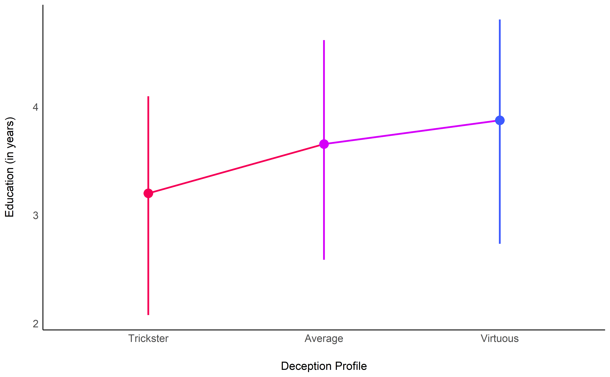
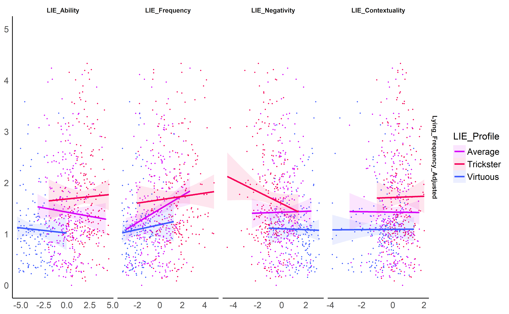
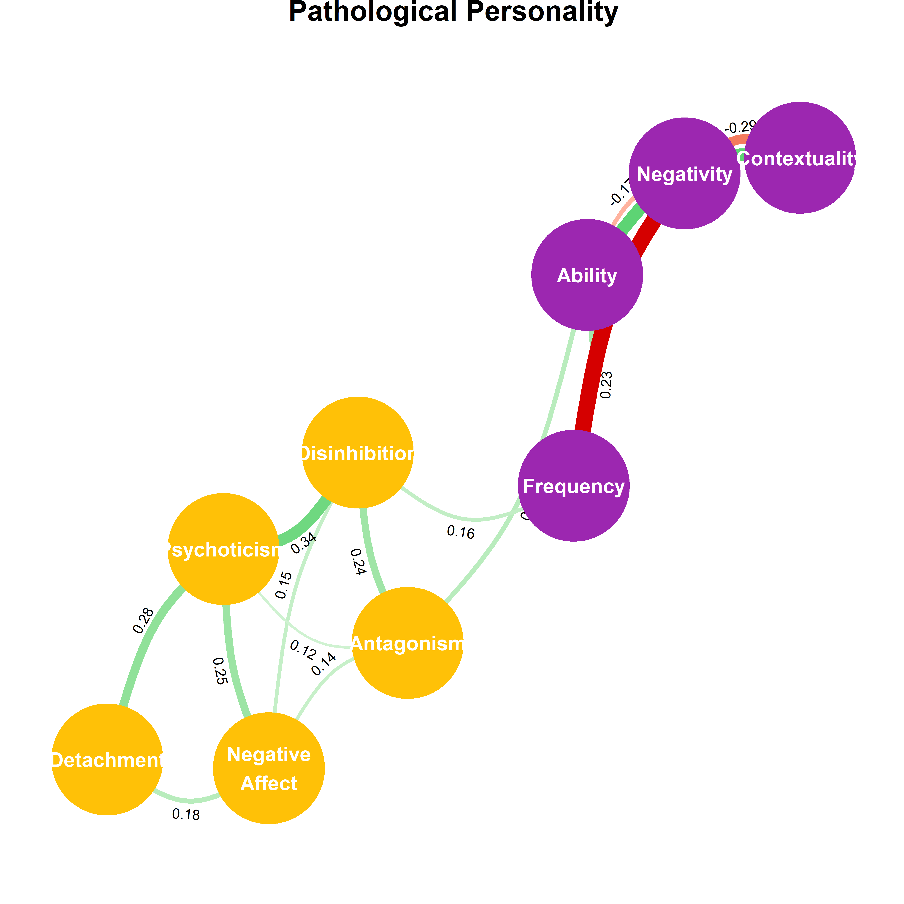
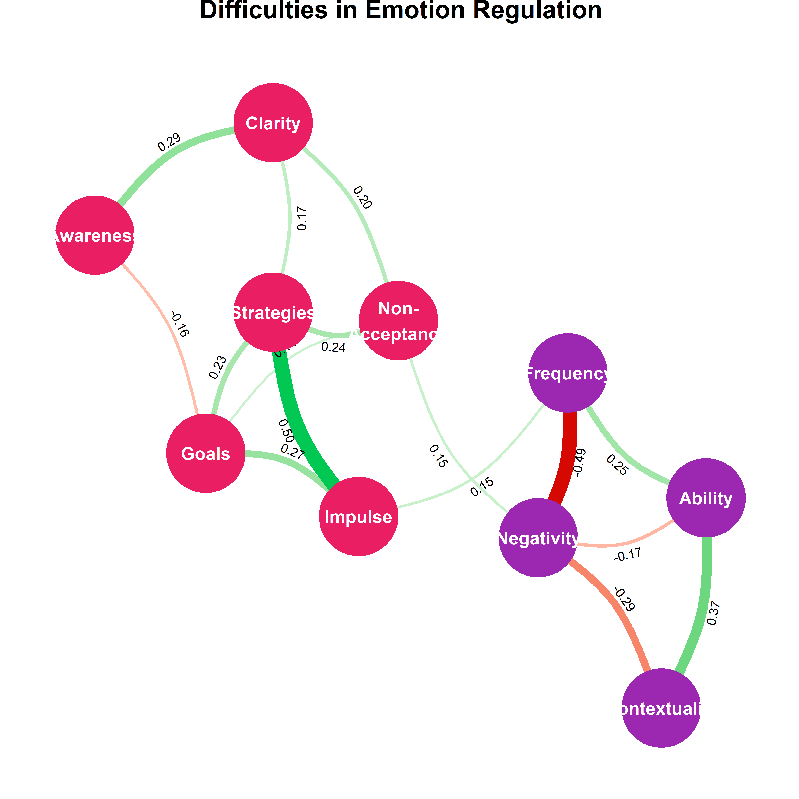

**The Structure of Deception: Validation of the Lying Profile
Questionnaire**
================

  - [Methods](#methods)
      - [Packages & Data](#packages-data)
          - [Packages](#packages)
          - [Data](#data)
          - [Preprocessing](#preprocessing)
      - [Measures Scoring](#measures-scoring)
          - [Utility Functions](#utility-functions)
          - [Deception and Lying Profile
            (LIE)](#deception-and-lying-profile-lie)
          - [Psychopathy (TRIMP)](#psychopathy-trimp)
          - [Narcissism (FFNI)](#narcissism-ffni)
          - [Normal Personality (IPIP6)](#normal-personality-ipip6)
          - [Pathological Personality
            (PID-5)](#pathological-personality-pid-5)
          - [Social Desirability (BIDR)](#social-desirability-bidr)
          - [Impulsivity (UPPS)](#impulsivity-upps)
          - [Emotion Regulation (DERS)](#emotion-regulation-ders)
          - [Light Triad (LTS)](#light-triad-lts)
          - [Introception (MAIA2)](#introception-maia2)
      - [Data Exclusion](#data-exclusion)
          - [Incomplete Data](#incomplete-data)
          - [Time to complete](#time-to-complete)
          - [Multivariate outliers](#multivariate-outliers)
          - [Final Sample](#final-sample)
  - [Results](#results)
      - [Descriptive Statistics](#descriptive-statistics)
          - [Deception and Lying Profile
            (LIE)](#deception-and-lying-profile-lie-1)
          - [Psychopathy (TRIMP)](#psychopathy-trimp-1)
          - [Narcissism (FFNI)](#narcissism-ffni-1)
          - [Normal Personality (IPIP6)](#normal-personality-ipip6-1)
          - [Pathological Personality
            (PID-5)](#pathological-personality-pid-5-1)
          - [Social Desirability (BIDR)](#social-desirability-bidr-1)
          - [Impulsivity (UPPS)](#impulsivity-upps-1)
          - [Emotion Regulation (DERS)](#emotion-regulation-ders-1)
          - [Light Triad (LTS)](#light-triad-lts-1)
          - [Interoception (MAIA2)](#interoception-maia2)
      - [Factor Structure](#factor-structure)
          - [Factor structure quality](#factor-structure-quality)
          - [Correlation matrix](#correlation-matrix)
          - [How many factors](#how-many-factors)
          - [Exploratory Factor Analysis
            (EFA)](#exploratory-factor-analysis-efa)
          - [Confirmatory Factor Analysis
            (CFA)](#confirmatory-factor-analysis-cfa)
          - [Reliability](#reliability)
      - [Cluster Structure](#cluster-structure)
          - [Cluster Tendency](#cluster-tendency)
          - [How many clusters](#how-many-clusters)
          - [Clustering](#clustering)
          - [Compute Profiles](#compute-profiles)
          - [Visualisation](#visualisation)
      - [Convergent Validity](#convergent-validity)
          - [Demographics](#demographics)
          - [Number of Lies](#number-of-lies)
          - [Social Desirability (BIDR)](#social-desirability-bidr-2)
          - [Psychopathy (TRIMP)](#psychopathy-trimp-2)
          - [Narcissism (FFNI)](#narcissism-ffni-2)
          - [Normal Personality (IPIP6)](#normal-personality-ipip6-2)
          - [Pathological Personality
            (PID5)](#pathological-personality-pid5)
          - [Light Triad (LTS)](#light-triad-lts-2)
          - [Impulsivity (UPPS)](#impulsivity-upps-2)
          - [Emotion Regulation (DERS)](#emotion-regulation-ders-2)
          - [Interoception (MAIA2)](#interoception-maia2-1)
  - [References](#references)

# Methods

## Packages & Data

### Packages

``` r
library(tidyverse)
library(easystats)
```

    > # Attaching packages (red = needs update)
    > <U+26A0> insight     0.8.1.1   <U+2714> bayestestR  0.5.2  
    > <U+2714> performance 0.4.4.1   <U+2714> parameters  0.5.0.1
    > <U+26A0> see         0.4.0.1   <U+2714> effectsize  0.2.0  
    > <U+26A0> modelbased  0.1.0     <U+2714> correlation 0.1.0  
    > <U+2714> report      0.1.0     
    > Warnings or errors in CRAN checks for package(s) 'bayestestR', 'parameters'.
    > Restart the R-Session and update packages in red with 'easystats::easystats_update()'.

``` r
set.seed(333)
```

### Data

``` r
labels <- read.csv("../data/labels.csv", stringsAsFactors = FALSE) %>% 
  mutate(Item = paste0(Questionnaire, "_", Item))
df_raw <- read.csv("../data/data.csv", stringsAsFactors = FALSE)
```

### Preprocessing

``` r
df_raw <- df_raw %>% 
  mutate(Participant = paste0("S", 1:nrow(df_raw)),
         Sex = as.factor(Sex))

paste("The initial sample included", report::report_participants(df_raw))
```

    > [1] "The initial sample included 1011 participants (Mean age = 25.56, SD = 7.89, range = [12.96, 73.51]; 55.09% females; Mean education = 3.38, SD = 2.15, range = [-7, 10])"

## Measures Scoring

### Utility Functions

``` r
# Reverse negative items
reverse <- function(x, mini, maxi){
  maxi - x + mini
}


# Descriptive statistics
descriptive_statistics <- function(df, starts_with){
  df %>% 
    select(starts_with(starts_with)) %>% 
    report::report() %>% 
    report::table_long() %>% 
    select(-one_of(c("n_Obs", "Median", "MAD", "n_Missing"))) %>% 
    print()
  
  plot(df %>% 
    select(starts_with(starts_with)) %>% 
    bayestestR::estimate_density(method = "KernSmooth") %>% 
    plot() + 
    see::theme_modern())
}
```

### Deception and Lying Profile (LIE)

We rescaled the LIE variables, originally scored on a -10 to 10 scale,
to -5 to 5, so that the coefficients are more easily interpretable
(i.e., refers to a change of 10% of the scale).

``` r
df_raw[stringr::str_detect(names(df_raw), "LIE_")] <- effectsize::change_scale(df_raw[stringr::str_detect(names(df_raw), "LIE_")], from = c(-10, 10), to = c(-5, 5))
```

### Psychopathy (TRIMP)

``` r
df_raw <- df_raw %>%
   # Transform to numeric
  mutate_at(vars(starts_with("TRIMP")), function(x) {
    ifelse(x == "TRUE", 3,
           ifelse(x == "somewhat true", 2,
                  ifelse(x == "somewhat false", 1, 0)))
    }) %>%
  # Reverse items
  mutate_at(vars("TRIMP_2", "TRIMP_4", "TRIMP_10", "TRIMP_11", "TRIMP_16", "TRIMP_21", "TRIMP_25", "TRIMP_30", "TRIMP_33", "TRIMP_35", "TRIMP_39", "TRIMP_41", "TRIMP_44", "TRIMP_47", "TRIMP_50", "TRIMP_52", "TRIMP_57"), reverse, mini = 0, maxi = 3) %>% 
  # Compute scores
      ## Boldness
  mutate(
    TRIMP_Boldness = (TRIMP_1 + TRIMP_16
                      + TRIMP_7 + TRIMP_32
                      + TRIMP_10 + TRIMP_28
                      + TRIMP_13 + TRIMP_41
                      + TRIMP_19 + TRIMP_38 + TRIMP_57
                      + TRIMP_4 + TRIMP_47 
                      + TRIMP_22 + TRIMP_35
                      + TRIMP_25 + TRIMP_50
                      + TRIMP_44 + TRIMP_54)/19,
    TRIMP_Boldness_Optimism = (TRIMP_1 + TRIMP_16)/2,
    TRIMP_Boldness_Resilience = (TRIMP_7 + TRIMP_32)/2,
    TRIMP_Boldness_Courage = (TRIMP_10 + TRIMP_28)/2,
    TRIMP_Boldness_Dominance = (TRIMP_13 + TRIMP_41)/2,
    TRIMP_Boldness_Persuasiveness = (TRIMP_19 + TRIMP_38 + TRIMP_57)/3,
    TRIMP_Boldness_Intrepidness = (TRIMP_4 + TRIMP_47)/2,
    TRIMP_Boldness_ToleranceForUncertainty = (TRIMP_22 + TRIMP_35)/2,
    TRIMP_Boldness_SelfConfidence = (TRIMP_25 + TRIMP_50)/2,
    TRIMP_Boldness_SocialAssurance = (TRIMP_44 + TRIMP_54)/2
) %>% 
      ## Meanness
  mutate(
    TRIMP_Meanness = (TRIMP_2 + TRIMP_8 + TRIMP_11 + TRIMP_20 + TRIMP_29 + TRIMP_33 + TRIMP_36 + TRIMP_48 + TRIMP_52 + TRIMP_55 
                      + TRIMP_6 + TRIMP_45
                      + TRIMP_14
                      + TRIMP_17 + TRIMP_23 + TRIMP_26 + TRIMP_42
                      + TRIMP_39
                      + TRIMP_40)/19,
    TRIMP_Meanness_Empathy = (TRIMP_2 + TRIMP_8 + TRIMP_11 + TRIMP_20 + TRIMP_29 + TRIMP_33 + TRIMP_36 + TRIMP_48 + TRIMP_52 + TRIMP_55)/10,
    TRIMP_Meanness_ExcitementSeeking = (TRIMP_6 + TRIMP_45)/2,
    TRIMP_Meanness_PhysicalAggression = TRIMP_14,
    TRIMP_Meanness_RelationalAggression = (TRIMP_17 + TRIMP_23 + TRIMP_26 + TRIMP_42)/4,
    TRIMP_Meanness_Honesty = TRIMP_39,
    TRIMP_Meanness_DestructiveAggression = TRIMP_40
) %>% 
     ## Disinhibition
  mutate(
    TRIMP_Disinhibition = (
      TRIMP_3 + TRIMP_46 + 
        TRIMP_5 + TRIMP_30 + 
        TRIMP_9 + TRIMP_15 + TRIMP_37 + TRIMP_51 +
        TRIMP_12 + TRIMP_18 + TRIMP_49 + TRIMP_56 +
        TRIMP_21 +
        TRIMP_24 + TRIMP_43 + TRIMP_53 + TRIMP_58 +
        TRIMP_27 +
        TRIMP_31 +
        TRIMP_34)/20,
    TRIMP_Disinhibition_ImpatienceUrgency = (TRIMP_3 + TRIMP_46)/2,
    TRIMP_Disinhibition_Dependability = (TRIMP_5 + TRIMP_30)/2,
    TRIMP_Disinhibition_ProblematicImpulsivity = (TRIMP_9 + TRIMP_15 + TRIMP_37 + TRIMP_51)/4,
    TRIMP_Disinhibition_Irresponsibility = (TRIMP_12 + TRIMP_18 + TRIMP_49 + TRIMP_56)/4,
    TRIMP_Disinhibition_PlanfulControl = TRIMP_21,
    TRIMP_Disinhibition_Theft = (TRIMP_24 + TRIMP_43 + TRIMP_53 + TRIMP_58)/4,
    TRIMP_Disinhibition_Alienation = TRIMP_27,
    TRIMP_Disinhibition_BoredomProneness = TRIMP_31,
    TRIMP_Disinhibition_Fraud = TRIMP_34
) %>% 
  ## General
      mutate(TRIMP_General = (TRIMP_Boldness*19 + TRIMP_Meanness*19 + TRIMP_Disinhibition*20)/58
) %>%
  # Remove individual questions
  select(-matches("TRIMP_\\d"))
```

### Narcissism (FFNI)

``` r
df_raw <- df_raw %>%
   # Transform to numeric
  mutate_at(vars(starts_with("FFNI")), function(x) {
    ifelse(x == "Disagree strongly", 1,
           ifelse(x == "Disagree a little", 2,
                  ifelse(x == "Neither agree nor disagree", 3,
                         ifelse(x == "Agree a little", 4, 5))))
  })%>%
  # Reverse items
  mutate_at(vars("FFNI_19", "FFNI_27"), reverse, mini = 1, maxi = 5) %>% 
  # Compute scores
  mutate(
    FFNI_AcclaimSeeking = (FFNI_1 + FFNI_16 + FFNI_31 + FFNI_46),
    FFNI_Distrust = (FFNI_4 + FFNI_19 + FFNI_34 + FFNI_49),
    FFNI_Entitlement = (FFNI_5 + FFNI_20 + FFNI_35 + FFNI_50),
    FFNI_Exploitativeness = (FFNI_7 + FFNI_22 + FFNI_37 + FFNI_52),
    FFNI_Indifference = (FFNI_9 + FFNI_24 + FFNI_39 + FFNI_54),
    FFNI_LackOfEmpathy = (FFNI_10 + FFNI_25 + FFNI_40 + FFNI_55),
    FFNI_Manipulativeness = (FFNI_11 + FFNI_26 + FFNI_41 + FFNI_56),
    FFNI_NeedForAdmiration = (FFNI_12 + FFNI_27 + FFNI_42 + FFNI_57),
    FFNI_ThrillSeeking = (FFNI_15 + FFNI_30 + FFNI_45 + FFNI_60),
    FFNI_General = (FFNI_AcclaimSeeking + FFNI_Entitlement + FFNI_NeedForAdmiration + FFNI_Manipulativeness + FFNI_LackOfEmpathy + FFNI_Indifference + FFNI_ThrillSeeking + FFNI_Distrust + FFNI_Exploitativeness) / 9
) %>% 
  # Remove individual questions
  select(-matches("FFNI_\\d"))
```

### Normal Personality (IPIP6)

``` r
df_raw <- df_raw %>%
  # Transform to numeric
  mutate_at(vars(starts_with("IPIP6")), as.numeric) %>% 
  # Reverse items
  mutate_at(vars("IPIP6_6", "IPIP6_7", "IPIP6_8", "IPIP6_9", "IPIP6_11", "IPIP6_12", "IPIP6_13", "IPIP6_15", "IPIP6_17", "IPIP6_18", "IPIP6_19", "IPIP6_20", "IPIP6_21", "IPIP6_22", "IPIP6_24"), reverse, mini = 1, maxi = 7) %>% 
  # Compute scores
  mutate(
    IPIP6_Extraversion = (IPIP6_1 + IPIP6_7 + IPIP6_19 + IPIP6_23)/4,
    IPIP6_Agreableness = (IPIP6_2 + IPIP6_8 + IPIP6_14 + IPIP6_20)/4,
    IPIP6_Conscientiousness = (IPIP6_3 + IPIP6_10 + IPIP6_11 + IPIP6_22)/4,
    IPIP6_Neuroticism = (IPIP6_4 + IPIP6_15 + IPIP6_16 + IPIP6_17)/4,
    IPIP6_Openeness = (IPIP6_5 + IPIP6_9 + IPIP6_13 + IPIP6_21)/4,
    IPIP6_HonestyHumility = (IPIP6_6 + IPIP6_12 + IPIP6_18 + IPIP6_24)/4
  ) %>% 
  # Remove individual questions
  select(-matches("IPIP6_\\d"))
```

### Pathological Personality (PID-5)

``` r
df_raw <- df_raw %>%
  # Transform to numeric
  mutate_at(vars(starts_with("PID5")), function(x) {
    ifelse(x == "Very false or often false", 0,
           ifelse(x == "Sometimes or somewhat false", 1,
                  ifelse(x == "Sometimes or somewhat true", 2, 3)))
  }) %>% 
  # Compute scores
  mutate(
    PID5_NegativeAffect = (PID5_8 + PID5_9 + PID5_10 + PID5_11 + PID5_15)/5,
    PID5_Detachment = (PID5_4 + PID5_13 + PID5_14 + PID5_16 + PID5_18)/5,
    PID5_Antagonism = (PID5_17 + PID5_19 + PID5_20 + PID5_22 + PID5_25)/5,
    PID5_Disinhibition = (PID5_1 + PID5_2 + PID5_3 + PID5_5 + PID5_6)/5,
    PID5_Psychoticism = (PID5_7 + PID5_12 + PID5_21 + PID5_23 + PID5_24)/5,
    PID5_Pathology = (PID5_NegativeAffect + PID5_Detachment + PID5_Antagonism + PID5_Disinhibition + PID5_Psychoticism)/5
  ) %>% 
  # Remove individual questions
  select(-matches("PID5_\\d"))
```

### Social Desirability (BIDR)

``` r
df_raw <- df_raw %>%
   # Reverse items
  mutate_at(vars("BIDR_1", "BIDR_3", "BIDR_5", "BIDR_8", "BIDR_9", "BIDR_11", "BIDR_12", "BIDR_13"), reverse, mini = 1, maxi = 7) %>% 
  # Compute scores
  mutate(
    BIDR_SelfDeceptiveEnhancement = (BIDR_1 + BIDR_2 + BIDR_3 + BIDR_4 + BIDR_5 + BIDR_6 + BIDR_7 + BIDR_8)/8,
    BIDR_ImpressionManagement = (BIDR_9 + BIDR_10 + BIDR_11 + BIDR_12 + BIDR_13 + BIDR_14 + BIDR_15 + BIDR_16)/8,
    BIDR_General = (BIDR_SelfDeceptiveEnhancement + BIDR_ImpressionManagement)/2
) %>% 
  # Remove individual questions
  select(-matches("BIDR_\\d"))
```

### Impulsivity (UPPS)

``` r
df_raw <- df_raw %>%
   # Transform to numeric
  mutate_at(vars(starts_with("UPPS")), function(x) {
    ifelse(x == "Strongly Agree", 1,
           ifelse(x == "Somewhat agree", 2,
                  ifelse(x == "Somewhat disagree", 3, 4)))
  })%>%
  # Reverse items
  mutate_at(vars("UPPS_3", "UPPS_6", "UPPS_8", "UPPS_9", "UPPS_10", "UPPS_13", "UPPS_14", "UPPS_15", "UPPS_16", "UPPS_17", "UPPS_18", "UPPS_20"), reverse, mini = 1, maxi = 4) %>% 
  # Compute scores
  mutate(
    UPPS_NegativeUrgency = (UPPS_6 + UPPS_8 + UPPS_13 + UPPS_15)/4,
    UPPS_PositiveUrgency = (UPPS_3 + UPPS_10 + UPPS_17 + UPPS_20)/4,
    UPPS_LackOfPerseverance = (UPPS_1 + UPPS_4 + UPPS_7 + UPPS_11)/4,
    UPPS_LackOfPremeditation = (UPPS_2 + UPPS_5 + UPPS_12 + UPPS_19)/4,
    UPPS_SensationSeeking = (UPPS_9 + UPPS_14 + UPPS_16 + UPPS_18)/4,
    UPPS_General = (UPPS_NegativeUrgency + UPPS_PositiveUrgency + UPPS_LackOfPerseverance + UPPS_LackOfPremeditation + UPPS_SensationSeeking)/5
) %>% 
  # Remove individual questions
  select(-matches("UPPS_\\d"))
```

### Emotion Regulation (DERS)

``` r
df_raw <- df_raw %>%
  # Transform to numeric
  mutate_at(vars(starts_with("DERS")), function(x) {
    ifelse(x == "Almost never (0 - 10%)", 1,
           ifelse(x == "Sometimes (11 - 35%)", 2,
                  ifelse(x == "About half the time (36 - 65%)", 3,
                         ifelse(x == "Most of the time (66 - 90%)", 4, 5))))
  }) %>%
  # Reverse items
  mutate_at(vars("DERS_1", "DERS_4", "DERS_6"), reverse, mini = 1, maxi = 5) %>% 
  # Compute scores
  mutate(
    DERS_Awareness = DERS_1 + DERS_4 + DERS_6,
    DERS_Clarity = DERS_2 + DERS_3 + DERS_5,
    DERS_Goals = DERS_8 + DERS_12 + DERS_15,
    DERS_Impulse = DERS_9 + DERS_16 + DERS_18,
    DERS_NonAcceptance = DERS_7 + DERS_13 + DERS_14,
    DERS_Strategies = DERS_10 + DERS_11 + DERS_17,
    DERS_General = (DERS_Awareness + DERS_Clarity + DERS_Goals + DERS_Impulse + DERS_NonAcceptance + DERS_Strategies) / 6
  ) %>% 
  # Remove individual questions
  select(-matches("DERS_\\d"))
```

### Light Triad (LTS)

``` r
df_raw <- df_raw %>%
   # Transform to numeric
  mutate_at(vars(starts_with("LTS")), function(x) {
    ifelse(x == "Agree strongly", 1,
           ifelse(x == "Agree", 2,
                  ifelse(x == "Neutral", 3,
                         ifelse(x == "Disagree", 4, 5)))) 
    })%>%
  # Compute scores
  mutate(
    LTS_FaithInHumanity = (LTS_1 + LTS_4 + LTS_7 + LTS_10)/4,
    LTS_Humanism = (LTS_2 + LTS_5 + LTS_8 + LTS_11)/4,
    LTS_Kantianism = (LTS_3 + LTS_6 + LTS_9 + LTS_12)/4,
    LTS_General = (LTS_FaithInHumanity + LTS_Humanism + LTS_Kantianism)/3
) %>% 
  # Remove individual questions
  select(-matches("LTS_\\d"))
```

### Introception (MAIA2)

``` r
df_raw <- df_raw %>%
  # Compute scores
  mutate(
   MAIA2_Noticing = (MAIA2_1 + MAIA2_2 + MAIA2_3 + MAIA2_4)/4,
   MAIA2_BodyListening = (MAIA2_5 + MAIA2_6 + MAIA2_7 + MAIA2_8 + MAIA2_9 + MAIA2_10 + MAIA2_11)/7
) %>% 
  # Remove individual questions
  select(-matches("MAIA2_\\d"))
```

## Data Exclusion

### Incomplete Data

``` r
df_incomplete <- df_raw %>% 
  filter_at(vars(matches("IPIP6|PID5|BIDR|MAIA|DERS|UPPS|FFNI|LTS|TRIMP|LIE_")), complete.cases) %>% 
  filter(Sex %in% c("Female", "Male")) %>% 
  droplevels()

paste("We excluded", nrow(df_raw) - nrow(df_incomplete), "participants with missing data.")
```

    > [1] "We excluded 5 participants with missing data."

### Time to complete

``` r
df_time <- df_incomplete %>% 
  mutate(Duration = Duration / 60) %>%  # Express in minutes
  filter(Duration < 120)

# Compute highest density intervals
ci <- bayestestR::eti(df_time$Duration, ci = c(0.8, 0.9, 0.95, 0.99))
cat(paste0("Duration Intervals:\n", paste0("  - ", insight::format_ci(ci$CI_low, ci$CI_high, ci$CI / 100), collapse = "\n")))
```

    > Duration Intervals:
    >   - 80% CI [13.09, 42.75]
    >   - 90% CI [10.95, 61.94]
    >   - 95% CI [9.42, 76.05]
    >   - 99% CI [7.52, 96.32]

``` r
upper_limit <- ci[ci$CI == 90, "CI_high"]
lower_limit <- ci[ci$CI == 90, "CI_low"]

# Visualisation
ci %>% 
  plot(show_zero = FALSE, show_title = FALSE) +
  geom_vline(xintercept = c(upper_limit, lower_limit), color="red", linetype="dotted") +
  theme_modern() +
  scale_fill_viridis_d() +
  ylab("Distribution") +
  xlab("Time to complete (in minutes)") 
```


``` r
df_time <- df_time %>% 
  filter(Duration < upper_limit,
         Duration > lower_limit)

paste("We excluded", nrow(df_incomplete) - nrow(df_time), "participants with a completion time outside the 90% percentile (>", insight::format_value(lower_limit), "min and <", insight::format_value(upper_limit), "min).")
```

    > [1] "We excluded 141 participants with a completion time outside the 90% percentile (> 10.95 min and < 61.94 min)."

### Multivariate outliers

``` r
methods <- c("zscore", "iqr", "mahalanobis", "robust", "mcd", "ics", "iforest", "lof")

# outliers <- df_time %>%
#   select(matches("LIE_|BIDR|IPIP6|PID5|TRIMP|FFNI|UPPS|DERS|LTS|MAIA"), -matches("_Profile|_General|_Pathology|Disinhibition_|Meanness_|Boldness_")) %>%
#   # select(matches("LIE_")) %>%
#   effectsize::standardize() %>%
#   performance::check_outliers(method = methods)
# 
# # Visualise
# as.data.frame(outliers) %>% 
#   mutate(Outlier = as.factor(paste0(round(Outlier*8), "/", length(methods)))) %>% 
#   ggplot(aes(x = Outlier, fill = Outlier)) +
#   geom_bar() +
#   geom_vline(aes(xintercept = 6.5), color = "red", linetype = "dotted") +
#   theme_modern() +
#   see::scale_fill_metro_d(guide = FALSE) +
#   xlab("Proportion of methods aggreeing on an outlier") +
#   ylab("Number of participants")
# 
# save(outliers, file="outliers.Rdata")
load("outliers.Rdata")

df <- df_time[-which(as.numeric(outliers) >= 6/length(methods)), ]

paste("Based on a composite outlier score (see the 'check_outliers' function in the 'performance' R package; Lüdecke et al., 2019) obtained via the joint application of multiple outliers detection algorithms (Z-scores, Iglewicz, 1993; Interquartile range (IQR); Mahalanobis distance, Cabana, 2019; Robust Mahalanobis distance, Gnanadesikan & Kettenring, 1972; Minimum Covariance Determinant, Leys et al., 2018; Invariant Coordinate Selection, Archimbaud et al., 2018; Isolation Forest, Liu et al. 2008; and Local Outlier Factor, Breunig et al., 2000), we excluded", nrow(df_time) - nrow(df), "participants that were classified as outliers by at least 6/8 of the methods used.")
```

    > [1] "Based on a composite outlier score (see the 'check_outliers' function in the 'performance' R package; Lüdecke et al., 2019) obtained via the joint application of multiple outliers detection algorithms (Z-scores, Iglewicz, 1993; Interquartile range (IQR); Mahalanobis distance, Cabana, 2019; Robust Mahalanobis distance, Gnanadesikan & Kettenring, 1972; Minimum Covariance Determinant, Leys et al., 2018; Invariant Coordinate Selection, Archimbaud et al., 2018; Isolation Forest, Liu et al. 2008; and Local Outlier Factor, Breunig et al., 2000), we excluded 103 participants that were classified as outliers by at least 6/8 of the methods used."

### Final Sample

``` r
paste("The final sample included", report_participants(df))
```

    > [1] "The final sample included 762 participants (Mean age = 25.42, SD = 7.76, range = [19.02, 73.51]; 56.04% females; Mean education = 3.51, SD = 2.00, range = [-7, 10])"

``` r
df <- df %>% 
  mutate(System_Screen = sqrt(System_Screen),
         Education_Student = as.factor(ifelse(Education_Student == "", NA, Education_Student)),
         Religion_Type = ifelse(Religion_Type == "", NA, Religion_Type), 
         Singapore_Duration = ifelse(Singapore_Duration > Age, NA, Singapore_Duration),
         Singapore_Duration = Singapore_Duration / Age)

df %>% 
  select(System_Device, System_Screen, Duration, Education_Student, Education_Type, Ethnicity, starts_with("Religion"), Income, Singapore_Duration) %>% 
  report(levels_percentage = TRUE, missing_percentage = TRUE, n_entries = 10)
```

    > The data contains 762 observations of the following variables:
    >   - System_Device: 3 entries: Phone, 74.15%; Computer, 25.07%; Tablet, 0.79%(0.00% missing)
    >   - System_Screen: Mean = 692.93, SD = 265.01, Median = 552.00, MAD = 76.91, range: [426.33, 2225.67], Skewness = 1.50, Kurtosis = 1.63, 0% missing
    >   - Duration: Mean = 23.90, SD = 9.69, Median = 21.23, MAD = 7.12, range: [10.97, 61.70], Skewness = 1.42, Kurtosis = 2.04, 0% missing
    >   - Education_Student: 2 levels: No (n = 229, 30.05%); Yes (n = 532, 69.82%) and missing (n = 1, 0.13%)
    >   - Education_Type: 18 entries: Business and Accountancy, 22.31%; Engineering, 19.29%; Social Sciences (Psychology, Sociology, etc.), 15.88%; Sciences, 10.89%; Others, 7.22%; Computing, 5.77%; Humanities (Languages, History, etc.), 4.99%; Communication Studies, 3.28%; Medicine, 3.02%; Art and Design, 1.97% and 8 others(0.00% missing)
    >   - Ethnicity: 20 entries: Chinese, 87.80%; Malay, 4.33%; Indian, 3.41%; , 1.84%; Vietnamese, 0.39%; Eurasian, 0.26%; Korean, 0.26%; African, 0.13%; Arabic, 0.13%; Boyanese , 0.13% and 10 others(0.00% missing)
    >   - Religion_Type: 6 entries: Buddhism, 33.33%; No religion, 25.46%; Christianity, 24.80%; Taoism, 5.77%; Islam, 4.99%; Hinduism, 2.36%(3.28% missing)
    >   - Religion_Religiosity: Mean = 4.22, SD = 2.97, Median = , MAD = 4.45, range: [0, 10], Skewness = 0.06, Kurtosis = -1.26, 2.89% missing
    >   - Religion_Engagement: Mean = 3.82, SD = 3.09, Median = , MAD = 4.45, range: [0, 10], Skewness = 0.30, Kurtosis = -1.18, 3.54% missing
    >   - Income: Mean = 2802.21, SD = 4348.98, Median = , MAD = 1482.60, range: [0, 60000], Skewness = 8.46, Kurtosis = 96.78, 13.25% missing
    >   - Singapore_Duration: Mean = 0.88, SD = 0.25, Median = , MAD = 0.02, range: [0, 1.00], Skewness = -2.51, Kurtosis = 4.85, 24.41% missing

``` r
df <- df %>% 
  mutate(Education_Type = ifelse(!Education_Type %in% c("Business and Accountancy",
                                                        "Engineering",
                                                        "Social Sciences (Psychology, Sociology...)",
                                                        "Sciences",
                                                        "Computing",
                                                        "Humanities (Languages, History...)"), "Other", Education_Type),
         Ethnicity = ifelse(!Ethnicity %in% c("Chinese", "Malay", "Indian"), "Other", Ethnicity))
```

#### Education and Income

``` r
report_participants(df, group = c("Sex", "Education_Student"))
```

    > [1] "For the 'Sex - Female and Education_Student - No' group: 136 participants (Mean age = 31.28, SD = 11.67, range = [21.73, 73.51]; 100.00% females; Mean education = 2.80, SD = 2.71, range = [-7, 6]), for the 'Sex - Male and Education_Student - No' group: 93 participants (Mean age = 30.88, SD = 11.86, range = [19.73, 66.19]; 0.00% females; Mean education = 2.11, SD = 2.77, range = [-6, 10]), for the 'Sex - Female and Education_Student - Yes' group: 291 participants (Mean age = 22.66, SD = 3.05, range = [19.11, 56.25]; 100.00% females; Mean education = 3.97, SD = 1.45, range = [0, 10]) and for the 'Sex - Male and Education_Student - Yes' group: 241 participants (Mean age = 23.31, SD = 2.06, range = [19.02, 39.79]; 0.00% females; Mean education = 3.88, SD = 1.29, range = [-2, 10])"

``` r
as.data.frame(table(df$Education_Type)) %>%
  ggplot(aes(x="", y =Freq, fill = reorder(Var1, -Freq))) +
  geom_bar(width = 1, stat = "identity") +
  labs(fill = "Course") +
  coord_polar("y", start = 0, direction = -1) +
  scale_fill_brewer(palette="Blues") +
  theme_void() +
  theme(legend.text = element_text(size = 20)) +
  theme(legend.title = element_text(face = "bold", size = 20))
```


``` r
df %>% 
  filter(!is.na(Education_Student)) %>% 
  filter(Income < 18000) %>% 
  ggplot(aes(x = Income, colour = Education_Type)) +
  geom_density(size = 1) +
  facet_grid(~Education_Student, labeller = "label_both") +
  theme_modern()
```


``` r
df %>% 
  filter(!is.na(Education_Student)) %>% 
  filter(Income < 18000) %>% 
  ggplot(aes(x = Age, y = Income, colour = Education_Type, fill = Education_Type)) +
  geom_point2() +
  geom_smooth(method = "lm", alpha = 0.1) + 
  theme_modern()
```


#### Culture

``` r
as.data.frame(table(df$Ethnicity)) %>%
  ggplot(aes(x="", y = Freq, fill = reorder(Var1, -Freq))) +
  labs(fill = "Ethnicity") +
  geom_bar(width = 1, stat = "identity") +
  coord_polar("y", start = 0) +
  scale_fill_brewer(palette="Oranges") +
  theme_void() +
  theme(legend.text = element_text(size = 20)) +
  theme(legend.title = element_text(face = "bold", size = 20))
```


``` r
df %>% 
  filter(!is.na(Singapore_Duration)) %>% 
  ggplot(aes(x = Singapore_Duration, colour = Ethnicity)) +
  geom_density(size = 1) +
  theme_modern() +
  scale_x_continuous(labels = scales::percent)
```


#### Religion

``` r
as.data.frame(table(df$Religion_Type)) %>%
  ggplot(aes(x="", y = Freq, fill = reorder(Var1, -Freq))) +
  geom_bar(width = 1, stat = "identity") +
  labs(fill = "Religion") +
  coord_polar("y", start = 0) +
  scale_fill_brewer(palette="Purples") +
  theme_void() +
  theme(legend.text = element_text(size = 20)) +
  theme(legend.title = element_text(face = "bold", size = 20))
```


``` r
df %>% 
  filter(!is.na(Religion_Engagement)) %>% 
  filter(!is.na(Religion_Type)) %>% 
  ggplot(aes(x = Religion_Engagement, colour = Religion_Type)) +
  geom_density(size = 1) +
  theme_modern()
```


``` r
df %>% 
  filter(!is.na(Religion_Religiosity)) %>% 
  filter(!is.na(Religion_Type)) %>% 
  ggplot(aes(x = Religion_Religiosity, colour = Religion_Type)) +
  geom_density(size = 1) +
  theme_modern()
```


``` r
df %>% 
  filter(!is.na(Religion_Engagement)) %>% 
  filter(!is.na(Religion_Religiosity)) %>% 
  filter(!is.na(Religion_Type)) %>% 
  ggplot(aes(x = Religion_Religiosity, y = Religion_Engagement, colour = Religion_Type, fill = Religion_Type)) +
  geom_jitter() +
  geom_smooth(method = "lm", alpha = 0.2) +
  ggtitle(paste("r =", insight::format_value(cor.test(df$Religion_Engagement, df$Religion_Religiosity)$estimate))) +
  theme_modern()
```


``` r
df <- df %>% 
  mutate(Religion_Faith = (Religion_Engagement + Religion_Religiosity) / 2)
```

# Results

## Descriptive Statistics

### Deception and Lying Profile (LIE)

``` r
descriptive_statistics(df, "LIE_")
```

    > Variable |  Mean |   SD | Min | Max | Skewness | Kurtosis
    > ---------------------------------------------------------
    > LIE_1    | -1.78 | 2.41 |  -5 |   5 |     0.49 |    -0.66
    > LIE_2    | -1.40 | 2.54 |  -5 |   5 |     0.37 |    -0.82
    > LIE_3    | -2.44 | 2.64 |  -5 |   5 |     1.03 |     0.21
    > LIE_4    | -1.61 | 2.46 |  -5 |   5 |     0.40 |    -0.72
    > LIE_5    | -1.84 | 2.29 |  -5 |   5 |     0.49 |    -0.58
    > LIE_6    | -1.00 | 2.58 |  -5 |   5 |     0.17 |    -1.01
    > LIE_7    | -0.78 | 2.70 |  -5 |   5 |     0.17 |    -0.97
    > LIE_8    | -1.37 | 2.29 |  -5 |   5 |     0.41 |    -0.43
    > LIE_9    | -0.20 | 2.74 |  -5 |   5 |    -0.15 |    -0.98
    > LIE_10   |  0.13 | 2.72 |  -5 |   5 |    -0.27 |    -0.88
    > LIE_11   | -0.37 | 2.62 |  -5 |   5 |    -0.04 |    -0.91
    > LIE_12   |  0.77 | 2.64 |  -5 |   5 |    -0.56 |    -0.52
    > LIE_13   | -0.46 | 2.56 |  -5 |   5 |     0.25 |    -0.68
    > LIE_14   |  0.42 | 2.46 |  -5 |   5 |    -0.38 |    -0.58
    > LIE_15   |  0.16 | 2.61 |  -5 |   5 |    -0.15 |    -0.83
    > LIE_16   | -1.00 | 2.39 |  -5 |   5 |     0.38 |    -0.41
    > LIE_17   |  0.56 | 2.71 |  -5 |   5 |    -0.07 |    -0.97
    > LIE_18   | -0.02 | 2.67 |  -5 |   5 |    -0.23 |    -0.93
    > LIE_19   |  1.02 | 2.64 |  -5 |   5 |    -0.35 |    -0.83
    > LIE_20   | -0.18 | 2.61 |  -5 |   5 |    -0.06 |    -0.86
    > LIE_21   | -1.01 | 2.75 |  -5 |   5 |     0.36 |    -0.84
    > LIE_22   | -2.26 | 2.35 |  -5 |   5 |     0.67 |    -0.43
    > LIE_23   | -1.87 | 2.37 |  -5 |   5 |     0.61 |    -0.38
    > LIE_24   |  1.24 | 2.36 |  -5 |   5 |    -0.39 |    -0.48
    > LIE_25   |  1.73 | 2.41 |  -5 |   5 |    -0.62 |    -0.22
    > LIE_26   | -2.61 | 2.20 |  -5 |   5 |     0.89 |     0.15
    > LIE_27   |  1.15 | 2.58 |  -5 |   5 |    -0.40 |    -0.70
    > LIE_28   | -0.26 | 2.56 |  -5 |   5 |    -0.10 |    -0.76
    > LIE_29   | -0.96 | 2.69 |  -5 |   5 |     0.28 |    -0.91
    > LIE_30   |  0.39 | 2.69 |  -5 |   5 |    -0.33 |    -0.84
    > LIE_31   | -0.42 | 2.62 |  -5 |   5 |    -0.04 |    -0.96
    > LIE_32   |  0.53 | 2.67 |  -5 |   5 |    -0.37 |    -0.74
    > LIE_33   |  1.84 | 2.18 |  -5 |   5 |    -1.05 |     1.33
    > LIE_34   |  2.64 | 2.00 |  -5 |   5 |    -0.76 |     0.31
    > LIE_35   |  1.73 | 2.31 |  -5 |   5 |    -0.59 |    -0.14
    > LIE_36   |  1.02 | 2.41 |  -5 |   5 |    -0.25 |    -0.65
    > LIE_37   |  0.56 | 2.73 |  -5 |   5 |    -0.01 |    -0.97
    > LIE_38   |  1.81 | 2.51 |  -5 |   5 |    -0.55 |    -0.60
    > LIE_39   |  1.69 | 2.46 |  -5 |   5 |    -0.87 |     0.30
    > LIE_40   |  1.80 | 2.42 |  -5 |   5 |    -0.73 |     0.06
    > LIE_41   |  0.99 | 2.65 |  -5 |   5 |    -0.19 |    -0.83
    > LIE_42   |  1.87 | 2.22 |  -5 |   5 |    -0.76 |     0.58
    > LIE_43   |  1.78 | 2.28 |  -5 |   5 |    -0.99 |     0.98
    > LIE_44   |  2.05 | 2.39 |  -5 |   5 |    -0.67 |    -0.14


### Psychopathy (TRIMP)

``` r
df %>% 
  select(TRIMP_General, starts_with("TRIMP_Boldness"), starts_with("TRIMP_Meanness"), starts_with("TRIMP_Disinhibition")) %>% 
  report() %>% 
  table_long() %>% 
  select(-one_of(c("n_Obs", "Median", "MAD", "n_Missing"))) %>% 
  print()
```

    > Variable                                   | Mean |   SD |  Min |  Max | Skewness | Kurtosis
    > --------------------------------------------------------------------------------------------
    > TRIMP_General                              | 1.08 | 0.28 | 0.34 | 1.90 |     0.25 |    -0.30
    > TRIMP_Boldness                             | 1.43 | 0.37 | 0.26 | 2.37 |    -0.15 |    -0.01
    > TRIMP_Boldness_Optimism                    | 1.72 | 0.56 | 0.00 | 3.00 |    -0.31 |     0.20
    > TRIMP_Boldness_Resilience                  | 1.55 | 0.63 | 0.00 | 3.00 |    -0.13 |    -0.28
    > TRIMP_Boldness_Courage                     | 1.36 | 0.67 | 0.00 | 3.00 |     0.08 |    -0.06
    > TRIMP_Boldness_Dominance                   | 1.39 | 0.70 | 0.00 | 3.00 |    -0.02 |    -0.30
    > TRIMP_Boldness_Persuasiveness              | 1.53 | 0.59 | 0.00 | 3.00 |    -0.18 |    -0.18
    > TRIMP_Boldness_Intrepidness                | 1.06 | 0.73 | 0.00 | 3.00 |     0.32 |    -0.59
    > TRIMP_Boldness_ToleranceForUncertainty     | 1.32 | 0.60 | 0.00 | 3.00 |     0.09 |     0.26
    > TRIMP_Boldness_SelfConfidence              | 1.58 | 0.66 | 0.00 | 3.00 |     0.11 |    -0.35
    > TRIMP_Boldness_SocialAssurance             | 1.31 | 0.65 | 0.00 | 3.00 |     0.06 |    -0.09
    > TRIMP_Meanness                             | 0.88 | 0.40 | 0.00 | 2.05 |     0.24 |    -0.44
    > TRIMP_Meanness_Empathy                     | 0.80 | 0.45 | 0.00 | 2.10 |     0.23 |    -0.64
    > TRIMP_Meanness_ExcitementSeeking           | 1.30 | 0.79 | 0.00 | 3.00 |     0.02 |    -0.68
    > TRIMP_Meanness_PhysicalAggression          | 0.88 | 0.92 | 0.00 | 3.00 |     0.61 |    -0.77
    > TRIMP_Meanness_RelationalAggression        | 1.02 | 0.63 | 0.00 | 2.75 |     0.23 |    -0.62
    > TRIMP_Meanness_Honesty                     | 0.79 | 0.69 | 0.00 | 3.00 |     0.61 |     0.33
    > TRIMP_Meanness_DestructiveAggression       | 0.35 | 0.63 | 0.00 | 3.00 |     1.70 |     1.96
    > TRIMP_Disinhibition                        | 0.93 | 0.40 | 0.05 | 2.30 |     0.44 |    -0.08
    > TRIMP_Disinhibition_ImpatienceUrgency      | 1.74 | 0.59 | 0.00 | 3.00 |    -0.30 |     0.11
    > TRIMP_Disinhibition_Dependability          | 0.92 | 0.65 | 0.00 | 3.00 |     0.25 |    -0.46
    > TRIMP_Disinhibition_ProblematicImpulsivity | 1.11 | 0.63 | 0.00 | 2.75 |     0.03 |    -0.66
    > TRIMP_Disinhibition_Irresponsibility       | 0.65 | 0.60 | 0.00 | 2.50 |     0.77 |    -0.25
    > TRIMP_Disinhibition_PlanfulControl         | 1.09 | 0.64 | 0.00 | 3.00 |     0.45 |     0.74
    > TRIMP_Disinhibition_Theft                  | 0.39 | 0.52 | 0.00 | 2.50 |     1.49 |     1.72
    > TRIMP_Disinhibition_Alienation             | 1.45 | 0.87 | 0.00 | 3.00 |     0.00 |    -0.67
    > TRIMP_Disinhibition_BoredomProneness       | 1.70 | 0.81 | 0.00 | 3.00 |    -0.22 |    -0.40
    > TRIMP_Disinhibition_Fraud                  | 0.40 | 0.69 | 0.00 | 3.00 |     1.64 |     1.89

``` r
plots(
  df %>% 
    select(starts_with("TRIMP_Boldness")) %>% 
    bayestestR::estimate_density(method = "KernSmooth") %>% 
    plot() + 
    theme_modern(),
  df %>% 
    select(starts_with("TRIMP_Meanness")) %>% 
    bayestestR::estimate_density(method = "KernSmooth") %>% 
    plot() + 
    theme_modern(),
  df %>% 
    select(starts_with("TRIMP_Disinhibition")) %>% 
    bayestestR::estimate_density(method = "KernSmooth") %>% 
    plot() + 
    theme_modern()
    )
```


### Narcissism (FFNI)

``` r
descriptive_statistics(df, "FFNI")
```

    > Variable               |  Mean |   SD |  Min |   Max | Skewness | Kurtosis
    > --------------------------------------------------------------------------
    > FFNI_AcclaimSeeking    | 14.19 | 3.33 | 4.00 | 20.00 |    -0.62 |     0.41
    > FFNI_Distrust          | 12.27 | 2.83 | 4.00 | 20.00 |    -0.04 |    -0.02
    > FFNI_Entitlement       |  9.94 | 3.63 | 4.00 | 20.00 |     0.14 |    -0.77
    > FFNI_Exploitativeness  |  9.01 | 3.67 | 4.00 | 20.00 |     0.34 |    -0.80
    > FFNI_Indifference      | 11.03 | 3.75 | 4.00 | 20.00 |     0.22 |    -0.63
    > FFNI_LackOfEmpathy     |  9.19 | 3.14 | 4.00 | 20.00 |     0.42 |    -0.38
    > FFNI_Manipulativeness  | 10.31 | 3.66 | 4.00 | 20.00 |     0.13 |    -0.78
    > FFNI_NeedForAdmiration | 12.87 | 2.89 | 4.00 | 20.00 |    -0.39 |     0.18
    > FFNI_ThrillSeeking     | 10.56 | 3.75 | 4.00 | 20.00 |     0.07 |    -0.78
    > FFNI_General           | 11.04 | 1.95 | 5.89 | 19.44 |     0.19 |     0.32


### Normal Personality (IPIP6)

``` r
descriptive_statistics(df, "IPIP6")
```

    > Variable                | Mean |   SD |  Min |  Max | Skewness | Kurtosis
    > -------------------------------------------------------------------------
    > IPIP6_Extraversion      | 3.58 | 1.20 | 1.00 | 6.75 |     0.13 |    -0.56
    > IPIP6_Agreableness      | 4.99 | 0.90 | 1.25 | 7.00 |    -0.29 |     0.11
    > IPIP6_Conscientiousness | 4.48 | 1.07 | 1.00 | 7.00 |    -0.24 |     0.00
    > IPIP6_Neuroticism       | 3.91 | 1.09 | 1.00 | 7.00 |    -0.02 |    -0.21
    > IPIP6_Openeness         | 4.53 | 1.05 | 1.50 | 7.00 |    -0.10 |    -0.38
    > IPIP6_HonestyHumility   | 4.39 | 1.24 | 1.25 | 7.00 |    -0.04 |    -0.60


### Pathological Personality (PID-5)

``` r
descriptive_statistics(df, "PID5")
```

    > Variable            | Mean |   SD | Min | Max | Skewness | Kurtosis
    > -------------------------------------------------------------------
    > PID5_NegativeAffect | 1.40 | 0.63 |   0 |   3 |    -0.13 |    -0.36
    > PID5_Detachment     | 1.08 | 0.55 |   0 |   3 |     0.10 |    -0.17
    > PID5_Antagonism     | 0.89 | 0.54 |   0 |   3 |     0.38 |    -0.10
    > PID5_Disinhibition  | 0.97 | 0.63 |   0 |   3 |     0.15 |    -0.77
    > PID5_Psychoticism   | 1.24 | 0.60 |   0 |   3 |    -0.09 |    -0.31
    > PID5_Pathology      | 1.12 | 0.45 |   0 |   3 |    -0.02 |     0.12


### Social Desirability (BIDR)

``` r
descriptive_statistics(df, "BIDR")
```

    > Variable                      | Mean |   SD |  Min |  Max | Skewness | Kurtosis
    > -------------------------------------------------------------------------------
    > BIDR_SelfDeceptiveEnhancement | 3.90 | 0.80 | 1.50 | 7.00 |     0.09 |     0.45
    > BIDR_ImpressionManagement     | 3.82 | 0.81 | 1.12 | 6.62 |     0.21 |     0.51
    > BIDR_General                  | 3.86 | 0.65 | 1.44 | 6.56 |     0.31 |     1.09


### Impulsivity (UPPS)

``` r
descriptive_statistics(df, "UPPS")
```

    > Variable                 | Mean |   SD |  Min |  Max | Skewness | Kurtosis
    > --------------------------------------------------------------------------
    > UPPS_NegativeUrgency     | 2.39 | 0.62 | 1.00 | 4.00 |    -0.22 |    -0.34
    > UPPS_PositiveUrgency     | 2.13 | 0.61 | 1.00 | 3.75 |    -0.09 |    -0.61
    > UPPS_LackOfPerseverance  | 1.85 | 0.44 | 1.00 | 3.25 |    -0.02 |    -0.14
    > UPPS_LackOfPremeditation | 1.87 | 0.44 | 1.00 | 3.75 |    -0.06 |     0.34
    > UPPS_SensationSeeking    | 2.68 | 0.65 | 1.00 | 4.00 |    -0.24 |    -0.26
    > UPPS_General             | 2.18 | 0.34 | 1.10 | 3.00 |    -0.40 |    -0.17


### Emotion Regulation (DERS)

``` r
descriptive_statistics(df, "DERS")
```

    > Variable           | Mean |   SD | Min | Max | Skewness | Kurtosis
    > ------------------------------------------------------------------
    > DERS_Awareness     | 7.04 | 2.01 |   3 |  13 |     0.33 |    -0.18
    > DERS_Clarity       | 7.42 | 2.46 |   3 |  15 |     0.44 |    -0.18
    > DERS_Goals         | 9.36 | 3.16 |   3 |  15 |     0.00 |    -0.94
    > DERS_Impulse       | 6.76 | 2.96 |   3 |  15 |     0.58 |    -0.48
    > DERS_NonAcceptance | 7.32 | 3.04 |   3 |  15 |     0.49 |    -0.55
    > DERS_Strategies    | 6.92 | 2.99 |   3 |  15 |     0.55 |    -0.56
    > DERS_General       | 7.47 | 1.96 |   3 |  13 |     0.26 |    -0.57


### Light Triad (LTS)

``` r
descriptive_statistics(df, "LTS")
```

    > Variable            | Mean |   SD | Min |  Max | Skewness | Kurtosis
    > --------------------------------------------------------------------
    > LTS_FaithInHumanity | 2.38 | 0.62 |   1 | 4.50 |     0.54 |     0.54
    > LTS_Humanism        | 2.04 | 0.49 |   1 | 4.00 |     0.28 |     0.47
    > LTS_Kantianism      | 2.08 | 0.56 |   1 | 4.00 |     0.35 |     0.16
    > LTS_General         | 2.16 | 0.44 |   1 | 4.00 |     0.24 |     0.50


### Interoception (MAIA2)

``` r
descriptive_statistics(df, "MAIA2")
```

    > Variable            | Mean |   SD | Min | Max | Skewness | Kurtosis
    > -------------------------------------------------------------------
    > MAIA2_Noticing      | 3.15 | 0.85 |   0 |   5 |    -0.44 |     0.22
    > MAIA2_BodyListening | 2.82 | 0.89 |   0 |   5 |    -0.40 |    -0.06


## Factor Structure

### Factor structure quality

``` r
lie <- select(df, starts_with("LIE_"))
labels_lie <- labels[labels$Questionnaire == "LIE", ]

parameters::check_factorstructure(lie)
```

    > # Is the data suitable for Factor Analysis?
    > 
    >   - KMO: The Kaiser, Meyer, Olkin (KMO) measure of sampling adequacy suggests that data seems appropriate for factor analysis (KMO = 0.95).
    >   - Sphericity: Bartlett's test of sphericity suggests that there is sufficient significant correlation in the data for factor analaysis (Chisq(946) = 16257.03, p < .001).

### Correlation matrix

``` r
cor <- as.matrix(correlation::correlation(lie))
```

### How many factors

``` r
parameters::n_factors(lie, cor = cor, rotation = "varimax", package = "all", safe = FALSE) %T>% 
  print() %>%
  plot() +
  ggtitle("How many factors to retain (Pearson's correlations)") +
  theme_modern()
```

    > # Method Agreement Procedure:
    > 
    > The choice of 7 dimensions is supported by 5 (20.00%) methods out of 25 (t, p, Optimal coordinates, Parallel analysis, Kaiser criterion).


### Exploratory Factor Analysis (EFA)

#### Seven latent factors model

``` r
library(psych)

efa_7 <- psych::fa(cor, n.obs = nrow(lie), nfactors = 7, rotate = "varimax", fm = "ml") 

parameters::model_parameters(efa_7, labels = labels_lie$Description) %>%
  print(sort = TRUE, threshold = "max")
```

    > # Rotated loadings from Factor Analysis (varimax-rotation)
    > 
    > Variable |                                                      Label |   ML1 |   ML2 |  ML4 |  ML3 |  ML6 |  ML5 |  ML7 | Complexity | Uniqueness
    > --------------------------------------------------------------------------------------------------------------------------------------------------
    > LIE_10   |                                             I can lie well |  0.85 |       |      |      |      |      |      |       1.30 |       0.17
    > LIE_9    |                                           I am a good liar |  0.81 |       |      |      |      |      |      |       1.36 |       0.23
    > LIE_14   |                    It is hard for others to detect my lies |  0.75 |       |      |      |      |      |      |       1.18 |       0.38
    > LIE_18   |                   It is easy for me to make up clever lies |  0.75 |       |      |      |      |      |      |       1.44 |       0.32
    > LIE_11   |                              I am good at deceiving others |  0.74 |       |      |      |      |      |      |       1.42 |       0.34
    > LIE_12   |                         I can lie effectively if I want to |  0.73 |       |      |      |      |      |      |       1.33 |       0.38
    > LIE_13   |                      Others can easily tell when I’m lying | -0.69 |       |      |      |      |      |      |       1.44 |       0.42
    > LIE_17   |                                     I find lying difficult | -0.63 |       |      |      |      |      |      |       2.07 |       0.39
    > LIE_15   |                            I almost never get caught lying |  0.62 |       |      |      |      |      |      |       1.26 |       0.56
    > LIE_20   |                    I do not have to prepare much for a lie |  0.54 |       |      |      |      |      |      |       2.09 |       0.56
    > LIE_16   |                 My lies often arouse suspicion from others | -0.47 |       |      |      |      |      |      |       2.51 |       0.59
    > LIE_27   |                        I feel tense whenever I have to lie | -0.46 |       |      |      |      |      |      |       2.49 |       0.52
    > LIE_4    |                                   I have a tendency to lie |       |  0.76 |      |      |      |      |      |       1.31 |       0.34
    > LIE_5    |                      I lie more often than most people do  |       |  0.72 |      |      |      |      |      |       1.45 |       0.38
    > LIE_7    |                           I lie more than I think I should |       |  0.71 |      |      |      |      |      |       1.29 |       0.42
    > LIE_6    |         I lie more frequently than what I expect myself to |       |  0.71 |      |      |      |      |      |       1.24 |       0.44
    > LIE_23   |           I find it difficult to refrain myself from lying |       |  0.71 |      |      |      |      |      |       1.18 |       0.45
    > LIE_1    |                                           I lie frequently |       |  0.71 |      |      |      |      |      |       1.66 |       0.34
    > LIE_22   |                     I find myself lying without any reason |       |  0.67 |      |      |      |      |      |       1.45 |       0.46
    > LIE_2    |                                   I lie in many situations |       |  0.60 |      |      |      |      |      |       2.19 |       0.45
    > LIE_26   |                                              I enjoy lying |       |  0.53 |      |      |      |      |      |       3.14 |       0.40
    > LIE_8    |                            Others lie less often than I do |       |  0.51 |      |      |      |      |      |       1.37 |       0.69
    > LIE_29   |                             I lie whenever it’s convenient |       |  0.49 |      |      |      |      |      |       2.75 |       0.54
    > LIE_21   |                          I have to try hard to avoid lying |       |  0.46 |      |      |      |      |      |       1.13 |       0.77
    > LIE_24   |                  It is easy to hold back from telling lies |       | -0.38 |      |      |      |      |      |       2.01 |       0.79
    > LIE_28   |                I feel satisfied when others believe my lie |       |  0.30 |      |      |      |      |      |       4.62 |       0.69
    > LIE_41   |                             Lying is against my principles |       |       | 0.65 |      |      |      |      |       1.64 |       0.46
    > LIE_44   |                                          It is bad to lie  |       |       | 0.63 |      |      |      |      |       1.32 |       0.54
    > LIE_25   |                                  I feel guilty after lying |       |       | 0.59 |      |      |      |      |       1.66 |       0.54
    > LIE_34   |                              I always avoid lying if I can |       |       | 0.56 |      |      |      |      |       2.04 |       0.50
    > LIE_36   | I prefer to tell the truth even if it gets me into trouble |       |       | 0.41 |      |      |      |      |       2.72 |       0.70
    > LIE_37   |                      I would never lie for trivial matters |       |       | 0.35 |      |      |      |      |       2.79 |       0.78
    > LIE_38   |                      I would never lie in serious contexts |       |       | 0.32 |      |      |      |      |       2.30 |       0.83
    > LIE_43   |                               It is okay to lie sometimes  |       |       |      | 0.72 |      |      |      |       1.46 |       0.37
    > LIE_33   |                                       I lie when necessary |       |       |      | 0.67 |      |      |      |       1.42 |       0.47
    > LIE_42   |           It is acceptable to lie depending on the context |       |       |      | 0.65 |      |      |      |       1.35 |       0.51
    > LIE_40   |                         I would only lie if it is harmless |       |       |      | 0.44 |      |      |      |       1.45 |       0.76
    > LIE_39   |            I would lie if something important was at stake |       |       |      | 0.44 |      |      |      |       1.77 |       0.74
    > LIE_35   |                 I would only lie if I have no other choice |       |       |      | 0.41 |      |      |      |       2.05 |       0.73
    > LIE_32   |            I lie when telling the truth is too troublesome |       |       |      |      | 0.64 |      |      |       1.79 |       0.43
    > LIE_30   |              I lie when it’s easier than telling the truth |       |       |      |      | 0.61 |      |      |       1.76 |       0.50
    > LIE_31   |       I lie if it’s the most direct way to get what I want |       |       |      |      | 0.44 |      |      |       3.08 |       0.57
    > LIE_3    |                                          I never tell lies |       |       |      |      |      | 0.47 |      |       2.41 |       0.62
    > LIE_19   |                I find it taxing to come up with a good lie |       |       |      |      |      |      | 0.54 |       2.53 |       0.34
    > 
    > The 7 latent factors (varimax rotation) accounted for 48.98% of the total variance of the original data (ML1 = 15.09%, ML2 = 13.94%, ML4 = 7.44%, ML3 = 5.98%, ML6 = 3.30%, ML5 = 1.93%, ML7 = 1.30%).

#### Four latent factors model

``` r
efa_4 <- psych::fa(cor, n.obs = nrow(lie), nfactors = 4, rotate = "varimax", fm = "ml") 

parameters::model_parameters(efa_4, labels = labels_lie$Description) %>% 
  print(sort = TRUE, threshold = "max") 
```

    > # Rotated loadings from Factor Analysis (varimax-rotation)
    > 
    > Variable |                                                      Label |   ML1 |   ML2 |  ML4 |   ML3 | Complexity | Uniqueness
    > ------------------------------------------------------------------------------------------------------------------------------
    > LIE_10   |                                             I can lie well |  0.84 |       |      |       |       1.30 |       0.19
    > LIE_9    |                                           I am a good liar |  0.80 |       |      |       |       1.38 |       0.24
    > LIE_14   |                    It is hard for others to detect my lies |  0.75 |       |      |       |       1.20 |       0.39
    > LIE_18   |                   It is easy for me to make up clever lies |  0.75 |       |      |       |       1.37 |       0.34
    > LIE_11   |                              I am good at deceiving others |  0.74 |       |      |       |       1.41 |       0.34
    > LIE_12   |                         I can lie effectively if I want to |  0.73 |       |      |       |       1.34 |       0.38
    > LIE_13   |                      Others can easily tell when I’m lying | -0.69 |       |      |       |       1.19 |       0.48
    > LIE_17   |                                     I find lying difficult | -0.64 |       |      |       |       1.80 |       0.42
    > LIE_15   |                            I almost never get caught lying |  0.62 |       |      |       |       1.27 |       0.57
    > LIE_20   |                    I do not have to prepare much for a lie |  0.54 |       |      |       |       1.69 |       0.61
    > LIE_19   |                I find it taxing to come up with a good lie | -0.54 |       |      |       |       1.75 |       0.59
    > LIE_16   |                 My lies often arouse suspicion from others | -0.47 |       |      |       |       1.77 |       0.69
    > LIE_4    |                                   I have a tendency to lie |       |  0.76 |      |       |       1.26 |       0.35
    > LIE_5    |                      I lie more often than most people do  |       |  0.72 |      |       |       1.38 |       0.38
    > LIE_23   |           I find it difficult to refrain myself from lying |       |  0.72 |      |       |       1.07 |       0.47
    > LIE_1    |                                           I lie frequently |       |  0.72 |      |       |       1.57 |       0.34
    > LIE_22   |                     I find myself lying without any reason |       |  0.69 |      |       |       1.14 |       0.49
    > LIE_6    |         I lie more frequently than what I expect myself to |       |  0.68 |      |       |       1.13 |       0.50
    > LIE_7    |                           I lie more than I think I should |       |  0.68 |      |       |       1.09 |       0.52
    > LIE_2    |                                   I lie in many situations |       |  0.61 |      |       |       1.96 |       0.46
    > LIE_26   |                                              I enjoy lying |       |  0.56 |      |       |       2.01 |       0.52
    > LIE_29   |                             I lie whenever it’s convenient |       |  0.53 |      |       |       1.93 |       0.59
    > LIE_8    |                            Others lie less often than I do |       |  0.51 |      |       |       1.35 |       0.69
    > LIE_21   |                          I have to try hard to avoid lying |       |  0.47 |      |       |       1.12 |       0.77
    > LIE_31   |       I lie if it’s the most direct way to get what I want |       |  0.44 |      |       |       2.40 |       0.66
    > LIE_24   |                  It is easy to hold back from telling lies |       | -0.36 |      |       |       1.64 |       0.83
    > LIE_28   |                I feel satisfied when others believe my lie |       |  0.32 |      |       |       3.43 |       0.72
    > LIE_41   |                             Lying is against my principles |       |       | 0.63 |       |       1.69 |       0.47
    > LIE_25   |                                  I feel guilty after lying |       |       | 0.59 |       |       1.55 |       0.55
    > LIE_44   |                                          It is bad to lie  |       |       | 0.58 |       |       1.33 |       0.61
    > LIE_34   |                              I always avoid lying if I can |       |       | 0.57 |       |       1.86 |       0.50
    > LIE_27   |                        I feel tense whenever I have to lie |       |       | 0.50 |       |       1.99 |       0.54
    > LIE_36   | I prefer to tell the truth even if it gets me into trouble |       |       | 0.43 |       |       2.08 |       0.72
    > LIE_37   |                      I would never lie for trivial matters |       |       | 0.33 |       |       1.58 |       0.86
    > LIE_38   |                      I would never lie in serious contexts |       |       | 0.32 |       |       1.73 |       0.86
    > LIE_43   |                               It is okay to lie sometimes  |       |       |      |  0.71 |       1.33 |       0.42
    > LIE_33   |                                       I lie when necessary |       |       |      |  0.70 |       1.14 |       0.47
    > LIE_42   |           It is acceptable to lie depending on the context |       |       |      |  0.61 |       1.32 |       0.57
    > LIE_39   |            I would lie if something important was at stake |       |       |      |  0.48 |       1.23 |       0.74
    > LIE_40   |                         I would only lie if it is harmless |       |       |      |  0.46 |       1.20 |       0.77
    > LIE_32   |            I lie when telling the truth is too troublesome |       |       |      |  0.44 |       2.15 |       0.68
    > LIE_30   |              I lie when it’s easier than telling the truth |       |       |      |  0.41 |       2.11 |       0.72
    > LIE_35   |                 I would only lie if I have no other choice |       |       |      |  0.37 |       2.19 |       0.75
    > LIE_3    |                                          I never tell lies |       |       |      | -0.36 |       1.98 |       0.80
    > 
    > The 4 latent factors (varimax rotation) accounted for 44.18% of the total variance of the original data (ML1 = 14.84%, ML2 = 14.67%, ML4 = 7.52%, ML3 = 7.15%).

#### One latent factors model

``` r
efa_1 <- psych::fa(cor, n.obs = nrow(lie), nfactors = 1, rotate = "varimax", fm = "ml") 

parameters::model_parameters(efa_1, labels = labels_lie$Description) %>% 
  print(sort = TRUE, threshold = "max") 
```

    > # Rotated loadings from Factor Analysis (varimax-rotation)
    > 
    > Variable |                                                      Label |   ML1 | Complexity | Uniqueness
    > -------------------------------------------------------------------------------------------------------
    > LIE_10   |                                             I can lie well |  0.82 |       1.00 |       0.33
    > LIE_9    |                                           I am a good liar |  0.81 |       1.00 |       0.34
    > LIE_11   |                              I am good at deceiving others |  0.76 |       1.00 |       0.42
    > LIE_18   |                   It is easy for me to make up clever lies |  0.76 |       1.00 |       0.43
    > LIE_12   |                         I can lie effectively if I want to |  0.70 |       1.00 |       0.51
    > LIE_14   |                    It is hard for others to detect my lies |  0.69 |       1.00 |       0.53
    > LIE_17   |                                     I find lying difficult | -0.68 |       1.00 |       0.54
    > LIE_2    |                                   I lie in many situations |  0.63 |       1.00 |       0.60
    > LIE_1    |                                           I lie frequently |  0.63 |       1.00 |       0.61
    > LIE_20   |                    I do not have to prepare much for a lie |  0.61 |       1.00 |       0.62
    > LIE_5    |                      I lie more often than most people do  |  0.60 |       1.00 |       0.64
    > LIE_4    |                                   I have a tendency to lie |  0.59 |       1.00 |       0.65
    > LIE_15   |                            I almost never get caught lying |  0.58 |       1.00 |       0.67
    > LIE_26   |                                              I enjoy lying |  0.57 |       1.00 |       0.67
    > LIE_13   |                      Others can easily tell when I’m lying | -0.54 |       1.00 |       0.71
    > LIE_19   |                I find it taxing to come up with a good lie | -0.53 |       1.00 |       0.72
    > LIE_41   |                             Lying is against my principles | -0.52 |       1.00 |       0.73
    > LIE_29   |                             I lie whenever it’s convenient |  0.52 |       1.00 |       0.73
    > LIE_27   |                        I feel tense whenever I have to lie | -0.51 |       1.00 |       0.74
    > LIE_28   |                I feel satisfied when others believe my lie |  0.49 |       1.00 |       0.76
    > LIE_6    |         I lie more frequently than what I expect myself to |  0.48 |       1.00 |       0.77
    > LIE_25   |                                  I feel guilty after lying | -0.48 |       1.00 |       0.77
    > LIE_31   |       I lie if it’s the most direct way to get what I want |  0.48 |       1.00 |       0.77
    > LIE_22   |                     I find myself lying without any reason |  0.45 |       1.00 |       0.79
    > LIE_23   |           I find it difficult to refrain myself from lying |  0.45 |       1.00 |       0.79
    > LIE_7    |                           I lie more than I think I should |  0.45 |       1.00 |       0.80
    > LIE_34   |                              I always avoid lying if I can | -0.44 |       1.00 |       0.81
    > LIE_8    |                            Others lie less often than I do |  0.43 |       1.00 |       0.82
    > LIE_36   | I prefer to tell the truth even if it gets me into trouble | -0.42 |       1.00 |       0.83
    > LIE_44   |                                          It is bad to lie  | -0.40 |       1.00 |       0.84
    > LIE_43   |                               It is okay to lie sometimes  |  0.40 |       1.00 |       0.84
    > LIE_32   |            I lie when telling the truth is too troublesome |  0.38 |       1.00 |       0.85
    > LIE_30   |              I lie when it’s easier than telling the truth |  0.36 |       1.00 |       0.87
    > LIE_33   |                                       I lie when necessary |  0.36 |       1.00 |       0.87
    > LIE_42   |           It is acceptable to lie depending on the context |  0.34 |       1.00 |       0.88
    > LIE_39   |            I would lie if something important was at stake |  0.27 |       1.00 |       0.93
    > LIE_3    |                                          I never tell lies | -0.26 |       1.00 |       0.93
    > LIE_38   |                      I would never lie in serious contexts | -0.26 |       1.00 |       0.93
    > LIE_16   |                 My lies often arouse suspicion from others | -0.25 |       1.00 |       0.94
    > LIE_37   |                      I would never lie for trivial matters | -0.24 |       1.00 |       0.94
    > LIE_21   |                          I have to try hard to avoid lying |  0.20 |       1.00 |       0.96
    > LIE_24   |                  It is easy to hold back from telling lies | -0.13 |       1.00 |       0.98
    > LIE_40   |                         I would only lie if it is harmless |  0.11 |       1.00 |       0.99
    > LIE_35   |                 I would only lie if I have no other choice | -0.09 |       1.00 |       0.99
    > 
    > The unique latent factor (varimax rotation) accounted for 25.42% of the total variance of the original data.

``` r
paste0("The model with one, four and seven factors accounted for ",
       report::format_text(c(insight::format_value(efa_1$Vaccounted[2,]*100),
                             insight::format_value(efa_4$Vaccounted[3, 4]*100),
                             insight::format_value(efa_7$Vaccounted[3, 7]*100))),
       "% of variance of the dataset.")
```

    > [1] "The model with one, four and seven factors accounted for 25.42, 44.18 and 48.98% of variance of the dataset."

The factor number exploration suggested the presence of seven, four and
one latent factor(s). However, the seven-factors solution apppeared as
spurious (one of the factor being loaded by only one item, “I never tell
lies”, which is likely to be representing social desirability than
genuine lying behaviour). We therefore decided to keep the unique and
four-factors models and submitted their simple structure to Confirmatory
Factor Analysis (CFA)

<!-- #### General factor model -->

<!-- ```{r warning=FALSE, message=FALSE} -->

<!-- efa_g <- psych::omega(cor, nfactors = 4, fm="ml", flip = FALSE) -->

<!-- parameters::model_parameters(efa_g, labels = labels_lie$Description) %>% -->

<!--   print(sort = TRUE, threshold = "max") -->

<!-- ``` -->

### Confirmatory Factor Analysis (CFA)

#### Model Selection

``` r
report_cfa_indices <- function(comparison, row=1, name="<model>"){
  paste0("(X2", name, " = ", insight::format_value(comparison[row, "Chisq"]),
        ", AIC", name, " = ", insight::format_value(comparison[row, "AIC"]),
        ", BIC", name, " = ", insight::format_value(comparison[row, "BIC_adjusted"]),
        ", RMSEA", name, " = ", insight::format_value(comparison[row, "RMSEA"]),
        ", CFI", name, " = ", insight::format_value(comparison[row, "CFI"]),
        ", SRMR", name, " = ", insight::format_value(comparison[row, "SRMR"]),
        ")")
}
```

##### One *vs.* Four Factors

``` r
cfa_4 <- parameters::efa_to_cfa(efa_4, threshold = "max") %>% 
  lavaan::cfa(data = lie)
cfa_1 <- parameters::efa_to_cfa(efa_1, threshold = "max") %>% 
  lavaan::cfa(data = lie)
```

``` r
comparison <- performance::compare_performance(cfa_4, cfa_1) %>% 
  select(Model, AIC, BIC, BIC_adjusted, Chisq, RMSEA, CFI, SRMR)
comparison
```

    > # Comparison of Model Performance Indices
    > 
    > Model |         AIC |         BIC | BIC_adjusted |   Chisq | RMSEA |  CFI | SRMR
    > --------------------------------------------------------------------------------
    > cfa_4 | 1.43607e+05 | 1.44043e+05 |  1.43744e+05 | 3598.15 |  0.06 | 0.83 | 0.09
    > cfa_1 | 1.48003e+05 | 1.48411e+05 |  1.48131e+05 | 8006.07 |  0.10 | 0.55 | 0.11

``` r
paste0("The confirmatory factor analysis favoured the four-factors solution ", 
       report_cfa_indices(comparison, 1, name="<4-factors>"),
       " over the one-factor ",
       report_cfa_indices(comparison, 2, name="<1-factor>"))
```

    > [1] "The confirmatory factor analysis favoured the four-factors solution (X2<4-factors> = 3598.15, AIC<4-factors> = 1.43607e+05, BIC<4-factors> = 1.43744e+05, RMSEA<4-factors> = 0.06, CFI<4-factors> = 0.83, SRMR<4-factors> = 0.09) over the one-factor (X2<1-factor> = 8006.07, AIC<1-factor> = 1.48003e+05, BIC<1-factor> = 1.48131e+05, RMSEA<1-factor> = 0.10, CFI<1-factor> = 0.55, SRMR<1-factor> = 0.11)"

##### Four-factors *vs.* Initial Model

``` r
# Initial Model
model_initial <- c()
for (dimension in unique(labels_lie$Dimension)) {
  model_initial <- c(
    model_initial,
    paste0(tools::toTitleCase(dimension), " =~ ", paste(as.character(labels_lie[labels_lie$Dimension == dimension, "Item"]), collapse = " + "))
  )
}
cfa_initial <- paste0(model_initial, collapse = "\n") %>% 
  lavaan::cfa(data = lie)
```

``` r
comparison <- performance::compare_performance(cfa_4, cfa_initial) %>% 
  select(Model, AIC, BIC, BIC_adjusted, Chisq, RMSEA, CFI, SRMR)
comparison
```

    > # Comparison of Model Performance Indices
    > 
    > Model       |         AIC |         BIC | BIC_adjusted |   Chisq | RMSEA |  CFI | SRMR
    > --------------------------------------------------------------------------------------
    > cfa_4       | 1.43607e+05 | 1.44043e+05 |  1.43744e+05 | 3598.15 |  0.06 | 0.83 | 0.09
    > cfa_initial | 1.44979e+05 | 1.45401e+05 |  1.45112e+05 | 4976.26 |  0.08 | 0.74 | 0.09

``` r
paste0("We then compared the four-factors solution with the initial hypothetic model with which we built the scale, which favoured the four-factors model ", report_cfa_indices(comparison, 2, name="<hypothetic>"))
```

    > [1] "We then compared the four-factors solution with the initial hypothetic model with which we built the scale, which favoured the four-factors model (X2<hypothetic> = 4976.26, AIC<hypothetic> = 1.44979e+05, BIC<hypothetic> = 1.45112e+05, RMSEA<hypothetic> = 0.08, CFI<hypothetic> = 0.74, SRMR<hypothetic> = 0.09)"

##### Short *vs.* Long Form

``` r
cfa_4_short3 <- parameters::efa_to_cfa(efa_4, threshold = 3, names = c("Ability", "Frequency", "Negativity", "Contextuality")) %>% 
  lavaan::cfa(data = lie)
cfa_4_short4 <- parameters::efa_to_cfa(efa_4, threshold = 4, names = c("Ability", "Frequency", "Negativity", "Contextuality")) %>% 
  lavaan::cfa(data = lie)
cfa_4_short5 <- parameters::efa_to_cfa(efa_4, threshold = 5, names = c("Ability", "Frequency", "Negativity", "Contextuality")) %>% 
  lavaan::cfa(data = lie)
```

``` r
comparison <- performance::compare_performance(cfa_4, cfa_4_short3, cfa_4_short4, cfa_4_short5) %>% 
  select(Model, AIC, BIC, BIC_adjusted, Chisq, RMSEA, CFI, SRMR)
comparison
```

    > # Comparison of Model Performance Indices
    > 
    > Model        |         AIC |         BIC | BIC_adjusted |   Chisq | RMSEA |  CFI | SRMR
    > ---------------------------------------------------------------------------------------
    > cfa_4        | 1.43607e+05 | 1.44043e+05 |  1.43744e+05 | 3598.15 |  0.06 | 0.83 | 0.09
    > cfa_4_short3 |    38448.70 |    38587.78 |     38492.52 |  115.10 |  0.04 | 0.98 | 0.04
    > cfa_4_short4 |    50692.77 |    50868.93 |     50748.27 |  320.59 |  0.06 | 0.96 | 0.05
    > cfa_4_short5 |    63472.44 |    63685.70 |     63539.63 |  623.33 |  0.06 | 0.94 | 0.06

``` r
paste0("Finally, we compared the full four-factors model (including all items) with short form retaining only the 3, 4 or 5 most loading items for each of the 4 dimensions. The 3-items version ",
       report_cfa_indices(comparison, 2, name="<3-items>"),
       " outperformed all versions, including 5-items ",
       report_cfa_indices(comparison, 4, name="<5-items>"),
       " and 4-items ",
       report_cfa_indices(comparison, 3, name="<4-items>"), 
       ". Nonetheless, as 3-items per construct is the bare minimum for adequate reliability, we decided to keep the second best performing version with 4-items per factor, which also displayed excellent indices of fit."
      )
```

    > [1] "Finally, we compared the full four-factors model (including all items) with short form retaining only the 3, 4 or 5 most loading items for each of the 4 dimensions. The 3-items version (X2<3-items> = 115.10, AIC<3-items> = 38448.70, BIC<3-items> = 38492.52, RMSEA<3-items> = 0.04, CFI<3-items> = 0.98, SRMR<3-items> = 0.04) outperformed all versions, including 5-items (X2<5-items> = 623.33, AIC<5-items> = 63472.44, BIC<5-items> = 63539.63, RMSEA<5-items> = 0.06, CFI<5-items> = 0.94, SRMR<5-items> = 0.06) and 4-items (X2<4-items> = 320.59, AIC<4-items> = 50692.77, BIC<4-items> = 50748.27, RMSEA<4-items> = 0.05, CFI<4-items> = 0.96, SRMR<4-items> = 0.05). Nonetheless, as 3-items per construct is the bare minimum for adequate reliability, we decided to keep the second best performing version with 4-items per factor, which also displayed excellent indices of fit."

#### Model Description

``` r
cfa_parameters <- model_parameters(cfa_4_short4, standardize = FALSE)
cfa_parameters
```

    > # Loading type
    > 
    > Link                    | Coefficient |   SE |       95% CI |      p
    > --------------------------------------------------------------------
    > Ability =~ LIE_9        |        1.00 | 0.00 | [1.00, 1.00] | < .001
    > Ability =~ LIE_10       |        1.05 | 0.03 | [0.99, 1.10] | < .001
    > Ability =~ LIE_14       |        0.77 | 0.03 | [0.71, 0.83] | < .001
    > Ability =~ LIE_18       |        0.87 | 0.03 | [0.81, 0.94] | < .001
    > Frequency =~ LIE_1      |        1.00 | 0.00 | [1.00, 1.00] | < .001
    > Frequency =~ LIE_4      |        1.01 | 0.04 | [0.93, 1.09] | < .001
    > Frequency =~ LIE_5      |        0.92 | 0.04 | [0.85, 1.00] | < .001
    > Frequency =~ LIE_23     |        0.82 | 0.04 | [0.74, 0.90] | < .001
    > Negativity =~ LIE_25    |        1.00 | 0.00 | [1.00, 1.00] | < .001
    > Negativity =~ LIE_34    |        0.86 | 0.06 | [0.73, 0.99] | < .001
    > Negativity =~ LIE_41    |        1.30 | 0.09 | [1.12, 1.48] | < .001
    > Negativity =~ LIE_44    |        1.07 | 0.08 | [0.91, 1.22] | < .001
    > Contextuality =~ LIE_33 |        1.00 | 0.00 | [1.00, 1.00] | < .001
    > Contextuality =~ LIE_39 |        0.78 | 0.07 | [0.64, 0.92] | < .001
    > Contextuality =~ LIE_42 |        1.03 | 0.07 | [0.90, 1.16] | < .001
    > Contextuality =~ LIE_43 |        1.21 | 0.07 | [1.06, 1.35] | < .001
    > 
    > # Correlation type
    > 
    > Link                        | Coefficient |   SE |         95% CI |      p
    > --------------------------------------------------------------------------
    > Ability ~~ Frequency        |        2.30 | 0.22 | [ 1.87,  2.74] | < .001
    > Ability ~~ Negativity       |       -1.74 | 0.19 | [-2.12, -1.37] | < .001
    > Ability ~~ Contextuality    |        1.59 | 0.18 | [ 1.24,  1.94] | < .001
    > Frequency ~~ Negativity     |       -1.78 | 0.18 | [-2.13, -1.44] | < .001
    > Frequency ~~ Contextuality  |        0.79 | 0.14 | [ 0.52,  1.06] | < .001
    > Negativity ~~ Contextuality |       -0.88 | 0.12 | [-1.12, -0.64] | < .001

``` r
data <- see::data_plot(cfa_parameters, ci=FALSE)

data$nodes <- mutate(data$nodes, Name = stringr::str_replace(Name, "LIE_", "Q")) 
data$edges <- mutate(data$edges, from = stringr::str_replace(from, "LIE_", "Q"))

figure_CFA <- tidygraph::tbl_graph(data$nodes, data$edges) %>%
  ggraph::ggraph(layout = 'fr') +
  ggraph::geom_edge_arc(aes(alpha = as.numeric(Type == "Correlation"),
                    label = Label_Correlation,
                    color = Coefficient),
                    strength = 0.1,
                    edge_width = 1.5,
                    label_dodge = unit(2, "mm"),
                    linetype = 1, angle_calc = "along",
                    label_size = 3,
                    start_cap = ggraph::circle(0, 'mm'), end_cap = ggraph::circle(0, 'mm')) +
  ggraph::geom_edge_link(aes(alpha = as.numeric(Type == "Loading"),
                     label = Label_Loading,
                     color = Coefficient),
                     label_dodge = unit(2, "mm"),
                     angle_calc = "along", 
                     edge_width = 0.9,
                     label_size = 3,
                     check_overlap = TRUE,
                     arrow = arrow(type = "closed", length = unit(3, "mm")),
                     start_cap = ggraph::circle(0, 'mm'), end_cap = ggraph::circle(-12, 'mm')) +
  ggraph::geom_node_point(aes(colour = Name, size = Latent)) +
  ggraph::geom_node_text(aes(label = Name))  +
  ggraph::scale_edge_colour_gradient2(
    guide = FALSE,
    high = "#4CAF50",
    mid = "#FFF9C4",
    low = "#E91E63"
  ) +
  scale_alpha(guide = FALSE, range = c(0, 1)) +
  scale_size_manual(values=c("TRUE"=33, "FALSE"=22)) +
  scale_color_manual(values=c("Negativity"="#E91E63", "Q41"="#EC407A", "Q44"="#F06292", "Q34"="#F48FB1", "Q25"="#F8BBD0",
                              "Contextuality"="#FF9800", "Q43"="#FFA726", "Q42"="#FFB74D", "Q33"="#FFCC80", "Q39"="#FFE0B2",
                              "Frequency"="#4CAF50", "Q1"="#66BB6A", "Q4"="#81C784", "Q5"="#A5D6A7", "Q23"="#C8E6C9",
                              "Ability"="#2196F3", "Q10"="#42A5F5", "Q9"="#64B5F6", "Q18"="#90CAF9", "Q14"="#BBDEFB")) +
  ggraph::scale_edge_alpha(guide = FALSE, range = c(0, 1)) +
  scale_x_continuous(expand = expand_scale(c(0.07, 0.07))) +
  scale_y_continuous(expand = expand_scale(c(0.07, 0.07))) +
  ggraph::theme_graph() +
  theme(legend.position = "none")
```

#### Loadings Table

``` r
table_efa <- as.data.frame(sort(parameters::model_parameters(efa_4, labels = labels_lie$Description)))[,1:6] %>% 
  mutate(Variable = as.character(Variable)) %>% 
  mutate_if(is.numeric, insight::format_value)
names(table_efa) <- c("Item", "Label", "Ability", "Frequency", "Negativity", "Contextuality")

table_cfa <- as.data.frame(parameters::model_parameters(cfa_4_short4)) %>% 
  filter(Type == "Loading") %>% 
  select(To, Item=From, Coefficient) %>% 
  pivot_wider(names_from=To, values_from=Coefficient, names_prefix="CFA_") %>% 
  mutate(Item = as.character(Item)) 

table <- full_join(table_efa, table_cfa, by="Item") %>% 
  mutate_if(is.numeric, insight::format_value) %>% 
  mutate(Ability = paste0(Ability, " [", CFA_Ability, "]"),
         Frequency = paste0(Frequency, " [", CFA_Frequency, "]"),
         Negativity = paste0(Negativity, " [", CFA_Negativity, "]"),
         Contextuality = paste0(Contextuality, " [", CFA_Contextuality, "]"),
         Item = stringr::str_replace(Item, "LIE_", "Q")) %>% 
  mutate_all(function(x) stringr::str_remove_all(x, " \\[]")) %>% 
  select(Item, Label, Ability, Frequency, Negativity, Contextuality)
write.csv(table, "figures/table_loadings.csv", row.names = FALSE)
```

#### Compute Scores

``` r
lie <- predict(cfa_parameters)
names(lie) <- paste0("LIE_", names(lie))
```

``` r
lie %>% 
  select(starts_with("LIE_")) %>% 
  report() %>% 
  table_long() %>% 
  select(-one_of(c("n_Obs", "Median", "MAD", "n_Missing"))) %>% 
  print()
```

    > Variable          | Mean |   SD |   Min |  Max | Skewness | Kurtosis
    > --------------------------------------------------------------------
    > LIE_Ability       | 0.00 | 2.33 | -5.12 | 4.71 |    -0.32 |    -0.74
    > LIE_Frequency     | 0.00 | 1.86 | -3.24 | 5.34 |     0.26 |    -0.65
    > LIE_Negativity    | 0.00 | 1.32 | -4.44 | 2.87 |    -0.08 |    -0.31
    > LIE_Contextuality | 0.00 | 1.34 | -5.17 | 2.60 |    -0.89 |     1.38

``` r
p_distrib <- lie %>% 
  select(starts_with("LIE_")) %>% 
  dplyr::rename_all(.funs = list(~ sub("LIE_*", "", .))) %>%
  bayestestR::estimate_density(method = "KernSmooth") %>% 
  see::data_plot() %>% 
  mutate(Parameter = fct_relevel(Parameter, "Ability", "Frequency", "Negativity", "Contextuality")) %>% 
  ggplot(aes(x=x, y=y, color=Parameter)) +
  geom_line(size=2) +
  # ggtitle("Distribution of the LIE dimensions") +
  xlab("Score\n") +
  ylab("Distribution") +
  theme_modern() +
  scale_color_manual(values=c("Ability"= "#2196F3", "Frequency"="#4CAF50", "Negativity"="#E91E63", "Contextuality"="#FF9800"), name = "Dimensions")
```

### Reliability

#### Cronbach’s alpha

``` r
paste0("All subscales of the LIE scale, namely, Frequency (alpha = ",
       insight::format_value(performance::cronbachs_alpha(select(df, LIE_1, LIE_4, LIE_5, LIE_23))),
       "), Ability (alpha = ",
        insight::format_value(performance::cronbachs_alpha(select(df, LIE_9, LIE_10, LIE_14, LIE_18))),
       "), Contextuality (alpha = ",
        insight::format_value(performance::cronbachs_alpha(select(df, LIE_33, LIE_39, LIE_42, LIE_43))),
       ") and Negativity (alpha = ", 
        insight::format_value(performance::cronbachs_alpha(select(df, LIE_25, LIE_34, LIE_41, LIE_44))),
       ") have a high reliability.")
```

    > [1] "All subscales of the LIE scale, namely, Frequency (alpha = 0.86), Ability (alpha = 0.90), Contextuality (alpha = 0.75) and Negativity (alpha = 0.75) have a high reliability."

``` r
library(formattable)

questions <- dplyr::select(df, dplyr::one_of(row.names(lavaan::lavInspect(cfa_4_short4)$lambda)))


om <- psych::omega(m = questions, nfactors = 4, fm = "ml", title = "Omega of LIE Scale", plot = "FALSE", n.obs = nrow(questions), flip=FALSE) # ωh = 0.36, ωt = 0.83 

# Table of omega coefficients
table_om <- om$omega.group
rownames(table_om) <- c("All items", "Ability", "Frequency", "Contextuality", "Negativity")
colnames(table_om) <- c("Omega (total)", "Omega (hierarchical)", "Omega (group)")
table_om
```

    >               Omega (total) Omega (hierarchical) Omega (group)
    > All items              0.83                 0.36          0.50
    > Ability                0.91                 0.44          0.47
    > Frequency              0.87                 0.37          0.50
    > Contextuality          0.76                 0.19          0.57
    > Negativity             0.75                 0.37          0.38

``` r
# Table of variance accounted for
table_variance <- om$omega.group %>%
  mutate(Composite = c("All items", "Ability", "Frequency", "Contextuality", "Negativity")) %>%
  mutate(Total = total*100,
         General = general*100,
         Group = group*100) %>%
  select(Composite, Total, General, Group)
colnames(table_variance) <- c("Composite", "Total Variance (%)", "Variance due to General Factor (%)", "Variance due to Group Factor (%)")
table_variance 
```

    >       Composite Total Variance (%) Variance due to General Factor (%)
    > 1     All items                 83                                 36
    > 2       Ability                 91                                 44
    > 3     Frequency                 87                                 37
    > 4 Contextuality                 76                                 19
    > 5    Negativity                 75                                 37
    >   Variance due to Group Factor (%)
    > 1                               50
    > 2                               47
    > 3                               50
    > 4                               57
    > 5                               38

``` r
cor.plot(om)
```


## Cluster Structure

### Cluster Tendency

``` r
parameters::check_clusterstructure(lie, standardize = FALSE) %T>%
  print() %>%
  plot()
```

    > # Clustering tendency
    > 
    > The dataset is suitable for clustering (Hopkins' H = 0.24).


### How many clusters

``` r
parameters::n_clusters(lie, standardize = FALSE) %T>%
  print() %>% 
  plot() +
  theme_modern()
```

    > # Method Agreement Procedure:
    > 
    > The choice of 3 clusters is supported by 11 (39.29%) methods out of 28 (KL, Hartigan, Scott, Marriot, TrCovW, TraceW, Friedman, Rubin, Ball, PtBiserial, Mixture).


The agreement procedure, combining 33 different methods for determining
the optimal number of clusters, supported the existence of 2 (12/33) or
3 (11/33) clusters.

### Clustering

#### K-means

``` r
set.seed(333)

k2 <- kmeans(lie, centers=2, iter.max = 10000, nstart = 1000)
k3 <- kmeans(lie, centers=3, iter.max = 10000, nstart = 1000)

model_parameters(k2) 
```

    > # K-means Cluster Means
    > 
    > The 2 clusters accounted for 44.92% of the total variance of the original data.
    > 
    > Cluster | n_Obs | Sum_Squares | LIE_Ability | LIE_Frequency | LIE_Negativity | LIE_Contextuality
    > ------------------------------------------------------------------------------------------------
    > 1       |   310 |     2256.48 |       -2.15 |         -1.42 |           0.97 |             -0.74
    > 2       |   452 |     2946.73 |        1.47 |          0.97 |          -0.67 |              0.50

``` r
model_parameters(k3) 
```

    > # K-means Cluster Means
    > 
    > The 3 clusters accounted for 57.58% of the total variance of the original data.
    > 
    > Cluster | n_Obs | Sum_Squares | LIE_Ability | LIE_Frequency | LIE_Negativity | LIE_Contextuality
    > ------------------------------------------------------------------------------------------------
    > 1       |   319 |     1711.18 |        0.19 |         -0.53 |           0.15 |              0.11
    > 2       |   267 |     1316.62 |        1.92 |          1.85 |          -1.09 |              0.61
    > 3       |   176 |      979.30 |       -3.25 |         -1.85 |           1.38 |             -1.13

``` r
paste0("We applied k-means clustering, which revealed that grouping the participants in 2 and 3 clusters would account for ",
       insight::format_value(attributes(model_parameters(k2))$variance*100),
       "% and ",
       insight::format_value(attributes(model_parameters(k3))$variance*100),
       "% of the total variance of the four dimensions of the questionnaire, respectively.",
       " Thus, we decided to go ahead with the latter solution.")
```

    > [1] "We applied k-means clustering, which revealed that grouping the participants in 2 and 3 clusters would account for 44.92% and 57.58% of the total variance of the four dimensions of the questionnaire, respectively. Thus, we decided to go ahead with the latter solution."

<!-- #### H-clust -->

<!-- ```{r warning=FALSE, message=FALSE} -->

<!-- hc <- hclust(dist(lie, method = 'euclidean'), method = 'ward.D2') -->

<!-- ggdendro::ggdendrogram(hc, labels=FALSE, leaf_labels=FALSE) + -->

<!--   theme_void() -->

<!-- lie %>%  -->

<!--   mutate(cluster = cutree(hc, k = 3)) %>% -->

<!--   group_by(cluster) %>%  -->

<!--   summarise_all(mean) -->

<!-- ``` -->

<!-- #### Mixture -->

<!-- ```{r warning=FALSE, message=FALSE} -->

<!-- library(mclust) -->

<!-- model <- mclust::Mclust(lie, verbose = FALSE) -->

<!-- model_parameters(model) -->

<!-- ``` -->

<!-- #### Spectral -->

<!-- ```{r warning=FALSE, message=FALSE} -->

<!-- spectral <- kernlab::specc(as.data.frame(t(lie)), centers=3) -->

<!-- lie %>%  -->

<!--   mutate(cluster = as.numeric(spectral)) %>% -->

<!--   group_by(cluster) %>%  -->

<!--   summarise_all(mean) -->

<!-- ``` -->

### Compute Profiles

``` r
lie$LIE_Profile <- model_parameters(k3) %>% 
  predict(names = c("Average", "Trickster", "Virtuous")) 

paste0('We then assigned each participant to its nearest cluster, labelling them as Average (',
       insight::format_value(sum(lie$LIE_Profile=="Average")/nrow(lie)*100),
       "% of the sample; people that report an average lying ability, slightly lower than average frequency, average negativity and contextuality), Trickster (",
       insight::format_value(sum(lie$LIE_Profile=="Trickster")/nrow(lie)*100),
       "%; people with high reported lying ability, frequency, low negative experience associated with deception and above-average flexibility in its implementation), and Virtuous (",
       insight::format_value(sum(lie$LIE_Profile=="Virtuous")/nrow(lie)*100),
       "%; people with very low reported lying ability and frequency, strong negative emotions and moral attitude associated with lying and high rigidity in their (non-)usage of deception).")
```

    > [1] "We then assigned each participant to its nearest cluster, labelling them as Average (41.86% of the sample; people that report an average lying ability, slightly lower than average frequency, average negativity and contextuality), Trickster (35.04%; people with high reported lying ability, frequency, low negative experience associated with deception and above-average flexibility in its implementation), and Virtuous (23.10%; people with very low reported lying ability and frequency, strong negative emotions and moral attitude associated with lying and high rigidity in their (non-)usage of deception)."

### Visualisation

<!-- #### Parallel Coordinate Plot -->

<!-- ```{r warning=FALSE, message=FALSE} -->

<!-- colors_cluster <- c("Normal" = "#4CAF50", "Deceiver" = "#f44336", "Truthful" = "#2196F3") -->

<!-- df %>%  -->

<!--   select(Participant, starts_with("LIE_")) %>%  -->

<!--   pivot_longer(-c(LIE_Profile, Participant), names_to = "Dimension", values_to = "Score") %>% -->

<!--   mutate(LIE_Profile = fct_relevel(LIE_Profile, "Deceiver", "Normal", "Truthful"), -->

<!--          Dimension = str_remove(Dimension, "LIE_"), -->

<!--          Dimension = fct_relevel(Dimension, "Ability", "Frequency", "Willingness", "Morality")) %>% -->

<!--   rename(Profile = LIE_Profile) %>%  -->

<!--   ggplot(aes(x = Dimension, y = Score)) + -->

<!--   # geom_line(aes(color = LIE_Profile, group = Participant), alpha = 0.1, position = ggplot2::position_dodge(0.7)) + -->

<!--   geom_violinhalf(aes(fill = Profile, color = Profile), position = ggplot2::position_dodge(0.7)) + -->

<!--   geom_dotplot(aes(group = interaction(Dimension, Profile)), binaxis = "y", stackdir = "down", position = ggplot2::position_dodge(0.7), binwidth = 0.2, dotsize = 0.8, fill = "black") + -->

<!--   scale_fill_manual(values = colors_cluster) + -->

<!--   scale_color_manual(values = colors_cluster) + -->

<!--   theme_modern() -->

<!-- ``` -->

<!-- #### Radar Plot -->

``` r
colors_cluster <- c("Average" = "#D500F9", "Trickster" = "#F50057", "Virtuous" = "#3D5AFE")

p_profiles <- lie %>% 
  select(starts_with("LIE_")) %>% 
  pivot_longer(-LIE_Profile, names_to = "Dimension", values_to = "Score") %>%
  mutate(LIE_Profile = fct_relevel(LIE_Profile, "Trickster", "Average", "Virtuous"),
         Dimension = str_remove(Dimension, "LIE_"),
         Dimension = fct_relevel(Dimension, "Ability", "Frequency", "Negativity", "Contextuality")) %>% 
  group_by(LIE_Profile, Dimension) %>% 
  summarise_all(mean) %>%
  rename(Profile = LIE_Profile) %>% 
  ggplot(aes(x = Dimension, y = Score, color = Profile, group = Profile)) +
  geom_line(key_glyph = "label") +
  geom_polygon(fill = NA, size = 2.5, show.legend = FALSE) +
  scale_color_manual(values = colors_cluster) +
  theme_minimal() +
  xlab("") + ylab("") +
  scale_y_continuous(breaks = c(-2, 0, 2), expand = expand_scale(c(.10, 0))) +
  # scale_y_continuous(limits = c(-5, 5)) +
  theme(axis.ticks.y = element_blank(),
        axis.text.y = element_blank(),
        legend.title = element_text(face="bold", size=15),
        panel.grid.major.y = element_line(color="#E0E0E0", linetype="longdash"),
        panel.grid.major.x = element_blank(),
        legend.text = element_text(size=13),
        axis.text.x = element_text(
          vjust = -0.5,
          size = 13,
          # face="bold",
          color="black")) +
  coord_radar(start = -pi/4, clip="off")
```

``` r
# Combine plots
figure_dimensions <- cowplot::plot_grid(p_distrib, p_profiles, nrow=2, labels = c('A', 'B'), label_size = 14)
```

## Convergent Validity

``` r
df <- cbind(df, lie) %>% 
  select(-matches("LIE_\\d"))
```

### Demographics

#### Sex

``` r
library(rstanarm)

model_dimensional <- stan_glm(Sex ~ LIE_Ability + LIE_Frequency + LIE_Contextuality + LIE_Negativity, data=df, family = "binomial", refresh = 0, seed=333)
model_profile <- stan_glm(Sex ~ LIE_Profile, data = df, family = "binomial", refresh = 0, seed=333)

performance::compare_performance(model_dimensional, model_profile, metrics = c("LOOIC", "R2"))
```

    > # Comparison of Model Performance Indices
    > 
    > Model             |    Type |    ELPD | ELPD_SE |   LOOIC | LOOIC_SE |   R2
    > ---------------------------------------------------------------------------
    > model_dimensional | stanreg | -516.04 |    5.85 | 1032.08 |    11.70 | 0.03
    > model_profile     | stanreg | -515.54 |    5.53 | 1031.09 |    11.05 | 0.03

``` r
parameters::parameters_table(model_parameters(model_profile))
```

    >                 Parameter Median         89% CI     pd % in ROPE  Rhat  ESS
    > 1             (Intercept)  -0.29 [-0.46, -0.10] 99.25%    16.95% 1.000 3295
    > 2 LIE_Profile [Trickster]   0.42 [ 0.16,  0.68] 99.52%     7.92% 1.001 3348
    > 3  LIE_Profile [Virtuous]  -0.48 [-0.79, -0.16] 99.35%     6.55% 1.000 3126
    >                 Prior
    > 1 Normal (0 +- 10.00)
    > 2  Normal (0 +- 2.50)
    > 3  Normal (0 +- 2.50)

``` r
parameters::parameters_table(model_parameters(model_dimensional))
```

    >           Parameter Median         89% CI     pd % in ROPE  Rhat  ESS
    > 1       (Intercept)  -0.26 [-0.36, -0.13]   100%    15.80% 0.999 3165
    > 2       LIE_Ability   0.14 [ 0.07,  0.20]   100%    85.85% 1.000 3615
    > 4     LIE_Frequency   0.02 [-0.07,  0.11] 62.32%    99.85% 1.002 2934
    > 3 LIE_Contextuality  -0.04 [-0.16,  0.06] 72.50%    97.85% 1.001 3124
    > 5    LIE_Negativity  -0.06 [-0.18,  0.09] 75.25%    92.25% 1.002 2818
    >                 Prior
    > 1 Normal (0 +- 10.00)
    > 2  Normal (0 +- 1.08)
    > 4  Normal (0 +- 1.34)
    > 3  Normal (0 +- 1.87)
    > 5  Normal (0 +- 1.89)

``` r
model_profile %>% 
  estimate_means() %>% 
  mutate(LIE_Profile = fct_relevel(LIE_Profile, "Trickster", "Average", "Virtuous")) %>% 
  ggplot(aes(x = LIE_Profile, y = Median, color = LIE_Profile)) +
  geom_line(aes(group = 1), size = 1) +
  geom_pointrange(aes(ymin = CI_low, ymax = CI_high), size = 1) +
  theme_modern() +
  scale_color_manual(values = colors_cluster, guide = FALSE) +
  ylab("Probability of being a Male") +
  xlab("Deception Profile")
```


``` r
df %>% 
  select(Participant, Sex, starts_with("LIE_"), -LIE_Profile) %>% 
  pivot_longer(-c(Sex, Participant), names_to = "Dimension", values_to = "Score") %>%
  mutate(Dimension = str_remove(Dimension, "LIE_"),
         Dimension = fct_relevel(Dimension, "Negativity", "Contextuality", "Frequency", "Ability")) %>%
  ggplot(aes(x = Dimension, y = Score)) +
  geom_boxplot(aes(fill = Sex, color = Sex)) +
  scale_fill_manual(values = c("Male" = "#2196F3", "Female" = "#F06292")) +
  scale_color_manual(values = c("Male" = "#2196F3", "Female" = "#F06292")) +
  theme_modern() +
  coord_flip() 
```


``` r
sig <- model_parameters(model_dimensional)[-1,] %>% 
  select(Parameter, pd) %>% 
  mutate(Dimension = stringr::str_remove(Parameter, "LIE_"),
         Text = format_pd(pd, stars_only=TRUE),
         Median = 0.6,
         Score = df %>% 
           select(one_of(Parameter)) %>% 
           summarise_all(function(x) {mean(range(x))}) %>% 
           t()) %>% 
  mutate(Dimension = fct_relevel(Dimension, "Ability", "Frequency", "Negativity", "Contextuality"))

p_sex <- rbind(estimate_link(model_dimensional, target="LIE_Ability") %>% 
        mutate(LIE_Frequency = NA, LIE_Contextuality=NA, LIE_Negativity=NA),
      estimate_link(model_dimensional, target="LIE_Frequency") %>% 
        mutate(LIE_Ability = NA, LIE_Contextuality=NA, LIE_Negativity=NA),
      estimate_link(model_dimensional, target="LIE_Contextuality") %>% 
        mutate(LIE_Frequency = NA, LIE_Ability=NA, LIE_Negativity=NA),
      estimate_link(model_dimensional, target="LIE_Negativity") %>% 
        mutate(LIE_Frequency = NA, LIE_Contextuality=NA, LIE_Ability=NA)) %>% 
  pivot_longer(cols=starts_with("LIE_"), names_to="Dimension", values_to = "Score") %>% 
  mutate(Dimension = str_remove(Dimension, "LIE_"),
         Dimension = fct_relevel(Dimension, "Ability", "Frequency", "Negativity", "Contextuality")) %>% 
  ggplot(aes(x = Score, y = Median)) +
  geom_ribbon(aes(ymin=CI_low, ymax=CI_high, fill=Dimension), alpha=0.1) +
  geom_line(aes(color=Dimension), size = 1) +
  geom_text(data = sig, aes(label = Text)) +
  theme_modern() +
  theme(strip.placement = "outside",
        strip.text = element_text(size=13, face="plain"),
        axis.title = element_text(size=13),
        axis.text = element_text(size=9),
        plot.title = element_text(face="bold", hjust = 0.5)) +
  ggtitle("Sex") +
  ylab("Probability of being a Male") +
  xlab("") +
  scale_color_manual(values=c("Ability"= "#2196F3", "Frequency"="#4CAF50", "Negativity"="#E91E63", "Contextuality"="#FF9800"), name = "Dimensions", guide=FALSE) +
   scale_fill_manual(values=c("Ability"= "#2196F3", "Frequency"="#4CAF50", "Negativity"="#E91E63", "Contextuality"="#FF9800"), name = "Dimensions", guide=FALSE) +
  facet_wrap(~Dimension, scales="free_x", strip.position = "bottom")
```

#### Age

``` r
model_dimensional <- stan_lmer(Age ~ LIE_Ability + LIE_Frequency + LIE_Contextuality + LIE_Negativity + Income + Education + (1|Sex), data = df, refresh = 0, seed=333)
model_profile <- stan_lmer(Age ~ LIE_Profile + Income + Education + (1|Sex), data = df, refresh = 0, seed=333)

performance::compare_performance(model_dimensional, model_profile)
```

    > # Comparison of Model Performance Indices
    > 
    > Model             |    Type |     ELPD | ELPD_SE |   LOOIC | LOOIC_SE |    WAIC |   R2 | R2_marginal | R2_adjusted | RMSE
    > -------------------------------------------------------------------------------------------------------------------------
    > model_dimensional | stanreg | -2194.05 |   37.32 | 4388.11 |    74.63 | 4388.01 | 0.26 |        0.26 |        0.23 | 6.66
    > model_profile     | stanreg | -2190.97 |   36.64 | 4381.94 |    73.28 | 4382.04 | 0.26 |        0.26 |        0.24 | 6.65

``` r
parameters::parameters_table(model_parameters(model_profile))
```

    >                 Parameter Median         89% CI     pd % in ROPE  Rhat  ESS
    > 1             (Intercept)  31.25 [24.47, 33.43]   100%        0% 1.892    7
    > 4 LIE_Profile [Trickster]  -0.46 [-1.33,  0.49] 79.65%    73.62% 1.005 1949
    > 5  LIE_Profile [Virtuous]   2.83 [ 1.75,  3.82]   100%     0.12% 1.003  946
    > 3                  Income   0.00 [ 0.00,  0.00] 99.78%      100% 1.249   18
    > 2               Education  -1.96 [-2.17, -1.76]   100%        0% 1.000 2214
    >                 Prior
    > 1 Normal (0 +- 77.55)
    > 4 Normal (0 +- 19.39)
    > 5 Normal (0 +- 19.39)
    > 3  Normal (0 +- 0.00)
    > 2  Normal (0 +- 9.71)

``` r
parameters::parameters_table(model_parameters(model_dimensional))
```

    >           Parameter Median         89% CI     pd % in ROPE  Rhat  ESS
    > 1       (Intercept)  31.80 [29.53, 34.18]   100%        0% 1.033  112
    > 4       LIE_Ability  -0.35 [-0.58, -0.11] 99.08%    99.85% 1.002 1419
    > 6     LIE_Frequency   0.02 [-0.30,  0.34] 53.65%      100% 1.000 2339
    > 5 LIE_Contextuality  -0.26 [-0.63,  0.12] 85.90%    98.72% 1.000 2926
    > 7    LIE_Negativity   0.19 [-0.30,  0.67] 74.92%    96.62% 0.999 2529
    > 3            Income   0.00 [ 0.00,  0.00] 99.83%      100% 1.002 3757
    > 2         Education  -1.93 [-2.13, -1.71]   100%        0% 1.006  849
    >                 Prior
    > 1 Normal (0 +- 77.55)
    > 4  Normal (0 +- 8.39)
    > 6 Normal (0 +- 10.26)
    > 5 Normal (0 +- 14.46)
    > 7 Normal (0 +- 14.51)
    > 3  Normal (0 +- 0.00)
    > 2  Normal (0 +- 9.71)

``` r
model_profile %>% 
  estimate_means() %>% 
  mutate(LIE_Profile = fct_relevel(LIE_Profile, "Trickster", "Average", "Virtuous")) %>% 
  ggplot(aes(x = LIE_Profile, y = Median, color = LIE_Profile)) +
  geom_line(aes(group = 1), size = 1) +
  geom_pointrange(aes(ymin = CI_low, ymax = CI_high), size = 1) +
  theme_modern() +
  scale_color_manual(values = colors_cluster, guide = FALSE) +
  ylab("Age") +
  xlab("Deception Profile")
```


``` r
sig <- model_parameters(model_dimensional)[2:5,] %>% 
  select(Parameter, pd) %>% 
  mutate(Dimension = stringr::str_remove(Parameter, "LIE_"),
         Text = format_pd(pd, stars_only=TRUE),
         Median = 29,
         Score = df %>% 
           select(one_of(Parameter)) %>% 
           summarise_all(function(x) {mean(range(x))}) %>% 
           t()) %>% 
  mutate(Dimension = fct_relevel(Dimension, "Ability", "Frequency", "Negativity", "Contextuality"))

p_age <- rbind(estimate_link(model_dimensional, target="LIE_Ability") %>% 
        mutate(LIE_Frequency = NA, LIE_Contextuality=NA, LIE_Negativity=NA),
      estimate_link(model_dimensional, target="LIE_Frequency") %>% 
        mutate(LIE_Ability = NA, LIE_Contextuality=NA, LIE_Negativity=NA),
      estimate_link(model_dimensional, target="LIE_Contextuality") %>% 
        mutate(LIE_Frequency = NA, LIE_Ability=NA, LIE_Negativity=NA),
      estimate_link(model_dimensional, target="LIE_Negativity") %>% 
        mutate(LIE_Frequency = NA, LIE_Contextuality=NA, LIE_Ability=NA)) %>% 
  pivot_longer(cols=starts_with("LIE_"), names_to="Dimension", values_to = "Score") %>% 
  mutate(Dimension = str_remove(Dimension, "LIE_"),
         Dimension = fct_relevel(Dimension, "Ability", "Frequency", "Negativity", "Contextuality")) %>% 
  ggplot(aes(x = Score, y = Median)) +
  geom_ribbon(aes(ymin=CI_low, ymax=CI_high, fill=Dimension), alpha=0.1) +
  geom_line(aes(color=Dimension), size = 1) +
  geom_text(data = sig, aes(label = Text)) +
  theme_modern() +
  theme(strip.placement = "outside",
        strip.text = element_text(size=13, face="plain"),
        axis.title = element_text(size=13),
        axis.text = element_text(size=9),
        plot.title = element_text(face="bold", hjust = 0.5)) +
  ggtitle("Age") +
  ylab("\nAge") +
  xlab("") +
  scale_color_manual(values=c("Ability"= "#2196F3", "Frequency"="#4CAF50", "Negativity"="#E91E63", "Contextuality"="#FF9800"), name = "Dimensions", guide=FALSE) +
   scale_fill_manual(values=c("Ability"= "#2196F3", "Frequency"="#4CAF50", "Negativity"="#E91E63", "Contextuality"="#FF9800"), name = "Dimensions", guide=FALSE) +
  facet_wrap(~Dimension, scales="free_x", strip.position = "bottom")
```

#### Education

``` r
model_profile <- stan_lmer(Education ~ LIE_Profile + Age + (1|Sex), data = df, refresh = 0, seed=333)
model_dimensional <- stan_lmer(Education ~ LIE_Ability + LIE_Frequency + LIE_Contextuality + LIE_Negativity + Age + (1|Sex), data = df, refresh = 0, seed=333)

performance::compare_performance(model_dimensional, model_profile)
```

    > # Comparison of Model Performance Indices
    > 
    > Model             |    Type |     ELPD | ELPD_SE |   LOOIC | LOOIC_SE |    WAIC |   R2 | R2_marginal | R2_adjusted | RMSE
    > -------------------------------------------------------------------------------------------------------------------------
    > model_dimensional | stanreg | -1501.71 |   32.86 | 3003.41 |    65.71 | 3003.40 | 0.25 |        0.25 |        0.23 | 1.74
    > model_profile     | stanreg | -1498.88 |   32.91 | 2997.75 |    65.82 | 2997.72 | 0.25 |        0.25 |        0.23 | 1.74

``` r
parameters::parameters_table(model_parameters(model_profile))
```

    >                 Parameter Median         89% CI     pd % in ROPE  Rhat  ESS
    > 1             (Intercept)   6.73 [ 6.05,  7.44]   100%        0% 1.008  687
    > 3 LIE_Profile [Trickster]  -0.35 [-0.57, -0.10] 98.88%    16.18% 1.001 2457
    > 4  LIE_Profile [Virtuous]   0.38 [ 0.10,  0.64] 98.65%    14.05% 1.000 2141
    > 2                     Age  -0.13 [-0.14, -0.11]   100%      100% 1.000 3465
    >                 Prior
    > 1 Normal (0 +- 20.05)
    > 3  Normal (0 +- 5.01)
    > 4  Normal (0 +- 5.01)
    > 2  Normal (0 +- 0.65)

``` r
parameters::parameters_table(model_parameters(model_dimensional))
```

    >           Parameter Median         89% CI     pd % in ROPE  Rhat  ESS
    > 1       (Intercept)   6.67 [ 6.02,  7.29]   100%        0% 1.016  287
    > 3       LIE_Ability  -0.06 [-0.12, -0.01] 95.20%      100% 1.002 2008
    > 5     LIE_Frequency  -0.09 [-0.18, -0.01] 95.95%    98.55% 1.006  528
    > 4 LIE_Contextuality   0.04 [-0.05,  0.14] 78.50%    99.75% 1.002 2307
    > 6    LIE_Negativity   0.03 [-0.13,  0.13] 61.72%    98.88% 1.005  685
    > 2               Age  -0.12 [-0.14, -0.11]   100%      100% 1.000 3471
    >                 Prior
    > 1 Normal (0 +- 20.05)
    > 3  Normal (0 +- 2.16)
    > 5  Normal (0 +- 2.69)
    > 4  Normal (0 +- 3.75)
    > 6  Normal (0 +- 3.81)
    > 2  Normal (0 +- 0.65)

``` r
model_profile %>% 
  estimate_means() %>% 
  mutate(LIE_Profile = fct_relevel(LIE_Profile, "Trickster", "Average", "Virtuous")) %>% 
  ggplot(aes(x = LIE_Profile, y = Median, color = LIE_Profile)) +
  geom_line(aes(group = 1), size = 1) +
  geom_pointrange(aes(ymin = CI_low, ymax = CI_high), size = 1) +
  theme_modern() +
  scale_color_manual(values = colors_cluster, guide = FALSE) +
  ylab("Education (in years)") +
  xlab("Deception Profile")
```



<!-- ##### Education Type -->

<!-- ```{r warning=FALSE, message=FALSE} -->

<!-- data <- filter(df, !Education_Type %in% c("", "Other")) -->

<!-- check_model <- function(variable="LIE_Ability", data){ -->

<!--   rez <- stan_lmer(paste0(variable, "~ Education_Type + (1|Sex)"), data = data, refresh = 0, chains = 2) %>%  -->

<!--   estimate_contrasts() %>%  -->

<!--   filter(pd > 0.99) -->

<!--   if(nrow(rez)){ -->

<!--     return(rez) -->

<!--   } else{ -->

<!--     return("No significant contrast.") -->

<!--   } -->

<!-- } -->

<!-- check_model("LIE_Ability", data) -->

<!-- check_model("LIE_Frequency", data) -->

<!-- check_model("LIE_Negativity", data) -->

<!-- check_model("LIE_Contextuality", data) -->

<!-- ``` -->

#### Income

``` r
model_dimensional <- stan_lmer(Income ~ LIE_Ability + LIE_Frequency + LIE_Contextuality + LIE_Negativity + Age + Education + (1|Sex), data = df, refresh = 0, seed=333)
model_profile <- stan_lmer(Income ~ LIE_Profile + Age + Education + (1|Sex), data = df, refresh = 0, seed=333)

performance::compare_performance(model_dimensional, model_profile)
```

    > # Comparison of Model Performance Indices
    > 
    > Model             |    Type |     ELPD | ELPD_SE |    LOOIC | LOOIC_SE |     WAIC |   R2 | R2_marginal | R2_adjusted |    RMSE
    > ------------------------------------------------------------------------------------------------------------------------------
    > model_dimensional | stanreg | -6463.98 |  138.72 | 12927.96 |   277.43 | 12939.42 | 0.04 |        0.04 |        0.01 | 4275.59
    > model_profile     | stanreg | -6465.42 |  139.69 | 12930.84 |   279.37 | 12948.40 | 0.04 |        0.04 |        0.01 | 4283.35

``` r
parameters::parameters_table(model_parameters(model_profile))
```

    >                 Parameter  Median              89% CI     pd % in ROPE  Rhat
    > 1             (Intercept) -694.65 [-2637.02, 1063.63] 74.30%    25.42% 1.012
    > 4 LIE_Profile [Trickster]  438.04 [ -219.35, 1007.82] 86.58%    48.52% 1.001
    > 5  LIE_Profile [Virtuous] -398.41 [-1073.16,  402.18] 81.10%    50.40% 1.000
    > 2                     Age   75.17 [   35.98,  116.60] 99.88%      100% 1.000
    > 3               Education  436.75 [  278.79,  588.01]   100%    49.55% 1.001
    >    ESS                  Prior
    > 1  502 Normal (0 +- 43581.74)
    > 4 2535 Normal (0 +- 10895.43)
    > 5 2254 Normal (0 +- 10895.43)
    > 2 2519  Normal (0 +- 1404.88)
    > 3 2247  Normal (0 +- 5456.14)

``` r
parameters::parameters_table(model_parameters(model_dimensional))
```

    >           Parameter  Median              89% CI     pd % in ROPE  Rhat  ESS
    > 1       (Intercept) -671.17 [-2634.41, 1401.03] 73.55%    26.35% 1.040   96
    > 4       LIE_Ability  184.52 [   14.68,  318.99] 97.45%    99.55% 1.004 1487
    > 6     LIE_Frequency   43.43 [ -187.70,  231.38] 62.70%    99.90% 1.004 2524
    > 5 LIE_Contextuality -151.32 [ -383.15,  109.20] 81.75%    96.53% 1.010  554
    > 7    LIE_Negativity    9.49 [ -289.18,  352.67] 51.90%    97.10% 1.002 2927
    > 2               Age   76.07 [   37.06,  113.42] 99.88%      100% 1.003 1827
    > 3         Education  438.42 [  283.65,  587.92]   100%    48.93% 1.004 2073
    >                    Prior
    > 1 Normal (0 +- 43581.74)
    > 4  Normal (0 +- 4714.92)
    > 6  Normal (0 +- 5763.34)
    > 5  Normal (0 +- 8123.93)
    > 7  Normal (0 +- 8156.44)
    > 2  Normal (0 +- 1404.88)
    > 3  Normal (0 +- 5456.14)

``` r
model_profile %>% 
  estimate_means() %>% 
  mutate(LIE_Profile = fct_relevel(LIE_Profile, "Trickster", "Average", "Virtuous")) %>% 
  ggplot(aes(x = LIE_Profile, y = Median, color = LIE_Profile)) +
  geom_line(aes(group = 1), size = 1) +
  geom_pointrange(aes(ymin = CI_low, ymax = CI_high), size = 1) +
  theme_modern() +
  scale_color_manual(values = colors_cluster, guide = FALSE) +
  ylab("Income") +
  xlab("Deception Profile")
```


``` r
sig <- model_parameters(model_dimensional)[2:5,] %>% 
  select(Parameter, pd) %>% 
  mutate(Dimension = stringr::str_remove(Parameter, "LIE_"),
         Text = format_pd(pd, stars_only=TRUE),
         Median = 4500,
         Score = df %>% 
           select(one_of(Parameter)) %>% 
           summarise_all(function(x) {mean(range(x))}) %>% 
           t()) %>% 
  mutate(Dimension = fct_relevel(Dimension, "Ability", "Frequency", "Negativity", "Contextuality"))

p_income <- rbind(estimate_link(model_dimensional, target="LIE_Ability") %>% 
        mutate(LIE_Frequency = NA, LIE_Contextuality=NA, LIE_Negativity=NA),
      estimate_link(model_dimensional, target="LIE_Frequency") %>% 
        mutate(LIE_Ability = NA, LIE_Contextuality=NA, LIE_Negativity=NA),
      estimate_link(model_dimensional, target="LIE_Contextuality") %>% 
        mutate(LIE_Frequency = NA, LIE_Ability=NA, LIE_Negativity=NA),
      estimate_link(model_dimensional, target="LIE_Negativity") %>% 
        mutate(LIE_Frequency = NA, LIE_Contextuality=NA, LIE_Ability=NA)) %>% 
  pivot_longer(cols=starts_with("LIE_"), names_to="Dimension", values_to = "Score") %>% 
  mutate(Dimension = str_remove(Dimension, "LIE_"),
         Dimension = fct_relevel(Dimension, "Ability", "Frequency", "Negativity", "Contextuality")) %>% 
  ggplot(aes(x = Score, y = Median)) +
  geom_ribbon(aes(ymin=CI_low, ymax=CI_high, fill=Dimension), alpha=0.1) +
  geom_line(aes(color=Dimension), size = 1) +
  geom_text(data = sig, aes(label = Text)) +
  theme_modern() +
  theme(strip.placement = "outside",
        strip.text = element_text(size=13, face="plain"),
        axis.title = element_text(size=13),
        axis.text = element_text(size=9),
        plot.title = element_text(face="bold", hjust = 0.5)) +
  ggtitle("Income") +
  ylab("Income (in SGD per capita)") +
  xlab("") +
  scale_color_manual(values=c("Ability"= "#2196F3", "Frequency"="#4CAF50", "Negativity"="#E91E63", "Contextuality"="#FF9800"), name = "Dimensions", guide=FALSE) +
   scale_fill_manual(values=c("Ability"= "#2196F3", "Frequency"="#4CAF50", "Negativity"="#E91E63", "Contextuality"="#FF9800"), name = "Dimensions", guide=FALSE) +
  facet_wrap(~Dimension, scales="free_x", strip.position = "bottom")
```

<!-- #### Culture -->

<!-- ##### Time in Singapore -->

<!-- ```{r warning=FALSE, message=FALSE} -->

<!-- data <- filter(df, !Education_Type %in% c("", "Other")) -->

<!-- stan_glmer(Singapore_Duration ~ LIE_Ability + LIE_Frequency + LIE_Willingness + LIE_Morality + (1|Birth_Country), data = data, refresh = 0) -->

<!-- ``` -->

<!-- ##### Origin -->

<!-- ```{r warning=FALSE, message=FALSE} -->

<!-- data <- filter(df, !Education_Type %in% c("", "Other")) -->

<!-- stan_glm(LIE_Ability ~ Birth_Country + Singapore_Duration, data = data, refresh = 0, chains = 2) %>% -->

<!--   estimate_contrasts() %>% -->

<!--   filter(pd > 0.99) -->

<!-- stan_glm(LIE_Frequency ~ Birth_Country + Singapore_Duration, data = data, refresh = 0, chains = 2) %>% -->

<!--   estimate_contrasts() %>% -->

<!--   filter(pd > 0.99) -->

<!-- stan_glm(LIE_Willingness ~ Birth_Country + Singapore_Duration, data = data, refresh = 0, chains = 2) %>% -->

<!--   estimate_contrasts() %>% -->

<!--   filter(pd > 0.99) -->

<!-- stan_glm(LIE_Morality ~ Birth_Country + Singapore_Duration, data = data, refresh = 0, chains = 2) %>% -->

<!--   estimate_contrasts() %>% -->

<!--   filter(pd > 0.99) -->

<!-- ``` -->

#### Religion

<!-- ##### Religion Type -->

<!-- ```{r warning=FALSE, message=FALSE} -->

<!-- check_model <- function(rez){ -->

<!--   rez <- rez %>%  -->

<!--     filter(pd > 0.99) -->

<!--   if(nrow(rez)){ -->

<!--     return(rez) -->

<!--   } else{ -->

<!--     return("No significant contrast.") -->

<!--   } -->

<!-- } -->

<!-- stan_glm(LIE_Ability ~ Religion_Type + Religion_Engagement, data = df, refresh = 0, chains = 2) %>%  -->

<!--   estimate_contrasts() %>%  -->

<!--   check_model() -->

<!-- stan_glm(LIE_Frequency ~ Religion_Type + Religion_Engagement, data = df, refresh = 0, chains = 2) %>%  -->

<!--   estimate_contrasts() %>%  -->

<!--   check_model() -->

<!-- stan_glm(LIE_Negativity ~ Religion_Type + Religion_Engagement, data = df, refresh = 0, chains = 2) %>%  -->

<!--   estimate_contrasts() %>%  -->

<!--   check_model() -->

<!-- stan_glm(LIE_Contextuality ~ Religion_Type + Religion_Engagement, data = df, refresh = 0, chains = 2) %>%  -->

<!--   estimate_contrasts() %>%  -->

<!--   check_model() -->

<!-- ``` -->

``` r
model_dimensional <- stan_lmer(Religion_Faith ~ LIE_Ability + LIE_Frequency + LIE_Contextuality + LIE_Negativity + (1|Religion_Type), data = dplyr::filter(df, !is.na(Religion_Faith)), refresh = 0, seed=333)
model_profile <- stan_lmer(Religion_Faith ~ LIE_Profile + (1|Religion_Type), data = dplyr::filter(df, !is.na(Religion_Faith)), refresh = 0, seed=333)

performance::compare_performance(model_dimensional, model_profile)
```

    > # Comparison of Model Performance Indices
    > 
    > Model             |    Type |     ELPD | ELPD_SE |   LOOIC | LOOIC_SE |    WAIC |   R2 | R2_marginal | R2_adjusted | RMSE
    > -------------------------------------------------------------------------------------------------------------------------
    > model_dimensional | stanreg | -1620.88 |   16.76 | 3241.76 |    33.52 | 3241.70 | 0.41 |        0.10 |        0.40 | 2.24
    > model_profile     | stanreg | -1641.01 |   16.63 | 3282.03 |    33.26 | 3281.99 | 0.38 |        0.03 |        0.37 | 2.31

``` r
parameters::parameters_table(model_parameters(model_profile))
```

    >                 Parameter Median         89% CI     pd % in ROPE  Rhat  ESS
    > 1             (Intercept)   4.37 [ 2.91,  5.68]   100%        0% 1.006  878
    > 2 LIE_Profile [Trickster]  -0.37 [-0.67, -0.02] 96.95%    35.43% 1.001 3454
    > 3  LIE_Profile [Virtuous]   0.66 [ 0.28,  1.01] 99.85%     5.33% 1.002 3039
    >                 Prior
    > 1 Normal (0 +- 29.40)
    > 2  Normal (0 +- 7.35)
    > 3  Normal (0 +- 7.35)

``` r
parameters::parameters_table(model_parameters(model_dimensional))
```

    >           Parameter Median         89% CI     pd % in ROPE  Rhat  ESS
    > 1       (Intercept)   4.43 [ 3.32,  5.69]   100%        0% 1.004  845
    > 2       LIE_Ability  -0.01 [-0.08,  0.07] 59.62%      100% 1.000 3751
    > 4     LIE_Frequency   0.25 [ 0.15,  0.35]   100%    75.98% 1.000 3285
    > 3 LIE_Contextuality  -0.25 [-0.36, -0.12] 99.92%    71.28% 1.000 4248
    > 5    LIE_Negativity   0.53 [ 0.37,  0.69]   100%     0.85% 0.999 3538
    >                 Prior
    > 1 Normal (0 +- 29.40)
    > 2  Normal (0 +- 3.19)
    > 4  Normal (0 +- 3.96)
    > 3  Normal (0 +- 5.47)
    > 5  Normal (0 +- 5.57)

``` r
model_profile %>% 
  estimate_means() %>% 
  mutate(LIE_Profile = fct_relevel(LIE_Profile, "Trickster", "Average", "Virtuous")) %>% 
  ggplot(aes(x = LIE_Profile, y = Median, color = LIE_Profile)) +
  geom_line(aes(group = 1), size = 1) +
  geom_pointrange(aes(ymin = CI_low, ymax = CI_high), size = 1) +
  theme_modern() +
  scale_color_manual(values = colors_cluster, guide = FALSE) +
  ylab("Faith") +
  xlab("Deception Profile")
```


``` r
sig <- model_parameters(model_dimensional)[-1,] %>% 
  select(Parameter, pd) %>% 
  mutate(Dimension = stringr::str_remove(Parameter, "LIE_"),
         Text = format_pd(pd, stars_only=TRUE),
         Median = 6.5,
         Score = dplyr::filter(df, !is.na(Religion_Faith)) %>% 
           select(one_of(Parameter)) %>% 
           summarise_all(function(x) {mean(range(x))}) %>% 
           t()) %>% 
  mutate(Dimension = fct_relevel(Dimension, "Ability", "Frequency", "Negativity", "Contextuality"))


p_religion <- rbind(estimate_link(model_dimensional, target="LIE_Ability") %>% 
        mutate(LIE_Frequency = NA, LIE_Contextuality=NA, LIE_Negativity=NA),
      estimate_link(model_dimensional, target="LIE_Frequency") %>% 
        mutate(LIE_Ability = NA, LIE_Contextuality=NA, LIE_Negativity=NA),
      estimate_link(model_dimensional, target="LIE_Contextuality") %>% 
        mutate(LIE_Frequency = NA, LIE_Ability=NA, LIE_Negativity=NA),
      estimate_link(model_dimensional, target="LIE_Negativity") %>% 
        mutate(LIE_Frequency = NA, LIE_Contextuality=NA, LIE_Ability=NA)) %>% 
  pivot_longer(cols=starts_with("LIE_"), names_to="Dimension", values_to = "Score") %>% 
  mutate(Dimension = str_remove(Dimension, "LIE_"),
         Dimension = fct_relevel(Dimension, "Ability", "Frequency", "Negativity", "Contextuality")) %>% 
  ggplot(aes(x = Score, y = Median)) +
  geom_ribbon(aes(ymin=CI_low, ymax=CI_high, fill=Dimension), alpha=0.1) +
  geom_line(aes(color=Dimension), size = 1) +
  theme_modern() +
  theme(strip.placement = "outside",
        strip.text = element_text(size=13, face="plain"),
        axis.title = element_text(size=13),
        axis.text = element_text(size=9),
        plot.title = element_text(face="bold", hjust = 0.5)) +
  geom_text(data = sig, aes(label = Text)) +
  ggtitle("Religion") +
  ylab("\nFaith") +
  xlab("") +
  scale_color_manual(values=c("Ability"= "#2196F3", "Frequency"="#4CAF50", "Negativity"="#E91E63", "Contextuality"="#FF9800"), name = "Dimensions", guide=FALSE) +
   scale_fill_manual(values=c("Ability"= "#2196F3", "Frequency"="#4CAF50", "Negativity"="#E91E63", "Contextuality"="#FF9800"), name = "Dimensions", guide=FALSE) +
  facet_wrap(~Dimension, scales="free_x", strip.position = "bottom")
```

``` r
# Combine plots
cowplot::plot_grid(p_sex, p_age, p_income, p_religion, nrow=2)
```


### Number of Lies

#### Raw

``` r
df$Lying_Frequency <- (df$Lying_Frequency_Day + df$Lying_Frequency_Week / 7) / 2
outliers <- check_outliers(df$Lying_Frequency, method = "zscore", threshold = list("zscore" = stats::qnorm(p = 0.999)))
df$Lying_Frequency[outliers == 1] <- NA

  
p_freq1 <- df %>% 
  filter(!is.na(Lying_Frequency)) %>% 
  ggplot(aes(x = Lying_Frequency)) +
  geom_histogram(aes(y=..density.., fill = ..x..), binwidth = 1/7) +
  geom_line(data=estimate_density(df$Lying_Frequency, method = "kernSmooth"),
            aes(x = x, y = y), color = "#2196F3", size = 1.5) +
  scale_fill_gradient(low='#AD1457', high='#F48FB1', guide = FALSE) +
  ylab("Distribution of Participants") + 
  xlab(expression(paste('Lying Frequency ', italic("(lies / day)"))))  +
  theme_modern() +
  theme(axis.text.y = element_blank())
```

``` r
library(ggforce)

df %>% 
  filter(!is.na(Lying_Frequency)) %>% 
  dplyr::select(starts_with("LIE"), Lying_Frequency) %>% 
  ggplot(aes(x = .panel_x, y = .panel_y, fill = LIE_Profile, colour = LIE_Profile)) + 
  geom_point(alpha = 1, shape = 16, size = 0.5) + 
  geom_smooth(method = 'lm', formula = y ~ poly(x, 1), alpha = 0.1) +
  scale_color_manual(values = colors_cluster) +
  scale_fill_manual(values = colors_cluster) +
  ggforce::facet_matrix(cols = vars(LIE_Ability , LIE_Frequency, LIE_Negativity, LIE_Contextuality), rows = vars(Lying_Frequency)) +
  coord_cartesian(ylim = c(0, 5)) +
  theme_modern()
```


``` r
model_profile <- stan_glm(Lying_Frequency ~ LIE_Profile, data = df, refresh = 0, seed=333)
model_dimensional <- stan_glm(Lying_Frequency ~ LIE_Ability + LIE_Frequency + LIE_Contextuality + LIE_Negativity, data = df, refresh = 0, seed=333)

performance::compare_performance(model_dimensional, model_profile)
```

    > # Comparison of Model Performance Indices
    > 
    > Model             |    Type |    ELPD | ELPD_SE |   LOOIC | LOOIC_SE |    WAIC |   R2 | R2_adjusted | RMSE
    > ----------------------------------------------------------------------------------------------------------
    > model_dimensional | stanreg | -903.42 |   22.13 | 1806.85 |    44.27 | 1806.83 | 0.16 |        0.15 | 0.86
    > model_profile     | stanreg | -918.32 |   21.24 | 1836.65 |    42.48 | 1836.64 | 0.12 |        0.11 | 0.89

``` r
parameters::parameters_table(model_parameters(model_profile))
```

    >                 Parameter Median         89% CI   pd % in ROPE  Rhat  ESS
    > 1             (Intercept)   1.08 [ 1.00,  1.16] 100%        0% 1.000 3811
    > 2 LIE_Profile [Trickster]   0.51 [ 0.38,  0.63] 100%        0% 1.001 3963
    > 3  LIE_Profile [Virtuous]  -0.35 [-0.48, -0.22] 100%     0.25% 1.000 3701
    >                Prior
    > 1 Normal (0 +- 9.45)
    > 2 Normal (0 +- 2.36)
    > 3 Normal (0 +- 2.36)

``` r
parameters::parameters_table(model_parameters(model_dimensional))
```

    >           Parameter Median        89% CI     pd % in ROPE  Rhat  ESS
    > 1       (Intercept)   1.18 [ 1.13, 1.23]   100%        0% 1.000 3520
    > 2       LIE_Ability   0.01 [-0.02, 0.04] 65.22%      100% 1.000 3929
    > 4     LIE_Frequency   0.17 [ 0.13, 0.21]   100%     0.10% 1.002 3074
    > 3 LIE_Contextuality   0.05 [ 0.00, 0.09] 94.33%    95.40% 1.000 3171
    > 5    LIE_Negativity  -0.03 [-0.09, 0.03] 77.15%    95.10% 1.001 2993
    >                Prior
    > 1 Normal (0 +- 9.45)
    > 2 Normal (0 +- 1.02)
    > 4 Normal (0 +- 1.31)
    > 3 Normal (0 +- 1.76)
    > 5 Normal (0 +- 1.83)

``` r
p_freq2 <- model_dimensional %>% 
  estimate_link(target = "LIE_Frequency", length = 10, smooth_strength = 0) %>% 
  ggplot(aes(x = LIE_Frequency, y = Median)) +
  geom_point2(data = df, aes(y = Lying_Frequency, color = Lying_Frequency), size = 4, alpha=0.7) +
  geom_ribbon(aes(ymin = CI_low, ymax = CI_high), alpha = 0.2) +
  geom_line(size = 1.5) + 
  scale_color_gradient(low='#AD1457', high='#F48FB1', guide = FALSE) +
  theme_modern() +
  ylab("Absolute Lying Frequency (lies / day)") +
  xlab("LIE - Frequency") +
  theme(plot.margin = unit(c(5.5, 0, 5.5, 5.5), "pt"))
```

``` r
# Combine plots
cowplot::plot_grid(p_freq2, 
                   p_freq1 +
                     coord_flip() +
                     xlab("") +
                     ylab("") +
                     theme(axis.line = element_blank(),
                           axis.text.x = element_blank(),
                           axis.title.y = element_blank(),
                           axis.line.y = element_blank(),
                           axis.ticks.y=element_blank(),
                           plot.margin = unit(c(0, 0, 10, -20), "pt")), 
                   nrow=1, rel_widths = c(0.75, 0.25))
```


#### Adjusted

``` r
df$Lying_Frequency_Adjusted <- effectsize::adjust(df, select = "Lying_Frequency", effect = c("BIDR_ImpressionManagement", "BIDR_SelfDeceptiveEnhancement"))$Lying_Frequency
df$Lying_Frequency_Adjusted <- df$Lying_Frequency_Adjusted + abs(min(df$Lying_Frequency_Adjusted, na.rm=TRUE))
  
  
p_freq1adj <- df %>% 
  filter(!is.na(Lying_Frequency_Adjusted)) %>% 
  ggplot(aes(x = Lying_Frequency_Adjusted)) +
  geom_histogram(aes(y=..density.., fill = ..x..), binwidth = 1/7) +
  geom_line(data=estimate_density(df$Lying_Frequency_Adjusted, method = "kernSmooth"),
            aes(x = x, y = y), color = "red", size = 1.5) +
  scale_fill_gradient(low='#1A237E', high='#2196F3', guide = FALSE) +
  ylab("Distribution of Participants") + 
  xlab(expression(paste('Lying Frequency ', italic("(lies / day)"))))  +
  theme_modern() +
  theme(axis.text.y = element_blank())
```

``` r
library(ggforce)

df %>% 
  filter(!is.na(Lying_Frequency_Adjusted)) %>% 
  dplyr::select(starts_with("LIE"), Lying_Frequency_Adjusted) %>% 
  ggplot(aes(x = .panel_x, y = .panel_y, fill = LIE_Profile, colour = LIE_Profile)) + 
  geom_point(alpha = 1, shape = 16, size = 0.5) + 
  geom_smooth(method = 'lm', formula = y ~ poly(x, 1), alpha = 0.1) +
  scale_color_manual(values = colors_cluster) +
  scale_fill_manual(values = colors_cluster) +
  ggforce::facet_matrix(cols = vars(LIE_Ability , LIE_Frequency, LIE_Negativity, LIE_Contextuality), rows = vars(Lying_Frequency_Adjusted)) +
  coord_cartesian(ylim = c(0, 5)) +
  theme_modern()
```



``` r
model_profile <- stan_glm(Lying_Frequency_Adjusted ~ LIE_Profile, data = df, refresh = 0, seed=333)
model_dimensional <- stan_glm(Lying_Frequency_Adjusted ~ LIE_Ability + LIE_Frequency + LIE_Contextuality + LIE_Negativity, data = df, refresh = 0, seed=333)

performance::compare_performance(model_dimensional, model_profile)
```

    > # Comparison of Model Performance Indices
    > 
    > Model             |    Type |    ELPD | ELPD_SE |   LOOIC | LOOIC_SE |    WAIC |   R2 | R2_adjusted | RMSE
    > ----------------------------------------------------------------------------------------------------------
    > model_dimensional | stanreg | -912.57 |   21.92 | 1825.14 |    43.84 | 1825.12 | 0.10 |        0.08 | 0.88
    > model_profile     | stanreg | -919.27 |   21.39 | 1838.54 |    42.78 | 1838.53 | 0.07 |        0.07 | 0.89

``` r
parameters::parameters_table(model_parameters(model_profile))
```

    >                 Parameter Median         89% CI     pd % in ROPE  Rhat  ESS
    > 1             (Intercept)   1.46 [ 1.39,  1.55]   100%        0% 1.000 4229
    > 2 LIE_Profile [Trickster]   0.41 [ 0.29,  0.54]   100%        0% 1.000 3645
    > 3  LIE_Profile [Virtuous]  -0.24 [-0.37, -0.11] 99.92%     3.67% 1.000 4240
    >                Prior
    > 1 Normal (0 +- 9.23)
    > 2 Normal (0 +- 2.31)
    > 3 Normal (0 +- 2.31)

``` r
parameters::parameters_table(model_parameters(model_dimensional))
```

    >           Parameter Median        89% CI     pd % in ROPE  Rhat  ESS
    > 1       (Intercept)   1.56 [ 1.50, 1.61]   100%        0% 1.000 4006
    > 2       LIE_Ability   0.01 [-0.02, 0.04] 76.08%      100% 0.999 3458
    > 4     LIE_Frequency   0.14 [ 0.10, 0.19]   100%     2.93% 1.000 3260
    > 3 LIE_Contextuality   0.01 [-0.04, 0.06] 62.45%    99.75% 1.001 3456
    > 5    LIE_Negativity  -0.01 [-0.08, 0.05] 58.83%    97.12% 1.000 3219
    >                Prior
    > 1 Normal (0 +- 9.23)
    > 2 Normal (0 +- 1.00)
    > 4 Normal (0 +- 1.28)
    > 3 Normal (0 +- 1.72)
    > 5 Normal (0 +- 1.79)

``` r
p_freq2adj <- model_dimensional %>% 
  estimate_link(target = "LIE_Frequency", length = 10, smooth_strength = 0) %>% 
  ggplot(aes(x = LIE_Frequency, y = Median)) +
  geom_point2(data = df, aes(y = Lying_Frequency_Adjusted, color = Lying_Frequency_Adjusted), size = 4, alpha=0.7) +
  geom_ribbon(aes(ymin = CI_low, ymax = CI_high), alpha = 0.2) +
  geom_line(size = 1.5) + 
  scale_color_gradient(low='#1A237E', high='#2196F3', guide = FALSE) +
  theme_modern() +
  ylab("Absolute Lying Frequency (lies / day)") +
  xlab("LIE - Frequency") +
  theme(plot.margin = unit(c(5.5, 0, 5.5, 5.5), "pt"))
```

``` r
# Combine plots
cowplot::plot_grid(p_freq2adj, 
                   p_freq1adj +
                     coord_flip() +
                     xlab("") +
                     ylab("") +
                     theme(axis.line = element_blank(),
                           axis.text.x = element_blank(),
                           axis.title.y = element_blank(),
                           axis.line.y = element_blank(),
                           axis.ticks.y=element_blank(),
                           plot.margin = unit(c(0, 0, 10, -20), "pt")), 
                   nrow=1, rel_widths = c(0.75, 0.25))
```


### Social Desirability (BIDR)

#### Utility Functions

``` r
library(ggraph)
library(tidygraph)

colors_nodes <- c("LIE"= "#9C27B0", 
                  "Psychopathy" = "#f44336", 
                  "Narcissism" = "#FF9800", 
                  "Pathological Personality" = "#FFC107", 
                  "Normal Personality" = "#4CAF50", 
                  "Social Desirability" = "#795548", 
                  "Light Triad" = "#2196F3", 
                  "Impulsivity" = "#673AB7", 
                  "Emotion Regulation" = "#E91E63", 
                  "Interoception" = "#b71c1c")

# convenience function
create_ggm <- function(data, title = "Pychopathy (TRIMP)", title_size=22, label_edges = TRUE, node_size=32, text_size=5.5, layout="kk", seed=333, bend=0.2){
  set.seed(seed)
  
  label_edges <- ifelse(rep_len(label_edges, length.out=nrow(data$edges)), insight::format_value(data$edges$r), "")
  
  data %>%
    ggraph(layout = layout) +
    geom_edge_arc(aes(colour=r, edge_width = abs(r), label = label_edges), 
                  strength=bend,
                  angle_calc = 'along',
                  label_dodge = unit(3.5, 'mm'),
                  check_overlap = FALSE) +
    geom_node_point(aes(colour = Questionnaire), size=node_size) +
    geom_node_text(aes(label = name), colour="white", check_overlap = FALSE, repel = FALSE, size=text_size, fontface="bold") +
    scale_edge_color_gradient2(low = "#d50000", high = "#00C853") +
    scale_color_manual(values = colors_nodes) +
    theme_graph() +
    guides(edge_width = FALSE,
           edge_color = FALSE,
           colour = FALSE) +
    scale_x_continuous(expand = expand_scale(c(.15, .15))) +
    scale_y_continuous(expand = expand_scale(c(.15, .15))) +
    theme(plot.title = element_text(hjust = 0.5, face="bold", size = title_size),
          plot.margin = unit(c(0, 0, 0, 0), "cm")) +
    ggtitle(title)
}
```

#### Gaussian Graphical Model

``` r
cor_bidr <- correlation::correlation(
  dplyr::select(df, dplyr::starts_with("LIE"), dplyr::starts_with("BIDR"), -BIDR_General),
  partial = TRUE, p_adjust = "none")

parameters::parameters_table(cor_bidr)
```

    >                       Parameter1                    Parameter2     r      t  df
    > 1                    LIE_Ability                 LIE_Frequency  0.27   7.78 760
    > 2                    LIE_Ability                LIE_Negativity -0.17  -4.64 760
    > 3                    LIE_Ability             LIE_Contextuality  0.34   9.92 760
    > 4                    LIE_Ability BIDR_SelfDeceptiveEnhancement  0.21   5.98 760
    > 5                    LIE_Ability     BIDR_ImpressionManagement -0.08  -2.21 760
    > 6                  LIE_Frequency                LIE_Negativity -0.55 -18.09 760
    > 7                  LIE_Frequency             LIE_Contextuality -0.17  -4.63 760
    > 8                  LIE_Frequency BIDR_SelfDeceptiveEnhancement -0.20  -5.62 760
    > 9                  LIE_Frequency     BIDR_ImpressionManagement -0.13  -3.51 760
    > 10                LIE_Negativity             LIE_Contextuality -0.26  -7.54 760
    > 11                LIE_Negativity BIDR_SelfDeceptiveEnhancement -0.07  -1.90 760
    > 12                LIE_Negativity     BIDR_ImpressionManagement  0.12   3.35 760
    > 13             LIE_Contextuality BIDR_SelfDeceptiveEnhancement -0.11  -2.95 760
    > 14             LIE_Contextuality     BIDR_ImpressionManagement -0.17  -4.80 760
    > 15 BIDR_SelfDeceptiveEnhancement     BIDR_ImpressionManagement  0.26   7.50 760
    >         p         95% CI  Method n_Obs
    > 1  < .001 [ 0.20,  0.34] Pearson   762
    > 2  < .001 [-0.23, -0.10] Pearson   762
    > 3  < .001 [ 0.27,  0.40] Pearson   762
    > 4  < .001 [ 0.14,  0.28] Pearson   762
    > 5  0.027  [-0.15, -0.01] Pearson   762
    > 6  < .001 [-0.60, -0.50] Pearson   762
    > 7  < .001 [-0.23, -0.10] Pearson   762
    > 8  < .001 [-0.27, -0.13] Pearson   762
    > 9  < .001 [-0.20, -0.06] Pearson   762
    > 10 < .001 [-0.33, -0.20] Pearson   762
    > 11 0.057  [-0.14,  0.00] Pearson   762
    > 12 < .001 [ 0.05,  0.19] Pearson   762
    > 13 0.003  [-0.18, -0.04] Pearson   762
    > 14 < .001 [-0.24, -0.10] Pearson   762
    > 15 < .001 [ 0.20,  0.33] Pearson   762

``` r
graphdata_bidr <- cor_bidr %>%
  filter(p < .001) %>%
  tidygraph::as_tbl_graph() %>%
  as.list()

graphdata_bidr$nodes$Questionnaire <- ifelse(stringr::str_detect(graphdata_bidr$nodes$name, "LIE_"),
                               "LIE", "Social Desirability")
graphdata_bidr$nodes$name <- stringr::str_remove(graphdata_bidr$nodes$name, "LIE_|BIDR_")
graphdata_bidr$nodes$name <- stringr::str_replace(graphdata_bidr$nodes$name, "fD", "f-D")
graphdata_bidr$nodes$name <- stringr::str_replace(graphdata_bidr$nodes$name, "nM", "n\nM")
graphdata_bidr$nodes$name <- stringr::str_replace(graphdata_bidr$nodes$name, "eE", "e\nE")

ggm_bidr <- create_ggm(graphdata_bidr, title = "Social Desirability", layout="sugiyama")
ggm_bidr
```


After controlling for social desirability, it seems that the
relationship between frequency and contextuality changed from being
positive to negative. The more people lie (likely representing a lack of
control), and the less flexible and insensitive to the context they are.

#### Adjust for Social Desirability

``` r
lie <- df[names(dplyr::select(df, dplyr::starts_with("LIE"), -LIE_Profile))]
df[names(lie)] <- effectsize::adjust(data = cbind(lie, df[c("BIDR_ImpressionManagement", "BIDR_SelfDeceptiveEnhancement", "Age", "Sex")]), 
                                     effect = c("BIDR_ImpressionManagement", "BIDR_SelfDeceptiveEnhancement", "Age", "Sex"), 
                                     multilevel = TRUE)[names(lie)]
```

### Psychopathy (TRIMP)

``` r
cor_trimp <- correlation::correlation( 
  dplyr::select(df, dplyr::starts_with("LIE"), -LIE_Profile, TRIMP_Boldness, TRIMP_Meanness, TRIMP_Disinhibition),
  partial = TRUE, p_adjust = "none")

parameters::parameters_table(cor_trimp)
```

    >           Parameter1          Parameter2     r      t  df      p         95% CI
    > 1        LIE_Ability       LIE_Frequency  0.26   7.44 755 < .001 [ 0.19,  0.33]
    > 2        LIE_Ability      LIE_Negativity -0.15  -4.06 755 < .001 [-0.22, -0.08]
    > 3        LIE_Ability   LIE_Contextuality  0.34  10.09 755 < .001 [ 0.28,  0.41]
    > 4        LIE_Ability      TRIMP_Boldness  0.23   6.50 755 < .001 [ 0.16,  0.30]
    > 5        LIE_Ability      TRIMP_Meanness -0.02  -0.53 755 0.596  [-0.09,  0.05]
    > 6        LIE_Ability TRIMP_Disinhibition  0.04   0.99 755 0.325  [-0.04,  0.11]
    > 7      LIE_Frequency      LIE_Negativity -0.53 -17.25 755 < .001 [-0.58, -0.48]
    > 8      LIE_Frequency   LIE_Contextuality -0.15  -4.17 755 < .001 [-0.22, -0.08]
    > 9      LIE_Frequency      TRIMP_Boldness  0.00   0.01 755 0.991  [-0.07,  0.07]
    > 10     LIE_Frequency      TRIMP_Meanness -0.03  -0.71 755 0.476  [-0.10,  0.05]
    > 11     LIE_Frequency TRIMP_Disinhibition  0.23   6.62 755 < .001 [ 0.17,  0.30]
    > 12    LIE_Negativity   LIE_Contextuality -0.26  -7.53 755 < .001 [-0.33, -0.20]
    > 13    LIE_Negativity      TRIMP_Boldness  0.03   0.74 755 0.461  [-0.04,  0.10]
    > 14    LIE_Negativity      TRIMP_Meanness -0.19  -5.31 755 < .001 [-0.26, -0.12]
    > 15    LIE_Negativity TRIMP_Disinhibition  0.15   4.09 755 < .001 [ 0.08,  0.22]
    > 16 LIE_Contextuality      TRIMP_Boldness -0.08  -2.25 755 0.024  [-0.15, -0.01]
    > 17 LIE_Contextuality      TRIMP_Meanness -0.03  -0.79 755 0.431  [-0.10,  0.04]
    > 18 LIE_Contextuality TRIMP_Disinhibition -0.01  -0.36 755 0.719  [-0.08,  0.06]
    > 19    TRIMP_Boldness      TRIMP_Meanness  0.29   8.18 755 < .001 [ 0.22,  0.35]
    > 20    TRIMP_Boldness TRIMP_Disinhibition -0.30  -8.60 755 < .001 [-0.36, -0.23]
    > 21    TRIMP_Meanness TRIMP_Disinhibition  0.62  21.84 755 < .001 [ 0.58,  0.66]
    >     Method n_Obs
    > 1  Pearson   757
    > 2  Pearson   757
    > 3  Pearson   757
    > 4  Pearson   757
    > 5  Pearson   757
    > 6  Pearson   757
    > 7  Pearson   757
    > 8  Pearson   757
    > 9  Pearson   757
    > 10 Pearson   757
    > 11 Pearson   757
    > 12 Pearson   757
    > 13 Pearson   757
    > 14 Pearson   757
    > 15 Pearson   757
    > 16 Pearson   757
    > 17 Pearson   757
    > 18 Pearson   757
    > 19 Pearson   757
    > 20 Pearson   757
    > 21 Pearson   757

``` r
graphdata_trimp <- cor_trimp %>%
  filter(p < .001) %>%
  tidygraph::as_tbl_graph() %>% 
  as.list()

graphdata_trimp$nodes$Questionnaire <- ifelse(stringr::str_detect(graphdata_trimp$nodes$name, "LIE_"),
                               "LIE", "Psychopathy")
graphdata_trimp$nodes$name <- stringr::str_remove(graphdata_trimp$nodes$name, "LIE_|TRIMP_")
  

create_ggm(graphdata_trimp, title = "Pychopathy")
```


### Narcissism (FFNI)

``` r
cor_ffni <- correlation::correlation( 
  dplyr::select(df, dplyr::starts_with("LIE"), dplyr::starts_with("FFNI"), -FFNI_General),
  partial = TRUE, p_adjust = "none")

parameters::parameters_table(cor_ffni)
```

    >                Parameter1             Parameter2     r      t  df      p
    > 1             LIE_Ability          LIE_Frequency  0.24   6.80 755 < .001
    > 2             LIE_Ability         LIE_Negativity -0.17  -4.81 755 < .001
    > 3             LIE_Ability      LIE_Contextuality  0.33   9.66 755 < .001
    > 4             LIE_Ability    FFNI_AcclaimSeeking -0.03  -0.74 755 0.459 
    > 5             LIE_Ability          FFNI_Distrust  0.06   1.62 755 0.105 
    > 6             LIE_Ability       FFNI_Entitlement -0.02  -0.63 755 0.527 
    > 7             LIE_Ability  FFNI_Exploitativeness -0.12  -3.22 755 0.001 
    > 8             LIE_Ability      FFNI_Indifference -0.01  -0.39 755 0.696 
    > 9             LIE_Ability     FFNI_LackOfEmpathy -0.05  -1.29 755 0.198 
    > 10            LIE_Ability  FFNI_Manipulativeness  0.35  10.42 755 < .001
    > 11            LIE_Ability FFNI_NeedForAdmiration  0.00   0.05 755 0.963 
    > 12            LIE_Ability     FFNI_ThrillSeeking  0.03   0.77 755 0.442 
    > 13          LIE_Frequency         LIE_Negativity -0.54 -17.68 755 < .001
    > 14          LIE_Frequency      LIE_Contextuality -0.17  -4.72 755 < .001
    > 15          LIE_Frequency    FFNI_AcclaimSeeking  0.02   0.46 755 0.649 
    > 16          LIE_Frequency          FFNI_Distrust -0.03  -0.78 755 0.436 
    > 17          LIE_Frequency       FFNI_Entitlement  0.08   2.33 755 0.020 
    > 18          LIE_Frequency  FFNI_Exploitativeness -0.01  -0.30 755 0.761 
    > 19          LIE_Frequency      FFNI_Indifference  0.06   1.67 755 0.096 
    > 20          LIE_Frequency     FFNI_LackOfEmpathy  0.10   2.84 755 0.005 
    > 21          LIE_Frequency  FFNI_Manipulativeness -0.01  -0.25 755 0.802 
    > 22          LIE_Frequency FFNI_NeedForAdmiration  0.10   2.69 755 0.007 
    > 23          LIE_Frequency     FFNI_ThrillSeeking  0.04   1.01 755 0.312 
    > 24         LIE_Negativity      LIE_Contextuality -0.26  -7.53 755 < .001
    > 25         LIE_Negativity    FFNI_AcclaimSeeking  0.10   2.81 755 0.005 
    > 26         LIE_Negativity          FFNI_Distrust -0.01  -0.24 755 0.811 
    > 27         LIE_Negativity       FFNI_Entitlement  0.09   2.52 755 0.012 
    > 28         LIE_Negativity  FFNI_Exploitativeness -0.13  -3.48 755 < .001
    > 29         LIE_Negativity      FFNI_Indifference  0.04   1.12 755 0.261 
    > 30         LIE_Negativity     FFNI_LackOfEmpathy  0.00  -0.07 755 0.943 
    > 31         LIE_Negativity  FFNI_Manipulativeness  0.06   1.73 755 0.083 
    > 32         LIE_Negativity FFNI_NeedForAdmiration  0.10   2.88 755 0.004 
    > 33         LIE_Negativity     FFNI_ThrillSeeking -0.02  -0.49 755 0.627 
    > 34      LIE_Contextuality    FFNI_AcclaimSeeking  0.11   2.98 755 0.003 
    > 35      LIE_Contextuality          FFNI_Distrust  0.02   0.55 755 0.581 
    > 36      LIE_Contextuality       FFNI_Entitlement -0.04  -0.97 755 0.330 
    > 37      LIE_Contextuality  FFNI_Exploitativeness  0.04   0.98 755 0.327 
    > 38      LIE_Contextuality      FFNI_Indifference  0.04   1.22 755 0.224 
    > 39      LIE_Contextuality     FFNI_LackOfEmpathy  0.01   0.27 755 0.784 
    > 40      LIE_Contextuality  FFNI_Manipulativeness -0.11  -2.91 755 0.004 
    > 41      LIE_Contextuality FFNI_NeedForAdmiration  0.09   2.47 755 0.014 
    > 42      LIE_Contextuality     FFNI_ThrillSeeking  0.03   0.72 755 0.473 
    > 43    FFNI_AcclaimSeeking          FFNI_Distrust  0.05   1.36 755 0.173 
    > 44    FFNI_AcclaimSeeking       FFNI_Entitlement  0.12   3.38 755 < .001
    > 45    FFNI_AcclaimSeeking  FFNI_Exploitativeness  0.01   0.14 755 0.885 
    > 46    FFNI_AcclaimSeeking      FFNI_Indifference  0.05   1.49 755 0.137 
    > 47    FFNI_AcclaimSeeking     FFNI_LackOfEmpathy -0.15  -4.30 755 < .001
    > 48    FFNI_AcclaimSeeking  FFNI_Manipulativeness  0.20   5.73 755 < .001
    > 49    FFNI_AcclaimSeeking FFNI_NeedForAdmiration -0.06  -1.62 755 0.106 
    > 50    FFNI_AcclaimSeeking     FFNI_ThrillSeeking  0.17   4.87 755 < .001
    > 51          FFNI_Distrust       FFNI_Entitlement  0.08   2.08 755 0.038 
    > 52          FFNI_Distrust  FFNI_Exploitativeness  0.18   4.95 755 < .001
    > 53          FFNI_Distrust      FFNI_Indifference  0.11   3.12 755 0.002 
    > 54          FFNI_Distrust     FFNI_LackOfEmpathy  0.06   1.78 755 0.076 
    > 55          FFNI_Distrust  FFNI_Manipulativeness -0.06  -1.52 755 0.129 
    > 56          FFNI_Distrust FFNI_NeedForAdmiration  0.17   4.83 755 < .001
    > 57          FFNI_Distrust     FFNI_ThrillSeeking -0.04  -1.06 755 0.288 
    > 58       FFNI_Entitlement  FFNI_Exploitativeness  0.28   8.01 755 < .001
    > 59       FFNI_Entitlement      FFNI_Indifference -0.03  -0.73 755 0.467 
    > 60       FFNI_Entitlement     FFNI_LackOfEmpathy  0.24   6.82 755 < .001
    > 61       FFNI_Entitlement  FFNI_Manipulativeness  0.07   1.95 755 0.052 
    > 62       FFNI_Entitlement FFNI_NeedForAdmiration  0.12   3.24 755 0.001 
    > 63       FFNI_Entitlement     FFNI_ThrillSeeking  0.07   2.02 755 0.043 
    > 64  FFNI_Exploitativeness      FFNI_Indifference -0.06  -1.52 755 0.129 
    > 65  FFNI_Exploitativeness     FFNI_LackOfEmpathy  0.24   6.88 755 < .001
    > 66  FFNI_Exploitativeness  FFNI_Manipulativeness  0.41  12.39 755 < .001
    > 67  FFNI_Exploitativeness FFNI_NeedForAdmiration  0.07   2.04 755 0.042 
    > 68  FFNI_Exploitativeness     FFNI_ThrillSeeking  0.06   1.52 755 0.130 
    > 69      FFNI_Indifference     FFNI_LackOfEmpathy  0.33   9.67 755 < .001
    > 70      FFNI_Indifference  FFNI_Manipulativeness  0.14   3.87 755 < .001
    > 71      FFNI_Indifference FFNI_NeedForAdmiration -0.46 -14.19 755 < .001
    > 72      FFNI_Indifference     FFNI_ThrillSeeking  0.15   4.21 755 < .001
    > 73     FFNI_LackOfEmpathy  FFNI_Manipulativeness -0.04  -1.07 755 0.287 
    > 74     FFNI_LackOfEmpathy FFNI_NeedForAdmiration  0.02   0.52 755 0.606 
    > 75     FFNI_LackOfEmpathy     FFNI_ThrillSeeking  0.09   2.36 755 0.018 
    > 76  FFNI_Manipulativeness FFNI_NeedForAdmiration  0.01   0.15 755 0.879 
    > 77  FFNI_Manipulativeness     FFNI_ThrillSeeking  0.13   3.60 755 < .001
    > 78 FFNI_NeedForAdmiration     FFNI_ThrillSeeking  0.05   1.39 755 0.165 
    >            95% CI  Method n_Obs
    > 1  [ 0.17,  0.31] Pearson   757
    > 2  [-0.24, -0.10] Pearson   757
    > 3  [ 0.27,  0.39] Pearson   757
    > 4  [-0.10,  0.04] Pearson   757
    > 5  [-0.01,  0.13] Pearson   757
    > 6  [-0.09,  0.05] Pearson   757
    > 7  [-0.19, -0.05] Pearson   757
    > 8  [-0.09,  0.06] Pearson   757
    > 9  [-0.12,  0.02] Pearson   757
    > 10 [ 0.29,  0.42] Pearson   757
    > 11 [-0.07,  0.07] Pearson   757
    > 12 [-0.04,  0.10] Pearson   757
    > 13 [-0.59, -0.49] Pearson   757
    > 14 [-0.24, -0.10] Pearson   757
    > 15 [-0.05,  0.09] Pearson   757
    > 16 [-0.10,  0.04] Pearson   757
    > 17 [ 0.01,  0.15] Pearson   757
    > 18 [-0.08,  0.06] Pearson   757
    > 19 [-0.01,  0.13] Pearson   757
    > 20 [ 0.03,  0.17] Pearson   757
    > 21 [-0.08,  0.06] Pearson   757
    > 22 [ 0.03,  0.17] Pearson   757
    > 23 [-0.03,  0.11] Pearson   757
    > 24 [-0.33, -0.20] Pearson   757
    > 25 [ 0.03,  0.17] Pearson   757
    > 26 [-0.08,  0.06] Pearson   757
    > 27 [ 0.02,  0.16] Pearson   757
    > 28 [-0.20, -0.05] Pearson   757
    > 29 [-0.03,  0.11] Pearson   757
    > 30 [-0.07,  0.07] Pearson   757
    > 31 [-0.01,  0.13] Pearson   757
    > 32 [ 0.03,  0.17] Pearson   757
    > 33 [-0.09,  0.05] Pearson   757
    > 34 [ 0.04,  0.18] Pearson   757
    > 35 [-0.05,  0.09] Pearson   757
    > 36 [-0.11,  0.04] Pearson   757
    > 37 [-0.04,  0.11] Pearson   757
    > 38 [-0.03,  0.12] Pearson   757
    > 39 [-0.06,  0.08] Pearson   757
    > 40 [-0.18, -0.03] Pearson   757
    > 41 [ 0.02,  0.16] Pearson   757
    > 42 [-0.05,  0.10] Pearson   757
    > 43 [-0.02,  0.12] Pearson   757
    > 44 [ 0.05,  0.19] Pearson   757
    > 45 [-0.07,  0.08] Pearson   757
    > 46 [-0.02,  0.12] Pearson   757
    > 47 [-0.22, -0.08] Pearson   757
    > 48 [ 0.13,  0.27] Pearson   757
    > 49 [-0.13,  0.01] Pearson   757
    > 50 [ 0.10,  0.24] Pearson   757
    > 51 [ 0.00,  0.15] Pearson   757
    > 52 [ 0.11,  0.25] Pearson   757
    > 53 [ 0.04,  0.18] Pearson   757
    > 54 [-0.01,  0.14] Pearson   757
    > 55 [-0.13,  0.02] Pearson   757
    > 56 [ 0.10,  0.24] Pearson   757
    > 57 [-0.11,  0.03] Pearson   757
    > 58 [ 0.21,  0.34] Pearson   757
    > 59 [-0.10,  0.04] Pearson   757
    > 60 [ 0.17,  0.31] Pearson   757
    > 61 [ 0.00,  0.14] Pearson   757
    > 62 [ 0.05,  0.19] Pearson   757
    > 63 [ 0.00,  0.14] Pearson   757
    > 64 [-0.13,  0.02] Pearson   757
    > 65 [ 0.17,  0.31] Pearson   757
    > 66 [ 0.35,  0.47] Pearson   757
    > 67 [ 0.00,  0.14] Pearson   757
    > 68 [-0.02,  0.13] Pearson   757
    > 69 [ 0.27,  0.39] Pearson   757
    > 70 [ 0.07,  0.21] Pearson   757
    > 71 [-0.51, -0.40] Pearson   757
    > 72 [ 0.08,  0.22] Pearson   757
    > 73 [-0.11,  0.03] Pearson   757
    > 74 [-0.05,  0.09] Pearson   757
    > 75 [ 0.01,  0.16] Pearson   757
    > 76 [-0.07,  0.08] Pearson   757
    > 77 [ 0.06,  0.20] Pearson   757
    > 78 [-0.02,  0.12] Pearson   757

``` r
graphdata_ffni <- cor_ffni %>%
  filter(p < .001) %>% 
  tidygraph::as_tbl_graph() %>% 
  as.list()

graphdata_ffni$nodes$Questionnaire <- ifelse(stringr::str_detect(graphdata_ffni$nodes$name, "LIE_"),
                               "LIE", "Narcissism")
graphdata_ffni$nodes$name <- stringr::str_remove(graphdata_ffni$nodes$name, "LIE_|FFNI_")
graphdata_ffni$nodes$name <- stringr::str_replace(graphdata_ffni$nodes$name, "dForA", "d for\nA")
graphdata_ffni$nodes$name <- stringr::str_replace(graphdata_ffni$nodes$name, "mS", "m\nS")
graphdata_ffni$nodes$name <- stringr::str_replace(graphdata_ffni$nodes$name, "lS", "l\nS")
graphdata_ffni$nodes$name <- stringr::str_replace(graphdata_ffni$nodes$name, "kOfE", "k of\nE")
  

ggm_ffni <- create_ggm(graphdata_ffni, title = "Narcissism", node_size=38)
ggm_ffni
```


### Normal Personality (IPIP6)

``` r
cor_ipip <- correlation::correlation( 
  dplyr::select(df, dplyr::starts_with("LIE"), dplyr::starts_with("IPIP6")),
  partial = TRUE, p_adjust = "none")

parameters::parameters_table(cor_ipip)
```

    >                 Parameter1              Parameter2     r      t  df      p
    > 1              LIE_Ability           LIE_Frequency  0.27   7.58 755 < .001
    > 2              LIE_Ability          LIE_Negativity -0.15  -4.30 755 < .001
    > 3              LIE_Ability       LIE_Contextuality  0.33   9.67 755 < .001
    > 4              LIE_Ability      IPIP6_Extraversion  0.09   2.39 755 0.017 
    > 5              LIE_Ability      IPIP6_Agreableness  0.01   0.40 755 0.686 
    > 6              LIE_Ability IPIP6_Conscientiousness  0.02   0.47 755 0.642 
    > 7              LIE_Ability       IPIP6_Neuroticism -0.04  -1.11 755 0.268 
    > 8              LIE_Ability         IPIP6_Openeness  0.15   4.19 755 < .001
    > 9              LIE_Ability   IPIP6_HonestyHumility -0.11  -2.94 755 0.003 
    > 10           LIE_Frequency          LIE_Negativity -0.52 -16.80 755 < .001
    > 11           LIE_Frequency       LIE_Contextuality -0.15  -4.15 755 < .001
    > 12           LIE_Frequency      IPIP6_Extraversion  0.04   1.04 755 0.300 
    > 13           LIE_Frequency      IPIP6_Agreableness -0.10  -2.90 755 0.004 
    > 14           LIE_Frequency IPIP6_Conscientiousness -0.11  -2.93 755 0.003 
    > 15           LIE_Frequency       IPIP6_Neuroticism  0.06   1.77 755 0.077 
    > 16           LIE_Frequency         IPIP6_Openeness -0.08  -2.10 755 0.036 
    > 17           LIE_Frequency   IPIP6_HonestyHumility -0.09  -2.59 755 0.010 
    > 18          LIE_Negativity       LIE_Contextuality -0.27  -7.81 755 < .001
    > 19          LIE_Negativity      IPIP6_Extraversion -0.08  -2.25 755 0.024 
    > 20          LIE_Negativity      IPIP6_Agreableness  0.11   2.98 755 0.003 
    > 21          LIE_Negativity IPIP6_Conscientiousness  0.08   2.11 755 0.035 
    > 22          LIE_Negativity       IPIP6_Neuroticism  0.02   0.50 755 0.616 
    > 23          LIE_Negativity         IPIP6_Openeness -0.04  -1.01 755 0.315 
    > 24          LIE_Negativity   IPIP6_HonestyHumility -0.15  -4.09 755 < .001
    > 25       LIE_Contextuality      IPIP6_Extraversion -0.11  -2.93 755 0.004 
    > 26       LIE_Contextuality      IPIP6_Agreableness  0.01   0.22 755 0.829 
    > 27       LIE_Contextuality IPIP6_Conscientiousness  0.08   2.31 755 0.021 
    > 28       LIE_Contextuality       IPIP6_Neuroticism  0.01   0.17 755 0.861 
    > 29       LIE_Contextuality         IPIP6_Openeness  0.01   0.26 755 0.796 
    > 30       LIE_Contextuality   IPIP6_HonestyHumility -0.05  -1.39 755 0.166 
    > 31      IPIP6_Extraversion      IPIP6_Agreableness  0.29   8.29 755 < .001
    > 32      IPIP6_Extraversion IPIP6_Conscientiousness -0.08  -2.14 755 0.032 
    > 33      IPIP6_Extraversion       IPIP6_Neuroticism -0.16  -4.47 755 < .001
    > 34      IPIP6_Extraversion         IPIP6_Openeness  0.11   3.11 755 0.002 
    > 35      IPIP6_Extraversion   IPIP6_HonestyHumility -0.32  -9.30 755 < .001
    > 36      IPIP6_Agreableness IPIP6_Conscientiousness  0.07   2.06 755 0.040 
    > 37      IPIP6_Agreableness       IPIP6_Neuroticism  0.11   3.15 755 0.002 
    > 38      IPIP6_Agreableness         IPIP6_Openeness  0.23   6.37 755 < .001
    > 39      IPIP6_Agreableness   IPIP6_HonestyHumility  0.18   5.12 755 < .001
    > 40 IPIP6_Conscientiousness       IPIP6_Neuroticism -0.16  -4.32 755 < .001
    > 41 IPIP6_Conscientiousness         IPIP6_Openeness -0.08  -2.20 755 0.028 
    > 42 IPIP6_Conscientiousness   IPIP6_HonestyHumility  0.02   0.50 755 0.615 
    > 43       IPIP6_Neuroticism         IPIP6_Openeness  0.00  -0.06 755 0.950 
    > 44       IPIP6_Neuroticism   IPIP6_HonestyHumility -0.20  -5.60 755 < .001
    > 45         IPIP6_Openeness   IPIP6_HonestyHumility  0.10   2.81 755 0.005 
    >            95% CI  Method n_Obs
    > 1  [ 0.20,  0.33] Pearson   757
    > 2  [-0.22, -0.08] Pearson   757
    > 3  [ 0.27,  0.39] Pearson   757
    > 4  [ 0.02,  0.16] Pearson   757
    > 5  [-0.06,  0.09] Pearson   757
    > 6  [-0.05,  0.09] Pearson   757
    > 7  [-0.11,  0.03] Pearson   757
    > 8  [ 0.08,  0.22] Pearson   757
    > 9  [-0.18, -0.04] Pearson   757
    > 10 [-0.57, -0.47] Pearson   757
    > 11 [-0.22, -0.08] Pearson   757
    > 12 [-0.03,  0.11] Pearson   757
    > 13 [-0.17, -0.03] Pearson   757
    > 14 [-0.18, -0.04] Pearson   757
    > 15 [-0.01,  0.13] Pearson   757
    > 16 [-0.15,  0.00] Pearson   757
    > 17 [-0.16, -0.02] Pearson   757
    > 18 [-0.34, -0.21] Pearson   757
    > 19 [-0.15, -0.01] Pearson   757
    > 20 [ 0.04,  0.18] Pearson   757
    > 21 [ 0.01,  0.15] Pearson   757
    > 22 [-0.05,  0.09] Pearson   757
    > 23 [-0.11,  0.03] Pearson   757
    > 24 [-0.22, -0.08] Pearson   757
    > 25 [-0.18, -0.03] Pearson   757
    > 26 [-0.06,  0.08] Pearson   757
    > 27 [ 0.01,  0.15] Pearson   757
    > 28 [-0.06,  0.08] Pearson   757
    > 29 [-0.06,  0.08] Pearson   757
    > 30 [-0.12,  0.02] Pearson   757
    > 31 [ 0.22,  0.35] Pearson   757
    > 32 [-0.15, -0.01] Pearson   757
    > 33 [-0.23, -0.09] Pearson   757
    > 34 [ 0.04,  0.18] Pearson   757
    > 35 [-0.38, -0.26] Pearson   757
    > 36 [ 0.00,  0.15] Pearson   757
    > 37 [ 0.04,  0.18] Pearson   757
    > 38 [ 0.16,  0.29] Pearson   757
    > 39 [ 0.11,  0.25] Pearson   757
    > 40 [-0.22, -0.08] Pearson   757
    > 41 [-0.15, -0.01] Pearson   757
    > 42 [-0.05,  0.09] Pearson   757
    > 43 [-0.07,  0.07] Pearson   757
    > 44 [-0.27, -0.13] Pearson   757
    > 45 [ 0.03,  0.17] Pearson   757

``` r
graphdata_ipip <- cor_ipip %>%
  filter(p < .001) %>% 
  tidygraph::as_tbl_graph() %>% 
  as.list()

graphdata_ipip$nodes$Questionnaire <- ifelse(stringr::str_detect(graphdata_ipip$nodes$name, "LIE_"),
                               "LIE", "Normal Personality")
graphdata_ipip$nodes$name <- stringr::str_remove(graphdata_ipip$nodes$name, "LIE_|IPIP6_")
graphdata_ipip$nodes$name <- stringr::str_replace(graphdata_ipip$nodes$name, "yH", "y /\nH")

ggm_ipip <- create_ggm(graphdata_ipip, title = "Normal Personality", layout="graphopt", node_size=40)
ggm_ipip
```


### Pathological Personality (PID5)

``` r
cor_pid <- correlation::correlation(
  dplyr::select(df, dplyr::starts_with("LIE"), dplyr::starts_with("PID5"), -PID5_Pathology),
  partial = TRUE, p_adjust = "none")

parameters::parameters_table(cor_pid)
```

    >             Parameter1          Parameter2     r      t  df      p
    > 1          LIE_Ability       LIE_Frequency  0.27   7.59 755 < .001
    > 2          LIE_Ability      LIE_Negativity -0.15  -4.07 755 < .001
    > 3          LIE_Ability   LIE_Contextuality  0.34  10.04 755 < .001
    > 4          LIE_Ability PID5_NegativeAffect -0.05  -1.40 755 0.161 
    > 5          LIE_Ability     PID5_Detachment -0.05  -1.26 755 0.209 
    > 6          LIE_Ability     PID5_Antagonism  0.19   5.42 755 < .001
    > 7          LIE_Ability  PID5_Disinhibition -0.07  -1.88 755 0.061 
    > 8          LIE_Ability   PID5_Psychoticism -0.01  -0.16 755 0.870 
    > 9        LIE_Frequency      LIE_Negativity -0.53 -17.26 755 < .001
    > 10       LIE_Frequency   LIE_Contextuality -0.16  -4.40 755 < .001
    > 11       LIE_Frequency PID5_NegativeAffect  0.04   1.08 755 0.279 
    > 12       LIE_Frequency     PID5_Detachment  0.07   1.95 755 0.051 
    > 13       LIE_Frequency     PID5_Antagonism  0.04   1.12 755 0.263 
    > 14       LIE_Frequency  PID5_Disinhibition  0.13   3.48 755 < .001
    > 15       LIE_Frequency   PID5_Psychoticism  0.00   0.10 755 0.917 
    > 16      LIE_Negativity   LIE_Contextuality -0.27  -7.78 755 < .001
    > 17      LIE_Negativity PID5_NegativeAffect  0.11   2.95 755 0.003 
    > 18      LIE_Negativity     PID5_Detachment -0.01  -0.25 755 0.801 
    > 19      LIE_Negativity     PID5_Antagonism -0.02  -0.47 755 0.642 
    > 20      LIE_Negativity  PID5_Disinhibition -0.04  -1.17 755 0.241 
    > 21      LIE_Negativity   PID5_Psychoticism  0.02   0.44 755 0.662 
    > 22   LIE_Contextuality PID5_NegativeAffect  0.08   2.29 755 0.022 
    > 23   LIE_Contextuality     PID5_Detachment  0.03   0.80 755 0.425 
    > 24   LIE_Contextuality     PID5_Antagonism -0.09  -2.51 755 0.012 
    > 25   LIE_Contextuality  PID5_Disinhibition -0.06  -1.66 755 0.098 
    > 26   LIE_Contextuality   PID5_Psychoticism  0.06   1.67 755 0.095 
    > 27 PID5_NegativeAffect     PID5_Detachment  0.17   4.81 755 < .001
    > 28 PID5_NegativeAffect     PID5_Antagonism  0.14   3.87 755 < .001
    > 29 PID5_NegativeAffect  PID5_Disinhibition  0.16   4.34 755 < .001
    > 30 PID5_NegativeAffect   PID5_Psychoticism  0.25   6.96 755 < .001
    > 31     PID5_Detachment     PID5_Antagonism  0.13   3.69 755 < .001
    > 32     PID5_Detachment  PID5_Disinhibition  0.07   1.94 755 0.053 
    > 33     PID5_Detachment   PID5_Psychoticism  0.26   7.42 755 < .001
    > 34     PID5_Antagonism  PID5_Disinhibition  0.22   6.26 755 < .001
    > 35     PID5_Antagonism   PID5_Psychoticism  0.13   3.48 755 < .001
    > 36  PID5_Disinhibition   PID5_Psychoticism  0.36  10.44 755 < .001
    >            95% CI  Method n_Obs
    > 1  [ 0.20,  0.33] Pearson   757
    > 2  [-0.22, -0.08] Pearson   757
    > 3  [ 0.28,  0.40] Pearson   757
    > 4  [-0.12,  0.02] Pearson   757
    > 5  [-0.12,  0.03] Pearson   757
    > 6  [ 0.12,  0.26] Pearson   757
    > 7  [-0.14,  0.00] Pearson   757
    > 8  [-0.08,  0.07] Pearson   757
    > 9  [-0.58, -0.48] Pearson   757
    > 10 [-0.23, -0.09] Pearson   757
    > 11 [-0.03,  0.11] Pearson   757
    > 12 [ 0.00,  0.14] Pearson   757
    > 13 [-0.03,  0.11] Pearson   757
    > 14 [ 0.05,  0.20] Pearson   757
    > 15 [-0.07,  0.08] Pearson   757
    > 16 [-0.34, -0.21] Pearson   757
    > 17 [ 0.04,  0.18] Pearson   757
    > 18 [-0.08,  0.06] Pearson   757
    > 19 [-0.09,  0.05] Pearson   757
    > 20 [-0.11,  0.03] Pearson   757
    > 21 [-0.06,  0.09] Pearson   757
    > 22 [ 0.01,  0.15] Pearson   757
    > 23 [-0.04,  0.10] Pearson   757
    > 24 [-0.16, -0.02] Pearson   757
    > 25 [-0.13,  0.01] Pearson   757
    > 26 [-0.01,  0.13] Pearson   757
    > 27 [ 0.10,  0.24] Pearson   757
    > 28 [ 0.07,  0.21] Pearson   757
    > 29 [ 0.09,  0.22] Pearson   757
    > 30 [ 0.18,  0.31] Pearson   757
    > 31 [ 0.06,  0.20] Pearson   757
    > 32 [ 0.00,  0.14] Pearson   757
    > 33 [ 0.19,  0.33] Pearson   757
    > 34 [ 0.15,  0.29] Pearson   757
    > 35 [ 0.05,  0.20] Pearson   757
    > 36 [ 0.29,  0.42] Pearson   757

``` r
graphdata_pid <- cor_pid %>%
  filter(p < .001) %>%
  tidygraph::as_tbl_graph() %>%
  as.list()

graphdata_pid$nodes$Questionnaire <- ifelse(stringr::str_detect(graphdata_pid$nodes$name, "LIE_"),
                               "LIE", "Pathological Personality")
graphdata_pid$nodes$name <- stringr::str_remove(graphdata_pid$nodes$name, "LIE_|PID5_")
graphdata_pid$nodes$name <- stringr::str_replace(graphdata_pid$nodes$name, "eA", "e\nA")

ggm_pid <- create_ggm(graphdata_pid, title = "Pathological Personality", layout="graphopt", node_size=40)
ggm_pid
```



### Light Triad (LTS)

``` r
cor_lts <- correlation::correlation(
  dplyr::select(df, dplyr::starts_with("LIE"), dplyr::starts_with("LTS"), -LTS_General),
  partial = TRUE, p_adjust = "none")

parameters::parameters_table(cor_lts)
```

    >             Parameter1          Parameter2     r      t  df      p
    > 1          LIE_Ability       LIE_Frequency  0.27   7.84 755 < .001
    > 2          LIE_Ability      LIE_Negativity -0.16  -4.39 755 < .001
    > 3          LIE_Ability   LIE_Contextuality  0.33   9.47 755 < .001
    > 4          LIE_Ability LTS_FaithInHumanity  0.01   0.15 755 0.878 
    > 5          LIE_Ability        LTS_Humanism -0.04  -1.03 755 0.302 
    > 6          LIE_Ability      LTS_Kantianism  0.01   0.26 755 0.794 
    > 7        LIE_Frequency      LIE_Negativity -0.52 -16.92 755 < .001
    > 8        LIE_Frequency   LIE_Contextuality -0.16  -4.32 755 < .001
    > 9        LIE_Frequency LTS_FaithInHumanity -0.11  -3.00 755 0.003 
    > 10       LIE_Frequency        LTS_Humanism  0.03   0.88 755 0.381 
    > 11       LIE_Frequency      LTS_Kantianism  0.09   2.55 755 0.011 
    > 12      LIE_Negativity   LIE_Contextuality -0.28  -8.10 755 < .001
    > 13      LIE_Negativity LTS_FaithInHumanity -0.06  -1.70 755 0.090 
    > 14      LIE_Negativity        LTS_Humanism -0.06  -1.77 755 0.078 
    > 15      LIE_Negativity      LTS_Kantianism -0.12  -3.19 755 0.001 
    > 16   LIE_Contextuality LTS_FaithInHumanity  0.00   0.12 755 0.906 
    > 17   LIE_Contextuality        LTS_Humanism -0.10  -2.72 755 0.007 
    > 18   LIE_Contextuality      LTS_Kantianism -0.04  -1.08 755 0.281 
    > 19 LTS_FaithInHumanity        LTS_Humanism  0.47  14.76 755 < .001
    > 20 LTS_FaithInHumanity      LTS_Kantianism  0.16   4.49 755 < .001
    > 21        LTS_Humanism      LTS_Kantianism  0.28   7.90 755 < .001
    >            95% CI  Method n_Obs
    > 1  [ 0.21,  0.34] Pearson   757
    > 2  [-0.23, -0.09] Pearson   757
    > 3  [ 0.26,  0.39] Pearson   757
    > 4  [-0.07,  0.08] Pearson   757
    > 5  [-0.11,  0.03] Pearson   757
    > 6  [-0.06,  0.08] Pearson   757
    > 7  [-0.57, -0.47] Pearson   757
    > 8  [-0.22, -0.09] Pearson   757
    > 9  [-0.18, -0.04] Pearson   757
    > 10 [-0.04,  0.10] Pearson   757
    > 11 [ 0.02,  0.16] Pearson   757
    > 12 [-0.35, -0.22] Pearson   757
    > 13 [-0.13,  0.01] Pearson   757
    > 14 [-0.13,  0.01] Pearson   757
    > 15 [-0.19, -0.04] Pearson   757
    > 16 [-0.07,  0.08] Pearson   757
    > 17 [-0.17, -0.03] Pearson   757
    > 18 [-0.11,  0.03] Pearson   757
    > 19 [ 0.42,  0.53] Pearson   757
    > 20 [ 0.09,  0.23] Pearson   757
    > 21 [ 0.21,  0.34] Pearson   757

``` r
graphdata_lts <- cor_lts %>%
  filter(p < .001) %>%
  tidygraph::as_tbl_graph() %>%
  as.list()

graphdata_lts$nodes$Questionnaire <- ifelse(stringr::str_detect(graphdata_lts$nodes$name, "LIE_"),
                               "LIE", "Light Triad")
graphdata_lts$nodes$name <- stringr::str_remove(graphdata_lts$nodes$name, "LIE_|LTS_")
graphdata_lts$nodes$name <- stringr::str_replace(graphdata_lts$nodes$name, "InH", " in\nH")

ggm_lts <- create_ggm(graphdata_lts, title = "Light Triad", layout="fr", bend=0.15)
ggm_lts
```


### Impulsivity (UPPS)

``` r
cor_upps <- correlation::correlation(
  dplyr::select(df, dplyr::starts_with("LIE"), dplyr::starts_with("UPPS"), -UPPS_General),
  partial = TRUE, p_adjust = "none")

parameters::parameters_table(cor_upps)
```

    >                  Parameter1               Parameter2     r      t  df      p
    > 1               LIE_Ability            LIE_Frequency  0.28   7.90 755 < .001
    > 2               LIE_Ability           LIE_Negativity -0.16  -4.58 755 < .001
    > 3               LIE_Ability        LIE_Contextuality  0.31   9.00 755 < .001
    > 4               LIE_Ability     UPPS_NegativeUrgency  0.02   0.60 755 0.546 
    > 5               LIE_Ability     UPPS_PositiveUrgency -0.04  -1.18 755 0.238 
    > 6               LIE_Ability  UPPS_LackOfPerseverance -0.02  -0.46 755 0.643 
    > 7               LIE_Ability UPPS_LackOfPremeditation -0.04  -1.03 755 0.301 
    > 8               LIE_Ability    UPPS_SensationSeeking  0.07   2.04 755 0.041 
    > 9             LIE_Frequency           LIE_Negativity -0.52 -16.81 755 < .001
    > 10            LIE_Frequency        LIE_Contextuality -0.14  -3.93 755 < .001
    > 11            LIE_Frequency     UPPS_NegativeUrgency  0.06   1.76 755 0.079 
    > 12            LIE_Frequency     UPPS_PositiveUrgency  0.16   4.38 755 < .001
    > 13            LIE_Frequency  UPPS_LackOfPerseverance  0.04   1.17 755 0.241 
    > 14            LIE_Frequency UPPS_LackOfPremeditation  0.01   0.41 755 0.683 
    > 15            LIE_Frequency    UPPS_SensationSeeking  0.00   0.11 755 0.914 
    > 16           LIE_Negativity        LIE_Contextuality -0.29  -8.29 755 < .001
    > 17           LIE_Negativity     UPPS_NegativeUrgency  0.10   2.75 755 0.006 
    > 18           LIE_Negativity     UPPS_PositiveUrgency  0.03   0.71 755 0.476 
    > 19           LIE_Negativity  UPPS_LackOfPerseverance -0.08  -2.15 755 0.032 
    > 20           LIE_Negativity UPPS_LackOfPremeditation -0.15  -4.05 755 < .001
    > 21           LIE_Negativity    UPPS_SensationSeeking  0.03   0.82 755 0.412 
    > 22        LIE_Contextuality     UPPS_NegativeUrgency  0.03   0.84 755 0.402 
    > 23        LIE_Contextuality     UPPS_PositiveUrgency -0.01  -0.29 755 0.770 
    > 24        LIE_Contextuality  UPPS_LackOfPerseverance -0.08  -2.09 755 0.037 
    > 25        LIE_Contextuality UPPS_LackOfPremeditation -0.10  -2.84 755 0.005 
    > 26        LIE_Contextuality    UPPS_SensationSeeking  0.07   2.00 755 0.046 
    > 27     UPPS_NegativeUrgency     UPPS_PositiveUrgency  0.58  19.81 755 < .001
    > 28     UPPS_NegativeUrgency  UPPS_LackOfPerseverance -0.01  -0.33 755 0.738 
    > 29     UPPS_NegativeUrgency UPPS_LackOfPremeditation  0.04   1.21 755 0.225 
    > 30     UPPS_NegativeUrgency    UPPS_SensationSeeking -0.14  -3.82 755 < .001
    > 31     UPPS_PositiveUrgency  UPPS_LackOfPerseverance  0.01   0.24 755 0.812 
    > 32     UPPS_PositiveUrgency UPPS_LackOfPremeditation  0.21   5.81 755 < .001
    > 33     UPPS_PositiveUrgency    UPPS_SensationSeeking  0.26   7.27 755 < .001
    > 34  UPPS_LackOfPerseverance UPPS_LackOfPremeditation  0.38  11.31 755 < .001
    > 35  UPPS_LackOfPerseverance    UPPS_SensationSeeking -0.13  -3.73 755 < .001
    > 36 UPPS_LackOfPremeditation    UPPS_SensationSeeking  0.03   0.76 755 0.445 
    >            95% CI  Method n_Obs
    > 1  [ 0.21,  0.34] Pearson   757
    > 2  [-0.23, -0.09] Pearson   757
    > 3  [ 0.25,  0.37] Pearson   757
    > 4  [-0.05,  0.09] Pearson   757
    > 5  [-0.11,  0.03] Pearson   757
    > 6  [-0.09,  0.05] Pearson   757
    > 7  [-0.11,  0.03] Pearson   757
    > 8  [ 0.00,  0.14] Pearson   757
    > 9  [-0.57, -0.47] Pearson   757
    > 10 [-0.21, -0.07] Pearson   757
    > 11 [-0.01,  0.13] Pearson   757
    > 12 [ 0.09,  0.23] Pearson   757
    > 13 [-0.03,  0.11] Pearson   757
    > 14 [-0.06,  0.09] Pearson   757
    > 15 [-0.07,  0.08] Pearson   757
    > 16 [-0.35, -0.22] Pearson   757
    > 17 [ 0.03,  0.17] Pearson   757
    > 18 [-0.05,  0.10] Pearson   757
    > 19 [-0.15, -0.01] Pearson   757
    > 20 [-0.21, -0.08] Pearson   757
    > 21 [-0.04,  0.10] Pearson   757
    > 22 [-0.04,  0.10] Pearson   757
    > 23 [-0.08,  0.06] Pearson   757
    > 24 [-0.15,  0.00] Pearson   757
    > 25 [-0.17, -0.03] Pearson   757
    > 26 [ 0.00,  0.14] Pearson   757
    > 27 [ 0.54,  0.63] Pearson   757
    > 28 [-0.08,  0.06] Pearson   757
    > 29 [-0.03,  0.12] Pearson   757
    > 30 [-0.21, -0.07] Pearson   757
    > 31 [-0.06,  0.08] Pearson   757
    > 32 [ 0.14,  0.27] Pearson   757
    > 33 [ 0.19,  0.32] Pearson   757
    > 34 [ 0.32,  0.44] Pearson   757
    > 35 [-0.20, -0.06] Pearson   757
    > 36 [-0.04,  0.10] Pearson   757

``` r
graphdata_upps <- cor_upps %>%
  filter(p < .001) %>%
  tidygraph::as_tbl_graph() %>%
  as.list()

graphdata_upps$nodes$Questionnaire <- ifelse(stringr::str_detect(graphdata_upps$nodes$name, "LIE_"),
                               "LIE", "Impulsivity")
graphdata_upps$nodes$name <- stringr::str_remove(graphdata_upps$nodes$name, "LIE_|UPPS_")
graphdata_upps$nodes$name <- stringr::str_replace(graphdata_upps$nodes$name, "U", "\nU")
graphdata_upps$nodes$name <- stringr::str_replace(graphdata_upps$nodes$name, "OfP", " of\nP")
graphdata_upps$nodes$name <- stringr::str_replace(graphdata_upps$nodes$name, "nS", "n\nS")

ggm_upps <- create_ggm(graphdata_upps, title = "Impulsivity")
ggm_upps
```


### Emotion Regulation (DERS)

``` r
cor_ders <- correlation::correlation(
  dplyr::select(df, dplyr::starts_with("LIE"), dplyr::starts_with("DERS"), -DERS_General),
  partial = TRUE, p_adjust = "none")

parameters::parameters_table(cor_ders)
```

    >            Parameter1         Parameter2     r      t  df      p         95% CI
    > 1         LIE_Ability      LIE_Frequency  0.28   7.92 755 < .001 [ 0.21,  0.34]
    > 2         LIE_Ability     LIE_Negativity -0.15  -4.26 755 < .001 [-0.22, -0.08]
    > 3         LIE_Ability  LIE_Contextuality  0.33   9.50 755 < .001 [ 0.26,  0.39]
    > 4         LIE_Ability     DERS_Awareness -0.06  -1.67 755 0.096  [-0.13,  0.01]
    > 5         LIE_Ability       DERS_Clarity -0.06  -1.78 755 0.075  [-0.14,  0.01]
    > 6         LIE_Ability         DERS_Goals -0.04  -1.18 755 0.240  [-0.11,  0.03]
    > 7         LIE_Ability       DERS_Impulse  0.03   0.93 755 0.351  [-0.04,  0.10]
    > 8         LIE_Ability DERS_NonAcceptance  0.00   0.08 755 0.938  [-0.07,  0.07]
    > 9         LIE_Ability    DERS_Strategies  0.01   0.18 755 0.859  [-0.06,  0.08]
    > 10      LIE_Frequency     LIE_Negativity -0.56 -18.46 755 < .001 [-0.60, -0.51]
    > 11      LIE_Frequency  LIE_Contextuality -0.15  -4.11 755 < .001 [-0.22, -0.08]
    > 12      LIE_Frequency     DERS_Awareness  0.04   1.04 755 0.297  [-0.03,  0.11]
    > 13      LIE_Frequency       DERS_Clarity  0.10   2.85 755 0.005  [ 0.03,  0.17]
    > 14      LIE_Frequency         DERS_Goals -0.06  -1.76 755 0.078  [-0.13,  0.01]
    > 15      LIE_Frequency       DERS_Impulse  0.13   3.47 755 < .001 [ 0.05,  0.19]
    > 16      LIE_Frequency DERS_NonAcceptance  0.09   2.58 755 0.010  [ 0.02,  0.16]
    > 17      LIE_Frequency    DERS_Strategies  0.01   0.17 755 0.861  [-0.06,  0.08]
    > 18     LIE_Negativity  LIE_Contextuality -0.26  -7.46 755 < .001 [-0.33, -0.19]
    > 19     LIE_Negativity     DERS_Awareness -0.06  -1.60 755 0.111  [-0.13,  0.01]
    > 20     LIE_Negativity       DERS_Clarity  0.02   0.58 755 0.563  [-0.05,  0.09]
    > 21     LIE_Negativity         DERS_Goals -0.04  -1.10 755 0.273  [-0.11,  0.03]
    > 22     LIE_Negativity       DERS_Impulse  0.06   1.70 755 0.090  [-0.01,  0.13]
    > 23     LIE_Negativity DERS_NonAcceptance  0.11   3.08 755 0.002  [ 0.04,  0.18]
    > 24     LIE_Negativity    DERS_Strategies  0.00   0.07 755 0.943  [-0.07,  0.07]
    > 25  LIE_Contextuality     DERS_Awareness -0.05  -1.39 755 0.166  [-0.12,  0.02]
    > 26  LIE_Contextuality       DERS_Clarity -0.03  -0.74 755 0.462  [-0.10,  0.04]
    > 27  LIE_Contextuality         DERS_Goals  0.03   0.79 755 0.428  [-0.04,  0.10]
    > 28  LIE_Contextuality       DERS_Impulse -0.01  -0.40 755 0.689  [-0.09,  0.06]
    > 29  LIE_Contextuality DERS_NonAcceptance  0.01   0.18 755 0.856  [-0.06,  0.08]
    > 30  LIE_Contextuality    DERS_Strategies  0.02   0.43 755 0.670  [-0.06,  0.09]
    > 31     DERS_Awareness       DERS_Clarity  0.28   7.93 755 < .001 [ 0.21,  0.34]
    > 32     DERS_Awareness         DERS_Goals -0.19  -5.39 755 < .001 [-0.26, -0.12]
    > 33     DERS_Awareness       DERS_Impulse  0.06   1.53 755 0.125  [-0.02,  0.13]
    > 34     DERS_Awareness DERS_NonAcceptance -0.05  -1.47 755 0.143  [-0.12,  0.02]
    > 35     DERS_Awareness    DERS_Strategies  0.02   0.43 755 0.669  [-0.06,  0.09]
    > 36       DERS_Clarity         DERS_Goals  0.03   0.82 755 0.410  [-0.04,  0.10]
    > 37       DERS_Clarity       DERS_Impulse  0.10   2.63 755 0.009  [ 0.02,  0.17]
    > 38       DERS_Clarity DERS_NonAcceptance  0.17   4.79 755 < .001 [ 0.10,  0.24]
    > 39       DERS_Clarity    DERS_Strategies  0.20   5.61 755 < .001 [ 0.13,  0.27]
    > 40         DERS_Goals       DERS_Impulse  0.29   8.22 755 < .001 [ 0.22,  0.35]
    > 41         DERS_Goals DERS_NonAcceptance  0.17   4.83 755 < .001 [ 0.10,  0.24]
    > 42         DERS_Goals    DERS_Strategies  0.23   6.64 755 < .001 [ 0.17,  0.30]
    > 43       DERS_Impulse DERS_NonAcceptance  0.07   1.79 755 0.074  [-0.01,  0.14]
    > 44       DERS_Impulse    DERS_Strategies  0.46  14.29 755 < .001 [ 0.40,  0.52]
    > 45 DERS_NonAcceptance    DERS_Strategies  0.22   6.19 755 < .001 [ 0.15,  0.29]
    >     Method n_Obs
    > 1  Pearson   757
    > 2  Pearson   757
    > 3  Pearson   757
    > 4  Pearson   757
    > 5  Pearson   757
    > 6  Pearson   757
    > 7  Pearson   757
    > 8  Pearson   757
    > 9  Pearson   757
    > 10 Pearson   757
    > 11 Pearson   757
    > 12 Pearson   757
    > 13 Pearson   757
    > 14 Pearson   757
    > 15 Pearson   757
    > 16 Pearson   757
    > 17 Pearson   757
    > 18 Pearson   757
    > 19 Pearson   757
    > 20 Pearson   757
    > 21 Pearson   757
    > 22 Pearson   757
    > 23 Pearson   757
    > 24 Pearson   757
    > 25 Pearson   757
    > 26 Pearson   757
    > 27 Pearson   757
    > 28 Pearson   757
    > 29 Pearson   757
    > 30 Pearson   757
    > 31 Pearson   757
    > 32 Pearson   757
    > 33 Pearson   757
    > 34 Pearson   757
    > 35 Pearson   757
    > 36 Pearson   757
    > 37 Pearson   757
    > 38 Pearson   757
    > 39 Pearson   757
    > 40 Pearson   757
    > 41 Pearson   757
    > 42 Pearson   757
    > 43 Pearson   757
    > 44 Pearson   757
    > 45 Pearson   757

``` r
graphdata_ders <- cor_ders %>%
  filter(p < .001) %>%
  tidygraph::as_tbl_graph() %>%
  as.list()

graphdata_ders$nodes$Questionnaire <- ifelse(stringr::str_detect(graphdata_ders$nodes$name, "LIE_"),
                               "LIE", "Emotion Regulation")
graphdata_ders$nodes$name <- stringr::str_remove(graphdata_ders$nodes$name, "LIE_|DERS_")
graphdata_ders$nodes$name <- stringr::str_replace(graphdata_ders$nodes$name, "nA", "n-\nA")

ggm_ders <- create_ggm(graphdata_ders, title = "Difficulties in Emotion Regulation")
ggm_ders
```



### Interoception (MAIA2)

``` r
cor_maia <- correlation::correlation(
  dplyr::select(df, dplyr::starts_with("LIE"), dplyr::starts_with("MAIA2")),
  partial = TRUE, p_adjust = "none")

parameters::parameters_table(cor_maia)
```

    >           Parameter1          Parameter2     r      t  df      p         95% CI
    > 1        LIE_Ability       LIE_Frequency  0.28   7.91 755 < .001 [ 0.21,  0.34]
    > 2        LIE_Ability      LIE_Negativity -0.16  -4.52 755 < .001 [-0.23, -0.09]
    > 3        LIE_Ability   LIE_Contextuality  0.33   9.64 755 < .001 [ 0.27,  0.39]
    > 4        LIE_Ability      MAIA2_Noticing  0.08   2.17 755 0.030  [ 0.01,  0.15]
    > 5        LIE_Ability MAIA2_BodyListening -0.01  -0.38 755 0.703  [-0.09,  0.06]
    > 6      LIE_Frequency      LIE_Negativity -0.54 -17.86 755 < .001 [-0.59, -0.49]
    > 7      LIE_Frequency   LIE_Contextuality -0.17  -4.62 755 < .001 [-0.23, -0.10]
    > 8      LIE_Frequency      MAIA2_Noticing -0.07  -1.86 755 0.063  [-0.14,  0.00]
    > 9      LIE_Frequency MAIA2_BodyListening  0.10   2.89 755 0.004  [ 0.03,  0.17]
    > 10    LIE_Negativity   LIE_Contextuality -0.27  -7.58 755 < .001 [-0.33, -0.20]
    > 11    LIE_Negativity      MAIA2_Noticing  0.05   1.36 755 0.173  [-0.02,  0.12]
    > 12    LIE_Negativity MAIA2_BodyListening  0.04   1.03 755 0.305  [-0.03,  0.11]
    > 13 LIE_Contextuality      MAIA2_Noticing  0.00   0.03 755 0.975  [-0.07,  0.07]
    > 14 LIE_Contextuality MAIA2_BodyListening  0.04   1.10 755 0.274  [-0.03,  0.11]
    > 15    MAIA2_Noticing MAIA2_BodyListening  0.56  18.37 755 < .001 [ 0.50,  0.60]
    >     Method n_Obs
    > 1  Pearson   757
    > 2  Pearson   757
    > 3  Pearson   757
    > 4  Pearson   757
    > 5  Pearson   757
    > 6  Pearson   757
    > 7  Pearson   757
    > 8  Pearson   757
    > 9  Pearson   757
    > 10 Pearson   757
    > 11 Pearson   757
    > 12 Pearson   757
    > 13 Pearson   757
    > 14 Pearson   757
    > 15 Pearson   757

``` r
graphdata_maia <- cor_maia %>%
  filter(p < .001) %>%
  tidygraph::as_tbl_graph() %>%
  as.list()

graphdata_maia$nodes$Questionnaire <- ifelse(stringr::str_detect(graphdata_maia$nodes$name, "LIE_"),
                               "LIE", "Interoception")
graphdata_maia$nodes$name <- stringr::str_remove(graphdata_maia$nodes$name, "LIE_|MAIA2_")
graphdata_maia$nodes$name <- stringr::str_replace(graphdata_maia$nodes$name, "yL", "y\nL")

ggm_maia <- create_ggm(graphdata_maia, title = "Interoception")
ggm_maia
```


``` r
scale <- 1.2
# Combine plots
p <- cowplot::plot_grid(create_ggm(graphdata_bidr, title = "Social Desirability", layout="sugiyama", label_edges = FALSE, title_size = 35, text_size=5.5*scale, node_size=48*scale), 
                        create_ggm(graphdata_trimp, title = "Pychopathy", label_edges = FALSE, title_size = 35, text_size=5.5*scale, node_size=40*scale), 
                        create_ggm(graphdata_ffni, title = "Narcissism", label_edges = FALSE, title_size = 35, text_size=5.5*scale, node_size=52*scale),
                        create_ggm(graphdata_ipip, title = "Normal Personality", layout="graphopt", label_edges = FALSE, title_size = 33, text_size=5.5*scale, node_size=52*scale), 
                        create_ggm(graphdata_pid, title = "Pathological Personality", layout="graphopt", label_edges = FALSE, title_size = 35, text_size=5.5*scale, node_size=40*scale), 
                        create_ggm(graphdata_lts, title = "Light Triad", layout="fr", bend=0.15, label_edges = FALSE, title_size = 35, text_size=5.5*scale, node_size=40*scale), 
                        create_ggm(graphdata_upps, title = "Impulsivity", label_edges = FALSE, title_size = 35, text_size=5.5*scale, node_size=44*scale), 
                        create_ggm(graphdata_ders, title = "Difficulties in Emotion Regulation", label_edges = FALSE, title_size = 35, text_size=5.5*scale, node_size=40*scale), 
                        create_ggm(graphdata_maia, title = "Interoception", label_edges = FALSE, title_size = 35, text_size=5.5*scale, node_size=40*scale)) +
    theme(plot.margin = unit(c(0,0,0,0), "cm"))
ggsave("figures/figure_ggm.png", p, height=figwidth*3, width=figwidth*3, dpi=600)
```

<!-- ## Structural Modelling -->

<!-- ### Full Model -->

<!-- ```{r warning=FALSE, message=FALSE} -->

<!-- # cor <- correlation::correlation( -->

<!-- #   dplyr::select(df,  -->

<!-- #                 dplyr::starts_with("LIE"), -->

<!-- #                 TRIMP_Boldness, TRIMP_Meanness, TRIMP_Disinhibition, -->

<!-- #                 FFNI_Manipulativeness, FFNI_NeedForAdmiration, -->

<!-- #                 IPIP6_Neuroticism, IPIP6_Conscientiousness, IPIP6_Openeness, -->

<!-- #                 PID5_Disinhibition, PID5_Antagonism, PID5_NegativeAffect, -->

<!-- #                 BIDR_SelfDeceptiveEnhancement, BIDR_ImpressionManagement, -->

<!-- #                 UPPS_NegativeUrgency, -->

<!-- #                 DERS_NonAcceptance, DERS_Impulse, -->

<!-- #                 LTS_Kantianism, LTS_Humanism), -->

<!-- #   partial = TRUE, p_adjust = "none") -->

<!-- cor <- correlation::correlation( -->

<!--   dplyr::select(df, -->

<!--                 dplyr::starts_with("LIE"), -->

<!--                 TRIMP_Boldness, TRIMP_Meanness, TRIMP_Disinhibition, -->

<!--                 dplyr::starts_with("FFNI"), -FFNI_General, -->

<!--                 dplyr::starts_with("IPIP6"), -->

<!--                 dplyr::starts_with("PID5"), -PID5_Pathology, -->

<!--                 dplyr::starts_with("BIDR"), -BIDR_General, -->

<!--                 dplyr::starts_with("UPPS"), -UPPS_General, -->

<!--                 dplyr::starts_with("DERS"), -DERS_General, -->

<!--                 dplyr::starts_with("LTS"), -LTS_General, -->

<!--                 dplyr::starts_with("MAIA2")), -->

<!--   partial = TRUE, p_adjust = "none") -->

<!-- ``` -->

<!-- ```{r warning=FALSE, message=FALSE, fig.height=figwidth * 1.5, fig.widtht=figwidth * 1.5} -->

<!-- graphdata <- cor %>% -->

<!--   filter(p < .001) %>% -->

<!--   tidygraph::as_tbl_graph() %>% -->

<!--   as.list() -->

<!-- graphdata$nodes$Questionnaire <- case_when( -->

<!--   stringr::str_detect(graphdata$nodes$name, "LIE_") ~ "LIE", -->

<!--   stringr::str_detect(graphdata$nodes$name, "TRIMP_") ~ "Psychopathy", -->

<!--   stringr::str_detect(graphdata$nodes$name, "FFNI_") ~ "Narcissism", -->

<!--   stringr::str_detect(graphdata$nodes$name, "PID5_") ~ "Pathological Personality", -->

<!--   stringr::str_detect(graphdata$nodes$name, "IPIP6_") ~ "Normal Personality", -->

<!--   stringr::str_detect(graphdata$nodes$name, "BIDR_") ~ "Social Desirability", -->

<!--   stringr::str_detect(graphdata$nodes$name, "LTS_") ~ "Light Triad", -->

<!--   stringr::str_detect(graphdata$nodes$name, "UPPS_") ~ "Impulsivity", -->

<!--   stringr::str_detect(graphdata$nodes$name, "DERS_") ~ "Emotion Regulation", -->

<!--   stringr::str_detect(graphdata$nodes$name, "MAIA2_") ~ "Interoception" -->

<!-- ) -->

<!-- graphdata$nodes$Questionnaire <- as.factor(graphdata$nodes$Questionnaire) -->

<!-- graphdata$nodes$Questionnaire <- fct_relevel(graphdata$nodes$Questionnaire, -->

<!--                                              "LIE", -->

<!--                                              "Psychopathy", -->

<!--                                              "Narcissism", -->

<!--                                              "Pathological Personality", -->

<!--                                              "Normal Personality", -->

<!--                                              "Social Desirability", -->

<!--                                              "Light Triad", -->

<!--                                              "Impulsivity", -->

<!--                                              "Emotion Regulation", -->

<!--                                              "Interoception") -->

<!-- graphdata$nodes$name <- stringr::str_remove(graphdata$nodes$name, "LIE_|TRIMP_|FFNI_|IPIP6_|PID5_|BIDR_|UPPS_|DERS_|LTS_|MAIA2_") -->

<!-- graphdata$nodes$name <- stringr::str_replace(graphdata$nodes$name, "dForA", "d for\nA") -->

<!-- graphdata$nodes$name <- stringr::str_replace(graphdata$nodes$name, "mS", "m\nS") -->

<!-- graphdata$nodes$name <- stringr::str_replace(graphdata$nodes$name, "lS", "l\nS") -->

<!-- graphdata$nodes$name <- stringr::str_replace(graphdata$nodes$name, "kOfE", "k of\nE") -->

<!-- graphdata$nodes$name <- stringr::str_replace(graphdata$nodes$name, "yH", "y /\nH") -->

<!-- graphdata$nodes$name <- stringr::str_replace(graphdata$nodes$name, "eA", "e\nA") -->

<!-- graphdata$nodes$name <- stringr::str_replace(graphdata$nodes$name, "fD", "f-D") -->

<!-- graphdata$nodes$name <- stringr::str_replace(graphdata$nodes$name, "nM", "n\nM") -->

<!-- graphdata$nodes$name <- stringr::str_replace(graphdata$nodes$name, "eE", "e\nE") -->

<!-- graphdata$nodes$name <- stringr::str_replace(graphdata$nodes$name, "U", "\nU") -->

<!-- graphdata$nodes$name <- stringr::str_replace(graphdata$nodes$name, "OfP", " of\nP") -->

<!-- graphdata$nodes$name <- stringr::str_replace(graphdata$nodes$name, "nS", "n\nS") -->

<!-- graphdata$nodes$name <- stringr::str_replace(graphdata$nodes$name, "nA", "n-a") -->

<!-- graphdata$nodes$name <- stringr::str_replace(graphdata$nodes$name, "InH", " in\nH") -->

<!-- graphdata$nodes$name <- stringr::str_replace(graphdata$nodes$name, "dyL", "dy\nL") -->

<!-- create_ggm(graphdata, title = "", label_edges = FALSE) + -->

<!--   guides(colour = guide_legend(override.aes = list(size=10))) -->

<!-- ``` -->

<!-- ### Deception-Centred Model -->

<!-- ```{r warning=FALSE, message=FALSE, fig.height=figwidth * 1.5, fig.widtht=figwidth * 1.5} -->

<!-- graphdata <- cor %>% -->

<!--   filter(!(str_detect(Parameter1, "LIE_") & str_detect(Parameter2, "LIE_"))) %>%  -->

<!--   filter(str_detect(Parameter1, "LIE_") | str_detect(Parameter2, "LIE_")) %>%  -->

<!--   filter(p < .05) %>% -->

<!--   tidygraph::as_tbl_graph() %>% -->

<!--   as.list() -->

<!-- graphdata$nodes$Questionnaire <- case_when( -->

<!--   stringr::str_detect(graphdata$nodes$name, "LIE_") ~ "LIE", -->

<!--   stringr::str_detect(graphdata$nodes$name, "TRIMP_") ~ "Psychopathy", -->

<!--   stringr::str_detect(graphdata$nodes$name, "FFNI_") ~ "Narcissism", -->

<!--   stringr::str_detect(graphdata$nodes$name, "PID5_") ~ "Pathological Personality", -->

<!--   stringr::str_detect(graphdata$nodes$name, "IPIP6_") ~ "Normal Personality", -->

<!--   stringr::str_detect(graphdata$nodes$name, "BIDR_") ~ "Social Desirability", -->

<!--   stringr::str_detect(graphdata$nodes$name, "LTS_") ~ "Light Triad", -->

<!--   stringr::str_detect(graphdata$nodes$name, "UPPS_") ~ "Impulsivity", -->

<!--   stringr::str_detect(graphdata$nodes$name, "DERS_") ~ "Emotion Regulation", -->

<!--   stringr::str_detect(graphdata$nodes$name, "MAIA2_") ~ "Interoception" -->

<!-- ) -->

<!-- graphdata$nodes$Questionnaire <- as.factor(graphdata$nodes$Questionnaire) -->

<!-- graphdata$nodes$Questionnaire <- fct_relevel(graphdata$nodes$Questionnaire, -->

<!--                                              "LIE", -->

<!--                                              "Psychopathy", -->

<!--                                              "Narcissism", -->

<!--                                              "Pathological Personality", -->

<!--                                              "Normal Personality", -->

<!--                                              "Social Desirability", -->

<!--                                              "Light Triad", -->

<!--                                              "Impulsivity", -->

<!--                                              "Emotion Regulation", -->

<!--                                              "Interoception") -->

<!-- graphdata$nodes$name <- stringr::str_remove(graphdata$nodes$name, "LIE_|TRIMP_|FFNI_|IPIP6_|PID5_|BIDR_|UPPS_|DERS_|LTS_|MAIA2_") -->

<!-- graphdata$nodes$name <- stringr::str_replace(graphdata$nodes$name, "dForA", "d for\nA") -->

<!-- graphdata$nodes$name <- stringr::str_replace(graphdata$nodes$name, "mS", "m\nS") -->

<!-- graphdata$nodes$name <- stringr::str_replace(graphdata$nodes$name, "lS", "l\nS") -->

<!-- graphdata$nodes$name <- stringr::str_replace(graphdata$nodes$name, "kOfE", "k of\nE") -->

<!-- graphdata$nodes$name <- stringr::str_replace(graphdata$nodes$name, "yH", "y /\nH") -->

<!-- graphdata$nodes$name <- stringr::str_replace(graphdata$nodes$name, "eA", "e\nA") -->

<!-- graphdata$nodes$name <- stringr::str_replace(graphdata$nodes$name, "fD", "f-D") -->

<!-- graphdata$nodes$name <- stringr::str_replace(graphdata$nodes$name, "nM", "n\nM") -->

<!-- graphdata$nodes$name <- stringr::str_replace(graphdata$nodes$name, "eE", "e\nE") -->

<!-- graphdata$nodes$name <- stringr::str_replace(graphdata$nodes$name, "U", "\nU") -->

<!-- graphdata$nodes$name <- stringr::str_replace(graphdata$nodes$name, "OfP", " of\nP") -->

<!-- graphdata$nodes$name <- stringr::str_replace(graphdata$nodes$name, "nS", "n\nS") -->

<!-- graphdata$nodes$name <- stringr::str_replace(graphdata$nodes$name, "nA", "n-a") -->

<!-- graphdata$nodes$name <- stringr::str_replace(graphdata$nodes$name, "InH", " in\nH") -->

<!-- graphdata$nodes$name <- stringr::str_replace(graphdata$nodes$name, "dyL", "dy\nL") -->

<!-- create_ggm(graphdata, title = "") + -->

<!--   guides(colour = guide_legend(override.aes = list(size=10))) -->

<!-- ``` -->

<!-- ## Predictive Modelling -->

<!-- ```{r warning=FALSE, message=FALSE} -->

<!-- vars <- cor %>% -->

<!--   filter(!(str_detect(Parameter1, "LIE_") & str_detect(Parameter2, "LIE_"))) %>%  -->

<!--   filter(str_detect(Parameter1, "LIE_") | str_detect(Parameter2, "LIE_")) %>%  -->

<!--   filter(p < .05) -->

<!-- data <- df[unique(c(vars$Parameter1, vars$Parameter2))] -->

<!-- data <- select(data, -starts_with("LIE_")) -->

<!-- data$LIE_Profile <- df$LIE_Profile -->

<!-- m1 <- glm(LIE_Profile ~ ., data = data %>%  -->

<!--                 mutate(LIE_Profile = ifelse(LIE_Profile == "Virtuous", 1, 0)), family = "binomial")  -->

<!-- m2 <- glm(LIE_Profile ~ ., data = data %>%  -->

<!--                 mutate(LIE_Profile = ifelse(LIE_Profile == "Trickster", 1, 0)), family = "binomial") -->

<!-- m3 <- glm(LIE_Profile ~ ., data = data %>%  -->

<!--                 mutate(LIE_Profile = ifelse(LIE_Profile == "Average", 1, 0)), family = "binomial") -->

<!-- params1 <- model_parameters(m1) -->

<!-- params1[order(params1$p),] -->

<!-- params2 <- model_parameters(m2) -->

<!-- params2[order(params2$p),] -->

<!-- ``` -->

<!-- ```{r warning=FALSE, message=FALSE} -->

<!-- # Convenience functions -->

<!-- profile_prediction_data <- function(df, m1, m2, var = "FFNI_Manipulativeness"){ -->

<!--   data <- visualisation_matrix(m1, target = var, length = 25)  -->

<!--   pred1 <- estimate_link(m1, data) -->

<!--   pred2 <- estimate_link(m2, data) -->

<!--   pred3 <- estimate_link(m3, data) -->

<!--   out <- rbind(mutate(pred1, Profile = "Virtuous"), -->

<!--         mutate(pred3, Profile = "Average"), -->

<!--         mutate(pred2, Profile = "Trickster"))  -->

<!--   out$x <- out[[var]] -->

<!--   out -->

<!-- } -->

<!-- ``` -->

<!-- ```{r warning=FALSE, message=FALSE} -->

<!-- rbind(mutate(profile_prediction_data(df, m1, m2, var = "FFNI_Manipulativeness"), Predictor = "Narcissism - Manipulativeness"), -->

<!--       mutate(profile_prediction_data(df, m1, m2, var = "TRIMP_Meanness"), Predictor = "Psychopathy - Meanness"), -->

<!--       mutate(profile_prediction_data(df, m1, m2, var = "BIDR_ImpressionManagement"), Predictor = "Social Desirability - Impression Management"), -->

<!--       mutate(profile_prediction_data(df, m1, m2, var = "IPIP6_Openeness"), Predictor = "Normal Personality - Openeness"), -->

<!--       mutate(profile_prediction_data(df, m1, m2, var = "LTS_Kantianism"), Predictor = "Light Triad - Kantianism")) %>%  -->

<!--   ggplot(aes(x = x, y = Predicted)) + -->

<!--     geom_ribbon(aes(ymin = CI_low, ymax = CI_high, fill = Profile), alpha = 0.1) + -->

<!--     geom_line(aes(color = Profile)) + -->

<!--     theme_modern() + -->

<!--     scale_y_continuous(labels = scales::percent) + -->

<!--     scale_color_manual(values = colors_cluster) + -->

<!--     scale_fill_manual(values = colors_cluster) + -->

<!--     ylab("Probability of Belonging to Cluster") + -->

<!--     theme(axis.title.x = element_blank(), -->

<!--           strip.placement = "outside") + -->

<!--     facet_wrap(~Predictor, nrow = 2, scales = "free", strip.position = "bottom") -->

<!-- ``` -->

# References

``` r
report::cite_packages(sessionInfo())
```

    > References                                                                                                                                                                                                                                          
    > ----------------------------------------------------------------------------------------------------------------------------------------------------------------------------------------------------------------------------------------------------
    > Daniel Lüdecke and Dominique Makowski (NA). easystats: Jump in the easyverse. R package version 0.2.0. https://github.com/easystats/easystats                                                                                                       
    > Daniel Lüdecke, Dominique Makowski and Philip Waggoner (NA). performance: Assessment of Regression Models Performance. R package version 0.4.4.1. https://easystats.github.io/performance/                                                          
    > Daniel Lüdecke, Dominique Makowski, Philip Waggoner and Mattan S. Ben-Shachar (NA). see: Visualisation Toolbox for 'easystats' and Extra Geoms, Themes and Color Palettes for 'ggplot2'. R package version 0.4.0.1. https://easystats.github.io/see/
    > Dirk Eddelbuettel and Romain Francois (2011). Rcpp: Seamless R and C++ Integration. Journal of Statistical Software, 40(8), 1-18. URL http://www.jstatsoft.org/v40/i08/.                                                                            
    > Dominique Makowski and Daniel Lüdecke (NA). correlation: Easy Peasy Correlations. R package version 0.1.0. https://github.com/easystats/correlation                                                                                                 
    > Dominique Makowski, Daniel Lüdecke and Mattan S. Ben-Shachar (NA). modelbased: Estimation of Model-Based Predictions, Contrasts and Means. R package version 0.1.0. https://github.com/easystats/modelbased                                         
    > Goodrich B, Gabry J, Ali I & Brilleman S. (2018). rstanarm: Bayesian applied regression modeling via Stan. R package version 2.17.4. http://mc-stan.org/.                                                                                           
    > H. Wickham. ggplot2: Elegant Graphics for Data Analysis. Springer-Verlag New York, 2016.                                                                                                                                                            
    > Hadley Wickham (2019). forcats: Tools for Working with Categorical Variables (Factors). R package version 0.4.0. https://CRAN.R-project.org/package=forcats                                                                                         
    > Hadley Wickham (2019). stringr: Simple, Consistent Wrappers for Common String Operations. R package version 1.4.0. https://CRAN.R-project.org/package=stringr                                                                                       
    > Hadley Wickham and Lionel Henry (2019). tidyr: Tidy Messy Data. R package version 1.0.0. https://CRAN.R-project.org/package=tidyr                                                                                                                   
    > Hadley Wickham, Jim Hester and Romain Francois (2018). readr: Read Rectangular Text Data. R package version 1.3.1. https://CRAN.R-project.org/package=readr                                                                                         
    > Hadley Wickham, Romain François, Lionel Henry and Kirill Müller (2019). dplyr: A Grammar of Data Manipulation. R package version 0.8.3. https://CRAN.R-project.org/package=dplyr                                                                    
    > Kirill Müller and Hadley Wickham (2019). tibble: Simple Data Frames. R package version 2.1.3. https://CRAN.R-project.org/package=tibble                                                                                                             
    > Kun Ren and Kenton Russell (2016). formattable: Create 'Formattable' Data Structures. R package version 0.2.0.1. https://CRAN.R-project.org/package=formattable                                                                                     
    > Lionel Henry and Hadley Wickham (2019). purrr: Functional Programming Tools. R package version 0.3.3. https://CRAN.R-project.org/package=purrr                                                                                                      
    > Lüdecke D, Waggoner P, Makowski D (2019). "insight: A Unified Interfaceto Access Information from Model Objects in R." _Journal of Open SourceSoftware_, *4*(38), 1412. doi: 10.21105/joss.01412 (URL:https://doi.org/10.21105/joss.01412).         
    > Makowski, Ben-Shachar & Lüdecke (2019). Compute and interpret indices of effect size. CRAN. Available from https://github.com/easystats/effectsize.                                                                                                 
    > Makowski, Ben-Shachar & Lüdecke (2019). Describe and understand your model’s parameters. CRAN. Available from https://github.com/easystats/parameters.                                                                                              
    > Makowski, D. & Lüdecke, D. (2019). The report package for R: Ensuring the use of best practices for results reporting. CRAN. Available from https://github.com/easystats/report. doi: .                                                             
    > Makowski, D., Ben-Shachar, M., & Lüdecke, D. (2019). bayestestR: Describing Effects and their Uncertainty, Existence and Significance within the Bayesian Framework. Journal of Open Source Software, 4(40), 1541. doi:10.21105/joss.01541          
    > Revelle, W. (2019) psych: Procedures for Personality and Psychological Research, Northwestern University, Evanston, Illinois, USA, https://CRAN.R-project.org/package=psych Version = 1.9.12.                                                       
    > Thomas Lin Pedersen (2019). ggforce: Accelerating 'ggplot2'. R package version 0.3.1. https://CRAN.R-project.org/package=ggforce                                                                                                                    
    > Thomas Lin Pedersen (2019). ggraph: An Implementation of Grammar of Graphics for Graphs and Networks. R package version 2.0.0. https://CRAN.R-project.org/package=ggraph                                                                            
    > Thomas Lin Pedersen (2019). tidygraph: A Tidy API for Graph Manipulation. R package version 1.1.2. https://CRAN.R-project.org/package=tidygraph                                                                                                     
    > Wickham et al., (2019). Welcome to the tidyverse. Journal of Open Source Software, 4(43), 1686, https://doi.org/10.21105/joss.01686                                                                                                                 
    > Yihui Xie (2020). knitr: A General-Purpose Package for Dynamic Report Generation in R. R package version 1.28.
