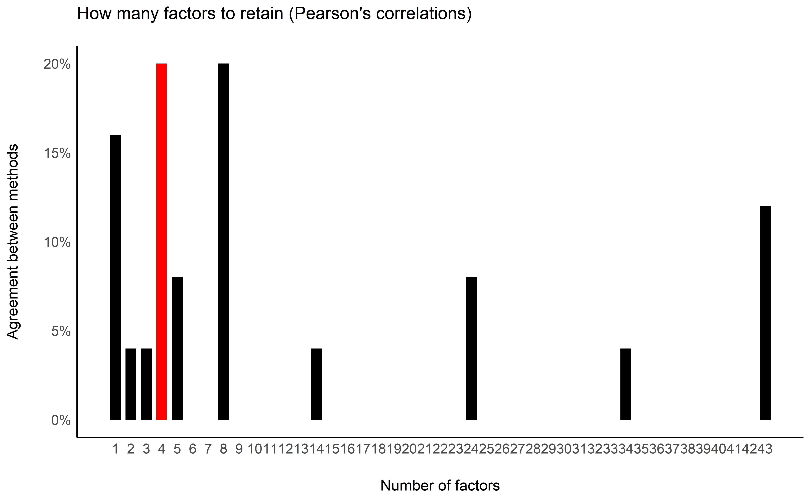
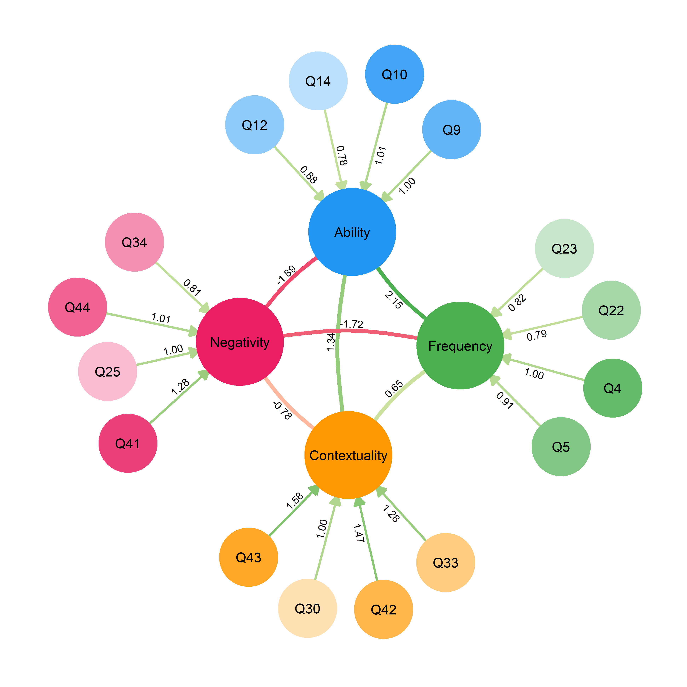
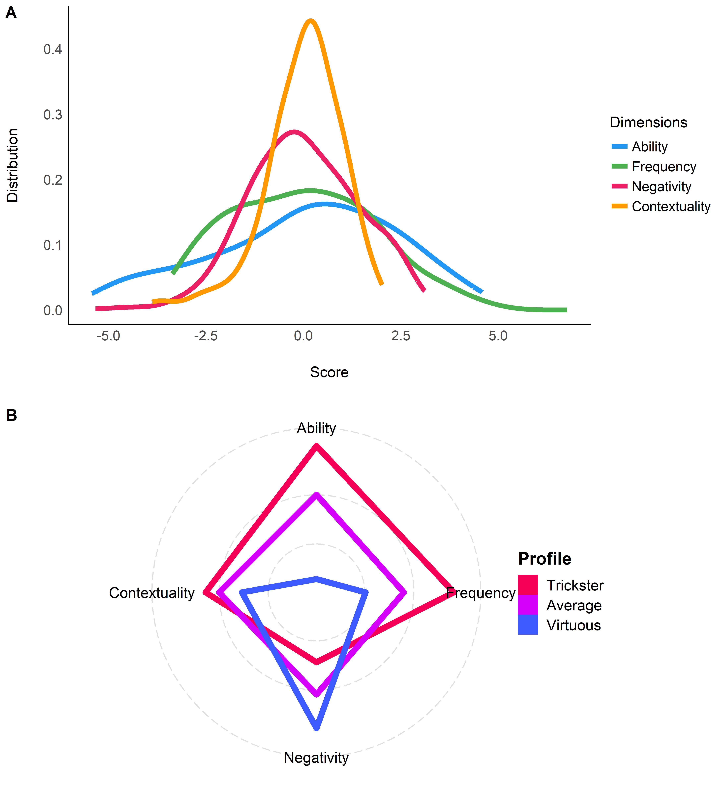
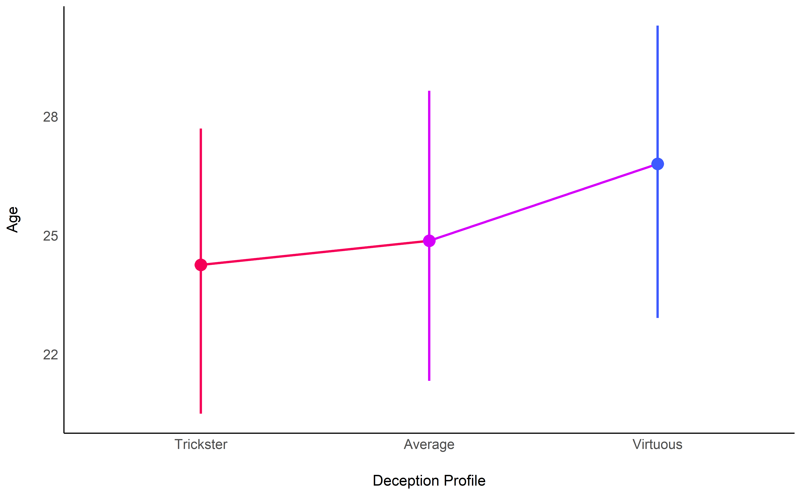
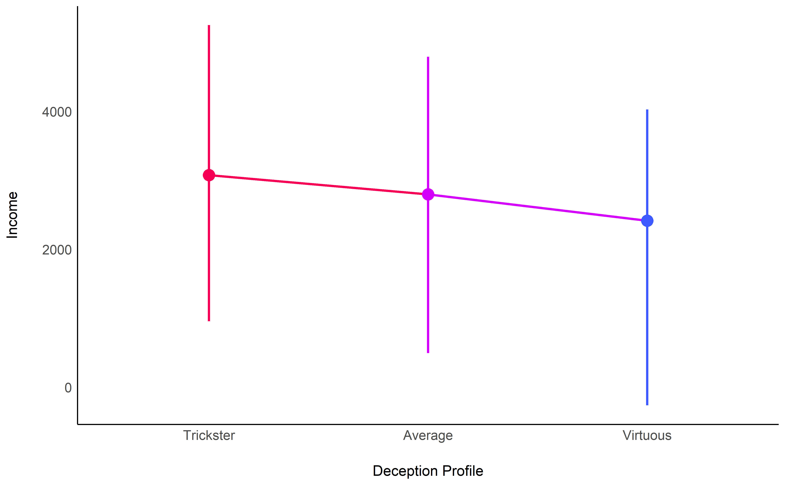
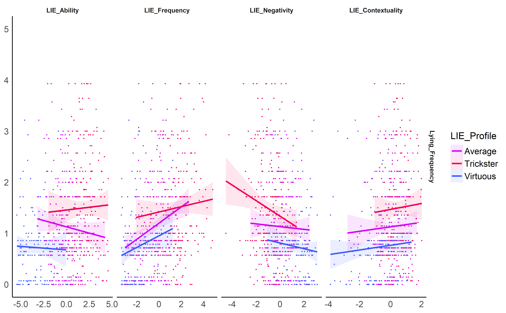
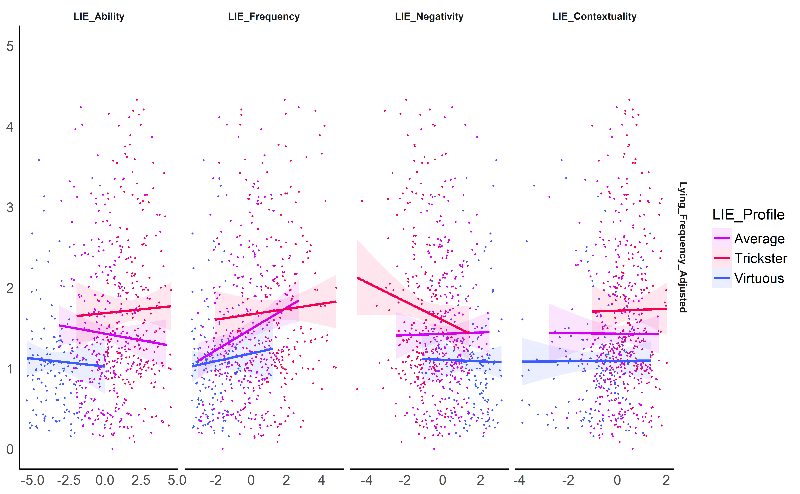
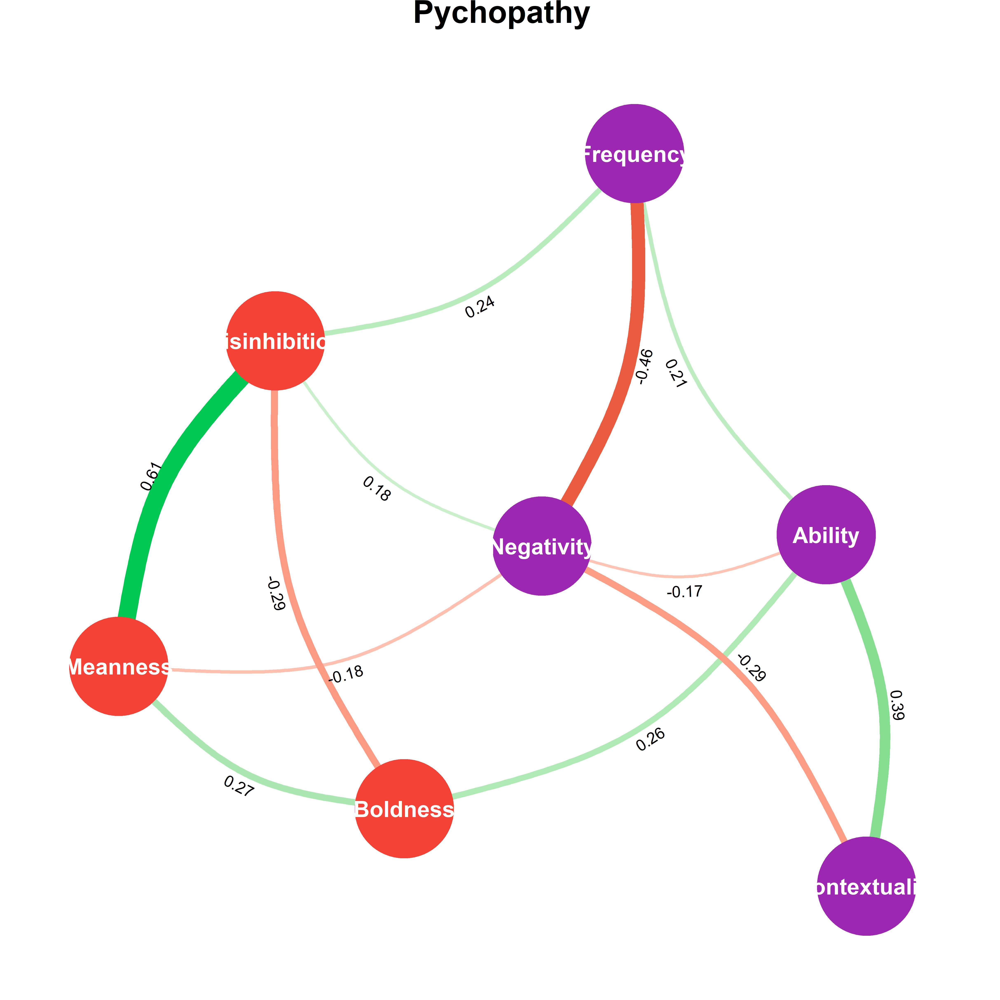
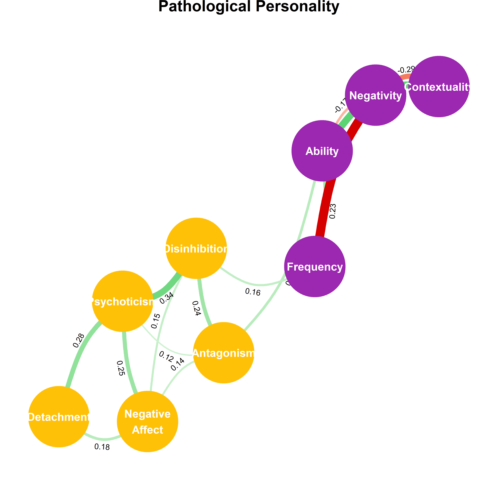

# Methods

## Packages & Data

### Packages

```r
library(tidyverse)
library(easystats)
```

```
> # Attaching packages (red = needs update)
> <U+2714> insight     0.9.0.1   <U+2714> bayestestR  0.7.2.1
> <U+26A0> performance 0.4.7.1   <U+2714> parameters  0.8.2  
> <U+26A0> see         0.5.1     <U+2714> effectsize  0.3.1  
> <U+26A0> correlation 0.2.1     <U+2714> modelbased  0.3.0  
> <U+2714> report      0.1.0     
> Warnings or errors in CRAN checks for package(s) 'modelbased'.
> Restart the R-Session and update packages in red with 'easystats::easystats_update()'.
```

```r
set.seed(333)
```


### Data


```r
labels <- read.csv("../data/labels.csv", stringsAsFactors = FALSE) %>% 
  mutate(Item = paste0(Questionnaire, "_", Item))
df_raw <- read.csv("../data/data.csv", stringsAsFactors = FALSE)
```


### Preprocessing


```r
df_raw <- df_raw %>% 
  mutate(Participant = paste0("S", 1:nrow(df_raw)),
         Sex = as.factor(Sex))

paste("The initial sample included", report::report_participants(df_raw))
```

```
> [1] "The initial sample included 1011 participants (Mean age = 25.56, SD = 7.89, range = [12.96, 73.51]; 55.09% females; Mean education = 3.38, SD = 2.15, range = [-7, 10])"
```

## Measures Scoring

### Utility Functions

```r
# Reverse negative items
reverse <- function(x, mini, maxi){
  maxi - x + mini
}


# Descriptive statistics
descriptive_statistics <- function(df, begins_with){
  df %>% 
    select(dplyr::starts_with(begins_with)) %>% 
    report::report() %>% 
    report::table_long() %>% 
    select(-one_of(c("n_Obs", "Median", "MAD", "n_Missing"))) %>% 
    print()
  
  plot(df %>% 
    select(dplyr::starts_with(begins_with)) %>% 
    bayestestR::estimate_density(method = "KernSmooth") %>% 
    plot() + 
    see::theme_modern())
}
```

### Deception and Lying Profile (LIE)

We rescaled the LIE variables, originally scored on a -10 to 10 scale, to -5 to 5, so that the coefficients are more easily interpretable (i.e., refers to a change of 10\% of the scale).


```r
df_raw[stringr::str_detect(names(df_raw), "LIE_")] <- effectsize::change_scale(df_raw[stringr::str_detect(names(df_raw), "LIE_")], from = c(-10, 10), to = c(-5, 5))
```

### Psychopathy (TRIMP)


```r
df_raw <- df_raw %>%
   # Transform to numeric
  mutate_at(vars(starts_with("TRIMP")), function(x) {
    ifelse(x == "TRUE", 3,
           ifelse(x == "somewhat true", 2,
                  ifelse(x == "somewhat false", 1, 0)))
    }) %>%
  # Reverse items
  mutate_at(vars("TRIMP_2", "TRIMP_4", "TRIMP_10", "TRIMP_11", "TRIMP_16", "TRIMP_21", "TRIMP_25", "TRIMP_30", "TRIMP_33", "TRIMP_35", "TRIMP_39", "TRIMP_41", "TRIMP_44", "TRIMP_47", "TRIMP_50", "TRIMP_52", "TRIMP_57"), reverse, mini = 0, maxi = 3) %>% 
  # Compute scores
      ## Boldness
  mutate(
    TRIMP_Boldness = (TRIMP_1 + TRIMP_16
                      + TRIMP_7 + TRIMP_32
                      + TRIMP_10 + TRIMP_28
                      + TRIMP_13 + TRIMP_41
                      + TRIMP_19 + TRIMP_38 + TRIMP_57
                      + TRIMP_4 + TRIMP_47 
                      + TRIMP_22 + TRIMP_35
                      + TRIMP_25 + TRIMP_50
                      + TRIMP_44 + TRIMP_54)/19,
    TRIMP_Boldness_Optimism = (TRIMP_1 + TRIMP_16)/2,
    TRIMP_Boldness_Resilience = (TRIMP_7 + TRIMP_32)/2,
    TRIMP_Boldness_Courage = (TRIMP_10 + TRIMP_28)/2,
    TRIMP_Boldness_Dominance = (TRIMP_13 + TRIMP_41)/2,
    TRIMP_Boldness_Persuasiveness = (TRIMP_19 + TRIMP_38 + TRIMP_57)/3,
    TRIMP_Boldness_Intrepidness = (TRIMP_4 + TRIMP_47)/2,
    TRIMP_Boldness_ToleranceForUncertainty = (TRIMP_22 + TRIMP_35)/2,
    TRIMP_Boldness_SelfConfidence = (TRIMP_25 + TRIMP_50)/2,
    TRIMP_Boldness_SocialAssurance = (TRIMP_44 + TRIMP_54)/2
) %>% 
      ## Meanness
  mutate(
    TRIMP_Meanness = (TRIMP_2 + TRIMP_8 + TRIMP_11 + TRIMP_20 + TRIMP_29 + TRIMP_33 + TRIMP_36 + TRIMP_48 + TRIMP_52 + TRIMP_55 
                      + TRIMP_6 + TRIMP_45
                      + TRIMP_14
                      + TRIMP_17 + TRIMP_23 + TRIMP_26 + TRIMP_42
                      + TRIMP_39
                      + TRIMP_40)/19,
    TRIMP_Meanness_Empathy = (TRIMP_2 + TRIMP_8 + TRIMP_11 + TRIMP_20 + TRIMP_29 + TRIMP_33 + TRIMP_36 + TRIMP_48 + TRIMP_52 + TRIMP_55)/10,
    TRIMP_Meanness_ExcitementSeeking = (TRIMP_6 + TRIMP_45)/2,
    TRIMP_Meanness_PhysicalAggression = TRIMP_14,
    TRIMP_Meanness_RelationalAggression = (TRIMP_17 + TRIMP_23 + TRIMP_26 + TRIMP_42)/4,
    TRIMP_Meanness_Honesty = TRIMP_39,
    TRIMP_Meanness_DestructiveAggression = TRIMP_40
) %>% 
     ## Disinhibition
  mutate(
    TRIMP_Disinhibition = (
      TRIMP_3 + TRIMP_46 + 
        TRIMP_5 + TRIMP_30 + 
        TRIMP_9 + TRIMP_15 + TRIMP_37 + TRIMP_51 +
        TRIMP_12 + TRIMP_18 + TRIMP_49 + TRIMP_56 +
        TRIMP_21 +
        TRIMP_24 + TRIMP_43 + TRIMP_53 + TRIMP_58 +
        TRIMP_27 +
        TRIMP_31 +
        TRIMP_34)/20,
    TRIMP_Disinhibition_ImpatienceUrgency = (TRIMP_3 + TRIMP_46)/2,
    TRIMP_Disinhibition_Dependability = (TRIMP_5 + TRIMP_30)/2,
    TRIMP_Disinhibition_ProblematicImpulsivity = (TRIMP_9 + TRIMP_15 + TRIMP_37 + TRIMP_51)/4,
    TRIMP_Disinhibition_Irresponsibility = (TRIMP_12 + TRIMP_18 + TRIMP_49 + TRIMP_56)/4,
    TRIMP_Disinhibition_PlanfulControl = TRIMP_21,
    TRIMP_Disinhibition_Theft = (TRIMP_24 + TRIMP_43 + TRIMP_53 + TRIMP_58)/4,
    TRIMP_Disinhibition_Alienation = TRIMP_27,
    TRIMP_Disinhibition_BoredomProneness = TRIMP_31,
    TRIMP_Disinhibition_Fraud = TRIMP_34
) %>% 
  ## General
      mutate(TRIMP_General = (TRIMP_Boldness*19 + TRIMP_Meanness*19 + TRIMP_Disinhibition*20)/58
) %>%
  # Remove individual questions
  select(-matches("TRIMP_\\d"))
```


### Narcissism (FFNI) 


```r
df_raw <- df_raw %>%
   # Transform to numeric
  mutate_at(vars(starts_with("FFNI")), function(x) {
    ifelse(x == "Disagree strongly", 1,
           ifelse(x == "Disagree a little", 2,
                  ifelse(x == "Neither agree nor disagree", 3,
                         ifelse(x == "Agree a little", 4, 5))))
  })%>%
  # Reverse items
  mutate_at(vars("FFNI_19", "FFNI_27"), reverse, mini = 1, maxi = 5) %>% 
  # Compute scores
  mutate(
    FFNI_AcclaimSeeking = (FFNI_1 + FFNI_16 + FFNI_31 + FFNI_46),
    FFNI_Distrust = (FFNI_4 + FFNI_19 + FFNI_34 + FFNI_49),
    FFNI_Entitlement = (FFNI_5 + FFNI_20 + FFNI_35 + FFNI_50),
    FFNI_Exploitativeness = (FFNI_7 + FFNI_22 + FFNI_37 + FFNI_52),
    FFNI_Indifference = (FFNI_9 + FFNI_24 + FFNI_39 + FFNI_54),
    FFNI_LackOfEmpathy = (FFNI_10 + FFNI_25 + FFNI_40 + FFNI_55),
    FFNI_Manipulativeness = (FFNI_11 + FFNI_26 + FFNI_41 + FFNI_56),
    FFNI_NeedForAdmiration = (FFNI_12 + FFNI_27 + FFNI_42 + FFNI_57),
    FFNI_ThrillSeeking = (FFNI_15 + FFNI_30 + FFNI_45 + FFNI_60),
    FFNI_General = (FFNI_AcclaimSeeking + FFNI_Entitlement + FFNI_NeedForAdmiration + FFNI_Manipulativeness + FFNI_LackOfEmpathy + FFNI_Indifference + FFNI_ThrillSeeking + FFNI_Distrust + FFNI_Exploitativeness) / 9
) %>% 
  # Remove individual questions
  select(-matches("FFNI_\\d"))
```


### Normal Personality (IPIP6)


```r
df_raw <- df_raw %>%
  # Transform to numeric
  mutate_at(vars(starts_with("IPIP6")), as.numeric) %>% 
  # Reverse items
  mutate_at(vars("IPIP6_6", "IPIP6_7", "IPIP6_8", "IPIP6_9", "IPIP6_11", "IPIP6_12", "IPIP6_13", "IPIP6_15", "IPIP6_17", "IPIP6_18", "IPIP6_19", "IPIP6_20", "IPIP6_21", "IPIP6_22", "IPIP6_24"), reverse, mini = 1, maxi = 7) %>% 
  # Compute scores
  mutate(
    IPIP6_Extraversion = (IPIP6_1 + IPIP6_7 + IPIP6_19 + IPIP6_23)/4,
    IPIP6_Agreableness = (IPIP6_2 + IPIP6_8 + IPIP6_14 + IPIP6_20)/4,
    IPIP6_Conscientiousness = (IPIP6_3 + IPIP6_10 + IPIP6_11 + IPIP6_22)/4,
    IPIP6_Neuroticism = (IPIP6_4 + IPIP6_15 + IPIP6_16 + IPIP6_17)/4,
    IPIP6_Openeness = (IPIP6_5 + IPIP6_9 + IPIP6_13 + IPIP6_21)/4,
    IPIP6_HonestyHumility = (IPIP6_6 + IPIP6_12 + IPIP6_18 + IPIP6_24)/4
  ) %>% 
  # Remove individual questions
  select(-matches("IPIP6_\\d"))
```


### Pathological Personality (PID-5)


```r
df_raw <- df_raw %>%
  # Transform to numeric
  mutate_at(vars(starts_with("PID5")), function(x) {
    ifelse(x == "Very false or often false", 0,
           ifelse(x == "Sometimes or somewhat false", 1,
                  ifelse(x == "Sometimes or somewhat true", 2, 3)))
  }) %>% 
  # Compute scores
  mutate(
    PID5_NegativeAffect = (PID5_8 + PID5_9 + PID5_10 + PID5_11 + PID5_15)/5,
    PID5_Detachment = (PID5_4 + PID5_13 + PID5_14 + PID5_16 + PID5_18)/5,
    PID5_Antagonism = (PID5_17 + PID5_19 + PID5_20 + PID5_22 + PID5_25)/5,
    PID5_Disinhibition = (PID5_1 + PID5_2 + PID5_3 + PID5_5 + PID5_6)/5,
    PID5_Psychoticism = (PID5_7 + PID5_12 + PID5_21 + PID5_23 + PID5_24)/5,
    PID5_Pathology = (PID5_NegativeAffect + PID5_Detachment + PID5_Antagonism + PID5_Disinhibition + PID5_Psychoticism)/5
  ) %>% 
  # Remove individual questions
  select(-matches("PID5_\\d"))
```


### Social Desirability (BIDR)


```r
df_raw <- df_raw %>%
   # Reverse items
  mutate_at(vars("BIDR_1", "BIDR_3", "BIDR_5", "BIDR_8", "BIDR_9", "BIDR_11", "BIDR_12", "BIDR_13"), reverse, mini = 1, maxi = 7) %>% 
  # Compute scores
  mutate(
    BIDR_SelfDeceptiveEnhancement = (BIDR_1 + BIDR_2 + BIDR_3 + BIDR_4 + BIDR_5 + BIDR_6 + BIDR_7 + BIDR_8)/8,
    BIDR_ImpressionManagement = (BIDR_9 + BIDR_10 + BIDR_11 + BIDR_12 + BIDR_13 + BIDR_14 + BIDR_15 + BIDR_16)/8,
    BIDR_General = (BIDR_SelfDeceptiveEnhancement + BIDR_ImpressionManagement)/2
) %>% 
  # Remove individual questions
  select(-matches("BIDR_\\d"))
```
 
 
### Impulsivity (UPPS)


```r
df_raw <- df_raw %>%
   # Transform to numeric
  mutate_at(vars(starts_with("UPPS")), function(x) {
    ifelse(x == "Strongly Agree", 1,
           ifelse(x == "Somewhat agree", 2,
                  ifelse(x == "Somewhat disagree", 3, 4)))
  })%>%
  # Reverse items
  mutate_at(vars("UPPS_3", "UPPS_6", "UPPS_8", "UPPS_9", "UPPS_10", "UPPS_13", "UPPS_14", "UPPS_15", "UPPS_16", "UPPS_17", "UPPS_18", "UPPS_20"), reverse, mini = 1, maxi = 4) %>% 
  # Compute scores
  mutate(
    UPPS_NegativeUrgency = (UPPS_6 + UPPS_8 + UPPS_13 + UPPS_15)/4,
    UPPS_PositiveUrgency = (UPPS_3 + UPPS_10 + UPPS_17 + UPPS_20)/4,
    UPPS_LackOfPerseverance = (UPPS_1 + UPPS_4 + UPPS_7 + UPPS_11)/4,
    UPPS_LackOfPremeditation = (UPPS_2 + UPPS_5 + UPPS_12 + UPPS_19)/4,
    UPPS_SensationSeeking = (UPPS_9 + UPPS_14 + UPPS_16 + UPPS_18)/4,
    UPPS_General = (UPPS_NegativeUrgency + UPPS_PositiveUrgency + UPPS_LackOfPerseverance + UPPS_LackOfPremeditation + UPPS_SensationSeeking)/5
) %>% 
  # Remove individual questions
  select(-matches("UPPS_\\d"))
```


### Emotion Regulation (DERS)


```r
df_raw <- df_raw %>%
  # Transform to numeric
  mutate_at(vars(starts_with("DERS")), function(x) {
    ifelse(x == "Almost never (0 - 10%)", 1,
           ifelse(x == "Sometimes (11 - 35%)", 2,
                  ifelse(x == "About half the time (36 - 65%)", 3,
                         ifelse(x == "Most of the time (66 - 90%)", 4, 5))))
  }) %>%
  # Reverse items
  mutate_at(vars("DERS_1", "DERS_4", "DERS_6"), reverse, mini = 1, maxi = 5) %>% 
  # Compute scores
  mutate(
    DERS_Awareness = DERS_1 + DERS_4 + DERS_6,
    DERS_Clarity = DERS_2 + DERS_3 + DERS_5,
    DERS_Goals = DERS_8 + DERS_12 + DERS_15,
    DERS_Impulse = DERS_9 + DERS_16 + DERS_18,
    DERS_NonAcceptance = DERS_7 + DERS_13 + DERS_14,
    DERS_Strategies = DERS_10 + DERS_11 + DERS_17,
    DERS_General = (DERS_Awareness + DERS_Clarity + DERS_Goals + DERS_Impulse + DERS_NonAcceptance + DERS_Strategies) / 6
  ) %>% 
  # Remove individual questions
  select(-matches("DERS_\\d"))
```

### Light Triad (LTS)


```r
df_raw <- df_raw %>%
   # Transform to numeric
  mutate_at(vars(starts_with("LTS")), function(x) {
    ifelse(x == "Agree strongly", 1,
           ifelse(x == "Agree", 2,
                  ifelse(x == "Neutral", 3,
                         ifelse(x == "Disagree", 4, 5)))) 
    })%>%
  # Compute scores
  mutate(
    LTS_FaithInHumanity = (LTS_1 + LTS_4 + LTS_7 + LTS_10)/4,
    LTS_Humanism = (LTS_2 + LTS_5 + LTS_8 + LTS_11)/4,
    LTS_Kantianism = (LTS_3 + LTS_6 + LTS_9 + LTS_12)/4,
    LTS_General = (LTS_FaithInHumanity + LTS_Humanism + LTS_Kantianism)/3
) %>% 
  # Remove individual questions
  select(-matches("LTS_\\d"))
```


### Introception (MAIA2)


```r
df_raw <- df_raw %>%
  # Compute scores
  mutate(
   MAIA2_Noticing = (MAIA2_1 + MAIA2_2 + MAIA2_3 + MAIA2_4)/4,
   MAIA2_BodyListening = (MAIA2_5 + MAIA2_6 + MAIA2_7 + MAIA2_8 + MAIA2_9 + MAIA2_10 + MAIA2_11)/7
) %>% 
  # Remove individual questions
  select(-matches("MAIA2_\\d"))
```


## Data Exclusion

### Incomplete Data


```r
df_incomplete <- df_raw %>% 
  filter_at(vars(matches("IPIP6|PID5|BIDR|MAIA|DERS|UPPS|FFNI|LTS|TRIMP|LIE_")), complete.cases) %>% 
  filter(Sex %in% c("Female", "Male")) %>% 
  droplevels()

paste("We excluded", nrow(df_raw) - nrow(df_incomplete), "participants with missing data.")
```

```
> [1] "We excluded 5 participants with missing data."
```

### Time to complete

```r
df_time <- df_incomplete %>% 
  mutate(Duration = Duration / 60) %>%  # Express in minutes
  filter(Duration < 120)

# Compute highest density intervals
ci <- bayestestR::eti(df_time$Duration, ci = c(0.8, 0.9, 0.95, 0.99))
cat(paste0("Duration Intervals:\n", paste0("  - ", insight::format_ci(ci$CI_low, ci$CI_high, ci$CI / 100), collapse = "\n")))
```

```
> Duration Intervals:
>   - 80% CI [13.09, 42.75]
>   - 90% CI [10.95, 61.94]
>   - 95% CI [9.42, 76.05]
>   - 99% CI [7.52, 96.32]
```

```r
upper_limit <- ci[ci$CI == 90, "CI_high"]
lower_limit <- ci[ci$CI == 90, "CI_low"]

# Visualisation
ci %>% 
  plot(show_zero = FALSE, show_title = FALSE) +
  geom_vline(xintercept = c(upper_limit, lower_limit), color="red", linetype="dotted") +
  theme_modern() +
  scale_fill_viridis_d() +
  ylab("Distribution") +
  xlab("Time to complete (in minutes)") 
```


```r
df_time <- df_time %>% 
  filter(Duration <= upper_limit,
         Duration >= lower_limit)

paste("We excluded", nrow(df_incomplete) - nrow(df_time), "participants with a completion time outside the 90% percentile (>", insight::format_value(lower_limit), "min and <", insight::format_value(upper_limit), "min).")
```

```
> [1] "We excluded 141 participants with a completion time outside the 90% percentile (> 10.95 min and < 61.94 min)."
```

### Multivariate outliers


```r
outliers <- df_time %>%
  select(matches("LIE_|BIDR|IPIP6|PID5|TRIMP|FFNI|UPPS|DERS|LTS|MAIA"), -matches("_Profile|_General|_Pathology|Disinhibition_|Meanness_|Boldness_")) %>%
  select(matches("LIE_")) %>%
  effectsize::standardize() %>%
  performance::check_outliers(method = "all")

n_methods <- length(attributes(outliers)$method)

# Visualise
as.data.frame(outliers) %>%
  mutate(Outlier = as.factor(paste0(round(Outlier*n_methods), "/", n_methods))) %>%
  ggplot(aes(x = Outlier, fill = Outlier)) +
  geom_bar() +
  geom_vline(aes(xintercept = 6.5), color = "red", linetype = "dotted") +
  theme_modern() +
  see::scale_fill_metro_d(guide = FALSE) +
  xlab("Number of methods detecting the same outliers") +
  ylab("Number of participants")
```


```r
df <- df_time[-which(as.numeric(outliers) >= 6/ n_methods), ]

paste("Based on a composite outlier score (see the 'check_outliers' function in the 'performance' R package; Lüdecke et al., 2019) obtained via the joint application of multiple outliers detection algorithms (Z-scores, Iglewicz, 1993; Interquartile range (IQR); Mahalanobis distance, Cabana, 2019; Robust Mahalanobis distance, Gnanadesikan & Kettenring, 1972; Minimum Covariance Determinant, Leys et al., 2018; Invariant Coordinate Selection, Archimbaud et al., 2018; Isolation Forest, Liu et al. 2008; and Local Outlier Factor, Breunig et al., 2000), we excluded", nrow(df_time) - nrow(df), "participants that were classified as outliers by at least 8/10 of the methods used.")
```

```
> [1] "Based on a composite outlier score (see the 'check_outliers' function in the 'performance' R package; Lüdecke et al., 2019) obtained via the joint application of multiple outliers detection algorithms (Z-scores, Iglewicz, 1993; Interquartile range (IQR); Mahalanobis distance, Cabana, 2019; Robust Mahalanobis distance, Gnanadesikan & Kettenring, 1972; Minimum Covariance Determinant, Leys et al., 2018; Invariant Coordinate Selection, Archimbaud et al., 2018; Isolation Forest, Liu et al. 2008; and Local Outlier Factor, Breunig et al., 2000), we excluded 149 participants that were classified as outliers by at least 8/10 of the methods used."
```


### Final Sample


```r
paste("The final sample included", report_participants(df))
```

```
> [1] "The final sample included 716 participants (Mean age = 25.02, SD = 7.07, range = [16.55, 73.51]; 55.87% females; Mean education = 3.54, SD = 1.95, range = [-7, 10])"
```

```r
df <- df %>% 
  mutate(System_Screen = sqrt(System_Screen),
         Education_Student = as.factor(ifelse(Education_Student == "", NA, Education_Student)),
         Religion_Type = ifelse(Religion_Type == "", NA, Religion_Type), 
         Singapore_Duration = ifelse(Singapore_Duration > Age, NA, Singapore_Duration),
         Singapore_Duration = Singapore_Duration / Age)

df %>% 
  select(System_Device, System_Screen, Duration, Education_Student, Education_Type, Ethnicity, starts_with("Religion"), Income, Singapore_Duration) %>% 
  report(levels_percentage = TRUE, missing_percentage = TRUE, n_entries = 10)
```

```
> The data contains 716 observations of the following variables:
>   - System_Device: 3 entries: Phone, 74.02%; Computer, 25.14%; Tablet, 0.84%(0.00% missing)
>   - System_Screen: Mean = 694.44, SD = 267.84, Median = 552.00, MAD = 76.91, range: [426.33, 2225.67], Skewness = 1.50, Kurtosis = 1.63, 0% missing
>   - Duration: Mean = 23.75, SD = 9.53, Median = 21.21, MAD = 7.08, range: [10.97, 61.70], Skewness = 1.42, Kurtosis = 2.06, 0% missing
>   - Education_Student: 2 levels: No (n = 212, 29.61%); Yes (n = 503, 70.25%) and missing (n = 1, 0.14%)
>   - Education_Type: 17 entries: Business and Accountancy, 21.51%; Engineering, 19.13%; Social Sciences (Psychology, Sociology, etc.), 16.20%; Sciences, 10.89%; Others, 7.26%; Computing, 5.87%; Humanities (Languages, History, etc.), 5.17%; Communication Studies, 3.77%; Medicine, 2.93%; Art and Design, 1.96% and 7 others(0.00% missing)
>   - Ethnicity: 21 entries: Chinese, 87.85%; Malay, 4.05%; Indian, 3.49%; , 1.82%; Vietnamese, 0.42%; Eurasian, 0.28%; African, 0.14%; Arabic, 0.14%; Boyanese , 0.14%; Caucasian, 0.14% and 11 others(0.00% missing)
>   - Religion_Type: 6 entries: Buddhism, 32.12%; No religion, 26.12%; Christianity, 25.00%; Taoism, 6.28%; Islam, 4.75%; Hinduism, 2.51%(3.21% missing)
>   - Religion_Religiosity: Mean = 4.14, SD = 2.97, Median = , MAD = 4.45, range: [0, 10], Skewness = 0.09, Kurtosis = -1.26, 2.93% missing
>   - Religion_Engagement: Mean = 3.73, SD = 3.07, Median = , MAD = 4.45, range: [0, 10], Skewness = 0.33, Kurtosis = -1.15, 3.63% missing
>   - Income: Mean = 2815.77, SD = 4352.05, Median = , MAD = 1482.60, range: [0, 60000], Skewness = 8.67, Kurtosis = 101.04, 13.83% missing
>   - Singapore_Duration: Mean = 0.89, SD = 0.24, Median = , MAD = 0.02, range: [0, 1.00], Skewness = -2.55, Kurtosis = 5.09, 24.44% missing
```


```r
df <- df %>% 
  mutate(Education_Type = ifelse(!Education_Type %in% c("Business and Accountancy",
                                                        "Engineering",
                                                        "Social Sciences (Psychology, Sociology...)",
                                                        "Sciences",
                                                        "Computing",
                                                        "Humanities (Languages, History...)"), "Other", Education_Type),
         Ethnicity = ifelse(!Ethnicity %in% c("Chinese", "Malay", "Indian"), "Other", Ethnicity))
```


#### Education and Income


```r
report_participants(df, group = c("Sex", "Education_Student"))
```

```
> [1] "For the 'Sex - Female and Education_Student - No' group: 125 participants (Mean age = 30.43, SD = 10.99, range = [21.73, 73.51]; 100.00% females; Mean education = 2.84, SD = 2.74, range = [-7, 6]), for the 'Sex - Male and Education_Student - No' group: 87 participants (Mean age = 30.18, SD = 10.85, range = [19.73, 62.66]; 0.00% females; Mean education = 2.25, SD = 2.66, range = [-6, 10]), for the 'Sex - Female and Education_Student - Yes' group: 275 participants (Mean age = 22.37, SD = 1.95, range = [16.55, 40.70]; 100.00% females; Mean education = 3.96, SD = 1.46, range = [-2, 10]) and for the 'Sex - Male and Education_Student - Yes' group: 228 participants (Mean age = 23.30, SD = 2.10, range = [19.02, 39.79]; 0.00% females; Mean education = 3.90, SD = 1.18, range = [-2, 10])"
```


```r
as.data.frame(table(df$Education_Type)) %>%
  ggplot(aes(x="", y =Freq, fill = reorder(Var1, -Freq))) +
  geom_bar(width = 1, stat = "identity") +
  labs(fill = "Course") +
  coord_polar("y", start = 0, direction = -1) +
  scale_fill_brewer(palette="Blues") +
  theme_void() +
  theme(legend.text = element_text(size = 20)) +
  theme(legend.title = element_text(face = "bold", size = 20))
```


```r
df %>% 
  filter(!is.na(Education_Student)) %>% 
  filter(Income < 18000) %>% 
  ggplot(aes(x = Income, colour = Education_Type)) +
  geom_density(size = 1) +
  facet_grid(~Education_Student, labeller = "label_both") +
  theme_modern()
```


```r
df %>% 
  filter(!is.na(Education_Student)) %>% 
  filter(Income < 18000) %>% 
  ggplot(aes(x = Age, y = Income, colour = Education_Type, fill = Education_Type)) +
  geom_point2() +
  geom_smooth(method = "lm", alpha = 0.1) + 
  theme_modern()
```


#### Culture


```r
as.data.frame(table(df$Ethnicity)) %>%
  ggplot(aes(x="", y = Freq, fill = reorder(Var1, -Freq))) +
  labs(fill = "Ethnicity") +
  geom_bar(width = 1, stat = "identity") +
  coord_polar("y", start = 0) +
  scale_fill_brewer(palette="Oranges") +
  theme_void() +
  theme(legend.text = element_text(size = 20)) +
  theme(legend.title = element_text(face = "bold", size = 20))
```


```r
df %>% 
  filter(!is.na(Singapore_Duration)) %>% 
  ggplot(aes(x = Singapore_Duration, colour = Ethnicity)) +
  geom_density(size = 1) +
  theme_modern() +
  scale_x_continuous(labels = scales::percent)
```


#### Religion


```r
as.data.frame(table(df$Religion_Type)) %>%
  ggplot(aes(x="", y = Freq, fill = reorder(Var1, -Freq))) +
  geom_bar(width = 1, stat = "identity") +
  labs(fill = "Religion") +
  coord_polar("y", start = 0) +
  scale_fill_brewer(palette="Purples") +
  theme_void() +
  theme(legend.text = element_text(size = 20)) +
  theme(legend.title = element_text(face = "bold", size = 20))
```


```r
df %>% 
  filter(!is.na(Religion_Engagement)) %>% 
  filter(!is.na(Religion_Type)) %>% 
  ggplot(aes(x = Religion_Engagement, colour = Religion_Type)) +
  geom_density(size = 1) +
  theme_modern()
```


```r
df %>% 
  filter(!is.na(Religion_Religiosity)) %>% 
  filter(!is.na(Religion_Type)) %>% 
  ggplot(aes(x = Religion_Religiosity, colour = Religion_Type)) +
  geom_density(size = 1) +
  theme_modern()
```


```r
df %>% 
  filter(!is.na(Religion_Engagement)) %>% 
  filter(!is.na(Religion_Religiosity)) %>% 
  filter(!is.na(Religion_Type)) %>% 
  ggplot(aes(x = Religion_Religiosity, y = Religion_Engagement, colour = Religion_Type, fill = Religion_Type)) +
  geom_jitter() +
  geom_smooth(method = "lm", alpha = 0.2) +
  ggtitle(paste("r =", insight::format_value(cor.test(df$Religion_Engagement, df$Religion_Religiosity)$estimate))) +
  theme_modern()
```


```r
df <- df %>% 
  mutate(Religion_Faith = (Religion_Engagement + Religion_Religiosity) / 2)
```

# Results

## Descriptive Statistics


### Deception and Lying Profile (LIE)

```r
descriptive_statistics(df, "LIE_")
```

```
> Variable |  Mean |   SD | Min |  Max | Skewness | Kurtosis
> ----------------------------------------------------------
> LIE_1    | -1.70 | 2.39 |  -5 | 5.00 |     0.47 |    -0.56
> LIE_2    | -1.32 | 2.52 |  -5 | 5.00 |     0.34 |    -0.79
> LIE_3    | -2.49 | 2.56 |  -5 | 5.00 |     1.03 |     0.29
> LIE_4    | -1.56 | 2.41 |  -5 | 5.00 |     0.37 |    -0.69
> LIE_5    | -1.80 | 2.26 |  -5 | 5.00 |     0.49 |    -0.47
> LIE_6    | -0.98 | 2.55 |  -5 | 5.00 |     0.14 |    -0.96
> LIE_7    | -0.84 | 2.62 |  -5 | 5.00 |     0.16 |    -0.94
> LIE_8    | -1.41 | 2.22 |  -5 | 4.25 |     0.31 |    -0.62
> LIE_9    | -0.13 | 2.71 |  -5 | 5.00 |    -0.15 |    -0.94
> LIE_10   |  0.20 | 2.66 |  -5 | 5.00 |    -0.30 |    -0.78
> LIE_11   | -0.29 | 2.59 |  -5 | 5.00 |    -0.07 |    -0.85
> LIE_12   |  0.79 | 2.63 |  -5 | 5.00 |    -0.56 |    -0.48
> LIE_13   | -0.49 | 2.51 |  -5 | 5.00 |     0.27 |    -0.63
> LIE_14   |  0.46 | 2.40 |  -5 | 5.00 |    -0.41 |    -0.51
> LIE_15   |  0.21 | 2.56 |  -5 | 5.00 |    -0.21 |    -0.75
> LIE_16   | -0.99 | 2.31 |  -5 | 5.00 |     0.38 |    -0.31
> LIE_17   |  0.40 | 2.65 |  -5 | 5.00 |    -0.03 |    -0.89
> LIE_18   |  0.04 | 2.64 |  -5 | 5.00 |    -0.25 |    -0.84
> LIE_19   |  0.94 | 2.60 |  -5 | 5.00 |    -0.29 |    -0.85
> LIE_20   | -0.18 | 2.56 |  -5 | 5.00 |    -0.09 |    -0.83
> LIE_21   | -1.03 | 2.69 |  -5 | 5.00 |     0.35 |    -0.79
> LIE_22   | -2.20 | 2.32 |  -5 | 5.00 |     0.62 |    -0.50
> LIE_23   | -1.83 | 2.28 |  -5 | 5.00 |     0.52 |    -0.48
> LIE_24   |  1.27 | 2.23 |  -5 | 5.00 |    -0.32 |    -0.45
> LIE_25   |  1.74 | 2.33 |  -5 | 5.00 |    -0.58 |    -0.19
> LIE_26   | -2.59 | 2.14 |  -5 | 5.00 |     0.80 |    -0.05
> LIE_27   |  1.13 | 2.53 |  -5 | 5.00 |    -0.38 |    -0.66
> LIE_28   | -0.21 | 2.53 |  -5 | 5.00 |    -0.09 |    -0.68
> LIE_29   | -0.91 | 2.69 |  -5 | 5.00 |     0.28 |    -0.83
> LIE_30   |  0.48 | 2.65 |  -5 | 5.00 |    -0.38 |    -0.74
> LIE_31   | -0.42 | 2.57 |  -5 | 5.00 |    -0.02 |    -0.89
> LIE_32   |  0.55 | 2.63 |  -5 | 5.00 |    -0.36 |    -0.70
> LIE_33   |  1.90 | 2.09 |  -5 | 5.00 |    -1.01 |     1.45
> LIE_34   |  2.53 | 1.99 |  -5 | 5.00 |    -0.72 |     0.40
> LIE_35   |  1.71 | 2.22 |  -5 | 5.00 |    -0.52 |    -0.20
> LIE_36   |  0.90 | 2.37 |  -5 | 5.00 |    -0.20 |    -0.66
> LIE_37   |  0.55 | 2.68 |  -5 | 5.00 |     0.05 |    -0.96
> LIE_38   |  1.81 | 2.46 |  -5 | 5.00 |    -0.50 |    -0.66
> LIE_39   |  1.74 | 2.39 |  -5 | 5.00 |    -0.87 |     0.39
> LIE_40   |  1.78 | 2.34 |  -5 | 5.00 |    -0.68 |     0.04
> LIE_41   |  0.88 | 2.63 |  -5 | 5.00 |    -0.16 |    -0.79
> LIE_42   |  1.88 | 2.16 |  -5 | 5.00 |    -0.77 |     0.82
> LIE_43   |  1.85 | 2.19 |  -5 | 5.00 |    -0.96 |     1.12
> LIE_44   |  1.99 | 2.38 |  -5 | 5.00 |    -0.65 |    -0.13
```


### Psychopathy (TRIMP)

```r
df %>% 
  select(TRIMP_General, starts_with("TRIMP_Boldness"), starts_with("TRIMP_Meanness"), starts_with("TRIMP_Disinhibition")) %>% 
  report() %>% 
  table_long() %>% 
  select(-one_of(c("n_Obs", "Median", "MAD", "n_Missing"))) %>% 
  print()
```

```
> Variable                                   | Mean |   SD |  Min |  Max | Skewness | Kurtosis
> --------------------------------------------------------------------------------------------
> TRIMP_General                              | 1.08 | 0.28 | 0.34 | 2.09 |     0.33 |    -0.02
> TRIMP_Boldness                             | 1.42 | 0.39 | 0.11 | 2.47 |    -0.19 |     0.22
> TRIMP_Boldness_Optimism                    | 1.71 | 0.57 | 0.00 | 3.00 |    -0.36 |     0.26
> TRIMP_Boldness_Resilience                  | 1.52 | 0.65 | 0.00 | 3.00 |    -0.12 |    -0.28
> TRIMP_Boldness_Courage                     | 1.34 | 0.68 | 0.00 | 3.00 |     0.07 |    -0.15
> TRIMP_Boldness_Dominance                   | 1.39 | 0.72 | 0.00 | 3.00 |    -0.02 |    -0.37
> TRIMP_Boldness_Persuasiveness              | 1.53 | 0.62 | 0.00 | 3.00 |    -0.18 |    -0.19
> TRIMP_Boldness_Intrepidness                | 1.06 | 0.74 | 0.00 | 3.00 |     0.34 |    -0.59
> TRIMP_Boldness_ToleranceForUncertainty     | 1.31 | 0.61 | 0.00 | 3.00 |     0.06 |     0.20
> TRIMP_Boldness_SelfConfidence              | 1.56 | 0.67 | 0.00 | 3.00 |     0.09 |    -0.32
> TRIMP_Boldness_SocialAssurance             | 1.30 | 0.67 | 0.00 | 3.00 |     0.07 |    -0.16
> TRIMP_Meanness                             | 0.88 | 0.41 | 0.00 | 2.63 |     0.37 |     0.04
> TRIMP_Meanness_Empathy                     | 0.80 | 0.46 | 0.00 | 2.40 |     0.32 |    -0.41
> TRIMP_Meanness_ExcitementSeeking           | 1.29 | 0.80 | 0.00 | 3.00 |     0.02 |    -0.69
> TRIMP_Meanness_PhysicalAggression          | 0.87 | 0.92 | 0.00 | 3.00 |     0.64 |    -0.73
> TRIMP_Meanness_RelationalAggression        | 1.03 | 0.63 | 0.00 | 3.00 |     0.28 |    -0.49
> TRIMP_Meanness_Honesty                     | 0.82 | 0.71 | 0.00 | 3.00 |     0.65 |     0.38
> TRIMP_Meanness_DestructiveAggression       | 0.35 | 0.64 | 0.00 | 3.00 |     1.79 |     2.44
> TRIMP_Disinhibition                        | 0.94 | 0.41 | 0.05 | 2.55 |     0.55 |     0.19
> TRIMP_Disinhibition_ImpatienceUrgency      | 1.75 | 0.59 | 0.00 | 3.00 |    -0.27 |     0.10
> TRIMP_Disinhibition_Dependability          | 0.93 | 0.67 | 0.00 | 3.00 |     0.35 |    -0.26
> TRIMP_Disinhibition_ProblematicImpulsivity | 1.12 | 0.64 | 0.00 | 3.00 |     0.15 |    -0.48
> TRIMP_Disinhibition_Irresponsibility       | 0.65 | 0.61 | 0.00 | 2.75 |     0.84 |     0.00
> TRIMP_Disinhibition_PlanfulControl         | 1.10 | 0.66 | 0.00 | 3.00 |     0.51 |     0.81
> TRIMP_Disinhibition_Theft                  | 0.39 | 0.52 | 0.00 | 2.50 |     1.45 |     1.55
> TRIMP_Disinhibition_Alienation             | 1.45 | 0.86 | 0.00 | 3.00 |     0.01 |    -0.66
> TRIMP_Disinhibition_BoredomProneness       | 1.71 | 0.81 | 0.00 | 3.00 |    -0.23 |    -0.40
> TRIMP_Disinhibition_Fraud                  | 0.41 | 0.70 | 0.00 | 3.00 |     1.69 |     2.12
```

```r
plots(
  df %>% 
    select(starts_with("TRIMP_Boldness")) %>% 
    bayestestR::estimate_density(method = "KernSmooth") %>% 
    plot() + 
    theme_modern(),
  df %>% 
    select(starts_with("TRIMP_Meanness")) %>% 
    bayestestR::estimate_density(method = "KernSmooth") %>% 
    plot() + 
    theme_modern(),
  df %>% 
    select(starts_with("TRIMP_Disinhibition")) %>% 
    bayestestR::estimate_density(method = "KernSmooth") %>% 
    plot() + 
    theme_modern()
    )
```


### Narcissism (FFNI)

```r
descriptive_statistics(df, "FFNI")
```

```
> Variable               |  Mean |   SD |  Min |   Max | Skewness | Kurtosis
> --------------------------------------------------------------------------
> FFNI_AcclaimSeeking    | 14.14 | 3.44 | 4.00 | 20.00 |    -0.68 |     0.43
> FFNI_Distrust          | 12.34 | 2.89 | 4.00 | 20.00 |     0.04 |    -0.09
> FFNI_Entitlement       |  9.90 | 3.69 | 4.00 | 20.00 |     0.19 |    -0.73
> FFNI_Exploitativeness  |  9.04 | 3.76 | 4.00 | 20.00 |     0.38 |    -0.73
> FFNI_Indifference      | 10.89 | 3.80 | 4.00 | 20.00 |     0.24 |    -0.59
> FFNI_LackOfEmpathy     |  9.12 | 3.18 | 4.00 | 20.00 |     0.51 |    -0.15
> FFNI_Manipulativeness  | 10.32 | 3.74 | 4.00 | 20.00 |     0.19 |    -0.73
> FFNI_NeedForAdmiration | 12.97 | 2.94 | 4.00 | 20.00 |    -0.39 |     0.25
> FFNI_ThrillSeeking     | 10.54 | 3.79 | 4.00 | 20.00 |     0.10 |    -0.80
> FFNI_General           | 11.03 | 1.97 | 5.89 | 19.44 |     0.28 |     0.58
```


### Normal Personality (IPIP6)

```r
descriptive_statistics(df, "IPIP6")
```

```
> Variable                | Mean |   SD |  Min |  Max | Skewness | Kurtosis
> -------------------------------------------------------------------------
> IPIP6_Extraversion      | 3.58 | 1.20 | 1.00 | 6.75 |     0.15 |    -0.57
> IPIP6_Agreableness      | 5.01 | 0.91 | 1.25 | 7.00 |    -0.38 |     0.46
> IPIP6_Conscientiousness | 4.43 | 1.08 | 1.00 | 7.00 |    -0.27 |    -0.03
> IPIP6_Neuroticism       | 3.94 | 1.13 | 1.00 | 7.00 |     0.02 |    -0.18
> IPIP6_Openeness         | 4.56 | 1.08 | 1.25 | 7.00 |    -0.12 |    -0.33
> IPIP6_HonestyHumility   | 4.39 | 1.23 | 1.00 | 7.00 |    -0.06 |    -0.55
```


### Pathological Personality (PID-5)

```r
descriptive_statistics(df, "PID5")
```

```
> Variable            | Mean |   SD | Min | Max | Skewness | Kurtosis
> -------------------------------------------------------------------
> PID5_NegativeAffect | 1.42 | 0.63 |   0 |   3 |    -0.10 |    -0.35
> PID5_Detachment     | 1.09 | 0.56 |   0 |   3 |     0.21 |    -0.02
> PID5_Antagonism     | 0.89 | 0.54 |   0 |   3 |     0.42 |     0.12
> PID5_Disinhibition  | 0.99 | 0.64 |   0 |   3 |     0.17 |    -0.69
> PID5_Psychoticism   | 1.24 | 0.61 |   0 |   3 |    -0.07 |    -0.29
> PID5_Pathology      | 1.13 | 0.45 |   0 |   3 |     0.12 |     0.37
```


### Social Desirability (BIDR)

```r
descriptive_statistics(df, "BIDR")
```

```
> Variable                      | Mean |   SD |  Min |  Max | Skewness | Kurtosis
> -------------------------------------------------------------------------------
> BIDR_SelfDeceptiveEnhancement | 3.86 | 0.79 | 1.50 | 6.12 |    -0.03 |     0.28
> BIDR_ImpressionManagement     | 3.78 | 0.82 | 1.00 | 6.62 |     0.14 |     0.73
> BIDR_General                  | 3.82 | 0.65 | 1.44 | 6.38 |     0.13 |     0.95
```


### Impulsivity (UPPS)

```r
descriptive_statistics(df, "UPPS")
```

```
> Variable                 | Mean |   SD |  Min |  Max | Skewness | Kurtosis
> --------------------------------------------------------------------------
> UPPS_NegativeUrgency     | 2.40 | 0.64 | 1.00 | 4.00 |    -0.11 |    -0.35
> UPPS_PositiveUrgency     | 2.13 | 0.62 | 1.00 | 4.00 |     0.02 |    -0.51
> UPPS_LackOfPerseverance  | 1.87 | 0.46 | 1.00 | 4.00 |     0.18 |     0.48
> UPPS_LackOfPremeditation | 1.87 | 0.46 | 1.00 | 3.75 |     0.11 |     0.67
> UPPS_SensationSeeking    | 2.68 | 0.66 | 1.00 | 4.00 |    -0.28 |    -0.25
> UPPS_General             | 2.19 | 0.35 | 1.10 | 3.55 |    -0.25 |     0.01
```


### Emotion Regulation (DERS)

```r
descriptive_statistics(df, "DERS")
```

```
> Variable           | Mean |   SD |  Min |   Max | Skewness | Kurtosis
> ---------------------------------------------------------------------
> DERS_Awareness     | 7.00 | 2.06 | 3.00 | 13.00 |     0.32 |    -0.21
> DERS_Clarity       | 7.46 | 2.53 | 3.00 | 15.00 |     0.50 |    -0.05
> DERS_Goals         | 9.41 | 3.18 | 3.00 | 15.00 |    -0.01 |    -0.99
> DERS_Impulse       | 6.78 | 3.02 | 3.00 | 15.00 |     0.66 |    -0.33
> DERS_NonAcceptance | 7.35 | 3.10 | 3.00 | 15.00 |     0.55 |    -0.48
> DERS_Strategies    | 6.98 | 3.04 | 3.00 | 15.00 |     0.56 |    -0.57
> DERS_General       | 7.50 | 1.95 | 3.50 | 13.33 |     0.28 |    -0.52
```


### Light Triad (LTS)

```r
descriptive_statistics(df, "LTS")
```

```
> Variable            | Mean |   SD | Min |  Max | Skewness | Kurtosis
> --------------------------------------------------------------------
> LTS_FaithInHumanity | 2.41 | 0.66 |   1 | 4.75 |     0.64 |     0.67
> LTS_Humanism        | 2.04 | 0.50 |   1 | 4.00 |     0.23 |     0.38
> LTS_Kantianism      | 2.08 | 0.56 |   1 | 4.00 |     0.31 |     0.14
> LTS_General         | 2.18 | 0.45 |   1 | 4.00 |     0.18 |     0.33
```


### Interoception (MAIA2)

```r
descriptive_statistics(df, "MAIA2")
```

```
> Variable            | Mean |   SD | Min | Max | Skewness | Kurtosis
> -------------------------------------------------------------------
> MAIA2_Noticing      | 3.12 | 0.89 |   0 |   5 |    -0.46 |     0.35
> MAIA2_BodyListening | 2.77 | 0.93 |   0 |   5 |    -0.39 |     0.08
```


## Factor Structure

### Splitting the data 60-40 for EFA-CFA

```r
lie <- select(df, starts_with("LIE_"))
labels_lie <- labels[labels$Questionnaire == "LIE", ]

# Two sets of data 60-40
partitions <- parameters::data_partition(lie, training_proportion = 0.6)
lie_EFA <- partitions$training
lie_CFA <- partitions$test


# Compare stats across groups
group_indices = c(rep(2, round(nrow(lie)/2)), rep(1, nrow(lie) - round(nrow(lie)/2)))
lie_grouped <- cbind(lie, group_indices) 

psych::statsBy(lie_grouped, group = "group_indices")
```

```
> Statistics within and between groups  
> Call: psych::statsBy(data = lie_grouped, group = "group_indices")
> Intraclass Correlation 1 (Percentage of variance due to groups) 
>         LIE_1         LIE_2         LIE_3         LIE_4         LIE_5 
>          0.00          0.00          0.00          0.00          0.03 
>         LIE_6         LIE_7         LIE_8         LIE_9        LIE_10 
>          0.01          0.00          0.00          0.00          0.00 
>        LIE_11        LIE_12        LIE_13        LIE_14        LIE_15 
>          0.00          0.00          0.00          0.00          0.00 
>        LIE_16        LIE_17        LIE_18        LIE_19        LIE_20 
>          0.00          0.00          0.00          0.00          0.00 
>        LIE_21        LIE_22        LIE_23        LIE_24        LIE_25 
>          0.00          0.00          0.00          0.00          0.00 
>        LIE_26        LIE_27        LIE_28        LIE_29        LIE_30 
>          0.01          0.00          0.00          0.01          0.00 
>        LIE_31        LIE_32        LIE_33        LIE_34        LIE_35 
>          0.00          0.00          0.00          0.01          0.00 
>        LIE_36        LIE_37        LIE_38        LIE_39        LIE_40 
>          0.02          0.01          0.00          0.00          0.00 
>        LIE_41        LIE_42        LIE_43        LIE_44 group_indices 
>          0.01          0.00          0.00          0.01          1.00 
> Intraclass Correlation 2 (Reliability of group differences) 
>         LIE_1         LIE_2         LIE_3         LIE_4         LIE_5 
>          0.45         -1.14        -17.63          0.36          0.91 
>         LIE_6         LIE_7         LIE_8         LIE_9        LIE_10 
>          0.75          0.41          0.31         -1.44         -3.98 
>        LIE_11        LIE_12        LIE_13        LIE_14        LIE_15 
>         -2.47        -12.61        -27.85        -54.67         -0.30 
>        LIE_16        LIE_17        LIE_18        LIE_19        LIE_20 
>          0.36         -4.47         -0.22         -0.13          0.41 
>        LIE_21        LIE_22        LIE_23        LIE_24        LIE_25 
>        -43.53         -3.90          0.55        -17.65          0.54 
>        LIE_26        LIE_27        LIE_28        LIE_29        LIE_30 
>          0.83         -0.72          0.52          0.81          0.26 
>        LIE_31        LIE_32        LIE_33        LIE_34        LIE_35 
>        -13.59        -16.87         -0.35          0.77          0.33 
>        LIE_36        LIE_37        LIE_38        LIE_39        LIE_40 
>          0.87          0.84          0.61          0.48         -4.07 
>        LIE_41        LIE_42        LIE_43        LIE_44 group_indices 
>          0.84         -3.38        -23.52          0.69          1.00 
> eta^2 between groups  
>  LIE_1.bg  LIE_2.bg  LIE_3.bg  LIE_4.bg  LIE_5.bg  LIE_6.bg  LIE_7.bg  LIE_8.bg 
>      0.00      0.00      0.00      0.00      0.01      0.01      0.00      0.00 
>  LIE_9.bg LIE_10.bg LIE_11.bg LIE_12.bg LIE_13.bg LIE_14.bg LIE_15.bg LIE_16.bg 
>      0.00      0.00      0.00      0.00      0.00      0.00      0.00      0.00 
> LIE_17.bg LIE_18.bg LIE_19.bg LIE_20.bg LIE_21.bg LIE_22.bg LIE_23.bg LIE_24.bg 
>      0.00      0.00      0.00      0.00      0.00      0.00      0.00      0.00 
> LIE_25.bg LIE_26.bg LIE_27.bg LIE_28.bg LIE_29.bg LIE_30.bg LIE_31.bg LIE_32.bg 
>      0.00      0.01      0.00      0.00      0.01      0.00      0.00      0.00 
> LIE_33.bg LIE_34.bg LIE_35.bg LIE_36.bg LIE_37.bg LIE_38.bg LIE_39.bg LIE_40.bg 
>      0.00      0.01      0.00      0.01      0.01      0.00      0.00      0.00 
> LIE_41.bg LIE_42.bg LIE_43.bg LIE_44.bg 
>      0.01      0.00      0.00      0.00 
> 
> To see the correlations between and within groups, use the short=FALSE option in your print statement.
> Many results are not shown directly. To see specific objects select from the following list:
>  mean sd n F ICC1 ICC2 ci1 ci2 raw rbg pbg rwg nw ci.wg pwg etabg etawg nwg nG Call
```


### Factor structure quality


```r
parameters::check_factorstructure(lie_EFA)
```

```
> # Is the data suitable for Factor Analysis?
> 
>   - KMO: The Kaiser, Meyer, Olkin (KMO) measure of sampling adequacy suggests that data seems appropriate for factor analysis (KMO = 0.94).
>   - Sphericity: Bartlett's test of sphericity suggests that there is sufficient significant correlation in the data for factor analaysis (Chisq(946) = 10773.22, p < .001).
```

### Correlation matrix


```r
cor <- as.matrix(correlation::correlation(lie_EFA))
```

### How many factors


```r
parameters::n_factors(lie_EFA, cor = cor, rotation = "varimax", package = "all", safe = FALSE) %T>% 
  print() %>%
  plot() +
  ggtitle("How many factors to retain (Pearson's correlations)") +
  theme_modern()
```

```
> # Method Agreement Procedure:
> 
> The choice of 4 dimensions is supported by 5 (20.00%) methods out of 25 (beta, R2, Velicer's MAP, BIC, BIC).
```




### Exploratory Factor Analysis (EFA)

#### Eight latent factors model


```r
efa_8 <- psych::fa(cor, n.obs = nrow(lie_EFA), nfactors = 8, rotate = "varimax", fm = "ml") 

parameters::model_parameters(efa_8, labels = labels_lie$Description) %>% 
  print(sort = TRUE, threshold = "max") 
```

```
> # Rotated loadings from Factor Analysis (varimax-rotation)
> 
> Variable |                                                      Label |   ML1 |   ML2 |  ML4 |  ML3 |  ML6 |  ML7 |  ML5 | ML8 | Complexity | Uniqueness
> --------------------------------------------------------------------------------------------------------------------------------------------------------
> LIE_10   |                                             I can lie well |  0.86 |       |      |      |      |      |      |     |       1.28 |       0.15
> LIE_9    |                                           I am a good liar |  0.84 |       |      |      |      |      |      |     |       1.36 |       0.18
> LIE_12   |                         I can lie effectively if I want to |  0.79 |       |      |      |      |      |      |     |       1.34 |       0.28
> LIE_14   |                    It is hard for others to detect my lies |  0.76 |       |      |      |      |      |      |     |       1.22 |       0.35
> LIE_13   |                      Others can easily tell when I’m lying | -0.76 |       |      |      |      |      |      |     |       1.40 |       0.31
> LIE_18   |                   It is easy for me to make up clever lies |  0.75 |       |      |      |      |      |      |     |       1.46 |       0.32
> LIE_11   |                              I am good at deceiving others |  0.74 |       |      |      |      |      |      |     |       1.47 |       0.33
> LIE_17   |                                     I find lying difficult | -0.67 |       |      |      |      |      |      |     |       1.96 |       0.33
> LIE_15   |                            I almost never get caught lying |  0.66 |       |      |      |      |      |      |     |       1.18 |       0.53
> LIE_20   |                    I do not have to prepare much for a lie |  0.62 |       |      |      |      |      |      |     |       1.90 |       0.46
> LIE_19   |                I find it taxing to come up with a good lie | -0.57 |       |      |      |      |      |      |     |       1.96 |       0.50
> LIE_16   |                 My lies often arouse suspicion from others | -0.51 |       |      |      |      |      |      |     |       2.11 |       0.61
> LIE_7    |                           I lie more than I think I should |       |  0.76 |      |      |      |      |      |     |       1.59 |       0.26
> LIE_5    |                      I lie more often than most people do  |       |  0.75 |      |      |      |      |      |     |       1.39 |       0.33
> LIE_23   |           I find it difficult to refrain myself from lying |       |  0.75 |      |      |      |      |      |     |       1.25 |       0.38
> LIE_6    |         I lie more frequently than what I expect myself to |       |  0.74 |      |      |      |      |      |     |       1.50 |       0.33
> LIE_4    |                                   I have a tendency to lie |       |  0.74 |      |      |      |      |      |     |       1.28 |       0.39
> LIE_22   |                     I find myself lying without any reason |       |  0.72 |      |      |      |      |      |     |       1.37 |       0.39
> LIE_1    |                                           I lie frequently |       |  0.70 |      |      |      |      |      |     |       1.91 |       0.30
> LIE_2    |                                   I lie in many situations |       |  0.61 |      |      |      |      |      |     |       2.79 |       0.34
> LIE_8    |                            Others lie less often than I do |       |  0.61 |      |      |      |      |      |     |       1.73 |       0.51
> LIE_29   |                             I lie whenever it’s convenient |       |  0.55 |      |      |      |      |      |     |       2.42 |       0.46
> LIE_21   |                          I have to try hard to avoid lying |       |  0.52 |      |      |      |      |      |     |       2.52 |       0.53
> LIE_26   |                                              I enjoy lying |       |  0.52 |      |      |      |      |      |     |       3.24 |       0.40
> LIE_24   |                  It is easy to hold back from telling lies |       | -0.40 |      |      |      |      |      |     |       3.43 |       0.67
> LIE_28   |                I feel satisfied when others believe my lie |       |  0.32 |      |      |      |      |      |     |       4.85 |       0.64
> LIE_44   |                                          It is bad to lie  |       |       | 0.66 |      |      |      |      |     |       1.31 |       0.50
> LIE_25   |                                  I feel guilty after lying |       |       | 0.63 |      |      |      |      |     |       1.71 |       0.46
> LIE_41   |                             Lying is against my principles |       |       | 0.61 |      |      |      |      |     |       2.11 |       0.44
> LIE_34   |                              I always avoid lying if I can |       |       | 0.53 |      |      |      |      |     |       2.28 |       0.50
> LIE_27   |                        I feel tense whenever I have to lie |       |       | 0.51 |      |      |      |      |     |       2.36 |       0.49
> LIE_36   | I prefer to tell the truth even if it gets me into trouble |       |       | 0.36 |      |      |      |      |     |       4.36 |       0.65
> LIE_37   |                      I would never lie for trivial matters |       |       | 0.30 |      |      |      |      |     |       3.53 |       0.81
> LIE_42   |           It is acceptable to lie depending on the context |       |       |      | 0.73 |      |      |      |     |       1.42 |       0.35
> LIE_43   |                               It is okay to lie sometimes  |       |       |      | 0.67 |      |      |      |     |       1.73 |       0.40
> LIE_33   |                                       I lie when necessary |       |       |      | 0.61 |      |      |      |     |       2.09 |       0.45
> LIE_39   |            I would lie if something important was at stake |       |       |      | 0.39 |      |      |      |     |       2.84 |       0.71
> LIE_35   |                 I would only lie if I have no other choice |       |       |      | 0.37 |      |      |      |     |       2.56 |       0.70
> LIE_40   |                         I would only lie if it is harmless |       |       |      | 0.33 |      |      |      |     |       2.75 |       0.80
> LIE_30   |              I lie when it’s easier than telling the truth |       |       |      |      | 0.66 |      |      |     |       1.83 |       0.40
> LIE_32   |            I lie when telling the truth is too troublesome |       |       |      |      | 0.61 |      |      |     |       2.15 |       0.44
> LIE_31   |       I lie if it’s the most direct way to get what I want |       |       |      |      | 0.44 |      |      |     |       2.81 |       0.53
> LIE_38   |                      I would never lie in serious contexts |       |       |      |      |      | 0.53 |      |     |       2.10 |       0.57
> LIE_3    |                                          I never tell lies |       |       |      |      |      |      | 0.45 |     |       3.27 |       0.58
> 
> The 8 latent factors (varimax rotation) accounted for 54.40% of the total variance of the original data (ML1 = 16.77%, ML2 = 15.62%, ML4 = 7.78%, ML3 = 5.67%, ML6 = 3.71%, ML7 = 1.85%, ML5 = 1.82%, ML8 = 1.18%).
```
#### Four latent factors model


```r
efa_4 <- psych::fa(cor, n.obs = nrow(lie_EFA), nfactors = 4, rotate = "varimax", fm = "ml") 

parameters::model_parameters(efa_4, labels = labels_lie$Description) %>% 
  print(sort = TRUE, threshold = "max") 
```

```
> # Rotated loadings from Factor Analysis (varimax-rotation)
> 
> Variable |                                                      Label |   ML1 |   ML2 |  ML4 |   ML3 | Complexity | Uniqueness
> ------------------------------------------------------------------------------------------------------------------------------
> LIE_10   |                                             I can lie well |  0.86 |       |      |       |       1.31 |       0.15
> LIE_9    |                                           I am a good liar |  0.83 |       |      |       |       1.36 |       0.20
> LIE_12   |                         I can lie effectively if I want to |  0.78 |       |      |       |       1.40 |       0.28
> LIE_14   |                    It is hard for others to detect my lies |  0.76 |       |      |       |       1.24 |       0.36
> LIE_18   |                   It is easy for me to make up clever lies |  0.74 |       |      |       |       1.46 |       0.33
> LIE_11   |                              I am good at deceiving others |  0.74 |       |      |       |       1.43 |       0.35
> LIE_13   |                      Others can easily tell when I’m lying | -0.73 |       |      |       |       1.26 |       0.40
> LIE_17   |                                     I find lying difficult | -0.66 |       |      |       |       1.84 |       0.38
> LIE_15   |                            I almost never get caught lying |  0.66 |       |      |       |       1.17 |       0.54
> LIE_20   |                    I do not have to prepare much for a lie |  0.61 |       |      |       |       1.84 |       0.48
> LIE_19   |                I find it taxing to come up with a good lie | -0.56 |       |      |       |       1.89 |       0.51
> LIE_16   |                 My lies often arouse suspicion from others | -0.49 |       |      |       |       1.46 |       0.71
> LIE_5    |                      I lie more often than most people do  |       |  0.75 |      |       |       1.39 |       0.33
> LIE_4    |                                   I have a tendency to lie |       |  0.74 |      |       |       1.25 |       0.39
> LIE_23   |           I find it difficult to refrain myself from lying |       |  0.74 |      |       |       1.06 |       0.44
> LIE_22   |                     I find myself lying without any reason |       |  0.73 |      |       |       1.16 |       0.43
> LIE_1    |                                           I lie frequently |       |  0.73 |      |       |       1.55 |       0.33
> LIE_6    |         I lie more frequently than what I expect myself to |       |  0.72 |      |       |       1.23 |       0.42
> LIE_7    |                           I lie more than I think I should |       |  0.71 |      |       |       1.17 |       0.45
> LIE_2    |                                   I lie in many situations |       |  0.64 |      |       |       2.10 |       0.38
> LIE_29   |                             I lie whenever it’s convenient |       |  0.59 |      |       |       1.82 |       0.51
> LIE_8    |                            Others lie less often than I do |       |  0.58 |      |       |       1.48 |       0.59
> LIE_21   |                          I have to try hard to avoid lying |       |  0.53 |      |       |       1.08 |       0.70
> LIE_26   |                                              I enjoy lying |       |  0.53 |      |       |       2.22 |       0.51
> LIE_31   |       I lie if it’s the most direct way to get what I want |       |  0.48 |      |       |       2.32 |       0.60
> LIE_24   |                  It is easy to hold back from telling lies |       | -0.41 |      |       |       1.36 |       0.80
> LIE_28   |                I feel satisfied when others believe my lie |       |  0.33 |      |       |       3.62 |       0.69
> LIE_25   |                                  I feel guilty after lying |       |       | 0.64 |       |       1.58 |       0.47
> LIE_44   |                                          It is bad to lie  |       |       | 0.63 |       |       1.28 |       0.54
> LIE_41   |                             Lying is against my principles |       |       | 0.62 |       |       1.97 |       0.44
> LIE_34   |                              I always avoid lying if I can |       |       | 0.55 |       |       1.97 |       0.51
> LIE_27   |                        I feel tense whenever I have to lie |       |       | 0.52 |       |       2.02 |       0.53
> LIE_36   | I prefer to tell the truth even if it gets me into trouble |       |       | 0.40 |       |       2.62 |       0.70
> LIE_35   |                 I would only lie if I have no other choice |       |       | 0.38 |       |       2.05 |       0.76
> LIE_37   |                      I would never lie for trivial matters |       |       | 0.33 |       |       1.47 |       0.86
> LIE_38   |                      I would never lie in serious contexts |       |       | 0.29 |       |       2.60 |       0.82
> LIE_43   |                               It is okay to lie sometimes  |       |       |      |  0.70 |       1.37 |       0.42
> LIE_33   |                                       I lie when necessary |       |       |      |  0.66 |       1.35 |       0.49
> LIE_42   |           It is acceptable to lie depending on the context |       |       |      |  0.63 |       1.40 |       0.52
> LIE_30   |              I lie when it’s easier than telling the truth |       |       |      |  0.52 |       1.85 |       0.61
> LIE_32   |            I lie when telling the truth is too troublesome |       |       |      |  0.49 |       2.21 |       0.62
> LIE_39   |            I would lie if something important was at stake |       |       |      |  0.45 |       1.42 |       0.75
> LIE_3    |                                          I never tell lies |       |       |      | -0.40 |       1.98 |       0.76
> LIE_40   |                         I would only lie if it is harmless |       |       |      |  0.35 |       1.85 |       0.83
> 
> The 4 latent factors (varimax rotation) accounted for 47.98% of the total variance of the original data (ML1 = 16.11%, ML2 = 15.99%, ML4 = 8.25%, ML3 = 7.62%).
```


#### One latent factors model


```r
efa_1 <- psych::fa(cor, n.obs = nrow(lie_EFA), nfactors = 1, rotate = "varimax", fm = "ml") 

parameters::model_parameters(efa_1, labels = labels_lie$Description) %>% 
  print(sort = TRUE, threshold = "max") 
```

```
> # Rotated loadings from Factor Analysis (varimax-rotation)
> 
> Variable |                                                      Label |   ML1 | Complexity | Uniqueness
> -------------------------------------------------------------------------------------------------------
> LIE_10   |                                             I can lie well |  0.84 |       1.00 |       0.29
> LIE_9    |                                           I am a good liar |  0.83 |       1.00 |       0.31
> LIE_18   |                   It is easy for me to make up clever lies |  0.77 |       1.00 |       0.40
> LIE_11   |                              I am good at deceiving others |  0.77 |       1.00 |       0.41
> LIE_12   |                         I can lie effectively if I want to |  0.77 |       1.00 |       0.41
> LIE_14   |                    It is hard for others to detect my lies |  0.72 |       1.00 |       0.49
> LIE_17   |                                     I find lying difficult | -0.71 |       1.00 |       0.49
> LIE_20   |                    I do not have to prepare much for a lie |  0.71 |       1.00 |       0.49
> LIE_2    |                                   I lie in many situations |  0.67 |       1.00 |       0.55
> LIE_13   |                      Others can easily tell when I’m lying | -0.63 |       1.00 |       0.60
> LIE_1    |                                           I lie frequently |  0.62 |       1.00 |       0.62
> LIE_5    |                      I lie more often than most people do  |  0.62 |       1.00 |       0.62
> LIE_19   |                I find it taxing to come up with a good lie | -0.61 |       1.00 |       0.63
> LIE_15   |                            I almost never get caught lying |  0.59 |       1.00 |       0.65
> LIE_41   |                             Lying is against my principles | -0.58 |       1.00 |       0.66
> LIE_4    |                                   I have a tendency to lie |  0.57 |       1.00 |       0.67
> LIE_26   |                                              I enjoy lying |  0.56 |       1.00 |       0.68
> LIE_27   |                        I feel tense whenever I have to lie | -0.56 |       1.00 |       0.69
> LIE_28   |                I feel satisfied when others believe my lie |  0.54 |       1.00 |       0.71
> LIE_25   |                                  I feel guilty after lying | -0.53 |       1.00 |       0.71
> LIE_29   |                             I lie whenever it’s convenient |  0.53 |       1.00 |       0.72
> LIE_31   |       I lie if it’s the most direct way to get what I want |  0.52 |       1.00 |       0.73
> LIE_6    |         I lie more frequently than what I expect myself to |  0.51 |       1.00 |       0.74
> LIE_8    |                            Others lie less often than I do |  0.51 |       1.00 |       0.74
> LIE_34   |                              I always avoid lying if I can | -0.48 |       1.00 |       0.77
> LIE_22   |                     I find myself lying without any reason |  0.47 |       1.00 |       0.78
> LIE_7    |                           I lie more than I think I should |  0.46 |       1.00 |       0.78
> LIE_32   |            I lie when telling the truth is too troublesome |  0.46 |       1.00 |       0.79
> LIE_43   |                               It is okay to lie sometimes  |  0.46 |       1.00 |       0.79
> LIE_23   |           I find it difficult to refrain myself from lying |  0.46 |       1.00 |       0.79
> LIE_36   | I prefer to tell the truth even if it gets me into trouble | -0.46 |       1.00 |       0.79
> LIE_33   |                                       I lie when necessary |  0.44 |       1.00 |       0.80
> LIE_42   |           It is acceptable to lie depending on the context |  0.43 |       1.00 |       0.81
> LIE_44   |                                          It is bad to lie  | -0.42 |       1.00 |       0.83
> LIE_30   |              I lie when it’s easier than telling the truth |  0.41 |       1.00 |       0.83
> LIE_38   |                      I would never lie in serious contexts | -0.36 |       1.00 |       0.87
> LIE_3    |                                          I never tell lies | -0.32 |       1.00 |       0.90
> LIE_16   |                 My lies often arouse suspicion from others | -0.32 |       1.00 |       0.90
> LIE_39   |            I would lie if something important was at stake |  0.29 |       1.00 |       0.91
> LIE_21   |                          I have to try hard to avoid lying |  0.24 |       1.00 |       0.94
> LIE_37   |                      I would never lie for trivial matters | -0.23 |       1.00 |       0.95
> LIE_24   |                  It is easy to hold back from telling lies | -0.18 |       1.00 |       0.97
> LIE_35   |                 I would only lie if I have no other choice | -0.12 |       1.00 |       0.99
> LIE_40   |                         I would only lie if it is harmless |  0.06 |       1.00 |       1.00
> 
> The unique latent factor (varimax rotation) accounted for 29.04% of the total variance of the original data.
```


```r
paste0("The model with one, four and eight factors accounted for ",
       report::format_text(c(insight::format_value(efa_1$Vaccounted[2,]*100),
                             insight::format_value(efa_4$Vaccounted[3, 4]*100),
                             insight::format_value(efa_8$Vaccounted[3, 8]*100))),
       "% of variance of the dataset.")
```

```
> [1] "The model with one, four and eight factors accounted for 29.04, 47.98 and 54.40% of variance of the dataset."
```


The factor number exploration suggested the presence of eight, four and one latent factor(s). However, the eight-factors solution apppeared as spurious (two of the factors being loaded by only one item; one of them only has an item "I never tell lies", which is likely to be representing social desirability than genuine lying behaviour). We therefore decided to keep the unique and four-factors models and submitted their simple structure to Confirmatory Factor Analysis (CFA)


<!-- #### General factor model -->

<!-- ```{r warning=FALSE, message=FALSE} -->
<!-- efa_g <- psych::omega(cor, nfactors = 4, fm="ml", flip = FALSE) -->

<!-- parameters::model_parameters(efa_g, labels = labels_lie$Description) %>% -->
<!--   print(sort = TRUE, threshold = "max") -->
<!-- ``` -->


### Confirmatory Factor Analysis (CFA)

#### Model Selection


```r
report_cfa_indices <- function(comparison, row=1, name="<model>"){
  paste0("(X2", name, " = ", insight::format_value(comparison[row, "Chisq"]),
        ", AIC", name, " = ", insight::format_value(comparison[row, "AIC"]),
        ", BIC", name, " = ", insight::format_value(comparison[row, "BIC_adjusted"]),
        ", RMSEA", name, " = ", insight::format_value(comparison[row, "RMSEA"]),
        ", CFI", name, " = ", insight::format_value(comparison[row, "CFI"]),
        ", SRMR", name, " = ", insight::format_value(comparison[row, "SRMR"]),
        ")")
}
```

##### One *vs.* Four Factors


```r
cfa_4 <- parameters::efa_to_cfa(efa_4, threshold = "max") %>% 
  lavaan::cfa(data = lie_CFA)
cfa_1 <- parameters::efa_to_cfa(efa_1, threshold = "max") %>% 
  lavaan::cfa(data = lie_CFA)
```


```r
comparison <- performance::compare_performance(cfa_4, cfa_1) %>% 
  select(Model, AIC, BIC, BIC_adjusted, Chisq, RMSEA, CFI, SRMR)
comparison
```

<div class="kable-table">

Model      AIC     BIC   BIC_adjusted   Chisq   RMSEA    CFI   SRMR
------  ------  ------  -------------  ------  ------  -----  -----
cfa_4    53242   53586          53288    2184    0.07   0.80   0.10
cfa_1    55145   55467          55188    4100    0.11   0.51   0.14

</div>

```r
paste0("The confirmatory factor analysis favoured the four-factors solution ", 
       report_cfa_indices(comparison, 1, name="<4-factors>"),
       " over the one-factor ",
       report_cfa_indices(comparison, 2, name="<1-factor>"))
```

```
> [1] "The confirmatory factor analysis favoured the four-factors solution (X2<4-factors> = 2184.35, AIC<4-factors> = 53241.67, BIC<4-factors> = 53287.58, RMSEA<4-factors> = 0.07, CFI<4-factors> = 0.80, SRMR<4-factors> = 0.10) over the one-factor (X2<1-factor> = 4100.08, AIC<1-factor> = 55145.41, BIC<1-factor> = 55188.38, RMSEA<1-factor> = 0.11, CFI<1-factor> = 0.51, SRMR<1-factor> = 0.14)"
```

##### Four-factors *vs.* Initial Model


```r
# Initial Model
model_initial <- c()
for (dimension in unique(labels_lie$Dimension)) {
  model_initial <- c(
    model_initial,
    paste0(tools::toTitleCase(dimension), " =~ ", paste(as.character(labels_lie[labels_lie$Dimension == dimension, "Item"]), collapse = " + "))
  )
}
cfa_initial <- paste0(model_initial, collapse = "\n") %>% 
  lavaan::cfa(data = lie_CFA)
```


```r
comparison <- performance::compare_performance(cfa_4, cfa_initial) %>% 
  select(Model, AIC, BIC, BIC_adjusted, Chisq, RMSEA, CFI, SRMR)
comparison
```

<div class="kable-table">

Model            AIC     BIC   BIC_adjusted   Chisq   RMSEA    CFI   SRMR
------------  ------  ------  -------------  ------  ------  -----  -----
cfa_4          53242   53586          53288    2184    0.07   0.80   0.10
cfa_initial    53756   54090          53801    2705    0.08   0.72   0.11

</div>

```r
paste0("We then compared the four-factors solution with the initial hypothetic model with which we built the scale, which favoured the four-factors model ", report_cfa_indices(comparison, 2, name="<hypothetic>"))
```

```
> [1] "We then compared the four-factors solution with the initial hypothetic model with which we built the scale, which favoured the four-factors model (X2<hypothetic> = 2705.16, AIC<hypothetic> = 53756.49, BIC<hypothetic> = 53800.93, RMSEA<hypothetic> = 0.08, CFI<hypothetic> = 0.72, SRMR<hypothetic> = 0.11)"
```

##### Short *vs.* Long Form


```r
cfa_4_short3 <- parameters::efa_to_cfa(efa_4, threshold = 3, names = c( "Ability", "Frequency", "Negativity", "Contextuality")) %>% 
  lavaan::cfa(data = lie_CFA)
cfa_4_short4 <- parameters::efa_to_cfa(efa_4, threshold = 4, names = c( "Ability", "Frequency", "Negativity", "Contextuality")) %>% 
  lavaan::cfa(data = lie_CFA)
cfa_4_short5 <- parameters::efa_to_cfa(efa_4, threshold = 5, names = c( "Ability", "Frequency", "Negativity", "Contextuality")) %>% 
  lavaan::cfa(data = lie_CFA)
```


```r
comparison <- performance::compare_performance(cfa_4, cfa_4_short3, cfa_4_short4, cfa_4_short5) %>% 
  select(Model, AIC, BIC, BIC_adjusted, Chisq, RMSEA, CFI, SRMR)
comparison
```

<div class="kable-table">

Model             AIC     BIC   BIC_adjusted   Chisq   RMSEA    CFI   SRMR
-------------  ------  ------  -------------  ------  ------  -----  -----
cfa_4           53242   53586          53288    2184    0.07   0.80   0.10
cfa_4_short3    14181   14291          14196      61    0.03   0.99   0.04
cfa_4_short4    18876   19015          18894     208    0.06   0.95   0.07
cfa_4_short5    23655   23823          23677     467    0.08   0.90   0.09

</div>

```r
paste0("Finally, we compared the full four-factors model (including all items) with short form retaining only the 3, 4 or 5 most loading items for each of the 4 dimensions. The 3-items version ",
       report_cfa_indices(comparison, 2, name="<3-items>"),
       " outperformed all versions, including 5-items ",
       report_cfa_indices(comparison, 4, name="<5-items>"),
       " and 4-items ",
       report_cfa_indices(comparison, 3, name="<4-items>"), 
       ". Nonetheless, as 3-items per construct is the bare minimum for adequate reliability, we decided to keep the second best performing version with 4-items per factor, which also displayed excellent indices of fit."
      )
```

```
> [1] "Finally, we compared the full four-factors model (including all items) with short form retaining only the 3, 4 or 5 most loading items for each of the 4 dimensions. The 3-items version (X2<3-items> = 60.54, AIC<3-items> = 14181.35, BIC<3-items> = 14196.01, RMSEA<3-items> = 0.03, CFI<3-items> = 0.99, SRMR<3-items> = 0.04) outperformed all versions, including 5-items (X2<5-items> = 467.21, AIC<5-items> = 23654.95, BIC<5-items> = 23677.41, RMSEA<5-items> = 0.08, CFI<5-items> = 0.90, SRMR<5-items> = 0.09) and 4-items (X2<4-items> = 207.63, AIC<4-items> = 18875.55, BIC<4-items> = 18894.11, RMSEA<4-items> = 0.06, CFI<4-items> = 0.95, SRMR<4-items> = 0.07). Nonetheless, as 3-items per construct is the bare minimum for adequate reliability, we decided to keep the second best performing version with 4-items per factor, which also displayed excellent indices of fit."
```

#### Model Description


```r
# Refit the cfa model with the full sample
cfa_4_short4_full <- parameters::efa_to_cfa(efa_4, threshold = 4, names = c( "Ability", "Frequency", "Negativity", "Contextuality")) %>% 
  lavaan::cfa(data = lie)

cfa_parameters <- model_parameters(cfa_4_short4_full, standardize = FALSE)
cfa_parameters
```

<div class="kable-table">

     To              Operator   From             Coefficient     SE   CI_low   CI_high    p  Type        
---  --------------  ---------  --------------  ------------  -----  -------  --------  ---  ------------
1    Ability         =~         LIE_9                   1.00   0.00     1.00      1.00    0  Loading     
2    Ability         =~         LIE_10                  1.01   0.03     0.96      1.06    0  Loading     
3    Ability         =~         LIE_12                  0.88   0.03     0.82      0.94    0  Loading     
4    Ability         =~         LIE_14                  0.78   0.03     0.73      0.83    0  Loading     
5    Frequency       =~         LIE_4                   1.00   0.00     1.00      1.00    0  Loading     
6    Frequency       =~         LIE_5                   0.91   0.04     0.83      0.99    0  Loading     
7    Frequency       =~         LIE_22                  0.79   0.04     0.71      0.88    0  Loading     
8    Frequency       =~         LIE_23                  0.82   0.04     0.74      0.91    0  Loading     
9    Negativity      =~         LIE_25                  1.00   0.00     1.00      1.00    0  Loading     
10   Negativity      =~         LIE_34                  0.81   0.06     0.69      0.92    0  Loading     
11   Negativity      =~         LIE_41                  1.28   0.08     1.12      1.44    0  Loading     
12   Negativity      =~         LIE_44                  1.01   0.07     0.87      1.15    0  Loading     
13   Contextuality   =~         LIE_30                  1.00   0.00     1.00      1.00    0  Loading     
14   Contextuality   =~         LIE_33                  1.28   0.13     1.02      1.53    0  Loading     
15   Contextuality   =~         LIE_42                  1.47   0.15     1.18      1.75    0  Loading     
16   Contextuality   =~         LIE_43                  1.58   0.15     1.28      1.88    0  Loading     
37   Ability         ~~         Frequency               2.15   0.23     1.70      2.60    0  Correlation 
38   Ability         ~~         Negativity             -1.89   0.20    -2.29     -1.50    0  Correlation 
39   Ability         ~~         Contextuality           1.34   0.18     1.00      1.69    0  Correlation 
40   Frequency       ~~         Negativity             -1.72   0.18    -2.06     -1.37    0  Correlation 
41   Frequency       ~~         Contextuality           0.65   0.12     0.41      0.88    0  Correlation 
42   Negativity      ~~         Contextuality          -0.78   0.12    -1.01     -0.56    0  Correlation 

</div>


```r
data <- see::data_plot(cfa_parameters, ci=FALSE)

data$nodes <- mutate(data$nodes, Name = stringr::str_replace(Name, "LIE_", "Q")) 
data$edges <- mutate(data$edges, from = stringr::str_replace(from, "LIE_", "Q"))

tidygraph::tbl_graph(data$nodes, data$edges) %>%
  ggraph::ggraph(layout = 'fr') +
  ggraph::geom_edge_arc(aes(alpha = as.numeric(Type == "Correlation"),
                    label = Label_Correlation,
                    color = Coefficient),
                    strength = 0.1,
                    edge_width = 1.5,
                    label_dodge = unit(2, "mm"),
                    linetype = 1, angle_calc = "along",
                    label_size = 3,
                    start_cap = ggraph::circle(0, 'mm'), end_cap = ggraph::circle(0, 'mm')) +
  ggraph::geom_edge_link(aes(alpha = as.numeric(Type == "Loading"),
                     label = Label_Loading,
                     color = Coefficient),
                     label_dodge = unit(2, "mm"),
                     angle_calc = "along", 
                     edge_width = 0.9,
                     label_size = 3,
                     check_overlap = TRUE,
                     arrow = arrow(type = "closed", length = unit(3, "mm")),
                     start_cap = ggraph::circle(0, 'mm'), end_cap = ggraph::circle(-12, 'mm')) +
  ggraph::geom_node_point(aes(colour = Name, size = Latent)) +
  ggraph::geom_node_text(aes(label = Name))  +
  ggraph::scale_edge_colour_gradient2(
    guide = FALSE,
    high = "#4CAF50",
    mid = "#FFF9C4",
    low = "#E91E63"
  ) +
  scale_alpha(guide = FALSE, range = c(0, 1)) +
  scale_size_manual(values=c("TRUE"=33, "FALSE"=22)) +
  scale_color_manual(values=c("Negativity"="#E91E63", "Q41"="#EC407A", "Q44"="#F06292", "Q34"="#F48FB1", "Q25"="#F8BBD0",
                              "Contextuality"="#FF9800", "Q43"="#FFA726", "Q42"="#FFB74D", "Q33"="#FFCC80", "Q30"="#FFE0B2",
                              "Frequency"="#4CAF50", "Q4"="#66BB6A", "Q5"="#81C784", "Q22"="#A5D6A7", "Q23"="#C8E6C9",
                              "Ability"="#2196F3", "Q10"="#42A5F5", "Q9"="#64B5F6", "Q12"="#90CAF9", "Q14"="#BBDEFB")) +
  ggraph::scale_edge_alpha(guide = FALSE, range = c(0, 1)) +
  scale_x_continuous(expand = expansion(c(0.07, 0.07))) +
  scale_y_continuous(expand = expansion(c(0.07, 0.07))) +
  ggraph::theme_graph() +
  theme(legend.position = "none")
```



#### Loadings Table


```r
table_efa <- as.data.frame(sort(parameters::model_parameters(efa_4, labels = labels_lie$Description)))[,1:6] %>% 
  mutate(Variable = as.character(Variable)) %>% 
  mutate_if(is.numeric, insight::format_value)
names(table_efa) <- c("Item", "Label", "Ability", "Frequency", "Negativity", "Contextuality")

table_cfa <- as.data.frame(parameters::model_parameters(cfa_4_short4_full)) %>% 
  filter(Type == "Loading") %>% 
  select(To, Item=From, Coefficient) %>% 
  pivot_wider(names_from=To, values_from=Coefficient, names_prefix="CFA_") %>% 
  mutate(Item = as.character(Item)) 

table <- full_join(table_efa, table_cfa, by="Item") %>% 
  mutate_if(is.numeric, insight::format_value) %>% 
  mutate(Frequency = paste0(Frequency, " [", CFA_Frequency, "]"),
         Ability = paste0(Ability, " [", CFA_Ability, "]"),
         Negativity = paste0(Negativity, " [", CFA_Negativity, "]"),
         Contextuality = paste0(Contextuality, " [", CFA_Contextuality, "]"),
         Item = stringr::str_replace(Item, "LIE_", "Q")) %>% 
  mutate_all(function(x) stringr::str_remove_all(x, " \\[]")) %>% 
  select(Item, Label, Frequency, Ability, Negativity, Contextuality)
write.csv(table, "figures/table_loadings.csv", row.names = FALSE)
```


#### Compute Scores


```r
lie <- predict(cfa_parameters)
names(lie) <- paste0("LIE_", names(lie))
```


```r
lie %>% 
  select(starts_with("LIE_")) %>% 
  report() %>% 
  table_long() %>% 
  select(-one_of(c("n_Obs", "Median", "MAD", "n_Missing"))) %>% 
  print()
```

```
> Variable          |      Mean |   SD |   Min |  Max | Skewness | Kurtosis
> -------------------------------------------------------------------------
> LIE_Ability       | -3.03e-17 | 2.38 | -5.43 | 4.58 |    -0.34 |    -0.61
> LIE_Frequency     | -7.84e-19 | 1.86 | -3.36 | 6.76 |     0.26 |    -0.50
> LIE_Negativity    |  1.73e-17 | 1.40 | -5.34 | 3.11 |    -0.11 |    -0.07
> LIE_Contextuality |  2.82e-17 | 1.00 | -3.88 | 2.02 |    -0.94 |     1.72
```

```r
p_distrib <- lie %>% 
  select(starts_with("LIE_")) %>% 
  dplyr::rename_all(.funs = list(~ sub("LIE_*", "", .))) %>%
  bayestestR::estimate_density(method = "KernSmooth") %>% 
  see::data_plot() %>% 
  mutate(Parameter = fct_relevel(Parameter, "Ability", "Frequency", "Negativity", "Contextuality")) %>% 
  ggplot(aes(x=x, y=y, color=Parameter)) +
  geom_line(size=2) +
  # ggtitle("Distribution of the LIE dimensions") +
  xlab("Score\n") +
  ylab("Distribution") +
  theme_modern() +
  scale_color_manual(values=c("Ability"= "#2196F3", "Frequency"="#4CAF50", "Negativity"="#E91E63", "Contextuality"="#FF9800"), name = "Dimensions")
```


### Reliability

#### Cronbach's alpha


```r
paste0("All subscales of the LIE scale, namely, Frequency (alpha = ",
       insight::format_value(performance::cronbachs_alpha(select(df, LIE_1, LIE_4, LIE_5, LIE_23))),
       "), Ability (alpha = ",
        insight::format_value(performance::cronbachs_alpha(select(df, LIE_9, LIE_10, LIE_14, LIE_18))),
       "), Contextuality (alpha = ",
        insight::format_value(performance::cronbachs_alpha(select(df, LIE_33, LIE_39, LIE_42, LIE_43))),
       ") and Negativity (alpha = ", 
        insight::format_value(performance::cronbachs_alpha(select(df, LIE_25, LIE_34, LIE_41, LIE_44))),
       ") have a high reliability.")
```

```
> [1] "All subscales of the LIE scale, namely, Frequency (alpha = 0.86), Ability (alpha = 0.92), Contextuality (alpha = 0.77) and Negativity (alpha = 0.77) have a high reliability."
```


```r
# library(formattable)

questions <- dplyr::select(df, dplyr::one_of(row.names(lavaan::lavInspect(cfa_4_short4_full)$lambda)))


om <- psych::omega(m = questions, nfactors = 4, fm = "ml", title = "Omega of LIE Scale", plot = "FALSE", n.obs = nrow(questions), flip=FALSE) # ωh = 0.36, ωt = 0.83 

# Table of omega coefficients
table_om <- om$omega.group
rownames(table_om) <- c("All items","Ability", "Frequency", "Negativity", "Contextuality")
colnames(table_om) <- c("Omega (total)", "Omega (hierarchical)", "Omega (group)")
table_om
```

<div class="kable-table">

                 Omega (total)   Omega (hierarchical)   Omega (group)
--------------  --------------  ---------------------  --------------
All items                 0.84                   0.39            0.50
Ability                   0.92                   0.49            0.43
Frequency                 0.85                   0.25            0.60
Negativity                0.78                   0.29            0.49
Contextuality             0.77                   0.34            0.43

</div>

```r
# Table of variance accounted for
table_variance <- om$omega.group %>%
  mutate(Composite = c("All items", "Ability", "Frequency", "Negativity", "Contextuality")) %>%
  mutate(Total = total*100,
         General = general*100,
         Group = group*100) %>%
  select(Composite, Total, General, Group)
colnames(table_variance) <- c("Composite", "Total Variance (%)", "Variance due to General Factor (%)", "Variance due to Group Factor (%)")
table_variance 
```

<div class="kable-table">

Composite        Total Variance (%)   Variance due to General Factor (%)   Variance due to Group Factor (%)
--------------  -------------------  -----------------------------------  ---------------------------------
All items                        84                                   39                                 50
Ability                          92                                   49                                 43
Frequency                        85                                   25                                 60
Negativity                       78                                   29                                 49
Contextuality                    77                                   34                                 43

</div>

```r
psych::cor.plot(om)
```


## Cluster Structure

### Cluster Tendency


```r
parameters::check_clusterstructure(lie, standardize = FALSE) %T>%
  print() %>%
  plot()
```

```
> # Clustering tendency
> 
> The dataset is suitable for clustering (Hopkins' H = 0.21).
```


### How many clusters


```r
parameters::n_clusters(lie, standardize = FALSE) %T>%
  print() %>% 
  plot() +
  theme_modern()
```

```
> # Method Agreement Procedure:
> 
> The choice of 3 clusters is supported by 7 (25.00%) methods out of 28 (Scott, TrCovW, Friedman, Ratkowsky, Ball, SDindex, Mixture).
```


The agreement procedure, combining 28 different methods for determining the optimal number of clusters, supported the existence of 2 (8/28) or 3 (11/28)
clusters. 

### Clustering

#### K-means

```r
set.seed(333)

k2 <- kmeans(lie, centers=2, iter.max = 10000, nstart = 1000)
k3 <- kmeans(lie, centers=3, iter.max = 10000, nstart = 1000)

model_parameters(k2) 
```

<div class="kable-table">

Cluster    n_Obs   Sum_Squares   LIE_Ability   LIE_Frequency   LIE_Negativity   LIE_Contextuality
--------  ------  ------------  ------------  --------------  ---------------  ------------------
1            450          2959           1.4            0.83            -0.66                0.38
2            266          1813          -2.3           -1.40             1.12               -0.64

</div>

```r
model_parameters(k3) 
```

<div class="kable-table">

Cluster    n_Obs   Sum_Squares   LIE_Ability   LIE_Frequency   LIE_Negativity   LIE_Contextuality
--------  ------  ------------  ------------  --------------  ---------------  ------------------
1            308          1576           0.0           -0.41             0.18               -0.01
2            258          1332           2.0            1.63            -1.12                0.55
3            150           697          -3.4           -1.97             1.56               -0.93

</div>

```r
paste0("We applied k-means clustering, which revealed that grouping the participants in 2 and 3 clusters would account for ",
       insight::format_value(attributes(model_parameters(k2))$variance*100),
       "% and ",
       insight::format_value(attributes(model_parameters(k3))$variance*100),
       "% of the total variance of the four dimensions of the questionnaire, respectively.",
       " Thus, we decided to go ahead with the latter solution.")
```

```
> [1] "We applied k-means clustering, which revealed that grouping the participants in 2 and 3 clusters would account for 44.64% and 58.18% of the total variance of the four dimensions of the questionnaire, respectively. Thus, we decided to go ahead with the latter solution."
```


<!-- #### H-clust -->
<!-- ```{r warning=FALSE, message=FALSE} -->
<!-- hc <- hclust(dist(lie, method = 'euclidean'), method = 'ward.D2') -->

<!-- ggdendro::ggdendrogram(hc, labels=FALSE, leaf_labels=FALSE) + -->
<!--   theme_void() -->

<!-- lie %>%  -->
<!--   mutate(cluster = cutree(hc, k = 3)) %>% -->
<!--   group_by(cluster) %>%  -->
<!--   summarise_all(mean) -->
<!-- ``` -->

<!-- #### Mixture -->
<!-- ```{r warning=FALSE, message=FALSE} -->
<!-- library(mclust) -->

<!-- model <- mclust::Mclust(lie, verbose = FALSE) -->
<!-- model_parameters(model) -->
<!-- ``` -->

<!-- #### Spectral -->
<!-- ```{r warning=FALSE, message=FALSE} -->
<!-- spectral <- kernlab::specc(as.data.frame(t(lie)), centers=3) -->

<!-- lie %>%  -->
<!--   mutate(cluster = as.numeric(spectral)) %>% -->
<!--   group_by(cluster) %>%  -->
<!--   summarise_all(mean) -->
<!-- ``` -->


### Compute Profiles

```r
lie$LIE_Profile <- model_parameters(k3) %>% 
  predict(names = c("Average", "Trickster", "Virtuous")) 

paste0('We then assigned each participant to its nearest cluster, labelling them as Average (',
       insight::format_value(sum(lie$LIE_Profile=="Average")/nrow(lie)*100),
       "% of the sample; people that report an average lying ability, slightly lower than average frequency, average negativity and contextuality), Trickster (",
       insight::format_value(sum(lie$LIE_Profile=="Trickster")/nrow(lie)*100),
       "%; people with high reported lying ability, frequency, low negative experience associated with deception and above-average flexibility in its implementation), and Virtuous (",
       insight::format_value(sum(lie$LIE_Profile=="Virtuous")/nrow(lie)*100),
       "%; people with very low reported lying ability and frequency, strong negative emotions and moral attitude associated with lying and high rigidity in their (non-)usage of deception).")
```

```
> [1] "We then assigned each participant to its nearest cluster, labelling them as Average (43.02% of the sample; people that report an average lying ability, slightly lower than average frequency, average negativity and contextuality), Trickster (36.03%; people with high reported lying ability, frequency, low negative experience associated with deception and above-average flexibility in its implementation), and Virtuous (20.95%; people with very low reported lying ability and frequency, strong negative emotions and moral attitude associated with lying and high rigidity in their (non-)usage of deception)."
```


### Visualisation

<!-- #### Parallel Coordinate Plot -->

<!-- ```{r warning=FALSE, message=FALSE} -->
<!-- colors_cluster <- c("Normal" = "#4CAF50", "Deceiver" = "#f44336", "Truthful" = "#2196F3") -->

<!-- df %>%  -->
<!--   select(Participant, starts_with("LIE_")) %>%  -->
<!--   pivot_longer(-c(LIE_Profile, Participant), names_to = "Dimension", values_to = "Score") %>% -->
<!--   mutate(LIE_Profile = fct_relevel(LIE_Profile, "Deceiver", "Normal", "Truthful"), -->
<!--          Dimension = str_remove(Dimension, "LIE_"), -->
<!--          Dimension = fct_relevel(Dimension, "Ability", "Frequency", "Willingness", "Morality")) %>% -->
<!--   rename(Profile = LIE_Profile) %>%  -->
<!--   ggplot(aes(x = Dimension, y = Score)) + -->
<!--   # geom_line(aes(color = LIE_Profile, group = Participant), alpha = 0.1, position = ggplot2::position_dodge(0.7)) + -->
<!--   geom_violinhalf(aes(fill = Profile, color = Profile), position = ggplot2::position_dodge(0.7)) + -->
<!--   geom_dotplot(aes(group = interaction(Dimension, Profile)), binaxis = "y", stackdir = "down", position = ggplot2::position_dodge(0.7), binwidth = 0.2, dotsize = 0.8, fill = "black") + -->
<!--   scale_fill_manual(values = colors_cluster) + -->
<!--   scale_color_manual(values = colors_cluster) + -->
<!--   theme_modern() -->
<!-- ``` -->

<!-- #### Radar Plot -->


```r
colors_cluster <- c("Average" = "#D500F9", "Trickster" = "#F50057", "Virtuous" = "#3D5AFE")

p_profiles <- lie %>% 
  select(starts_with("LIE_")) %>% 
  pivot_longer(-LIE_Profile, names_to = "Dimension", values_to = "Score") %>%
  mutate(LIE_Profile = fct_relevel(LIE_Profile, "Trickster", "Average", "Virtuous"),
         Dimension = str_remove(Dimension, "LIE_"),
         Dimension = fct_relevel(Dimension, "Ability", "Frequency", "Negativity", "Contextuality")) %>% 
  group_by(LIE_Profile, Dimension) %>% 
  summarise_all(mean) %>%
  rename(Profile = LIE_Profile) %>% 
  ggplot(aes(x = Dimension, y = Score, color = Profile, group = Profile)) +
  geom_line(key_glyph = "label") +
  geom_polygon(fill = NA, size = 2.5, show.legend = FALSE) +
  scale_color_manual(values = colors_cluster) +
  theme_minimal() +
  xlab("") + ylab("") +
  scale_y_continuous(breaks = c(-2, 0, 2), expand = expansion(c(.10, 0))) +
  # scale_y_continuous(limits = c(-5, 5)) +
  theme(axis.ticks.y = element_blank(),
        axis.text.y = element_blank(),
        legend.title = element_text(face="bold", size=15),
        panel.grid.major.y = element_line(color="#E0E0E0", linetype="longdash"),
        panel.grid.major.x = element_blank(),
        legend.text = element_text(size=13),
        axis.text.x = element_text(
          vjust = -0.5,
          size = 13,
          # face="bold",
          color="black")) +
  coord_radar(start = -pi/4, clip="off")
```


```r
# Combine plots
cowplot::plot_grid(p_distrib, p_profiles, nrow=2, labels = c('A', 'B'), label_size = 14)
```




## Convergent Validity


```r
df <- cbind(df, lie) %>%
  select(-matches("LIE_\\d"))
```


### Demographics

#### Sex


```r
library(rstanarm)

model_profile <- stan_glm(Sex ~ LIE_Profile, data = df, family = "binomial", refresh = 0, seed=333)
model_dimensional <- stan_glm(Sex ~ LIE_Ability + LIE_Frequency + LIE_Contextuality + LIE_Negativity, data=df, family = "binomial", refresh = 0, seed=333)

performance::compare_performance(model_dimensional, model_profile, metrics = c("LOOIC", "R2"))
```

<div class="kable-table">

Model               Type       ELPD   ELPD_SE   LOOIC   LOOIC_SE     R2
------------------  --------  -----  --------  ------  ---------  -----
model_dimensional   stanreg    -486       5.6     971         11   0.03
model_profile       stanreg    -486       5.2     971         10   0.03

</div>

```r
parameters::parameters_table(model_parameters(model_profile))
```

<div class="kable-table">

Parameter                 Median   89% CI           pd       % in ROPE   Rhat    ESS       Prior              
------------------------  -------  ---------------  -------  ----------  ------  --------  -------------------
(Intercept)               -0.37    [-0.56, -0.20]   99.85%   5.38%       1.001   2906.68   Normal (0 +- 2.50) 
LIE_Profile [Trickster]   0.53     [ 0.28,  0.83]   99.85%   1.95%       1.000   2919.42   Normal (0 +- 5.20) 
LIE_Profile [Virtuous]    -0.31    [-0.62,  0.05]   92.42%   27.20%      1.000   2674.12   Normal (0 +- 6.14) 

</div>

```r
parameters::parameters_table(model_parameters(model_dimensional))
```

<div class="kable-table">

     Parameter           Median   89% CI           pd       % in ROPE   Rhat    ESS       Prior              
---  ------------------  -------  ---------------  -------  ----------  ------  --------  -------------------
1    (Intercept)         -0.25    [-0.37, -0.12]   99.92%   20.45%      1.001   3423.96   Normal (0 +- 2.50) 
2    LIE_Ability         0.11     [ 0.04,  0.18]   99.28%   95.75%      1.000   3266.24   Normal (0 +- 1.05) 
4    LIE_Frequency       0.08     [ 0.00,  0.17]   94.77%   96.88%      1.000   3049.46   Normal (0 +- 1.35) 
3    LIE_Contextuality   -0.10    [-0.25,  0.06]   83.65%   79.17%      0.999   3074.58   Normal (0 +- 2.49) 
5    LIE_Negativity      -0.05    [-0.18,  0.07]   73.90%   94.17%      1.001   2887.57   Normal (0 +- 1.78) 

</div>


```r
model_profile %>%
  estimate_means() %>%
  mutate(LIE_Profile = fct_relevel(LIE_Profile, "Trickster", "Average", "Virtuous")) %>%
  ggplot(aes(x = LIE_Profile, y = Probability, color = LIE_Profile)) +
  geom_line(aes(group = 1), size = 1) +
  geom_pointrange(aes(ymin = CI_low, ymax = CI_high), size = 1) +
  theme_modern() +
  scale_color_manual(values = colors_cluster, guide = FALSE) +
  ylab("Probability of being a Male") +
  xlab("Deception Profile")
```


```r
df %>%
  select(Participant, Sex, starts_with("LIE_"), -LIE_Profile) %>%
  pivot_longer(-c(Sex, Participant), names_to = "Dimension", values_to = "Score") %>%
  mutate(Dimension = str_remove(Dimension, "LIE_"),
         Dimension = fct_relevel(Dimension, "Ability", "Frequency", "Negativity", "Contextuality")) %>%
  ggplot(aes(x = Dimension, y = Score)) +
  geom_boxplot(aes(fill = Sex, color = Sex)) +
  scale_fill_manual(values = c("Male" = "#2196F3", "Female" = "#F06292")) +
  scale_color_manual(values = c("Male" = "#2196F3", "Female" = "#F06292")) +
  theme_modern() +
  coord_flip()
```


```r
sig <- model_parameters(model_dimensional)[-1,] %>%
  select(Parameter, pd) %>%
  mutate(Dimension = stringr::str_remove(Parameter, "LIE_"),
         Text = insight::format_pd(pd, stars_only=TRUE),
         Predicted = 0.6,
         Score = df %>%
           select(one_of(Parameter)) %>%
           summarise_all(function(x) {mean(range(x))}) %>%
           t()) %>%
  mutate(Dimension = fct_relevel(Dimension, "Ability", "Frequency", "Negativity", "Contextuality"))

p_sex <- rbind(estimate_link(model_dimensional, target="LIE_Ability") %>%
        mutate(LIE_Frequency = NA, LIE_Contextuality=NA, LIE_Negativity=NA),
      estimate_link(model_dimensional, target="LIE_Frequency") %>%
        mutate(LIE_Ability = NA, LIE_Contextuality=NA, LIE_Negativity=NA),
      estimate_link(model_dimensional, target="LIE_Contextuality") %>%
        mutate(LIE_Frequency = NA, LIE_Ability=NA, LIE_Negativity=NA),
      estimate_link(model_dimensional, target="LIE_Negativity") %>%
        mutate(LIE_Frequency = NA, LIE_Contextuality=NA, LIE_Ability=NA)) %>%
  pivot_longer(cols=starts_with("LIE_"), names_to="Dimension", values_to = "Score") %>%
  mutate(Dimension = str_remove(Dimension, "LIE_"),
         Dimension = fct_relevel(Dimension, "Ability", "Frequency", "Negativity", "Contextuality")) %>%
  ggplot(aes(x = Score, y = Predicted)) +
  geom_ribbon(aes(ymin=CI_low, ymax=CI_high, fill=Dimension), alpha=0.1) +
  geom_line(aes(color=Dimension), size = 1) +
  geom_text(data = sig, aes(label = Text)) +
  theme_modern() +
  theme(strip.placement = "outside",
        strip.text = element_text(size=13, face="plain"),
        axis.title = element_text(size=13),
        axis.text = element_text(size=9),
        plot.title = element_text(face="bold", hjust = 0.5)) +
  ggtitle("Sex") +
  ylab("Probability of being a Male") +
  xlab("") +
  scale_color_manual(values=c("Ability"= "#2196F3", "Frequency"="#4CAF50", "Negativity"="#E91E63", "Contextuality"="#FF9800"), name = "Dimensions", guide=FALSE) +
   scale_fill_manual(values=c("Ability"= "#2196F3", "Frequency"="#4CAF50", "Negativity"="#E91E63", "Contextuality"="#FF9800"), name = "Dimensions", guide=FALSE) +
  facet_wrap(~Dimension, scales="free_x", strip.position = "bottom")
```

#### Age


```r
model_profile <- stan_lmer(Age ~ LIE_Profile + Income + Education + (1|Sex), data = df, refresh = 0, seed=333)
model_dimensional <- stan_lmer(Age ~ LIE_Ability + LIE_Frequency + LIE_Contextuality + LIE_Negativity + Income + Education + (1|Sex), data = df, refresh = 0, seed=333)

performance::compare_performance(model_dimensional, model_profile)
```

<div class="kable-table">

Model               Type        ELPD   ELPD_SE   LOOIC   LOOIC_SE   WAIC     R2   R2_marginal   R2_adjusted   RMSE
------------------  --------  ------  --------  ------  ---------  -----  -----  ------------  ------------  -----
model_dimensional   stanreg    -1979        40    3958         79   3958   0.27          0.27          0.24    5.9
model_profile       stanreg    -1980        40    3961         80   3961   0.26          0.26          0.24    6.0

</div>

```r
parameters::parameters_table(model_parameters(model_profile))
```

<div class="kable-table">

     Parameter                 Median     89% CI           pd       % in ROPE   Rhat    ESS       Prior                   
---  ------------------------  ---------  ---------------  -------  ----------  ------  --------  ------------------------
1    (Intercept)               31.09      [28.94, 33.11]   100%     0%          1.003   608.73    Normal (25.06 +- 17.31) 
4    LIE_Profile [Trickster]   -0.50      [-1.38,  0.32]   82.97%   62.58%      1.000   3509.52   Normal (0.00 +- 35.92)  
5    LIE_Profile [Virtuous]    1.62       [ 0.66,  2.76]   99.40%   7.72%       1.000   3355.97   Normal (0.00 +- 43.38)  
3    Income                    1.42e-04   [ 0.00,  0.00]   99.20%   100%        1.002   3314.22   Normal (0.00 +- 0.00)   
2    Education                 -1.85      [-2.05, -1.65]   100%     0%          1.000   2831.07   Normal (0.00 +- 8.97)   

</div>

```r
parameters::parameters_table(model_parameters(model_dimensional))
```

<div class="kable-table">

     Parameter           Median     89% CI           pd       % in ROPE   Rhat    ESS       Prior                   
---  ------------------  ---------  ---------------  -------  ----------  ------  --------  ------------------------
1    (Intercept)         31.23      [29.23, 33.43]   100%     0%          1.010   643.76    Normal (25.06 +- 17.31) 
4    LIE_Ability         -0.24      [-0.45, -0.02]   96.67%   99.98%      1.000   2833.74   Normal (0.00 +- 7.41)   
6    LIE_Frequency       0.04       [-0.25,  0.31]   58.17%   100%        1.000   2797.71   Normal (0.00 +- 9.29)   
5    LIE_Contextuality   -0.57      [-1.09, -0.10]   96.83%   65.77%      1.003   2160.13   Normal (0.00 +- 17.30)  
7    LIE_Negativity      -0.01      [-0.39,  0.41]   51.02%   99.20%      1.002   2377.70   Normal (0.00 +- 12.30)  
3    Income              1.40e-04   [ 0.00,  0.00]   99.35%   100%        1.000   2330.40   Normal (0.00 +- 0.00)   
2    Education           -1.81      [-2.01, -1.61]   100%     0%          1.001   3276.73   Normal (0.00 +- 8.97)   

</div>


```r
model_profile %>%
  estimate_means() %>%
  mutate(LIE_Profile = fct_relevel(LIE_Profile, "Trickster", "Average", "Virtuous")) %>%
  ggplot(aes(x = LIE_Profile, y = Mean, color = LIE_Profile)) +
  geom_line(aes(group = 1), size = 1) +
  geom_pointrange(aes(ymin = CI_low, ymax = CI_high), size = 1) +
  theme_modern() +
  scale_color_manual(values = colors_cluster, guide = FALSE) +
  ylab("Age") +
  xlab("Deception Profile")
```




```r
sig <- model_parameters(model_dimensional)[2:5,] %>%
  select(Parameter, pd) %>%
  mutate(Dimension = stringr::str_remove(Parameter, "LIE_"),
         Text = format_pd(pd, stars_only=TRUE),
         Predicted = 29,
         Score = df %>%
           select(one_of(Parameter)) %>%
           summarise_all(function(x) {mean(range(x))}) %>%
           t()) %>%
  mutate(Dimension = fct_relevel(Dimension, "Ability", "Frequency", "Negativity", "Contextuality"))

sig <- sig %>% 
  mutate(Text = ifelse(pd >= 0.95, "°", Text))

p_age <- rbind(estimate_link(model_dimensional, target="LIE_Frequency") %>%
        mutate(LIE_Ability = NA, LIE_Contextuality=NA, LIE_Negativity=NA),
      estimate_link(model_dimensional, target="LIE_Ability") %>%
        mutate(LIE_Frequency = NA, LIE_Contextuality=NA, LIE_Negativity=NA),
      estimate_link(model_dimensional, target="LIE_Contextuality") %>%
        mutate(LIE_Frequency = NA, LIE_Ability=NA, LIE_Negativity=NA),
      estimate_link(model_dimensional, target="LIE_Negativity") %>%
        mutate(LIE_Frequency = NA, LIE_Contextuality=NA, LIE_Ability=NA)) %>%
  pivot_longer(cols=starts_with("LIE_"), names_to="Dimension", values_to = "Score") %>%
  mutate(Dimension = str_remove(Dimension, "LIE_"),
         Dimension = fct_relevel(Dimension, "Ability", "Frequency", "Negativity", "Contextuality")) %>%
  ggplot(aes(x = Score, y = Predicted)) +
  geom_ribbon(aes(ymin=CI_low, ymax=CI_high, fill=Dimension), alpha=0.1) +
  geom_line(aes(color=Dimension), size = 1) +
  geom_text(data = sig, aes(label = Text)) +
  theme_modern() +
  theme(strip.placement = "outside",
        strip.text = element_text(size=13, face="plain"),
        axis.title = element_text(size=13),
        axis.text = element_text(size=9),
        plot.title = element_text(face="bold", hjust = 0.5)) +
  ggtitle("Age") +
  ylab("\nAge") +
  xlab("") +
  scale_color_manual(values=c("Frequency"="#4CAF50", "Ability"= "#2196F3", "Negativity"="#E91E63", "Contextuality"="#FF9800"), name = "Dimensions", guide=FALSE) +
   scale_fill_manual(values=c("Frequency"="#4CAF50", "Ability"= "#2196F3", "Negativity"="#E91E63", "Contextuality"="#FF9800"), name = "Dimensions", guide=FALSE) +
  facet_wrap(~Dimension, scales="free_x", strip.position = "bottom")
```


#### Education


```r
model_profile <- stan_lmer(Education ~ LIE_Profile + Age + (1|Sex), data = df, refresh = 0, seed=333)
model_dimensional <- stan_lmer(Education ~ LIE_Ability + LIE_Frequency + LIE_Contextuality + LIE_Negativity + Age + (1|Sex), data = df, refresh = 0, seed=333)

performance::compare_performance(model_dimensional, model_profile)
```

<div class="kable-table">

Model               Type        ELPD   ELPD_SE   LOOIC   LOOIC_SE   WAIC     R2   R2_marginal   R2_adjusted   RMSE
------------------  --------  ------  --------  ------  ---------  -----  -----  ------------  ------------  -----
model_dimensional   stanreg    -1388        34    2775         68   2775   0.26          0.26          0.24    1.7
model_profile       stanreg    -1384        34    2768         67   2768   0.26          0.26          0.24    1.7

</div>

```r
parameters::parameters_table(model_parameters(model_profile))
```

<div class="kable-table">

     Parameter                 Median   89% CI           pd       % in ROPE   Rhat    ESS       Prior                  
---  ------------------------  -------  ---------------  -------  ----------  ------  --------  -----------------------
1    (Intercept)               7.07     [ 6.42,  7.70]   100%     0%          1.014   206.23    Normal (3.54 +- 4.88)  
3    LIE_Profile [Trickster]   -0.45    [-0.69, -0.22]   99.98%   4.25%       1.004   1971.47   Normal (0.00 +- 10.18) 
4    LIE_Profile [Virtuous]    0.22     [-0.05,  0.48]   89.85%   43.18%      1.004   2259.92   Normal (0.00 +- 11.98) 
2    Age                       -0.14    [-0.15, -0.12]   100%     100%        1.003   1057.77   Normal (0.00 +- 0.69)  

</div>

```r
parameters::parameters_table(model_parameters(model_dimensional))
```

<div class="kable-table">

     Parameter           Median   89% CI           pd       % in ROPE   Rhat    ESS       Prior                 
---  ------------------  -------  ---------------  -------  ----------  ------  --------  ----------------------
1    (Intercept)         6.92     [ 6.17,  7.99]   100%     0%          1.079   38.15     Normal (3.54 +- 4.88) 
3    LIE_Ability         -0.05    [-0.10,  0.01]   92.42%   100%        1.011   958.02    Normal (0.00 +- 2.06) 
5    LIE_Frequency       -0.12    [-0.21, -0.05]   98.83%   91.30%      1.032   86.20     Normal (0.00 +- 2.63) 
4    LIE_Contextuality   0.03     [-0.10,  0.16]   62.68%   97.80%      1.006   1529.68   Normal (0.00 +- 4.87) 
6    LIE_Negativity      -0.03    [-0.14,  0.08]   68.53%   99.33%      1.001   209.28    Normal (0.00 +- 3.50) 
2    Age                 -0.14    [-0.15, -0.12]   100%     100%        1.017   365.67    Normal (0.00 +- 0.69) 

</div>

```r
model_profile %>%
  estimate_means() %>%
  mutate(LIE_Profile = fct_relevel(LIE_Profile, "Trickster", "Average", "Virtuous")) %>%
  ggplot(aes(x = LIE_Profile, y = Mean, color = LIE_Profile)) +
  geom_line(aes(group = 1), size = 1) +
  geom_pointrange(aes(ymin = CI_low, ymax = CI_high), size = 1) +
  theme_modern() +
  scale_color_manual(values = colors_cluster, guide = FALSE) +
  ylab("Education (in years)") +
  xlab("Deception Profile")
```


#### Income


```r
model_dimensional <- stan_lmer(Income ~ LIE_Ability + LIE_Frequency + LIE_Contextuality + LIE_Negativity + Age + Education + (1|Sex), data = df, refresh = 0, seed=333)
model_profile <- stan_lmer(Income ~ LIE_Profile + Age + Education + (1|Sex), data = df, refresh = 0, seed=333)

performance::compare_performance(model_dimensional, model_profile)
```

<div class="kable-table">

Model               Type        ELPD   ELPD_SE   LOOIC   LOOIC_SE    WAIC     R2   R2_marginal   R2_adjusted   RMSE
------------------  --------  ------  --------  ------  ---------  ------  -----  ------------  ------------  -----
model_dimensional   stanreg    -6044       139   12089        278   12101   0.05          0.05          0.02   4259
model_profile       stanreg    -6044       139   12089        277   12105   0.04          0.04          0.02   4278

</div>

```r
parameters::parameters_table(model_parameters(model_profile))
```

<div class="kable-table">

     Parameter                 Median    89% CI                pd       % in ROPE   Rhat    ESS       Prior                        
---  ------------------------  --------  --------------------  -------  ----------  ------  --------  -----------------------------
1    (Intercept)               -765.55   [-2680.43, 1391.66]   73.15%   22.43%      1.005   1187.09   Normal (2820.46 +- 10895.88) 
4    LIE_Profile [Trickster]   268.13    [ -379.93,  848.07]   75.83%   62.52%      1.000   2526.37   Normal (0.00 +- 22602.71)    
5    LIE_Profile [Virtuous]    -382.57   [-1144.35,  374.10]   79.85%   50.22%      1.001   2836.85   Normal (0.00 +- 27301.14)    
2    Age                       73.32     [   22.17,  115.04]   99.30%   100%        1.001   1414.79   Normal (0.00 +- 1573.27)     
3    Education                 479.11    [  316.73,  668.63]   100%     34.10%      1.003   1214.22   Normal (0.00 +- 5643.76)     

</div>

```r
parameters::parameters_table(model_parameters(model_dimensional))
```

<div class="kable-table">

     Parameter           Median    89% CI                pd       % in ROPE   Rhat    ESS       Prior                        
---  ------------------  --------  --------------------  -------  ----------  ------  --------  -----------------------------
1    (Intercept)         -749.48   [-2811.99, 1443.61]   72.40%   22.32%      1.007   819.95    Normal (2820.46 +- 10895.88) 
4    LIE_Ability         226.38    [   72.52,  377.08]   98.95%   98.70%      1.000   2813.61   Normal (0.00 +- 4661.19)     
6    LIE_Frequency       56.71     [ -129.53,  256.49]   67.80%   99.88%      1.000   2757.29   Normal (0.00 +- 5845.00)     
5    LIE_Contextuality   -326.57   [ -691.08,    6.91]   93.30%   68.45%      1.000   2677.38   Normal (0.00 +- 10890.12)    
7    LIE_Negativity      32.94     [ -254.67,  328.35]   56.75%   98.38%      1.000   2867.78   Normal (0.00 +- 7742.93)     
2    Age                 73.29     [   27.08,  120.35]   99.40%   100%        1.000   3195.15   Normal (0.00 +- 1573.27)     
3    Education           489.31    [  334.99,  661.06]   100%     30.40%      1.000   2936.36   Normal (0.00 +- 5643.76)     

</div>

```r
model_profile %>%
  estimate_means() %>%
  mutate(LIE_Profile = fct_relevel(LIE_Profile, "Trickster", "Average", "Virtuous")) %>%
  ggplot(aes(x = LIE_Profile, y = Mean, color = LIE_Profile)) +
  geom_line(aes(group = 1), size = 1) +
  geom_pointrange(aes(ymin = CI_low, ymax = CI_high), size = 1) +
  theme_modern() +
  scale_color_manual(values = colors_cluster, guide = FALSE) +
  ylab("Income") +
  xlab("Deception Profile")
```




```r
sig <- model_parameters(model_dimensional)[2:5,] %>%
  select(Parameter, pd) %>%
  mutate(Dimension = stringr::str_remove(Parameter, "LIE_"),
         Text = format_pd(pd, stars_only=TRUE),
         Predicted = 4500,
         Score = df %>%
           select(one_of(Parameter)) %>%
           summarise_all(function(x) {mean(range(x))}) %>%
           t()) %>%
  mutate(Dimension = fct_relevel(Dimension, "Ability", "Frequency", "Negativity", "Contextuality"))

p_income <- rbind(estimate_link(model_dimensional, target="LIE_Ability") %>%
        mutate(LIE_Frequency = NA, LIE_Contextuality=NA, LIE_Negativity=NA),
      estimate_link(model_dimensional, target="LIE_Frequency") %>%
        mutate(LIE_Ability = NA, LIE_Contextuality=NA, LIE_Negativity=NA),
      estimate_link(model_dimensional, target="LIE_Contextuality") %>%
        mutate(LIE_Frequency = NA, LIE_Ability=NA, LIE_Negativity=NA),
      estimate_link(model_dimensional, target="LIE_Negativity") %>%
        mutate(LIE_Frequency = NA, LIE_Contextuality=NA, LIE_Ability=NA)) %>%
  pivot_longer(cols=starts_with("LIE_"), names_to="Dimension", values_to = "Score") %>%
  mutate(Dimension = str_remove(Dimension, "LIE_"),
         Dimension = fct_relevel(Dimension, "Ability", "Frequency", "Negativity", "Contextuality")) %>%
  ggplot(aes(x = Score, y = Predicted)) +
  geom_ribbon(aes(ymin=CI_low, ymax=CI_high, fill=Dimension), alpha=0.1) +
  geom_line(aes(color=Dimension), size = 1) +
  geom_text(data = sig, aes(label = Text)) +
  theme_modern() +
  theme(strip.placement = "outside",
        strip.text = element_text(size=13, face="plain"),
        axis.title = element_text(size=13),
        axis.text = element_text(size=9),
        plot.title = element_text(face="bold", hjust = 0.5)) +
  ggtitle("Income") +
  ylab("Income (in SGD per capita)") +
  xlab("") +
  scale_color_manual(values=c("Ability"= "#2196F3", "Frequency"="#4CAF50", "Negativity"="#E91E63", "Contextuality"="#FF9800"), name = "Dimensions", guide=FALSE) +
   scale_fill_manual(values=c("Ability"= "#2196F3", "Frequency"="#4CAF50", "Negativity"="#E91E63", "Contextuality"="#FF9800"), name = "Dimensions", guide=FALSE) +
  facet_wrap(~Dimension, scales="free_x", strip.position = "bottom")
```


#### Religion


```r
model_dimensional <- stan_lmer(Religion_Faith ~ LIE_Ability + LIE_Frequency + LIE_Contextuality + LIE_Negativity + (1|Religion_Type), data = dplyr::filter(df, !is.na(Religion_Faith)), refresh = 0, seed=333)
model_profile <- stan_lmer(Religion_Faith ~ LIE_Profile + (1|Religion_Type), data = dplyr::filter(df, !is.na(Religion_Faith)), refresh = 0, seed=333)

performance::compare_performance(model_dimensional, model_profile)
```

<div class="kable-table">

Model               Type        ELPD   ELPD_SE   LOOIC   LOOIC_SE   WAIC     R2   R2_marginal   R2_adjusted   RMSE
------------------  --------  ------  --------  ------  ---------  -----  -----  ------------  ------------  -----
model_dimensional   stanreg    -1534        16    3068         33   3068   0.39          0.07          0.37    2.3
model_profile       stanreg    -1548        16    3097         32   3097   0.36          0.02          0.35    2.3

</div>

```r
parameters::parameters_table(model_parameters(model_profile))
```

<div class="kable-table">

Parameter                 Median   89% CI           pd       % in ROPE   Rhat    ESS       Prior                  
------------------------  -------  ---------------  -------  ----------  ------  --------  -----------------------
(Intercept)               4.38     [ 3.02,  5.53]   100%     0%          1.006   843.63    Normal (3.93 +- 7.32)  
LIE_Profile [Trickster]   -0.38    [-0.68, -0.03]   96.85%   33.52%      1.000   3661.61   Normal (0.00 +- 15.20) 
LIE_Profile [Virtuous]    0.47     [ 0.08,  0.84]   97.60%   20.85%      1.000   3531.67   Normal (0.00 +- 18.28) 

</div>

```r
parameters::parameters_table(model_parameters(model_dimensional))
```

<div class="kable-table">

     Parameter           Median   89% CI           pd       % in ROPE   Rhat    ESS       Prior                 
---  ------------------  -------  ---------------  -------  ----------  ------  --------  ----------------------
1    (Intercept)         4.33     [ 3.15,  5.47]   100%     0%          1.003   1230.14   Normal (3.93 +- 7.32) 
2    LIE_Ability         0.01     [-0.08,  0.09]   53.75%   100%        1.000   3572.10   Normal (0.00 +- 3.12) 
4    LIE_Frequency       0.19     [ 0.09,  0.29]   99.85%   94.40%      1.000   3667.54   Normal (0.00 +- 3.95) 
3    LIE_Contextuality   -0.37    [-0.56, -0.19]   99.95%   24.22%      1.000   3823.94   Normal (0.00 +- 7.27) 
5    LIE_Negativity      0.36     [ 0.22,  0.52]   99.98%   22.50%      1.001   3205.93   Normal (0.00 +- 5.22) 

</div>

```r
model_profile %>%
  estimate_means() %>%
  mutate(LIE_Profile = fct_relevel(LIE_Profile, "Trickster", "Average", "Virtuous")) %>%
  ggplot(aes(x = LIE_Profile, y = Mean, color = LIE_Profile)) +
  geom_line(aes(group = 1), size = 1) +
  geom_pointrange(aes(ymin = CI_low, ymax = CI_high), size = 1) +
  theme_modern() +
  scale_color_manual(values = colors_cluster, guide = FALSE) +
  ylab("Faith") +
  xlab("Deception Profile")
```


```r
sig <- model_parameters(model_dimensional)[-1,] %>%
  select(Parameter, pd) %>%
  mutate(Dimension = stringr::str_remove(Parameter, "LIE_"),
         Text = format_pd(pd, stars_only=TRUE),
         Predicted = 6.5,
         Score = dplyr::filter(df, !is.na(Religion_Faith)) %>%
           select(one_of(Parameter)) %>%
           summarise_all(function(x) {mean(range(x))}) %>%
           t()) %>%
  mutate(Dimension = fct_relevel(Dimension, "Ability", "Frequency", "Negativity", "Contextuality"))


p_religion <- rbind(estimate_link(model_dimensional, target="LIE_Ability") %>%
        mutate(LIE_Frequency = NA, LIE_Contextuality=NA, LIE_Negativity=NA),
      estimate_link(model_dimensional, target="LIE_Frequency") %>%
        mutate(LIE_Ability = NA, LIE_Contextuality=NA, LIE_Negativity=NA),
      estimate_link(model_dimensional, target="LIE_Contextuality") %>%
        mutate(LIE_Frequency = NA, LIE_Ability=NA, LIE_Negativity=NA),
      estimate_link(model_dimensional, target="LIE_Negativity") %>%
        mutate(LIE_Frequency = NA, LIE_Contextuality=NA, LIE_Ability=NA)) %>%
  pivot_longer(cols=starts_with("LIE_"), names_to="Dimension", values_to = "Score") %>%
  mutate(Dimension = str_remove(Dimension, "LIE_"),
         Dimension = fct_relevel(Dimension, "Ability", "Frequency", "Negativity", "Contextuality")) %>%
  ggplot(aes(x = Score, y = Predicted)) +
  geom_ribbon(aes(ymin=CI_low, ymax=CI_high, fill=Dimension), alpha=0.1) +
  geom_line(aes(color=Dimension), size = 1) +
  theme_modern() +
  theme(strip.placement = "outside",
        strip.text = element_text(size=13, face="plain"),
        axis.title = element_text(size=13),
        axis.text = element_text(size=9),
        plot.title = element_text(face="bold", hjust = 0.5)) +
  geom_text(data = sig, aes(label = Text)) +
  ggtitle("Religion") +
  ylab("\nFaith") +
  xlab("") +
  scale_color_manual(values=c("Ability"= "#2196F3", "Frequency"="#4CAF50", "Negativity"="#E91E63", "Contextuality"="#FF9800"), name = "Dimensions", guide=FALSE) +
   scale_fill_manual(values=c("Ability"= "#2196F3", "Frequency"="#4CAF50", "Negativity"="#E91E63", "Contextuality"="#FF9800"), name = "Dimensions", guide=FALSE) +
  facet_wrap(~Dimension, scales="free_x", strip.position = "bottom")
```


```r
# Combine plots
cowplot::plot_grid(p_sex, p_age, p_income, p_religion, nrow=2)
```


```r
# ggsave("60-40-datasplit/demographics.png", combine_plots, height=figwidth, width=figwidth)
```


### Number of Lies

#### Raw


```r
df$Lying_Frequency <- (df$Lying_Frequency_Day + df$Lying_Frequency_Week / 7) / 2
outliers <- check_outliers(df$Lying_Frequency, method = "zscore", threshold = list("zscore" = stats::qnorm(p = 0.999)))
df$Lying_Frequency[outliers == 1] <- NA


p_freq1 <- df %>%
  filter(!is.na(Lying_Frequency)) %>%
  ggplot(aes(x = Lying_Frequency)) +
  geom_histogram(aes(y=..density.., fill = ..x..), binwidth = 1/7) +
  geom_line(data=estimate_density(df$Lying_Frequency, method = "kernSmooth"),
            aes(x = x, y = y), color = "#2196F3", size = 1.5) +
  scale_fill_gradient(low='#AD1457', high='#F48FB1', guide = FALSE) +
  ylab("Distribution of Participants") +
  xlab(expression(paste('Lying Frequency ', italic("(lies / day)"))))  +
  theme_modern() +
  theme(axis.text.y = element_blank())
```


```r
library(ggforce)

df %>%
  filter(!is.na(Lying_Frequency)) %>%
  dplyr::select(starts_with("LIE"), Lying_Frequency) %>%
  ggplot(aes(x = .panel_x, y = .panel_y, fill = LIE_Profile, colour = LIE_Profile)) +
  geom_point(alpha = 1, shape = 16, size = 0.5) +
  geom_smooth(method = 'lm', formula = y ~ poly(x, 1), alpha = 0.1) +
  scale_color_manual(values = colors_cluster) +
  scale_fill_manual(values = colors_cluster) +
  ggforce::facet_matrix(cols = vars(LIE_Ability , LIE_Frequency, LIE_Negativity, LIE_Contextuality), rows = vars(Lying_Frequency)) +
  coord_cartesian(ylim = c(0, 5)) +
  theme_modern()
```




```r
model_profile <- stan_glm(Lying_Frequency ~ LIE_Profile, data = df, refresh = 0, seed=333)
model_dimensional <- stan_glm(Lying_Frequency ~ LIE_Ability + LIE_Frequency + LIE_Contextuality + LIE_Negativity, data = df, refresh = 0, seed=333)

performance::compare_performance(model_dimensional, model_profile)
```

<div class="kable-table">

Model               Type       ELPD   ELPD_SE   LOOIC   LOOIC_SE   WAIC     R2   R2_adjusted   RMSE
------------------  --------  -----  --------  ------  ---------  -----  -----  ------------  -----
model_dimensional   stanreg    -832        21    1664         41   1664   0.13          0.11   0.85
model_profile       stanreg    -839        20    1678         40   1678   0.10          0.09   0.86

</div>

```r
parameters::parameters_table(model_parameters(model_profile))
```

<div class="kable-table">

Parameter                 Median   89% CI           pd     % in ROPE   Rhat    ESS       Prior                 
------------------------  -------  ---------------  -----  ----------  ------  --------  ----------------------
(Intercept)               1.13     [ 1.04,  1.20]   100%   0%          1.000   4152.67   Normal (1.16 +- 2.27) 
LIE_Profile [Trickster]   0.37     [ 0.25,  0.50]   100%   0%          1.000   4077.22   Normal (0.00 +- 4.81) 
LIE_Profile [Virtuous]    -0.40    [-0.55, -0.26]   100%   0.02%       1.000   4027.72   Normal (0.00 +- 5.46) 

</div>

```r
parameters::parameters_table(model_parameters(model_dimensional))
```

<div class="kable-table">

     Parameter           Median   89% CI          pd       % in ROPE   Rhat    ESS       Prior                 
---  ------------------  -------  --------------  -------  ----------  ------  --------  ----------------------
1    (Intercept)         1.18     [ 1.13, 1.24]   100%     0%          1.001   3707.46   Normal (1.16 +- 2.27) 
2    LIE_Ability         0.02     [-0.01, 0.05]   89.45%   99.98%      1.001   3030.55   Normal (0.00 +- 0.96) 
4    LIE_Frequency       0.12     [ 0.08, 0.16]   100%     10.60%      1.000   3162.83   Normal (0.00 +- 1.25) 
3    LIE_Contextuality   0.05     [-0.01, 0.12]   88.83%   85.17%      1.002   3171.39   Normal (0.00 +- 2.26) 
5    LIE_Negativity      -0.04    [-0.10, 0.01]   89.18%   91.85%      1.000   2854.71   Normal (0.00 +- 1.66) 

</div>


```r
p_freq2 <- model_dimensional %>%
  estimate_link(target = "LIE_Frequency", length = 10, smooth_strength = 0) %>%
  ggplot(aes(x = LIE_Frequency, y = Predicted)) +
  geom_point2(data = df, aes(y = Lying_Frequency, color = Lying_Frequency), size = 4, alpha=0.7) +
  geom_ribbon(aes(ymin = CI_low, ymax = CI_high), alpha = 0.2) +
  geom_line(size = 1.5) +
  scale_color_gradient(low='#AD1457', high='#F48FB1', guide = FALSE) +
  theme_modern() +
  ylab("Absolute Lying Frequency (lies / day)") +
  xlab("LIE - Frequency") +
  theme(plot.margin = unit(c(5.5, 0, 5.5, 5.5), "pt"))
```


```r
# Combine plots
cowplot::plot_grid(p_freq2,
                   p_freq1 +
                     coord_flip() +
                     xlab("") +
                     ylab("") +
                     theme(axis.line = element_blank(),
                           axis.text.x = element_blank(),
                           axis.title.y = element_blank(),
                           axis.line.y = element_blank(),
                           axis.ticks.y=element_blank(),
                           plot.margin = unit(c(0, 0, 10, -20), "pt")),
                   nrow=1, rel_widths = c(0.75, 0.25))
```


#### Adjusted


```r
df$Lying_Frequency_Adjusted <- effectsize::adjust(df, select = "Lying_Frequency", effect = c("BIDR_ImpressionManagement", "BIDR_SelfDeceptiveEnhancement"))$Lying_Frequency
df$Lying_Frequency_Adjusted <- df$Lying_Frequency_Adjusted + abs(min(df$Lying_Frequency_Adjusted, na.rm=TRUE))


p_freq1adj <- df %>%
  filter(!is.na(Lying_Frequency_Adjusted)) %>%
  ggplot(aes(x = Lying_Frequency_Adjusted)) +
  geom_histogram(aes(y=..density.., fill = ..x..), binwidth = 1/7) +
  geom_line(data=estimate_density(df$Lying_Frequency_Adjusted, method = "kernSmooth"),
            aes(x = x, y = y), color = "red", size = 1.5) +
  scale_fill_gradient(low='#1A237E', high='#2196F3', guide = FALSE) +
  ylab("Distribution of Participants") +
  xlab(expression(paste('Lying Frequency ', italic("(lies / day)"))))  +
  theme_modern() +
  theme(axis.text.y = element_blank())
```


```r
library(ggforce)

df %>%
  filter(!is.na(Lying_Frequency_Adjusted)) %>%
  dplyr::select(starts_with("LIE"), Lying_Frequency_Adjusted) %>%
  ggplot(aes(x = .panel_x, y = .panel_y, fill = LIE_Profile, colour = LIE_Profile)) +
  geom_point(alpha = 1, shape = 16, size = 0.5) +
  geom_smooth(method = 'lm', formula = y ~ poly(x, 1), alpha = 0.1) +
  scale_color_manual(values = colors_cluster) +
  scale_fill_manual(values = colors_cluster) +
  ggforce::facet_matrix(cols = vars(LIE_Ability , LIE_Frequency, LIE_Negativity, LIE_Contextuality), rows = vars(Lying_Frequency_Adjusted)) +
  coord_cartesian(ylim = c(0, 5)) +
  theme_modern()
```




```r
model_profile <- stan_glm(Lying_Frequency_Adjusted ~ LIE_Profile, data = df, refresh = 0, seed=333)
model_dimensional <- stan_glm(Lying_Frequency_Adjusted ~ LIE_Ability + LIE_Frequency + LIE_Contextuality + LIE_Negativity, data = df, refresh = 0, seed=333)

performance::compare_performance(model_dimensional, model_profile)
```

<div class="kable-table">

Model               Type       ELPD   ELPD_SE   LOOIC   LOOIC_SE   WAIC     R2   R2_adjusted   RMSE
------------------  --------  -----  --------  ------  ---------  -----  -----  ------------  -----
model_dimensional   stanreg    -837        20    1674         41   1674   0.08          0.06   0.86
model_profile       stanreg    -839        20    1677         40   1677   0.07          0.06   0.86

</div>

```r
parameters::parameters_table(model_parameters(model_profile))
```

<div class="kable-table">

Parameter                 Median   89% CI           pd     % in ROPE   Rhat    ESS       Prior                 
------------------------  -------  ---------------  -----  ----------  ------  --------  ----------------------
(Intercept)               1.43     [ 1.35,  1.51]   100%   0%          1.000   4476.88   Normal (1.45 +- 2.23) 
LIE_Profile [Trickster]   0.29     [ 0.17,  0.41]   100%   0.40%       1.000   5096.96   Normal (0.00 +- 4.73) 
LIE_Profile [Virtuous]    -0.34    [-0.47, -0.20]   100%   0.10%       1.000   4672.89   Normal (0.00 +- 5.37) 

</div>

```r
parameters::parameters_table(model_parameters(model_dimensional))
```

<div class="kable-table">

     Parameter           Median   89% CI          pd       % in ROPE   Rhat    ESS       Prior                 
---  ------------------  -------  --------------  -------  ----------  ------  --------  ----------------------
1    (Intercept)         1.47     [ 1.42, 1.52]   100%     0%          0.999   3961.98   Normal (1.45 +- 2.23) 
2    LIE_Ability         0.03     [ 0.00, 0.06]   96.33%   99.95%      1.000   3679.99   Normal (0.00 +- 0.95) 
4    LIE_Frequency       0.10     [ 0.05, 0.13]   100%     39.30%      1.000   3400.01   Normal (0.00 +- 1.23) 
3    LIE_Contextuality   0.00     [-0.07, 0.07]   53.67%   96.33%      1.000   3715.74   Normal (0.00 +- 2.22) 
5    LIE_Negativity      -0.03    [-0.09, 0.03]   77.15%   95.90%      1.000   3262.21   Normal (0.00 +- 1.63) 

</div>


```r
p_freq2adj <- model_dimensional %>%
  estimate_link(target = "LIE_Frequency", length = 10, smooth_strength = 0) %>%
  ggplot(aes(x = LIE_Frequency, y = Predicted)) +
  geom_point2(data = df, aes(y = Lying_Frequency_Adjusted, color = Lying_Frequency_Adjusted), size = 4, alpha=0.7) +
  geom_ribbon(aes(ymin = CI_low, ymax = CI_high), alpha = 0.2) +
  geom_line(size = 1.5) +
  scale_color_gradient(low='#1A237E', high='#2196F3', guide = FALSE) +
  theme_modern() +
  ylab("Absolute Lying Frequency (lies / day)") +
  xlab("LIE - Frequency") +
  theme(plot.margin = unit(c(5.5, 0, 5.5, 5.5), "pt"))
```


```r
# Combine plots
cowplot::plot_grid(p_freq2adj,
                   p_freq1adj +
                     coord_flip() +
                     xlab("") +
                     ylab("") +
                     theme(axis.line = element_blank(),
                           axis.text.x = element_blank(),
                           axis.title.y = element_blank(),
                           axis.line.y = element_blank(),
                           axis.ticks.y=element_blank(),
                           plot.margin = unit(c(0, 0, 10, -20), "pt")),
                   nrow=1, rel_widths = c(0.75, 0.25))
```


### Social Desirability (BIDR)

#### Utility Functions


```r
library(ggraph)
library(tidygraph)

colors_nodes <- c("LIE"= "#9C27B0",
                  "Psychopathy" = "#f44336",
                  "Narcissism" = "#FF9800",
                  "Pathological Personality" = "#FFC107",
                  "Normal Personality" = "#4CAF50",
                  "Social Desirability" = "#795548",
                  "Light Triad" = "#2196F3",
                  "Impulsivity" = "#673AB7",
                  "Emotion Regulation" = "#E91E63",
                  "Interoception" = "#b71c1c")

# convenience function
create_ggm <- function(data, title = "Pychopathy (TRIMP)", title_size=22, label_edges = TRUE, node_size=32, text_size=5.5, layout="kk", seed=333, bend=0.2){
  set.seed(seed)

  label_edges <- ifelse(rep_len(label_edges, length.out=nrow(data$edges)), insight::format_value(data$edges$r), "")

  data %>%
    ggraph(layout = layout) +
    geom_edge_arc(aes(colour=r, edge_width = abs(r), label = label_edges),
                  strength=bend,
                  angle_calc = 'along',
                  label_dodge = unit(3.5, 'mm'),
                  check_overlap = FALSE) +
    geom_node_point(aes(colour = Questionnaire), size=node_size) +
    geom_node_text(aes(label = name), colour="white", check_overlap = FALSE, repel = FALSE, size=text_size, fontface="bold") +
    scale_edge_color_gradient2(low = "#d50000", high = "#00C853") +
    scale_color_manual(values = colors_nodes) +
    theme_graph() +
    guides(edge_width = FALSE,
           edge_color = FALSE,
           colour = FALSE) +
    scale_x_continuous(expand = expansion(c(.15, .15))) +
    scale_y_continuous(expand = expansion(c(.15, .15))) +
    theme(plot.title = element_text(hjust = 0.5, face="bold", size = title_size),
          plot.margin = unit(c(0, 0, 0, 0), "cm")) +
    ggtitle(title)
}
```


#### Gaussian Graphical Model


```r
cor_bidr <- correlation::correlation(
  dplyr::select(df, dplyr::starts_with("LIE"), dplyr::starts_with("BIDR"), -BIDR_General),
  partial = TRUE, p_adjust = "none")

parameters::parameters_table(cor_bidr)
```

<div class="kable-table">

Parameter1                      Parameter2                      r       95% CI           t        df    p        Method    n_Obs 
------------------------------  ------------------------------  ------  ---------------  -------  ----  -------  --------  ------
LIE_Ability                     LIE_Frequency                   0.24    [ 0.17,  0.31]   6.68     714   < .001   Pearson   716   
LIE_Ability                     LIE_Negativity                  -0.19   [-0.26, -0.12]   -5.12    714   < .001   Pearson   716   
LIE_Ability                     LIE_Contextuality               0.38    [ 0.31,  0.44]   10.93    714   < .001   Pearson   716   
LIE_Ability                     BIDR_SelfDeceptiveEnhancement   0.22    [ 0.15,  0.29]   6.17     714   < .001   Pearson   716   
LIE_Ability                     BIDR_ImpressionManagement       -0.06   [-0.13,  0.01]   -1.63    714   0.103    Pearson   716   
LIE_Frequency                   LIE_Negativity                  -0.47   [-0.53, -0.41]   -14.34   714   < .001   Pearson   716   
LIE_Frequency                   LIE_Contextuality               -0.13   [-0.20, -0.06]   -3.55    714   < .001   Pearson   716   
LIE_Frequency                   BIDR_SelfDeceptiveEnhancement   -0.21   [-0.28, -0.14]   -5.80    714   < .001   Pearson   716   
LIE_Frequency                   BIDR_ImpressionManagement       -0.12   [-0.19, -0.05]   -3.22    714   0.001    Pearson   716   
LIE_Negativity                  LIE_Contextuality               -0.29   [-0.36, -0.22]   -8.17    714   < .001   Pearson   716   
LIE_Negativity                  BIDR_SelfDeceptiveEnhancement   -0.07   [-0.14,  0.00]   -1.89    714   0.059    Pearson   716   
LIE_Negativity                  BIDR_ImpressionManagement       0.13    [ 0.06,  0.20]   3.57     714   < .001   Pearson   716   
LIE_Contextuality               BIDR_SelfDeceptiveEnhancement   -0.12   [-0.19, -0.05]   -3.26    714   0.001    Pearson   716   
LIE_Contextuality               BIDR_ImpressionManagement       -0.17   [-0.24, -0.10]   -4.54    714   < .001   Pearson   716   
BIDR_SelfDeceptiveEnhancement   BIDR_ImpressionManagement       0.24    [ 0.17,  0.31]   6.74     714   < .001   Pearson   716   

</div>


```r
graphdata_bidr <- cor_bidr %>%
  filter(p < .001) %>%
  tidygraph::as_tbl_graph() %>%
  as.list()

graphdata_bidr$nodes$Questionnaire <- ifelse(stringr::str_detect(graphdata_bidr$nodes$name, "LIE_"),
                               "LIE", "Social Desirability")
graphdata_bidr$nodes$name <- stringr::str_remove(graphdata_bidr$nodes$name, "LIE_|BIDR_")
graphdata_bidr$nodes$name <- stringr::str_replace(graphdata_bidr$nodes$name, "fD", "f-D")
graphdata_bidr$nodes$name <- stringr::str_replace(graphdata_bidr$nodes$name, "nM", "n\nM")
graphdata_bidr$nodes$name <- stringr::str_replace(graphdata_bidr$nodes$name, "eE", "e\nE")

ggm_bidr <- create_ggm(graphdata_bidr, title = "Social Desirability", layout="sugiyama")
ggm_bidr
```


After controlling for social desirability, it seems that the relationship between frequency and contextuality changed from being positive to negative. The more people lie (likely representing a lack of control), and the less flexible and insensitive to the context they are.

#### Adjust for Social Desirability


```r
lie <- df[names(dplyr::select(df, dplyr::starts_with("LIE"), -LIE_Profile))]
df[names(lie)] <- effectsize::adjust(data = cbind(lie, df[c("BIDR_ImpressionManagement", "BIDR_SelfDeceptiveEnhancement", "Age", "Sex")]),
                                     effect = c("BIDR_ImpressionManagement", "BIDR_SelfDeceptiveEnhancement", "Age", "Sex"),
                                     multilevel = TRUE)[names(lie)]
```


### Psychopathy (TRIMP)


```r
cor_trimp <- correlation::correlation(
  dplyr::select(df, dplyr::starts_with("LIE"), -LIE_Profile, TRIMP_Boldness, TRIMP_Meanness, TRIMP_Disinhibition),
  partial = TRUE, p_adjust = "none")

parameters::parameters_table(cor_trimp)
```

<div class="kable-table">

Parameter1          Parameter2            r       95% CI           t        df    p        Method    n_Obs 
------------------  --------------------  ------  ---------------  -------  ----  -------  --------  ------
LIE_Ability         LIE_Frequency         0.21    [ 0.14,  0.28]   5.85     708   < .001   Pearson   710   
LIE_Ability         LIE_Negativity        -0.17   [-0.24, -0.10]   -4.68    708   < .001   Pearson   710   
LIE_Ability         LIE_Contextuality     0.39    [ 0.32,  0.45]   11.17    708   < .001   Pearson   710   
LIE_Ability         TRIMP_Boldness        0.26    [ 0.19,  0.33]   7.21     708   < .001   Pearson   710   
LIE_Ability         TRIMP_Meanness        -0.03   [-0.11,  0.04]   -0.89    708   0.372    Pearson   710   
LIE_Ability         TRIMP_Disinhibition   0.07    [ 0.00,  0.14]   1.86     708   0.063    Pearson   710   
LIE_Frequency       LIE_Negativity        -0.46   [-0.52, -0.40]   -13.93   708   < .001   Pearson   710   
LIE_Frequency       LIE_Contextuality     -0.11   [-0.18, -0.04]   -2.91    708   0.004    Pearson   710   
LIE_Frequency       TRIMP_Boldness        0.02    [-0.05,  0.09]   0.52     708   0.602    Pearson   710   
LIE_Frequency       TRIMP_Meanness        0.01    [-0.06,  0.09]   0.36     708   0.722    Pearson   710   
LIE_Frequency       TRIMP_Disinhibition   0.24    [ 0.17,  0.30]   6.46     708   < .001   Pearson   710   
LIE_Negativity      LIE_Contextuality     -0.29   [-0.35, -0.22]   -7.92    708   < .001   Pearson   710   
LIE_Negativity      TRIMP_Boldness        0.04    [-0.03,  0.12]   1.17     708   0.241    Pearson   710   
LIE_Negativity      TRIMP_Meanness        -0.18   [-0.25, -0.11]   -4.97    708   < .001   Pearson   710   
LIE_Negativity      TRIMP_Disinhibition   0.18    [ 0.10,  0.25]   4.77     708   < .001   Pearson   710   
LIE_Contextuality   TRIMP_Boldness        -0.10   [-0.17, -0.02]   -2.62    708   0.009    Pearson   710   
LIE_Contextuality   TRIMP_Meanness        -0.03   [-0.10,  0.05]   -0.68    708   0.494    Pearson   710   
LIE_Contextuality   TRIMP_Disinhibition   -0.01   [-0.09,  0.06]   -0.36    708   0.720    Pearson   710   
TRIMP_Boldness      TRIMP_Meanness        0.27    [ 0.20,  0.34]   7.59     708   < .001   Pearson   710   
TRIMP_Boldness      TRIMP_Disinhibition   -0.29   [-0.36, -0.22]   -8.09    708   < .001   Pearson   710   
TRIMP_Meanness      TRIMP_Disinhibition   0.61    [ 0.56,  0.65]   20.35    708   < .001   Pearson   710   

</div>


```r
graphdata_trimp <- cor_trimp %>%
  filter(p < .001) %>%
  tidygraph::as_tbl_graph() %>%
  as.list()

graphdata_trimp$nodes$Questionnaire <- ifelse(stringr::str_detect(graphdata_trimp$nodes$name, "LIE_"),
                               "LIE", "Psychopathy")
graphdata_trimp$nodes$name <- stringr::str_remove(graphdata_trimp$nodes$name, "LIE_|TRIMP_")


create_ggm(graphdata_trimp, title = "Pychopathy")
```




### Narcissism (FFNI)


```r
cor_ffni <- correlation::correlation(
  dplyr::select(df, dplyr::starts_with("LIE"), dplyr::starts_with("FFNI"), -FFNI_General),
  partial = TRUE, p_adjust = "none")

parameters::parameters_table(cor_ffni)
```

<div class="kable-table">

Parameter1               Parameter2               r       95% CI           t        df    p        Method    n_Obs 
-----------------------  -----------------------  ------  ---------------  -------  ----  -------  --------  ------
LIE_Ability              LIE_Frequency            0.21    [ 0.14,  0.28]   5.83     708   < .001   Pearson   710   
LIE_Ability              LIE_Negativity           -0.20   [-0.27, -0.13]   -5.51    708   < .001   Pearson   710   
LIE_Ability              LIE_Contextuality        0.35    [ 0.29,  0.41]   9.99     708   < .001   Pearson   710   
LIE_Ability              FFNI_AcclaimSeeking      0.02    [-0.06,  0.09]   0.46     708   0.648    Pearson   710   
LIE_Ability              FFNI_Distrust            0.06    [-0.01,  0.13]   1.61     708   0.107    Pearson   710   
LIE_Ability              FFNI_Entitlement         -0.06   [-0.14,  0.01]   -1.66    708   0.098    Pearson   710   
LIE_Ability              FFNI_Exploitativeness    -0.15   [-0.22, -0.08]   -4.14    708   < .001   Pearson   710   
LIE_Ability              FFNI_Indifference        0.00    [-0.07,  0.08]   0.10     708   0.923    Pearson   710   
LIE_Ability              FFNI_LackOfEmpathy       -0.02   [-0.09,  0.06]   -0.42    708   0.677    Pearson   710   
LIE_Ability              FFNI_Manipulativeness    0.37    [ 0.31,  0.44]   10.74    708   < .001   Pearson   710   
LIE_Ability              FFNI_NeedForAdmiration   0.03    [-0.04,  0.10]   0.82     708   0.411    Pearson   710   
LIE_Ability              FFNI_ThrillSeeking       0.03    [-0.05,  0.10]   0.76     708   0.446    Pearson   710   
LIE_Frequency            LIE_Negativity           -0.46   [-0.51, -0.40]   -13.73   708   < .001   Pearson   710   
LIE_Frequency            LIE_Contextuality        -0.13   [-0.20, -0.05]   -3.42    708   < .001   Pearson   710   
LIE_Frequency            FFNI_AcclaimSeeking      -0.01   [-0.08,  0.07]   -0.16    708   0.876    Pearson   710   
LIE_Frequency            FFNI_Distrust            0.00    [-0.08,  0.07]   -0.11    708   0.916    Pearson   710   
LIE_Frequency            FFNI_Entitlement         0.08    [ 0.01,  0.15]   2.15     708   0.032    Pearson   710   
LIE_Frequency            FFNI_Exploitativeness    0.02    [-0.05,  0.10]   0.63     708   0.526    Pearson   710   
LIE_Frequency            FFNI_Indifference        0.02    [-0.05,  0.10]   0.65     708   0.516    Pearson   710   
LIE_Frequency            FFNI_LackOfEmpathy       0.14    [ 0.07,  0.21]   3.77     708   < .001   Pearson   710   
LIE_Frequency            FFNI_Manipulativeness    -0.03   [-0.10,  0.05]   -0.70    708   0.486    Pearson   710   
LIE_Frequency            FFNI_NeedForAdmiration   0.06    [-0.02,  0.13]   1.50     708   0.133    Pearson   710   
LIE_Frequency            FFNI_ThrillSeeking       0.08    [ 0.00,  0.15]   2.08     708   0.038    Pearson   710   
LIE_Negativity           LIE_Contextuality        -0.29   [-0.36, -0.22]   -8.05    708   < .001   Pearson   710   
LIE_Negativity           FFNI_AcclaimSeeking      0.12    [ 0.05,  0.19]   3.28     708   0.001    Pearson   710   
LIE_Negativity           FFNI_Distrust            0.01    [-0.06,  0.09]   0.33     708   0.743    Pearson   710   
LIE_Negativity           FFNI_Entitlement         0.03    [-0.04,  0.11]   0.93     708   0.353    Pearson   710   
LIE_Negativity           FFNI_Exploitativeness    -0.11   [-0.18, -0.04]   -2.95    708   0.003    Pearson   710   
LIE_Negativity           FFNI_Indifference        0.00    [-0.07,  0.08]   0.10     708   0.924    Pearson   710   
LIE_Negativity           FFNI_LackOfEmpathy       0.03    [-0.04,  0.11]   0.88     708   0.379    Pearson   710   
LIE_Negativity           FFNI_Manipulativeness    0.07    [ 0.00,  0.14]   1.83     708   0.067    Pearson   710   
LIE_Negativity           FFNI_NeedForAdmiration   0.10    [ 0.03,  0.17]   2.64     708   0.009    Pearson   710   
LIE_Negativity           FFNI_ThrillSeeking       0.01    [-0.06,  0.09]   0.35     708   0.730    Pearson   710   
LIE_Contextuality        FFNI_AcclaimSeeking      0.05    [-0.02,  0.12]   1.36     708   0.175    Pearson   710   
LIE_Contextuality        FFNI_Distrust            -0.01   [-0.08,  0.06]   -0.28    708   0.780    Pearson   710   
LIE_Contextuality        FFNI_Entitlement         -0.03   [-0.10,  0.05]   -0.71    708   0.475    Pearson   710   
LIE_Contextuality        FFNI_Exploitativeness    0.04    [-0.04,  0.11]   0.94     708   0.346    Pearson   710   
LIE_Contextuality        FFNI_Indifference        0.06    [-0.02,  0.13]   1.50     708   0.134    Pearson   710   
LIE_Contextuality        FFNI_LackOfEmpathy       -0.01   [-0.08,  0.06]   -0.29    708   0.769    Pearson   710   
LIE_Contextuality        FFNI_Manipulativeness    -0.06   [-0.13,  0.01]   -1.61    708   0.109    Pearson   710   
LIE_Contextuality        FFNI_NeedForAdmiration   0.10    [ 0.03,  0.17]   2.64     708   0.009    Pearson   710   
LIE_Contextuality        FFNI_ThrillSeeking       0.02    [-0.06,  0.09]   0.44     708   0.659    Pearson   710   
FFNI_AcclaimSeeking      FFNI_Distrust            0.04    [-0.04,  0.11]   0.96     708   0.335    Pearson   710   
FFNI_AcclaimSeeking      FFNI_Entitlement         0.17    [ 0.10,  0.24]   4.60     708   < .001   Pearson   710   
FFNI_AcclaimSeeking      FFNI_Exploitativeness    -0.02   [-0.09,  0.06]   -0.43    708   0.666    Pearson   710   
FFNI_AcclaimSeeking      FFNI_Indifference        0.02    [-0.05,  0.10]   0.62     708   0.539    Pearson   710   
FFNI_AcclaimSeeking      FFNI_LackOfEmpathy       -0.16   [-0.23, -0.09]   -4.27    708   < .001   Pearson   710   
FFNI_AcclaimSeeking      FFNI_Manipulativeness    0.23    [ 0.15,  0.29]   6.15     708   < .001   Pearson   710   
FFNI_AcclaimSeeking      FFNI_NeedForAdmiration   -0.09   [-0.16, -0.02]   -2.45    708   0.015    Pearson   710   
FFNI_AcclaimSeeking      FFNI_ThrillSeeking       0.17    [ 0.09,  0.24]   4.50     708   < .001   Pearson   710   
FFNI_Distrust            FFNI_Entitlement         0.07    [-0.01,  0.14]   1.78     708   0.076    Pearson   710   
FFNI_Distrust            FFNI_Exploitativeness    0.17    [ 0.10,  0.24]   4.68     708   < .001   Pearson   710   
FFNI_Distrust            FFNI_Indifference        0.11    [ 0.04,  0.18]   2.93     708   0.003    Pearson   710   
FFNI_Distrust            FFNI_LackOfEmpathy       0.05    [-0.02,  0.13]   1.44     708   0.152    Pearson   710   
FFNI_Distrust            FFNI_Manipulativeness    -0.02   [-0.10,  0.05]   -0.65    708   0.518    Pearson   710   
FFNI_Distrust            FFNI_NeedForAdmiration   0.17    [ 0.10,  0.24]   4.53     708   < .001   Pearson   710   
FFNI_Distrust            FFNI_ThrillSeeking       -0.05   [-0.13,  0.02]   -1.40    708   0.163    Pearson   710   
FFNI_Entitlement         FFNI_Exploitativeness    0.28    [ 0.21,  0.34]   7.65     708   < .001   Pearson   710   
FFNI_Entitlement         FFNI_Indifference        -0.04   [-0.12,  0.03]   -1.13    708   0.257    Pearson   710   
FFNI_Entitlement         FFNI_LackOfEmpathy       0.25    [ 0.18,  0.32]   6.79     708   < .001   Pearson   710   
FFNI_Entitlement         FFNI_Manipulativeness    0.07    [ 0.00,  0.15]   1.93     708   0.054    Pearson   710   
FFNI_Entitlement         FFNI_NeedForAdmiration   0.11    [ 0.04,  0.18]   3.00     708   0.003    Pearson   710   
FFNI_Entitlement         FFNI_ThrillSeeking       0.09    [ 0.02,  0.16]   2.39     708   0.017    Pearson   710   
FFNI_Exploitativeness    FFNI_Indifference        -0.02   [-0.10,  0.05]   -0.61    708   0.541    Pearson   710   
FFNI_Exploitativeness    FFNI_LackOfEmpathy       0.23    [ 0.16,  0.30]   6.34     708   < .001   Pearson   710   
FFNI_Exploitativeness    FFNI_Manipulativeness    0.41    [ 0.35,  0.47]   11.94    708   < .001   Pearson   710   
FFNI_Exploitativeness    FFNI_NeedForAdmiration   0.10    [ 0.03,  0.17]   2.68     708   0.007    Pearson   710   
FFNI_Exploitativeness    FFNI_ThrillSeeking       0.05    [-0.02,  0.13]   1.40     708   0.163    Pearson   710   
FFNI_Indifference        FFNI_LackOfEmpathy       0.31    [ 0.25,  0.38]   8.77     708   < .001   Pearson   710   
FFNI_Indifference        FFNI_Manipulativeness    0.14    [ 0.07,  0.21]   3.86     708   < .001   Pearson   710   
FFNI_Indifference        FFNI_NeedForAdmiration   -0.49   [-0.54, -0.43]   -14.77   708   < .001   Pearson   710   
FFNI_Indifference        FFNI_ThrillSeeking       0.20    [ 0.13,  0.27]   5.48     708   < .001   Pearson   710   
FFNI_LackOfEmpathy       FFNI_Manipulativeness    -0.04   [-0.11,  0.03]   -1.06    708   0.288    Pearson   710   
FFNI_LackOfEmpathy       FFNI_NeedForAdmiration   0.01    [-0.06,  0.09]   0.38     708   0.700    Pearson   710   
FFNI_LackOfEmpathy       FFNI_ThrillSeeking       0.07    [ 0.00,  0.14]   1.91     708   0.057    Pearson   710   
FFNI_Manipulativeness    FFNI_NeedForAdmiration   -0.02   [-0.10,  0.05]   -0.65    708   0.516    Pearson   710   
FFNI_Manipulativeness    FFNI_ThrillSeeking       0.09    [ 0.01,  0.16]   2.28     708   0.023    Pearson   710   
FFNI_NeedForAdmiration   FFNI_ThrillSeeking       0.09    [ 0.01,  0.16]   2.36     708   0.019    Pearson   710   

</div>


```r
graphdata_ffni <- cor_ffni %>%
  filter(p < .001) %>%
  tidygraph::as_tbl_graph() %>%
  as.list()

graphdata_ffni$nodes$Questionnaire <- ifelse(stringr::str_detect(graphdata_ffni$nodes$name, "LIE_"),
                               "LIE", "Narcissism")
graphdata_ffni$nodes$name <- stringr::str_remove(graphdata_ffni$nodes$name, "LIE_|FFNI_")
graphdata_ffni$nodes$name <- stringr::str_replace(graphdata_ffni$nodes$name, "dForA", "d for\nA")
graphdata_ffni$nodes$name <- stringr::str_replace(graphdata_ffni$nodes$name, "mS", "m\nS")
graphdata_ffni$nodes$name <- stringr::str_replace(graphdata_ffni$nodes$name, "lS", "l\nS")
graphdata_ffni$nodes$name <- stringr::str_replace(graphdata_ffni$nodes$name, "kOfE", "k of\nE")


ggm_ffni <- create_ggm(graphdata_ffni, title = "Narcissism", node_size=38)
ggm_ffni
```


### Normal Personality (IPIP6)


```r
cor_ipip <- correlation::correlation(
  dplyr::select(df, dplyr::starts_with("LIE"), dplyr::starts_with("IPIP6")),
  partial = TRUE, p_adjust = "none")

parameters::parameters_table(cor_ipip)
```

<div class="kable-table">

Parameter1                Parameter2                r       95% CI           t        df    p        Method    n_Obs 
------------------------  ------------------------  ------  ---------------  -------  ----  -------  --------  ------
LIE_Ability               LIE_Frequency             0.24    [ 0.17,  0.31]   6.69     708   < .001   Pearson   710   
LIE_Ability               LIE_Negativity            -0.17   [-0.24, -0.09]   -4.48    708   < .001   Pearson   710   
LIE_Ability               LIE_Contextuality         0.37    [ 0.31,  0.44]   10.76    708   < .001   Pearson   710   
LIE_Ability               IPIP6_Extraversion        0.12    [ 0.04,  0.19]   3.10     708   0.002    Pearson   710   
LIE_Ability               IPIP6_Agreableness        0.01    [-0.07,  0.08]   0.18     708   0.857    Pearson   710   
LIE_Ability               IPIP6_Conscientiousness   0.00    [-0.07,  0.08]   0.06     708   0.949    Pearson   710   
LIE_Ability               IPIP6_Neuroticism         -0.02   [-0.10,  0.05]   -0.63    708   0.528    Pearson   710   
LIE_Ability               IPIP6_Openeness           0.19    [ 0.11,  0.26]   5.04     708   < .001   Pearson   710   
LIE_Ability               IPIP6_HonestyHumility     -0.04   [-0.11,  0.03]   -1.05    708   0.292    Pearson   710   
LIE_Frequency             LIE_Negativity            -0.45   [-0.51, -0.39]   -13.55   708   < .001   Pearson   710   
LIE_Frequency             LIE_Contextuality         -0.12   [-0.19, -0.04]   -3.09    708   0.002    Pearson   710   
LIE_Frequency             IPIP6_Extraversion        0.04    [-0.03,  0.11]   1.04     708   0.299    Pearson   710   
LIE_Frequency             IPIP6_Agreableness        -0.11   [-0.18, -0.03]   -2.86    708   0.004    Pearson   710   
LIE_Frequency             IPIP6_Conscientiousness   -0.11   [-0.18, -0.04]   -2.91    708   0.004    Pearson   710   
LIE_Frequency             IPIP6_Neuroticism         0.06    [-0.02,  0.13]   1.56     708   0.119    Pearson   710   
LIE_Frequency             IPIP6_Openeness           -0.09   [-0.16, -0.02]   -2.41    708   0.016    Pearson   710   
LIE_Frequency             IPIP6_HonestyHumility     -0.14   [-0.21, -0.07]   -3.76    708   < .001   Pearson   710   
LIE_Negativity            LIE_Contextuality         -0.30   [-0.36, -0.23]   -8.35    708   < .001   Pearson   710   
LIE_Negativity            IPIP6_Extraversion        -0.07   [-0.15,  0.00]   -1.93    708   0.054    Pearson   710   
LIE_Negativity            IPIP6_Agreableness        0.12    [ 0.05,  0.19]   3.24     708   0.001    Pearson   710   
LIE_Negativity            IPIP6_Conscientiousness   0.07    [-0.01,  0.14]   1.75     708   0.080    Pearson   710   
LIE_Negativity            IPIP6_Neuroticism         0.03    [-0.05,  0.10]   0.73     708   0.464    Pearson   710   
LIE_Negativity            IPIP6_Openeness           -0.03   [-0.10,  0.05]   -0.74    708   0.458    Pearson   710   
LIE_Negativity            IPIP6_HonestyHumility     -0.17   [-0.24, -0.10]   -4.59    708   < .001   Pearson   710   
LIE_Contextuality         IPIP6_Extraversion        -0.09   [-0.17, -0.02]   -2.54    708   0.011    Pearson   710   
LIE_Contextuality         IPIP6_Agreableness        0.03    [-0.04,  0.10]   0.81     708   0.416    Pearson   710   
LIE_Contextuality         IPIP6_Conscientiousness   0.07    [ 0.00,  0.15]   1.93     708   0.054    Pearson   710   
LIE_Contextuality         IPIP6_Neuroticism         -0.01   [-0.09,  0.06]   -0.37    708   0.712    Pearson   710   
LIE_Contextuality         IPIP6_Openeness           -0.02   [-0.09,  0.05]   -0.53    708   0.599    Pearson   710   
LIE_Contextuality         IPIP6_HonestyHumility     -0.07   [-0.14,  0.01]   -1.83    708   0.068    Pearson   710   
IPIP6_Extraversion        IPIP6_Agreableness        0.30    [ 0.23,  0.37]   8.42     708   < .001   Pearson   710   
IPIP6_Extraversion        IPIP6_Conscientiousness   -0.09   [-0.16, -0.01]   -2.32    708   0.021    Pearson   710   
IPIP6_Extraversion        IPIP6_Neuroticism         -0.15   [-0.22, -0.08]   -4.14    708   < .001   Pearson   710   
IPIP6_Extraversion        IPIP6_Openeness           0.10    [ 0.03,  0.17]   2.71     708   0.007    Pearson   710   
IPIP6_Extraversion        IPIP6_HonestyHumility     -0.30   [-0.36, -0.23]   -8.33    708   < .001   Pearson   710   
IPIP6_Agreableness        IPIP6_Conscientiousness   0.08    [ 0.01,  0.16]   2.24     708   0.025    Pearson   710   
IPIP6_Agreableness        IPIP6_Neuroticism         0.10    [ 0.03,  0.18]   2.78     708   0.006    Pearson   710   
IPIP6_Agreableness        IPIP6_Openeness           0.21    [ 0.14,  0.28]   5.67     708   < .001   Pearson   710   
IPIP6_Agreableness        IPIP6_HonestyHumility     0.19    [ 0.12,  0.26]   5.28     708   < .001   Pearson   710   
IPIP6_Conscientiousness   IPIP6_Neuroticism         -0.15   [-0.22, -0.08]   -4.03    708   < .001   Pearson   710   
IPIP6_Conscientiousness   IPIP6_Openeness           -0.07   [-0.14,  0.01]   -1.82    708   0.069    Pearson   710   
IPIP6_Conscientiousness   IPIP6_HonestyHumility     0.01    [-0.07,  0.08]   0.23     708   0.821    Pearson   710   
IPIP6_Neuroticism         IPIP6_Openeness           -0.01   [-0.08,  0.07]   -0.22    708   0.823    Pearson   710   
IPIP6_Neuroticism         IPIP6_HonestyHumility     -0.18   [-0.25, -0.11]   -4.80    708   < .001   Pearson   710   
IPIP6_Openeness           IPIP6_HonestyHumility     0.07    [-0.01,  0.14]   1.81     708   0.071    Pearson   710   

</div>


```r
graphdata_ipip <- cor_ipip %>%
  filter(p < .001) %>%
  tidygraph::as_tbl_graph() %>%
  as.list()

graphdata_ipip$nodes$Questionnaire <- ifelse(stringr::str_detect(graphdata_ipip$nodes$name, "LIE_"),
                               "LIE", "Normal Personality")
graphdata_ipip$nodes$name <- stringr::str_remove(graphdata_ipip$nodes$name, "LIE_|IPIP6_")
graphdata_ipip$nodes$name <- stringr::str_replace(graphdata_ipip$nodes$name, "yH", "y /\nH")

ggm_ipip <- create_ggm(graphdata_ipip, title = "Normal Personality", layout="graphopt", node_size=40)
ggm_ipip
```


### Pathological Personality (PID5)


```r
cor_pid <- correlation::correlation(
  dplyr::select(df, dplyr::starts_with("LIE"), dplyr::starts_with("PID5"), -PID5_Pathology),
  partial = TRUE, p_adjust = "none")

parameters::parameters_table(cor_pid)
```

<div class="kable-table">

Parameter1            Parameter2            r       95% CI           t        df    p        Method    n_Obs 
--------------------  --------------------  ------  ---------------  -------  ----  -------  --------  ------
LIE_Ability           LIE_Frequency         0.23    [ 0.16,  0.29]   6.17     708   < .001   Pearson   710   
LIE_Ability           LIE_Negativity        -0.17   [-0.24, -0.10]   -4.59    708   < .001   Pearson   710   
LIE_Ability           LIE_Contextuality     0.38    [ 0.31,  0.44]   10.85    708   < .001   Pearson   710   
LIE_Ability           PID5_NegativeAffect   -0.05   [-0.13,  0.02]   -1.40    708   0.163    Pearson   710   
LIE_Ability           PID5_Detachment       -0.06   [-0.13,  0.02]   -1.50    708   0.134    Pearson   710   
LIE_Ability           PID5_Antagonism       0.18    [ 0.10,  0.25]   4.79     708   < .001   Pearson   710   
LIE_Ability           PID5_Disinhibition    -0.05   [-0.13,  0.02]   -1.39    708   0.165    Pearson   710   
LIE_Ability           PID5_Psychoticism     0.02    [-0.05,  0.10]   0.60     708   0.548    Pearson   710   
LIE_Frequency         LIE_Negativity        -0.47   [-0.52, -0.41]   -14.06   708   < .001   Pearson   710   
LIE_Frequency         LIE_Contextuality     -0.12   [-0.19, -0.05]   -3.21    708   0.001    Pearson   710   
LIE_Frequency         PID5_NegativeAffect   0.01    [-0.06,  0.09]   0.32     708   0.752    Pearson   710   
LIE_Frequency         PID5_Detachment       0.06    [-0.02,  0.13]   1.53     708   0.127    Pearson   710   
LIE_Frequency         PID5_Antagonism       0.07    [ 0.00,  0.14]   1.92     708   0.055    Pearson   710   
LIE_Frequency         PID5_Disinhibition    0.16    [ 0.08,  0.23]   4.22     708   < .001   Pearson   710   
LIE_Frequency         PID5_Psychoticism     -0.01   [-0.09,  0.06]   -0.31    708   0.754    Pearson   710   
LIE_Negativity        LIE_Contextuality     -0.29   [-0.36, -0.23]   -8.18    708   < .001   Pearson   710   
LIE_Negativity        PID5_NegativeAffect   0.11    [ 0.04,  0.18]   2.93     708   0.003    Pearson   710   
LIE_Negativity        PID5_Detachment       -0.02   [-0.09,  0.06]   -0.48    708   0.631    Pearson   710   
LIE_Negativity        PID5_Antagonism       0.00    [-0.07,  0.07]   0.03     708   0.976    Pearson   710   
LIE_Negativity        PID5_Disinhibition    -0.01   [-0.08,  0.07]   -0.18    708   0.859    Pearson   710   
LIE_Negativity        PID5_Psychoticism     0.01    [-0.06,  0.08]   0.25     708   0.804    Pearson   710   
LIE_Contextuality     PID5_NegativeAffect   0.07    [ 0.00,  0.14]   1.83     708   0.067    Pearson   710   
LIE_Contextuality     PID5_Detachment       0.04    [-0.03,  0.12]   1.18     708   0.239    Pearson   710   
LIE_Contextuality     PID5_Antagonism       -0.05   [-0.13,  0.02]   -1.39    708   0.166    Pearson   710   
LIE_Contextuality     PID5_Disinhibition    -0.04   [-0.11,  0.03]   -1.07    708   0.285    Pearson   710   
LIE_Contextuality     PID5_Psychoticism     0.02    [-0.05,  0.09]   0.51     708   0.612    Pearson   710   
PID5_NegativeAffect   PID5_Detachment       0.18    [ 0.11,  0.25]   4.90     708   < .001   Pearson   710   
PID5_NegativeAffect   PID5_Antagonism       0.14    [ 0.07,  0.22]   3.88     708   < .001   Pearson   710   
PID5_NegativeAffect   PID5_Disinhibition    0.15    [ 0.08,  0.22]   4.04     708   < .001   Pearson   710   
PID5_NegativeAffect   PID5_Psychoticism     0.25    [ 0.18,  0.32]   6.79     708   < .001   Pearson   710   
PID5_Detachment       PID5_Antagonism       0.11    [ 0.04,  0.18]   2.91     708   0.004    Pearson   710   
PID5_Detachment       PID5_Disinhibition    0.07    [-0.01,  0.14]   1.78     708   0.075    Pearson   710   
PID5_Detachment       PID5_Psychoticism     0.28    [ 0.21,  0.34]   7.62     708   < .001   Pearson   710   
PID5_Antagonism       PID5_Disinhibition    0.24    [ 0.17,  0.31]   6.49     708   < .001   Pearson   710   
PID5_Antagonism       PID5_Psychoticism     0.12    [ 0.05,  0.20]   3.31     708   < .001   Pearson   710   
PID5_Disinhibition    PID5_Psychoticism     0.34    [ 0.28,  0.41]   9.77     708   < .001   Pearson   710   

</div>


```r
graphdata_pid <- cor_pid %>%
  filter(p < .001) %>%
  tidygraph::as_tbl_graph() %>%
  as.list()

graphdata_pid$nodes$Questionnaire <- ifelse(stringr::str_detect(graphdata_pid$nodes$name, "LIE_"),
                               "LIE", "Pathological Personality")
graphdata_pid$nodes$name <- stringr::str_remove(graphdata_pid$nodes$name, "LIE_|PID5_")
graphdata_pid$nodes$name <- stringr::str_replace(graphdata_pid$nodes$name, "eA", "e\nA")

ggm_pid <- create_ggm(graphdata_pid, title = "Pathological Personality", layout="graphopt", node_size=40)
ggm_pid
```




### Light Triad (LTS)


```r
cor_lts <- correlation::correlation(
  dplyr::select(df, dplyr::starts_with("LIE"), dplyr::starts_with("LTS"), -LTS_General),
  partial = TRUE, p_adjust = "none")

parameters::parameters_table(cor_lts)
```

<div class="kable-table">

Parameter1            Parameter2            r       95% CI           t        df    p        Method    n_Obs 
--------------------  --------------------  ------  ---------------  -------  ----  -------  --------  ------
LIE_Ability           LIE_Frequency         0.25    [ 0.18,  0.32]   7.01     708   < .001   Pearson   710   
LIE_Ability           LIE_Negativity        -0.18   [-0.25, -0.11]   -4.88    708   < .001   Pearson   710   
LIE_Ability           LIE_Contextuality     0.36    [ 0.30,  0.43]   10.37    708   < .001   Pearson   710   
LIE_Ability           LTS_FaithInHumanity   0.06    [-0.01,  0.14]   1.66     708   0.097    Pearson   710   
LIE_Ability           LTS_Humanism          -0.07   [-0.14,  0.01]   -1.80    708   0.072    Pearson   710   
LIE_Ability           LTS_Kantianism        -0.02   [-0.10,  0.05]   -0.63    708   0.531    Pearson   710   
LIE_Frequency         LIE_Negativity        -0.44   [-0.50, -0.38]   -13.02   708   < .001   Pearson   710   
LIE_Frequency         LIE_Contextuality     -0.11   [-0.19, -0.04]   -3.07    708   0.002    Pearson   710   
LIE_Frequency         LTS_FaithInHumanity   -0.13   [-0.21, -0.06]   -3.59    708   < .001   Pearson   710   
LIE_Frequency         LTS_Humanism          0.06    [-0.02,  0.13]   1.53     708   0.127    Pearson   710   
LIE_Frequency         LTS_Kantianism        0.12    [ 0.04,  0.19]   3.15     708   0.002    Pearson   710   
LIE_Negativity        LIE_Contextuality     -0.31   [-0.37, -0.24]   -8.61    708   < .001   Pearson   710   
LIE_Negativity        LTS_FaithInHumanity   -0.04   [-0.11,  0.04]   -1.00    708   0.316    Pearson   710   
LIE_Negativity        LTS_Humanism          -0.05   [-0.13,  0.02]   -1.46    708   0.144    Pearson   710   
LIE_Negativity        LTS_Kantianism        -0.14   [-0.21, -0.07]   -3.71    708   < .001   Pearson   710   
LIE_Contextuality     LTS_FaithInHumanity   -0.02   [-0.10,  0.05]   -0.63    708   0.530    Pearson   710   
LIE_Contextuality     LTS_Humanism          -0.08   [-0.15, -0.01]   -2.15    708   0.032    Pearson   710   
LIE_Contextuality     LTS_Kantianism        -0.04   [-0.11,  0.03]   -1.10    708   0.271    Pearson   710   
LTS_FaithInHumanity   LTS_Humanism          0.46    [ 0.40,  0.52]   13.88    708   < .001   Pearson   710   
LTS_FaithInHumanity   LTS_Kantianism        0.15    [ 0.08,  0.22]   4.08     708   < .001   Pearson   710   
LTS_Humanism          LTS_Kantianism        0.29    [ 0.23,  0.36]   8.19     708   < .001   Pearson   710   

</div>


```r
graphdata_lts <- cor_lts %>%
  filter(p < .001) %>%
  tidygraph::as_tbl_graph() %>%
  as.list()

graphdata_lts$nodes$Questionnaire <- ifelse(stringr::str_detect(graphdata_lts$nodes$name, "LIE_"),
                               "LIE", "Light Triad")
graphdata_lts$nodes$name <- stringr::str_remove(graphdata_lts$nodes$name, "LIE_|LTS_")
graphdata_lts$nodes$name <- stringr::str_replace(graphdata_lts$nodes$name, "InH", " in\nH")

ggm_lts <- create_ggm(graphdata_lts, title = "Light Triad", layout="fr", bend=0.15)
ggm_lts
```


### Impulsivity (UPPS)


```r
cor_upps <- correlation::correlation(
  dplyr::select(df, dplyr::starts_with("LIE"), dplyr::starts_with("UPPS"), -UPPS_General),
  partial = TRUE, p_adjust = "none")

parameters::parameters_table(cor_upps)
```

<div class="kable-table">

Parameter1                 Parameter2                 r          95% CI           t        df    p        Method    n_Obs 
-------------------------  -------------------------  ---------  ---------------  -------  ----  -------  --------  ------
LIE_Ability                LIE_Frequency              0.24       [ 0.17,  0.31]   6.56     708   < .001   Pearson   710   
LIE_Ability                LIE_Negativity             -0.19      [-0.26, -0.12]   -5.25    708   < .001   Pearson   710   
LIE_Ability                LIE_Contextuality          0.35       [ 0.28,  0.41]   9.81     708   < .001   Pearson   710   
LIE_Ability                UPPS_NegativeUrgency       0.02       [-0.05,  0.09]   0.56     708   0.578    Pearson   710   
LIE_Ability                UPPS_PositiveUrgency       -0.01      [-0.09,  0.06]   -0.31    708   0.757    Pearson   710   
LIE_Ability                UPPS_LackOfPerseverance    -0.07      [-0.14,  0.01]   -1.80    708   0.072    Pearson   710   
LIE_Ability                UPPS_LackOfPremeditation   -0.03      [-0.10,  0.04]   -0.77    708   0.444    Pearson   710   
LIE_Ability                UPPS_SensationSeeking      0.07       [-0.01,  0.14]   1.81     708   0.070    Pearson   710   
LIE_Frequency              LIE_Negativity             -0.45      [-0.50, -0.39]   -13.30   708   < .001   Pearson   710   
LIE_Frequency              LIE_Contextuality          -0.10      [-0.17, -0.02]   -2.61    708   0.009    Pearson   710   
LIE_Frequency              UPPS_NegativeUrgency       0.04       [-0.04,  0.11]   1.03     708   0.304    Pearson   710   
LIE_Frequency              UPPS_PositiveUrgency       0.18       [ 0.10,  0.25]   4.75     708   < .001   Pearson   710   
LIE_Frequency              UPPS_LackOfPerseverance    0.04       [-0.03,  0.12]   1.15     708   0.252    Pearson   710   
LIE_Frequency              UPPS_LackOfPremeditation   0.05       [-0.03,  0.12]   1.27     708   0.205    Pearson   710   
LIE_Frequency              UPPS_SensationSeeking      0.03       [-0.04,  0.11]   0.90     708   0.368    Pearson   710   
LIE_Negativity             LIE_Contextuality          -0.31      [-0.38, -0.25]   -8.77    708   < .001   Pearson   710   
LIE_Negativity             UPPS_NegativeUrgency       0.09       [ 0.02,  0.16]   2.46     708   0.014    Pearson   710   
LIE_Negativity             UPPS_PositiveUrgency       0.06       [-0.02,  0.13]   1.56     708   0.119    Pearson   710   
LIE_Negativity             UPPS_LackOfPerseverance    -0.12      [-0.20, -0.05]   -3.33    708   < .001   Pearson   710   
LIE_Negativity             UPPS_LackOfPremeditation   -0.13      [-0.20, -0.05]   -3.41    708   < .001   Pearson   710   
LIE_Negativity             UPPS_SensationSeeking      0.03       [-0.05,  0.10]   0.68     708   0.497    Pearson   710   
LIE_Contextuality          UPPS_NegativeUrgency       0.04       [-0.03,  0.11]   1.11     708   0.269    Pearson   710   
LIE_Contextuality          UPPS_PositiveUrgency       -0.02      [-0.10,  0.05]   -0.62    708   0.535    Pearson   710   
LIE_Contextuality          UPPS_LackOfPerseverance    -0.08      [-0.15,  0.00]   -2.08    708   0.038    Pearson   710   
LIE_Contextuality          UPPS_LackOfPremeditation   -0.10      [-0.17, -0.02]   -2.54    708   0.011    Pearson   710   
LIE_Contextuality          UPPS_SensationSeeking      0.06       [-0.01,  0.13]   1.64     708   0.102    Pearson   710   
UPPS_NegativeUrgency       UPPS_PositiveUrgency       0.58       [ 0.52,  0.62]   18.74    708   < .001   Pearson   710   
UPPS_NegativeUrgency       UPPS_LackOfPerseverance    -0.01      [-0.08,  0.06]   -0.27    708   0.787    Pearson   710   
UPPS_NegativeUrgency       UPPS_LackOfPremeditation   0.02       [-0.05,  0.10]   0.64     708   0.521    Pearson   710   
UPPS_NegativeUrgency       UPPS_SensationSeeking      -0.11      [-0.18, -0.04]   -2.98    708   0.003    Pearson   710   
UPPS_PositiveUrgency       UPPS_LackOfPerseverance    0.03       [-0.04,  0.10]   0.82     708   0.415    Pearson   710   
UPPS_PositiveUrgency       UPPS_LackOfPremeditation   0.23       [ 0.16,  0.30]   6.19     708   < .001   Pearson   710   
UPPS_PositiveUrgency       UPPS_SensationSeeking      0.25       [ 0.18,  0.32]   6.84     708   < .001   Pearson   710   
UPPS_LackOfPerseverance    UPPS_LackOfPremeditation   0.37       [ 0.30,  0.43]   10.44    708   < .001   Pearson   710   
UPPS_LackOfPerseverance    UPPS_SensationSeeking      -0.14      [-0.21, -0.07]   -3.74    708   < .001   Pearson   710   
UPPS_LackOfPremeditation   UPPS_SensationSeeking      8.08e-04   [-0.07,  0.07]   0.02     708   0.983    Pearson   710   

</div>


```r
graphdata_upps <- cor_upps %>%
  filter(p < .001) %>%
  tidygraph::as_tbl_graph() %>%
  as.list()

graphdata_upps$nodes$Questionnaire <- ifelse(stringr::str_detect(graphdata_upps$nodes$name, "LIE_"),
                               "LIE", "Impulsivity")
graphdata_upps$nodes$name <- stringr::str_remove(graphdata_upps$nodes$name, "LIE_|UPPS_")
graphdata_upps$nodes$name <- stringr::str_replace(graphdata_upps$nodes$name, "U", "\nU")
graphdata_upps$nodes$name <- stringr::str_replace(graphdata_upps$nodes$name, "OfP", " of\nP")
graphdata_upps$nodes$name <- stringr::str_replace(graphdata_upps$nodes$name, "nS", "n\nS")

ggm_upps <- create_ggm(graphdata_upps, title = "Impulsivity")
ggm_upps
```


### Emotion Regulation (DERS)


```r
cor_ders <- correlation::correlation(
  dplyr::select(df, dplyr::starts_with("LIE"), dplyr::starts_with("DERS"), -DERS_General),
  partial = TRUE, p_adjust = "none")

parameters::parameters_table(cor_ders)
```

<div class="kable-table">

Parameter1           Parameter2           r           95% CI           t        df    p        Method    n_Obs 
-------------------  -------------------  ----------  ---------------  -------  ----  -------  --------  ------
LIE_Ability          LIE_Frequency        0.25        [ 0.18,  0.32]   6.87     708   < .001   Pearson   710   
LIE_Ability          LIE_Negativity       -0.17       [-0.24, -0.10]   -4.67    708   < .001   Pearson   710   
LIE_Ability          LIE_Contextuality    0.37        [ 0.31,  0.43]   10.61    708   < .001   Pearson   710   
LIE_Ability          DERS_Awareness       -0.10       [-0.17, -0.03]   -2.70    708   0.007    Pearson   710   
LIE_Ability          DERS_Clarity         -0.03       [-0.10,  0.05]   -0.75    708   0.453    Pearson   710   
LIE_Ability          DERS_Goals           -0.06       [-0.13,  0.01]   -1.57    708   0.117    Pearson   710   
LIE_Ability          DERS_Impulse         -0.01       [-0.08,  0.07]   -0.20    708   0.838    Pearson   710   
LIE_Ability          DERS_NonAcceptance   0.01        [-0.06,  0.08]   0.28     708   0.783    Pearson   710   
LIE_Ability          DERS_Strategies      0.03        [-0.04,  0.11]   0.88     708   0.379    Pearson   710   
LIE_Frequency        LIE_Negativity       -0.49       [-0.54, -0.43]   -15.00   708   < .001   Pearson   710   
LIE_Frequency        LIE_Contextuality    -0.12       [-0.19, -0.05]   -3.26    708   0.001    Pearson   710   
LIE_Frequency        DERS_Awareness       0.07        [ 0.00,  0.14]   1.88     708   0.060    Pearson   710   
LIE_Frequency        DERS_Clarity         0.09        [ 0.02,  0.17]   2.49     708   0.013    Pearson   710   
LIE_Frequency        DERS_Goals           -0.06       [-0.14,  0.01]   -1.72    708   0.085    Pearson   710   
LIE_Frequency        DERS_Impulse         0.15        [ 0.08,  0.22]   4.01     708   < .001   Pearson   710   
LIE_Frequency        DERS_NonAcceptance   0.10        [ 0.02,  0.17]   2.60     708   0.010    Pearson   710   
LIE_Frequency        DERS_Strategies      -0.02       [-0.09,  0.06]   -0.46    708   0.647    Pearson   710   
LIE_Negativity       LIE_Contextuality    -0.29       [-0.36, -0.22]   -8.04    708   < .001   Pearson   710   
LIE_Negativity       DERS_Awareness       -0.04       [-0.11,  0.04]   -0.95    708   0.342    Pearson   710   
LIE_Negativity       DERS_Clarity         0.02        [-0.05,  0.10]   0.65     708   0.515    Pearson   710   
LIE_Negativity       DERS_Goals           -0.04       [-0.11,  0.04]   -1.03    708   0.304    Pearson   710   
LIE_Negativity       DERS_Impulse         0.05        [-0.02,  0.13]   1.46     708   0.146    Pearson   710   
LIE_Negativity       DERS_NonAcceptance   0.15        [ 0.08,  0.22]   3.98     708   < .001   Pearson   710   
LIE_Negativity       DERS_Strategies      0.00        [-0.08,  0.07]   -0.11    708   0.915    Pearson   710   
LIE_Contextuality    DERS_Awareness       -0.02       [-0.09,  0.06]   -0.44    708   0.663    Pearson   710   
LIE_Contextuality    DERS_Clarity         -6.81e-04   [-0.07,  0.07]   -0.02    708   0.986    Pearson   710   
LIE_Contextuality    DERS_Goals           0.03        [-0.04,  0.11]   0.86     708   0.390    Pearson   710   
LIE_Contextuality    DERS_Impulse         -0.02       [-0.09,  0.06]   -0.49    708   0.627    Pearson   710   
LIE_Contextuality    DERS_NonAcceptance   0.02        [-0.06,  0.09]   0.48     708   0.630    Pearson   710   
LIE_Contextuality    DERS_Strategies      0.01        [-0.06,  0.09]   0.35     708   0.729    Pearson   710   
DERS_Awareness       DERS_Clarity         0.29        [ 0.22,  0.36]   8.12     708   < .001   Pearson   710   
DERS_Awareness       DERS_Goals           -0.16       [-0.23, -0.08]   -4.22    708   < .001   Pearson   710   
DERS_Awareness       DERS_Impulse         0.03        [-0.05,  0.10]   0.68     708   0.499    Pearson   710   
DERS_Awareness       DERS_NonAcceptance   -0.09       [-0.16, -0.02]   -2.47    708   0.014    Pearson   710   
DERS_Awareness       DERS_Strategies      -3.11e-04   [-0.07,  0.07]   -0.01    708   0.993    Pearson   710   
DERS_Clarity         DERS_Goals           0.03        [-0.04,  0.10]   0.83     708   0.406    Pearson   710   
DERS_Clarity         DERS_Impulse         0.09        [ 0.02,  0.16]   2.43     708   0.015    Pearson   710   
DERS_Clarity         DERS_NonAcceptance   0.20        [ 0.13,  0.27]   5.38     708   < .001   Pearson   710   
DERS_Clarity         DERS_Strategies      0.17        [ 0.10,  0.24]   4.61     708   < .001   Pearson   710   
DERS_Goals           DERS_Impulse         0.27        [ 0.21,  0.34]   7.60     708   < .001   Pearson   710   
DERS_Goals           DERS_NonAcceptance   0.14        [ 0.07,  0.21]   3.76     708   < .001   Pearson   710   
DERS_Goals           DERS_Strategies      0.23        [ 0.16,  0.30]   6.42     708   < .001   Pearson   710   
DERS_Impulse         DERS_NonAcceptance   0.04        [-0.03,  0.11]   1.10     708   0.271    Pearson   710   
DERS_Impulse         DERS_Strategies      0.50        [ 0.44,  0.55]   15.17    708   < .001   Pearson   710   
DERS_NonAcceptance   DERS_Strategies      0.24        [ 0.16,  0.30]   6.45     708   < .001   Pearson   710   

</div>


```r
graphdata_ders <- cor_ders %>%
  filter(p < .001) %>%
  tidygraph::as_tbl_graph() %>%
  as.list()

graphdata_ders$nodes$Questionnaire <- ifelse(stringr::str_detect(graphdata_ders$nodes$name, "LIE_"),
                               "LIE", "Emotion Regulation")
graphdata_ders$nodes$name <- stringr::str_remove(graphdata_ders$nodes$name, "LIE_|DERS_")
graphdata_ders$nodes$name <- stringr::str_replace(graphdata_ders$nodes$name, "nA", "n-\nA")

ggm_ders <- create_ggm(graphdata_ders, title = "Difficulties in Emotion Regulation")
ggm_ders
```


### Interoception (MAIA2)


```r
cor_maia <- correlation::correlation(
  dplyr::select(df, dplyr::starts_with("LIE"), dplyr::starts_with("MAIA2")),
  partial = TRUE, p_adjust = "none")

parameters::parameters_table(cor_maia)
```

<div class="kable-table">

Parameter1          Parameter2            r       95% CI           t        df    p        Method    n_Obs 
------------------  --------------------  ------  ---------------  -------  ----  -------  --------  ------
LIE_Ability         LIE_Frequency         0.25    [ 0.18,  0.32]   6.79     708   < .001   Pearson   710   
LIE_Ability         LIE_Negativity        -0.19   [-0.26, -0.11]   -5.05    708   < .001   Pearson   710   
LIE_Ability         LIE_Contextuality     0.37    [ 0.31,  0.43]   10.69    708   < .001   Pearson   710   
LIE_Ability         MAIA2_Noticing        0.10    [ 0.03,  0.17]   2.64     708   0.008    Pearson   710   
LIE_Ability         MAIA2_BodyListening   0.00    [-0.08,  0.07]   -0.06    708   0.948    Pearson   710   
LIE_Frequency       LIE_Negativity        -0.47   [-0.52, -0.41]   -14.07   708   < .001   Pearson   710   
LIE_Frequency       LIE_Contextuality     -0.12   [-0.20, -0.05]   -3.35    708   < .001   Pearson   710   
LIE_Frequency       MAIA2_Noticing        -0.07   [-0.14,  0.01]   -1.82    708   0.070    Pearson   710   
LIE_Frequency       MAIA2_BodyListening   0.09    [ 0.01,  0.16]   2.31     708   0.021    Pearson   710   
LIE_Negativity      LIE_Contextuality     -0.29   [-0.35, -0.22]   -7.98    708   < .001   Pearson   710   
LIE_Negativity      MAIA2_Noticing        0.07    [ 0.00,  0.15]   1.97     708   0.049    Pearson   710   
LIE_Negativity      MAIA2_BodyListening   0.01    [-0.07,  0.08]   0.21     708   0.833    Pearson   710   
LIE_Contextuality   MAIA2_Noticing        -0.01   [-0.08,  0.06]   -0.29    708   0.773    Pearson   710   
LIE_Contextuality   MAIA2_BodyListening   0.01    [-0.06,  0.08]   0.28     708   0.776    Pearson   710   
MAIA2_Noticing      MAIA2_BodyListening   0.58    [ 0.53,  0.63]   19.12    708   < .001   Pearson   710   

</div>


```r
graphdata_maia <- cor_maia %>%
  filter(p < .001) %>%
  tidygraph::as_tbl_graph() %>%
  as.list()

graphdata_maia$nodes$Questionnaire <- ifelse(stringr::str_detect(graphdata_maia$nodes$name, "LIE_"),
                               "LIE", "Interoception")
graphdata_maia$nodes$name <- stringr::str_remove(graphdata_maia$nodes$name, "LIE_|MAIA2_")
graphdata_maia$nodes$name <- stringr::str_replace(graphdata_maia$nodes$name, "yL", "y\nL")

ggm_maia <- create_ggm(graphdata_maia, title = "Interoception")
ggm_maia
```


<!-- ```{r figure_ggm, fig.height=figwidth*3, fig.width=figwidth*3, message=FALSE, warning=FALSE, include=FALSE, eval=FALSE} -->
<!-- # This has to be run manually -->

<!-- scale <- 1.2 -->
<!-- # Combine plots -->
<!-- p <- cowplot::plot_grid(create_ggm(graphdata_bidr, title = "Social Desirability", layout="sugiyama", label_edges = FALSE, title_size = 35, text_size=5.5*scale, node_size=48*scale), -->
<!--                         create_ggm(graphdata_trimp, title = "Pychopathy", label_edges = FALSE, title_size = 35, text_size=5.5*scale, node_size=40*scale), -->
<!--                         create_ggm(graphdata_ffni, title = "Narcissism", label_edges = FALSE, title_size = 35, text_size=5.5*scale, node_size=52*scale), -->
<!--                         create_ggm(graphdata_ipip, title = "Normal Personality", layout="graphopt", label_edges = FALSE, title_size = 33, text_size=5.5*scale, node_size=52*scale), -->
<!--                         create_ggm(graphdata_pid, title = "Pathological Personality", layout="graphopt", label_edges = FALSE, title_size = 35, text_size=5.5*scale, node_size=40*scale), -->
<!--                         create_ggm(graphdata_lts, title = "Light Triad", layout="fr", bend=0.15, label_edges = FALSE, title_size = 35, text_size=5.5*scale, node_size=40*scale), -->
<!--                         create_ggm(graphdata_upps, title = "Impulsivity", label_edges = FALSE, title_size = 35, text_size=5.5*scale, node_size=44*scale), -->
<!--                         create_ggm(graphdata_ders, title = "Difficulties in Emotion Regulation", label_edges = FALSE, title_size = 35, text_size=5.5*scale, node_size=40*scale), -->
<!--                         create_ggm(graphdata_maia, title = "Interoception", label_edges = FALSE, title_size = 35, text_size=5.5*scale, node_size=40*scale)) + -->
<!--     theme(plot.margin = unit(c(0,0,0,0), "cm")) -->
<!-- ggsave("figures/figure_ggm.png", p, height=figwidth*3, width=figwidth*3, dpi=600) -->
<!-- ``` -->


# References


```r
report::cite_packages(sessionInfo())
```

<div class="kable-table">

|References                                                                                                                                                                                                                                                 |
|:----------------------------------------------------------------------------------------------------------------------------------------------------------------------------------------------------------------------------------------------------------|
|Ben-Shachar, Makowski & Lüdecke (2020). Compute and interpret indices of effect size. CRAN. Available from https://github.com/easystats/effectsize.                                                                                                        |
|Daniel Lüdecke and Dominique Makowski (2020). easystats: Jump in the easyverse. R package version 0.2.0. https://github.com/easystats/easystats                                                                                                            |
|Daniel Lüdecke, Dominique Makowski, Philip Waggoner and Mattan S. Ben-Shachar (2020). see: Visualisation Toolbox for 'easystats' and Extra Geoms, Themes and Color Palettes for 'ggplot2'. R package version 0.5.1. https://CRAN.R-project.org/package=see |
|Dirk Eddelbuettel and Romain Francois (2011). Rcpp: Seamless R and C++ Integration. Journal of Statistical Software, 40(8), 1-18. URL http://www.jstatsoft.org/v40/i08/.                                                                                   |
|Goodrich B, Gabry J, Ali I & Brilleman S. (2020). rstanarm: Bayesian applied regression modeling via Stan. R package version 2.21.1 https://mc-stan.org/rstanarm.                                                                                          |
|H. Wickham. ggplot2: Elegant Graphics for Data Analysis. Springer-Verlag New York, 2016.                                                                                                                                                                   |
|Hadley Wickham (2019). forcats: Tools for Working with Categorical Variables (Factors). R package version 0.4.0. https://CRAN.R-project.org/package=forcats                                                                                                |
|Hadley Wickham (2019). stringr: Simple, Consistent Wrappers for Common String Operations. R package version 1.4.0. https://CRAN.R-project.org/package=stringr                                                                                              |
|Hadley Wickham and Lionel Henry (2019). tidyr: Tidy Messy Data. R package version 1.0.0. https://CRAN.R-project.org/package=tidyr                                                                                                                          |
|Hadley Wickham, Jim Hester and Romain Francois (2018). readr: Read Rectangular Text Data. R package version 1.3.1. https://CRAN.R-project.org/package=readr                                                                                                |
|Hadley Wickham, Romain François, Lionel Henry and Kirill Müller (2020). dplyr: A Grammar of Data Manipulation. R package version 0.8.5. https://CRAN.R-project.org/package=dplyr                                                                           |
|Kirill Müller and Hadley Wickham (2019). tibble: Simple Data Frames. R package version 2.1.3. https://CRAN.R-project.org/package=tibble                                                                                                                    |
|Lionel Henry and Hadley Wickham (2019). purrr: Functional Programming Tools. R package version 0.3.3. https://CRAN.R-project.org/package=purrr                                                                                                             |
|Lüdecke D, Waggoner P, Makowski D (2019). "insight: A Unified Interfaceto Access Information from Model Objects in R." _Journal of Open SourceSoftware_, *4*(38), 1412. doi: 10.21105/joss.01412 (URL:https://doi.org/10.21105/joss.01412).                |
|Lüdecke, Ben-Shachar & Makowski (2020). Describe and understand your model’s parameters. CRAN. Available from https://easystats.github.io/parameters.                                                                                                      |
|Lüdecke, Makowski, Waggoner & Patil (2020). Assessment of Regression Models Performance. CRAN. Available from https://easystats.github.io/performance                                                                                                      |
|Makowski, D. & Lüdecke, D. (2019). The report package for R: Ensuring the use of best practices for results reporting. CRAN. Available from https://github.com/easystats/report. doi: .                                                                    |
|Makowski, D., Ben-Shachar, M. S. & Lüdecke, D. (2020). *Estimation of Model-Based Predictions, Contrasts and Means*. CRAN.                                                                                                                                 |
|Makowski, D., Ben-Shachar, M. S., Patil, I. & Lüdecke, D. (2020). *Methods for Correlation Analysis*. CRAN.                                                                                                                                                |
|Makowski, D., Ben-Shachar, M., & Lüdecke, D. (2019). bayestestR: Describing Effects and their Uncertainty, Existence and Significance within the Bayesian Framework. Journal of Open Source Software, 4(40), 1541. doi:10.21105/joss.01541                 |
|Thomas Lin Pedersen (2019). ggforce: Accelerating 'ggplot2'. R package version 0.3.1. https://CRAN.R-project.org/package=ggforce                                                                                                                           |
|Thomas Lin Pedersen (2020). ggraph: An Implementation of Grammar of Graphics for Graphs and Networks. R package version 2.0.3. https://CRAN.R-project.org/package=ggraph                                                                                   |
|Thomas Lin Pedersen (2020). tidygraph: A Tidy API for Graph Manipulation. R package version 1.2.0. https://CRAN.R-project.org/package=tidygraph                                                                                                            |
|Wickham et al., (2019). Welcome to the tidyverse. Journal of Open Source Software, 4(43), 1686, https://doi.org/10.21105/joss.01686                                                                                                                        |
|Yihui Xie (2020). knitr: A General-Purpose Package for Dynamic Report Generation in R. R package version 1.28.                                                                                                                                             |

</div>


