# Methods

## Packages & Data

### Packages

```r
library(tidyverse)
library(easystats)
```

```
> # Attaching packages (red = needs update)
> <U+2714> insight     0.9.0     <U+26A0> bayestestR  0.6.0  
> <U+2714> performance 0.4.7.1   <U+2714> parameters  0.8.0.1
> <U+2714> see         0.5.1     <U+2714> effectsize  0.3.1  
> <U+26A0> correlation 0.2.1     <U+2714> modelbased  0.3.0  
> <U+2714> report      0.1.0     
> Warnings or errors in CRAN checks for package(s) 'modelbased'.
> Restart the R-Session and update packages in red with 'easystats::easystats_update()'.
```

```r
set.seed(333)
```


### Data


```r
labels <- read.csv("../data/labels.csv", stringsAsFactors = FALSE) %>% 
  mutate(Item = paste0(Questionnaire, "_", Item))
df_raw <- read.csv("../data/data.csv", stringsAsFactors = FALSE)
```


### Preprocessing


```r
df_raw <- df_raw %>% 
  mutate(Participant = paste0("S", 1:nrow(df_raw)),
         Sex = as.factor(Sex))

paste("The initial sample included", report::report_participants(df_raw))
```

```
> [1] "The initial sample included 1011 participants (Mean age = 25.56, SD = 7.89, range = [12.96, 73.51]; 55.09% females; Mean education = 3.38, SD = 2.15, range = [-7, 10])"
```

## Measures Scoring

### Utility Functions

```r
# Reverse negative items
reverse <- function(x, mini, maxi){
  maxi - x + mini
}


# Descriptive statistics
descriptive_statistics <- function(df, begins_with){
  df %>% 
    select(dplyr::starts_with(begins_with)) %>% 
    report::report() %>% 
    report::table_long() %>% 
    select(-one_of(c("n_Obs", "Median", "MAD", "n_Missing"))) %>% 
    print()
  
  plot(df %>% 
    select(dplyr::starts_with(begins_with)) %>% 
    bayestestR::estimate_density(method = "KernSmooth") %>% 
    plot() + 
    see::theme_modern())
}
```

### Deception and Lying Profile (LIE)

We rescaled the LIE variables, originally scored on a -10 to 10 scale, to -5 to 5, so that the coefficients are more easily interpretable (i.e., refers to a change of 10\% of the scale).


```r
df_raw[stringr::str_detect(names(df_raw), "LIE_")] <- effectsize::change_scale(df_raw[stringr::str_detect(names(df_raw), "LIE_")], from = c(-10, 10), to = c(-5, 5))
```

### Psychopathy (TRIMP)


```r
df_raw <- df_raw %>%
   # Transform to numeric
  mutate_at(vars(starts_with("TRIMP")), function(x) {
    ifelse(x == "TRUE", 3,
           ifelse(x == "somewhat true", 2,
                  ifelse(x == "somewhat false", 1, 0)))
    }) %>%
  # Reverse items
  mutate_at(vars("TRIMP_2", "TRIMP_4", "TRIMP_10", "TRIMP_11", "TRIMP_16", "TRIMP_21", "TRIMP_25", "TRIMP_30", "TRIMP_33", "TRIMP_35", "TRIMP_39", "TRIMP_41", "TRIMP_44", "TRIMP_47", "TRIMP_50", "TRIMP_52", "TRIMP_57"), reverse, mini = 0, maxi = 3) %>% 
  # Compute scores
      ## Boldness
  mutate(
    TRIMP_Boldness = (TRIMP_1 + TRIMP_16
                      + TRIMP_7 + TRIMP_32
                      + TRIMP_10 + TRIMP_28
                      + TRIMP_13 + TRIMP_41
                      + TRIMP_19 + TRIMP_38 + TRIMP_57
                      + TRIMP_4 + TRIMP_47 
                      + TRIMP_22 + TRIMP_35
                      + TRIMP_25 + TRIMP_50
                      + TRIMP_44 + TRIMP_54)/19,
    TRIMP_Boldness_Optimism = (TRIMP_1 + TRIMP_16)/2,
    TRIMP_Boldness_Resilience = (TRIMP_7 + TRIMP_32)/2,
    TRIMP_Boldness_Courage = (TRIMP_10 + TRIMP_28)/2,
    TRIMP_Boldness_Dominance = (TRIMP_13 + TRIMP_41)/2,
    TRIMP_Boldness_Persuasiveness = (TRIMP_19 + TRIMP_38 + TRIMP_57)/3,
    TRIMP_Boldness_Intrepidness = (TRIMP_4 + TRIMP_47)/2,
    TRIMP_Boldness_ToleranceForUncertainty = (TRIMP_22 + TRIMP_35)/2,
    TRIMP_Boldness_SelfConfidence = (TRIMP_25 + TRIMP_50)/2,
    TRIMP_Boldness_SocialAssurance = (TRIMP_44 + TRIMP_54)/2
) %>% 
      ## Meanness
  mutate(
    TRIMP_Meanness = (TRIMP_2 + TRIMP_8 + TRIMP_11 + TRIMP_20 + TRIMP_29 + TRIMP_33 + TRIMP_36 + TRIMP_48 + TRIMP_52 + TRIMP_55 
                      + TRIMP_6 + TRIMP_45
                      + TRIMP_14
                      + TRIMP_17 + TRIMP_23 + TRIMP_26 + TRIMP_42
                      + TRIMP_39
                      + TRIMP_40)/19,
    TRIMP_Meanness_Empathy = (TRIMP_2 + TRIMP_8 + TRIMP_11 + TRIMP_20 + TRIMP_29 + TRIMP_33 + TRIMP_36 + TRIMP_48 + TRIMP_52 + TRIMP_55)/10,
    TRIMP_Meanness_ExcitementSeeking = (TRIMP_6 + TRIMP_45)/2,
    TRIMP_Meanness_PhysicalAggression = TRIMP_14,
    TRIMP_Meanness_RelationalAggression = (TRIMP_17 + TRIMP_23 + TRIMP_26 + TRIMP_42)/4,
    TRIMP_Meanness_Honesty = TRIMP_39,
    TRIMP_Meanness_DestructiveAggression = TRIMP_40
) %>% 
     ## Disinhibition
  mutate(
    TRIMP_Disinhibition = (
      TRIMP_3 + TRIMP_46 + 
        TRIMP_5 + TRIMP_30 + 
        TRIMP_9 + TRIMP_15 + TRIMP_37 + TRIMP_51 +
        TRIMP_12 + TRIMP_18 + TRIMP_49 + TRIMP_56 +
        TRIMP_21 +
        TRIMP_24 + TRIMP_43 + TRIMP_53 + TRIMP_58 +
        TRIMP_27 +
        TRIMP_31 +
        TRIMP_34)/20,
    TRIMP_Disinhibition_ImpatienceUrgency = (TRIMP_3 + TRIMP_46)/2,
    TRIMP_Disinhibition_Dependability = (TRIMP_5 + TRIMP_30)/2,
    TRIMP_Disinhibition_ProblematicImpulsivity = (TRIMP_9 + TRIMP_15 + TRIMP_37 + TRIMP_51)/4,
    TRIMP_Disinhibition_Irresponsibility = (TRIMP_12 + TRIMP_18 + TRIMP_49 + TRIMP_56)/4,
    TRIMP_Disinhibition_PlanfulControl = TRIMP_21,
    TRIMP_Disinhibition_Theft = (TRIMP_24 + TRIMP_43 + TRIMP_53 + TRIMP_58)/4,
    TRIMP_Disinhibition_Alienation = TRIMP_27,
    TRIMP_Disinhibition_BoredomProneness = TRIMP_31,
    TRIMP_Disinhibition_Fraud = TRIMP_34
) %>% 
  ## General
      mutate(TRIMP_General = (TRIMP_Boldness*19 + TRIMP_Meanness*19 + TRIMP_Disinhibition*20)/58
) %>%
  # Remove individual questions
  select(-matches("TRIMP_\\d"))
```


### Narcissism (FFNI) 


```r
df_raw <- df_raw %>%
   # Transform to numeric
  mutate_at(vars(starts_with("FFNI")), function(x) {
    ifelse(x == "Disagree strongly", 1,
           ifelse(x == "Disagree a little", 2,
                  ifelse(x == "Neither agree nor disagree", 3,
                         ifelse(x == "Agree a little", 4, 5))))
  })%>%
  # Reverse items
  mutate_at(vars("FFNI_19", "FFNI_27"), reverse, mini = 1, maxi = 5) %>% 
  # Compute scores
  mutate(
    FFNI_AcclaimSeeking = (FFNI_1 + FFNI_16 + FFNI_31 + FFNI_46),
    FFNI_Distrust = (FFNI_4 + FFNI_19 + FFNI_34 + FFNI_49),
    FFNI_Entitlement = (FFNI_5 + FFNI_20 + FFNI_35 + FFNI_50),
    FFNI_Exploitativeness = (FFNI_7 + FFNI_22 + FFNI_37 + FFNI_52),
    FFNI_Indifference = (FFNI_9 + FFNI_24 + FFNI_39 + FFNI_54),
    FFNI_LackOfEmpathy = (FFNI_10 + FFNI_25 + FFNI_40 + FFNI_55),
    FFNI_Manipulativeness = (FFNI_11 + FFNI_26 + FFNI_41 + FFNI_56),
    FFNI_NeedForAdmiration = (FFNI_12 + FFNI_27 + FFNI_42 + FFNI_57),
    FFNI_ThrillSeeking = (FFNI_15 + FFNI_30 + FFNI_45 + FFNI_60),
    FFNI_General = (FFNI_AcclaimSeeking + FFNI_Entitlement + FFNI_NeedForAdmiration + FFNI_Manipulativeness + FFNI_LackOfEmpathy + FFNI_Indifference + FFNI_ThrillSeeking + FFNI_Distrust + FFNI_Exploitativeness) / 9
) %>% 
  # Remove individual questions
  select(-matches("FFNI_\\d"))
```


### Normal Personality (IPIP6)


```r
df_raw <- df_raw %>%
  # Transform to numeric
  mutate_at(vars(starts_with("IPIP6")), as.numeric) %>% 
  # Reverse items
  mutate_at(vars("IPIP6_6", "IPIP6_7", "IPIP6_8", "IPIP6_9", "IPIP6_11", "IPIP6_12", "IPIP6_13", "IPIP6_15", "IPIP6_17", "IPIP6_18", "IPIP6_19", "IPIP6_20", "IPIP6_21", "IPIP6_22", "IPIP6_24"), reverse, mini = 1, maxi = 7) %>% 
  # Compute scores
  mutate(
    IPIP6_Extraversion = (IPIP6_1 + IPIP6_7 + IPIP6_19 + IPIP6_23)/4,
    IPIP6_Agreableness = (IPIP6_2 + IPIP6_8 + IPIP6_14 + IPIP6_20)/4,
    IPIP6_Conscientiousness = (IPIP6_3 + IPIP6_10 + IPIP6_11 + IPIP6_22)/4,
    IPIP6_Neuroticism = (IPIP6_4 + IPIP6_15 + IPIP6_16 + IPIP6_17)/4,
    IPIP6_Openeness = (IPIP6_5 + IPIP6_9 + IPIP6_13 + IPIP6_21)/4,
    IPIP6_HonestyHumility = (IPIP6_6 + IPIP6_12 + IPIP6_18 + IPIP6_24)/4
  ) %>% 
  # Remove individual questions
  select(-matches("IPIP6_\\d"))
```


### Pathological Personality (PID-5)


```r
df_raw <- df_raw %>%
  # Transform to numeric
  mutate_at(vars(starts_with("PID5")), function(x) {
    ifelse(x == "Very false or often false", 0,
           ifelse(x == "Sometimes or somewhat false", 1,
                  ifelse(x == "Sometimes or somewhat true", 2, 3)))
  }) %>% 
  # Compute scores
  mutate(
    PID5_NegativeAffect = (PID5_8 + PID5_9 + PID5_10 + PID5_11 + PID5_15)/5,
    PID5_Detachment = (PID5_4 + PID5_13 + PID5_14 + PID5_16 + PID5_18)/5,
    PID5_Antagonism = (PID5_17 + PID5_19 + PID5_20 + PID5_22 + PID5_25)/5,
    PID5_Disinhibition = (PID5_1 + PID5_2 + PID5_3 + PID5_5 + PID5_6)/5,
    PID5_Psychoticism = (PID5_7 + PID5_12 + PID5_21 + PID5_23 + PID5_24)/5,
    PID5_Pathology = (PID5_NegativeAffect + PID5_Detachment + PID5_Antagonism + PID5_Disinhibition + PID5_Psychoticism)/5
  ) %>% 
  # Remove individual questions
  select(-matches("PID5_\\d"))
```


### Social Desirability (BIDR)


```r
df_raw <- df_raw %>%
   # Reverse items
  mutate_at(vars("BIDR_1", "BIDR_3", "BIDR_5", "BIDR_8", "BIDR_9", "BIDR_11", "BIDR_12", "BIDR_13"), reverse, mini = 1, maxi = 7) %>% 
  # Compute scores
  mutate(
    BIDR_SelfDeceptiveEnhancement = (BIDR_1 + BIDR_2 + BIDR_3 + BIDR_4 + BIDR_5 + BIDR_6 + BIDR_7 + BIDR_8)/8,
    BIDR_ImpressionManagement = (BIDR_9 + BIDR_10 + BIDR_11 + BIDR_12 + BIDR_13 + BIDR_14 + BIDR_15 + BIDR_16)/8,
    BIDR_General = (BIDR_SelfDeceptiveEnhancement + BIDR_ImpressionManagement)/2
) %>% 
  # Remove individual questions
  select(-matches("BIDR_\\d"))
```
 
 
### Impulsivity (UPPS)


```r
df_raw <- df_raw %>%
   # Transform to numeric
  mutate_at(vars(starts_with("UPPS")), function(x) {
    ifelse(x == "Strongly Agree", 1,
           ifelse(x == "Somewhat agree", 2,
                  ifelse(x == "Somewhat disagree", 3, 4)))
  })%>%
  # Reverse items
  mutate_at(vars("UPPS_3", "UPPS_6", "UPPS_8", "UPPS_9", "UPPS_10", "UPPS_13", "UPPS_14", "UPPS_15", "UPPS_16", "UPPS_17", "UPPS_18", "UPPS_20"), reverse, mini = 1, maxi = 4) %>% 
  # Compute scores
  mutate(
    UPPS_NegativeUrgency = (UPPS_6 + UPPS_8 + UPPS_13 + UPPS_15)/4,
    UPPS_PositiveUrgency = (UPPS_3 + UPPS_10 + UPPS_17 + UPPS_20)/4,
    UPPS_LackOfPerseverance = (UPPS_1 + UPPS_4 + UPPS_7 + UPPS_11)/4,
    UPPS_LackOfPremeditation = (UPPS_2 + UPPS_5 + UPPS_12 + UPPS_19)/4,
    UPPS_SensationSeeking = (UPPS_9 + UPPS_14 + UPPS_16 + UPPS_18)/4,
    UPPS_General = (UPPS_NegativeUrgency + UPPS_PositiveUrgency + UPPS_LackOfPerseverance + UPPS_LackOfPremeditation + UPPS_SensationSeeking)/5
) %>% 
  # Remove individual questions
  select(-matches("UPPS_\\d"))
```


### Emotion Regulation (DERS)


```r
df_raw <- df_raw %>%
  # Transform to numeric
  mutate_at(vars(starts_with("DERS")), function(x) {
    ifelse(x == "Almost never (0 - 10%)", 1,
           ifelse(x == "Sometimes (11 - 35%)", 2,
                  ifelse(x == "About half the time (36 - 65%)", 3,
                         ifelse(x == "Most of the time (66 - 90%)", 4, 5))))
  }) %>%
  # Reverse items
  mutate_at(vars("DERS_1", "DERS_4", "DERS_6"), reverse, mini = 1, maxi = 5) %>% 
  # Compute scores
  mutate(
    DERS_Awareness = DERS_1 + DERS_4 + DERS_6,
    DERS_Clarity = DERS_2 + DERS_3 + DERS_5,
    DERS_Goals = DERS_8 + DERS_12 + DERS_15,
    DERS_Impulse = DERS_9 + DERS_16 + DERS_18,
    DERS_NonAcceptance = DERS_7 + DERS_13 + DERS_14,
    DERS_Strategies = DERS_10 + DERS_11 + DERS_17,
    DERS_General = (DERS_Awareness + DERS_Clarity + DERS_Goals + DERS_Impulse + DERS_NonAcceptance + DERS_Strategies) / 6
  ) %>% 
  # Remove individual questions
  select(-matches("DERS_\\d"))
```

### Light Triad (LTS)


```r
df_raw <- df_raw %>%
   # Transform to numeric
  mutate_at(vars(starts_with("LTS")), function(x) {
    ifelse(x == "Agree strongly", 1,
           ifelse(x == "Agree", 2,
                  ifelse(x == "Neutral", 3,
                         ifelse(x == "Disagree", 4, 5)))) 
    })%>%
  # Compute scores
  mutate(
    LTS_FaithInHumanity = (LTS_1 + LTS_4 + LTS_7 + LTS_10)/4,
    LTS_Humanism = (LTS_2 + LTS_5 + LTS_8 + LTS_11)/4,
    LTS_Kantianism = (LTS_3 + LTS_6 + LTS_9 + LTS_12)/4,
    LTS_General = (LTS_FaithInHumanity + LTS_Humanism + LTS_Kantianism)/3
) %>% 
  # Remove individual questions
  select(-matches("LTS_\\d"))
```


### Introception (MAIA2)


```r
df_raw <- df_raw %>%
  # Compute scores
  mutate(
   MAIA2_Noticing = (MAIA2_1 + MAIA2_2 + MAIA2_3 + MAIA2_4)/4,
   MAIA2_BodyListening = (MAIA2_5 + MAIA2_6 + MAIA2_7 + MAIA2_8 + MAIA2_9 + MAIA2_10 + MAIA2_11)/7
) %>% 
  # Remove individual questions
  select(-matches("MAIA2_\\d"))
```


## Data Exclusion

### Incomplete Data


```r
df_incomplete <- df_raw %>% 
  filter_at(vars(matches("IPIP6|PID5|BIDR|MAIA|DERS|UPPS|FFNI|LTS|TRIMP|LIE_")), complete.cases) %>% 
  filter(Sex %in% c("Female", "Male")) %>% 
  droplevels()

paste("We excluded", nrow(df_raw) - nrow(df_incomplete), "participants with missing data.")
```

```
> [1] "We excluded 5 participants with missing data."
```

### Time to complete

```r
df_time <- df_incomplete %>% 
  mutate(Duration = Duration / 60) %>%  # Express in minutes
  filter(Duration < 120)

# Compute highest density intervals
ci <- bayestestR::eti(df_time$Duration, ci = c(0.8, 0.9, 0.95, 0.99))
cat(paste0("Duration Intervals:\n", paste0("  - ", insight::format_ci(ci$CI_low, ci$CI_high, ci$CI / 100), collapse = "\n")))
```

```
> Duration Intervals:
>   - 80% CI [13.09, 42.75]
>   - 90% CI [10.95, 61.94]
>   - 95% CI [9.42, 76.05]
>   - 99% CI [7.52, 96.32]
```

```r
upper_limit <- ci[ci$CI == 90, "CI_high"]
lower_limit <- ci[ci$CI == 90, "CI_low"]

# Visualisation
ci %>% 
  plot(show_zero = FALSE, show_title = FALSE) +
  geom_vline(xintercept = c(upper_limit, lower_limit), color="red", linetype="dotted") +
  theme_modern() +
  scale_fill_viridis_d() +
  ylab("Distribution") +
  xlab("Time to complete (in minutes)") 
```


```r
df_time <- df_time %>% 
  filter(Duration <= upper_limit,
         Duration >= lower_limit)

paste("We excluded", nrow(df_incomplete) - nrow(df_time), "participants with a completion time outside the 90% percentile (>", insight::format_value(lower_limit), "min and <", insight::format_value(upper_limit), "min).")
```

```
> [1] "We excluded 141 participants with a completion time outside the 90% percentile (> 10.95 min and < 61.94 min)."
```

### Multivariate outliers


```r
outliers <- df_time %>%
  select(matches("LIE_|BIDR|IPIP6|PID5|TRIMP|FFNI|UPPS|DERS|LTS|MAIA"), -matches("_Profile|_General|_Pathology|Disinhibition_|Meanness_|Boldness_")) %>%
  select(matches("LIE_")) %>%
  effectsize::standardize() %>%
  performance::check_outliers(method = "all")

n_methods <- length(attributes(outliers)$method)

# Visualise
as.data.frame(outliers) %>%
  mutate(Outlier = as.factor(paste0(round(Outlier*n_methods), "/", n_methods))) %>%
  ggplot(aes(x = Outlier, fill = Outlier)) +
  geom_bar() +
  geom_vline(aes(xintercept = 6.5), color = "red", linetype = "dotted") +
  theme_modern() +
  see::scale_fill_metro_d(guide = FALSE) +
  xlab("Number of methods detecting the same outliers") +
  ylab("Number of participants")
```

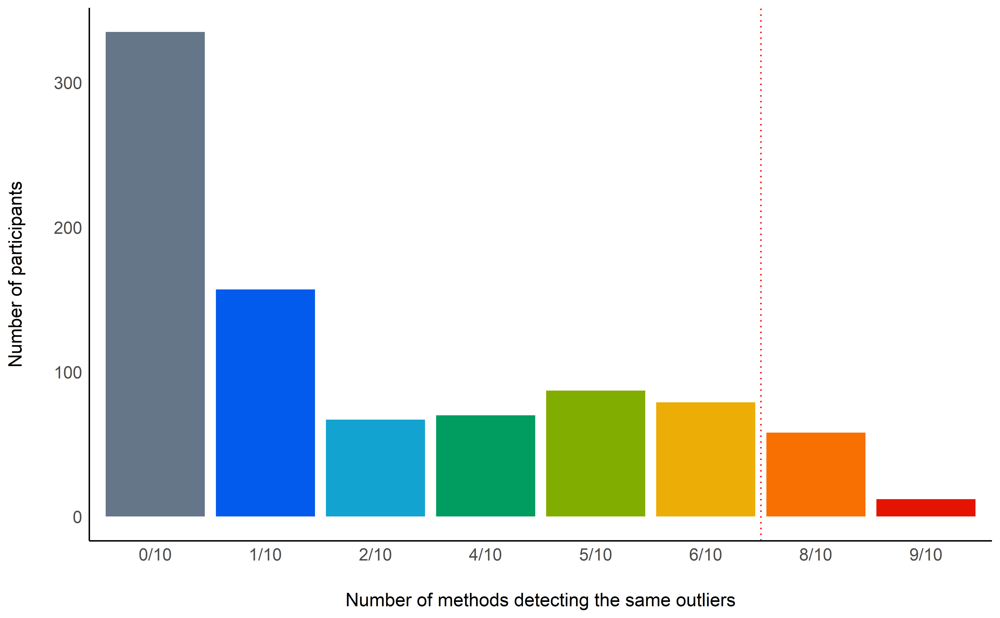

```r
df <- df_time[-which(as.numeric(outliers) >= 7/ n_methods), ]

paste("Based on a composite outlier score (see the 'check_outliers' function in the 'performance' R package; Lüdecke et al., 2019) obtained via the joint application of multiple outliers detection algorithms (Z-scores, Iglewicz, 1993; Interquartile range (IQR); Mahalanobis distance, Cabana, 2019; Robust Mahalanobis distance, Gnanadesikan & Kettenring, 1972; Minimum Covariance Determinant, Leys et al., 2018; Invariant Coordinate Selection, Archimbaud et al., 2018; Isolation Forest, Liu et al. 2008; and Local Outlier Factor, Breunig et al., 2000), we excluded", nrow(df_time) - nrow(df), "participants that were classified as outliers by at least 8/10 of the methods used.")
```

```
> [1] "Based on a composite outlier score (see the 'check_outliers' function in the 'performance' R package; Lüdecke et al., 2019) obtained via the joint application of multiple outliers detection algorithms (Z-scores, Iglewicz, 1993; Interquartile range (IQR); Mahalanobis distance, Cabana, 2019; Robust Mahalanobis distance, Gnanadesikan & Kettenring, 1972; Minimum Covariance Determinant, Leys et al., 2018; Invariant Coordinate Selection, Archimbaud et al., 2018; Isolation Forest, Liu et al. 2008; and Local Outlier Factor, Breunig et al., 2000), we excluded 70 participants that were classified as outliers by at least 8/10 of the methods used."
```


### Final Sample


```r
paste("The final sample included", report_participants(df))
```

```
> [1] "The final sample included 795 participants (Mean age = 25.40, SD = 7.66, range = [16.55, 73.51]; 56.35% females; Mean education = 3.50, SD = 1.99, range = [-7, 10])"
```

```r
df <- df %>% 
  mutate(System_Screen = sqrt(System_Screen),
         Education_Student = as.factor(ifelse(Education_Student == "", NA, Education_Student)),
         Religion_Type = ifelse(Religion_Type == "", NA, Religion_Type), 
         Singapore_Duration = ifelse(Singapore_Duration > Age, NA, Singapore_Duration),
         Singapore_Duration = Singapore_Duration / Age)

df %>% 
  select(System_Device, System_Screen, Duration, Education_Student, Education_Type, Ethnicity, starts_with("Religion"), Income, Singapore_Duration) %>% 
  report(levels_percentage = TRUE, missing_percentage = TRUE, n_entries = 10)
```

```
> The data contains 795 observations of the following variables:
>   - System_Device: 3 entries: Phone, 74.21%; Computer, 25.03%; Tablet, 0.75%(0.00% missing)
>   - System_Screen: Mean = 692.42, SD = 266.38, Median = 552.00, MAD = 76.91, range: [426.33, 2225.67], Skewness = 1.50, Kurtosis = 1.57, 0% missing
>   - Duration: Mean = 23.81, SD = 9.60, Median = 21.22, MAD = 7.09, range: [10.97, 61.70], Skewness = 1.43, Kurtosis = 2.11, 0% missing
>   - Education_Student: 2 levels: No (n = 243, 30.57%); Yes (n = 551, 69.31%) and missing (n = 1, 0.13%)
>   - Education_Type: 17 entries: Business and Accountancy, 22.26%; Engineering, 19.12%; Social Sciences (Psychology, Sociology, etc.), 15.47%; Sciences, 10.69%; Others, 7.42%; Computing, 5.91%; Humanities (Languages, History, etc.), 5.03%; Communication Studies, 4.03%; Medicine, 3.02%; Art and Design, 1.89% and 7 others(0.00% missing)
>   - Ethnicity: 22 entries: Chinese, 87.30%; Malay, 4.28%; Indian, 3.90%; , 1.76%; Vietnamese, 0.38%; Eurasian, 0.25%; Korean, 0.25%; African, 0.13%; Arabic, 0.13%; Boyanese , 0.13% and 12 others(0.00% missing)
>   - Religion_Type: 6 entries: Buddhism, 31.95%; No religion, 26.16%; Christianity, 25.03%; Taoism, 5.91%; Islam, 5.03%; Hinduism, 2.77%(3.14% missing)
>   - Religion_Religiosity: Mean = 4.16, SD = 3.02, Median = , MAD = 4.45, range: [0, 10], Skewness = 0.08, Kurtosis = -1.28, 2.77% missing
>   - Religion_Engagement: Mean = 3.74, SD = 3.11, Median = , MAD = 4.45, range: [0, 10], Skewness = 0.34, Kurtosis = -1.16, 3.40% missing
>   - Income: Mean = 2825.20, SD = 4302.03, Median = , MAD = 1482.60, range: [0, 60000], Skewness = 8.41, Kurtosis = 96.91, 13.33% missing
>   - Singapore_Duration: Mean = 0.88, SD = 0.25, Median = , MAD = 0.02, range: [0, 1.00], Skewness = -2.50, Kurtosis = 4.81, 23.77% missing
```


```r
df <- df %>% 
  mutate(Education_Type = ifelse(!Education_Type %in% c("Business and Accountancy",
                                                        "Engineering",
                                                        "Social Sciences (Psychology, Sociology...)",
                                                        "Sciences",
                                                        "Computing",
                                                        "Humanities (Languages, History...)"), "Other", Education_Type),
         Ethnicity = ifelse(!Ethnicity %in% c("Chinese", "Malay", "Indian"), "Other", Ethnicity))
```


#### Education and Income


```r
report_participants(df, group = c("Sex", "Education_Student"))
```

```
> [1] "For the 'Sex - Female and Education_Student - No' group: 145 participants (Mean age = 31.14, SD = 11.42, range = [21.73, 73.51]; 100.00% females; Mean education = 2.85, SD = 2.74, range = [-7, 6]), for the 'Sex - Male and Education_Student - No' group: 98 participants (Mean age = 30.80, SD = 11.55, range = [19.73, 66.19]; 0.00% females; Mean education = 2.18, SD = 2.76, range = [-6, 10]), for the 'Sex - Female and Education_Student - Yes' group: 303 participants (Mean age = 22.64, SD = 3.05, range = [16.55, 56.25]; 100.00% females; Mean education = 3.94, SD = 1.48, range = [-2, 10]) and for the 'Sex - Male and Education_Student - Yes' group: 248 participants (Mean age = 23.29, SD = 2.05, range = [19.02, 39.79]; 0.00% females; Mean education = 3.88, SD = 1.18, range = [-2, 10])"
```


```r
as.data.frame(table(df$Education_Type)) %>%
  ggplot(aes(x="", y =Freq, fill = reorder(Var1, -Freq))) +
  geom_bar(width = 1, stat = "identity") +
  labs(fill = "Course") +
  coord_polar("y", start = 0, direction = -1) +
  scale_fill_brewer(palette="Blues") +
  theme_void() +
  theme(legend.text = element_text(size = 20)) +
  theme(legend.title = element_text(face = "bold", size = 20))
```


```r
df %>% 
  filter(!is.na(Education_Student)) %>% 
  filter(Income < 18000) %>% 
  ggplot(aes(x = Income, colour = Education_Type)) +
  geom_density(size = 1) +
  facet_grid(~Education_Student, labeller = "label_both") +
  theme_modern()
```


```r
df %>% 
  filter(!is.na(Education_Student)) %>% 
  filter(Income < 18000) %>% 
  ggplot(aes(x = Age, y = Income, colour = Education_Type, fill = Education_Type)) +
  geom_point2() +
  geom_smooth(method = "lm", alpha = 0.1) + 
  theme_modern()
```


#### Culture


```r
as.data.frame(table(df$Ethnicity)) %>%
  ggplot(aes(x="", y = Freq, fill = reorder(Var1, -Freq))) +
  labs(fill = "Ethnicity") +
  geom_bar(width = 1, stat = "identity") +
  coord_polar("y", start = 0) +
  scale_fill_brewer(palette="Oranges") +
  theme_void() +
  theme(legend.text = element_text(size = 20)) +
  theme(legend.title = element_text(face = "bold", size = 20))
```


```r
df %>% 
  filter(!is.na(Singapore_Duration)) %>% 
  ggplot(aes(x = Singapore_Duration, colour = Ethnicity)) +
  geom_density(size = 1) +
  theme_modern() +
  scale_x_continuous(labels = scales::percent)
```


#### Religion


```r
as.data.frame(table(df$Religion_Type)) %>%
  ggplot(aes(x="", y = Freq, fill = reorder(Var1, -Freq))) +
  geom_bar(width = 1, stat = "identity") +
  labs(fill = "Religion") +
  coord_polar("y", start = 0) +
  scale_fill_brewer(palette="Purples") +
  theme_void() +
  theme(legend.text = element_text(size = 20)) +
  theme(legend.title = element_text(face = "bold", size = 20))
```


```r
df %>% 
  filter(!is.na(Religion_Engagement)) %>% 
  filter(!is.na(Religion_Type)) %>% 
  ggplot(aes(x = Religion_Engagement, colour = Religion_Type)) +
  geom_density(size = 1) +
  theme_modern()
```


```r
df %>% 
  filter(!is.na(Religion_Religiosity)) %>% 
  filter(!is.na(Religion_Type)) %>% 
  ggplot(aes(x = Religion_Religiosity, colour = Religion_Type)) +
  geom_density(size = 1) +
  theme_modern()
```


```r
df %>% 
  filter(!is.na(Religion_Engagement)) %>% 
  filter(!is.na(Religion_Religiosity)) %>% 
  filter(!is.na(Religion_Type)) %>% 
  ggplot(aes(x = Religion_Religiosity, y = Religion_Engagement, colour = Religion_Type, fill = Religion_Type)) +
  geom_jitter() +
  geom_smooth(method = "lm", alpha = 0.2) +
  ggtitle(paste("r =", insight::format_value(cor.test(df$Religion_Engagement, df$Religion_Religiosity)$estimate))) +
  theme_modern()
```


```r
df <- df %>% 
  mutate(Religion_Faith = (Religion_Engagement + Religion_Religiosity) / 2)
```

# Results

## Descriptive Statistics


### Deception and Lying Profile (LIE)

```r
descriptive_statistics(df, "LIE_")
```

```
> Variable |  Mean |   SD | Min | Max | Skewness | Kurtosis
> ---------------------------------------------------------
> LIE_1    | -1.70 | 2.52 |  -5 |   5 |     0.57 |    -0.48
> LIE_2    | -1.34 | 2.64 |  -5 |   5 |     0.41 |    -0.76
> LIE_3    | -2.47 | 2.67 |  -5 |   5 |     1.06 |     0.26
> LIE_4    | -1.54 | 2.52 |  -5 |   5 |     0.43 |    -0.67
> LIE_5    | -1.79 | 2.37 |  -5 |   5 |     0.57 |    -0.39
> LIE_6    | -0.95 | 2.65 |  -5 |   5 |     0.16 |    -1.01
> LIE_7    | -0.74 | 2.78 |  -5 |   5 |     0.19 |    -0.96
> LIE_8    | -1.31 | 2.39 |  -5 |   5 |     0.45 |    -0.42
> LIE_9    | -0.13 | 2.80 |  -5 |   5 |    -0.14 |    -1.00
> LIE_10   |  0.21 | 2.77 |  -5 |   5 |    -0.27 |    -0.88
> LIE_11   | -0.27 | 2.69 |  -5 |   5 |    -0.04 |    -0.92
> LIE_12   |  0.84 | 2.69 |  -5 |   5 |    -0.57 |    -0.52
> LIE_13   | -0.50 | 2.63 |  -5 |   5 |     0.27 |    -0.71
> LIE_14   |  0.41 | 2.52 |  -5 |   5 |    -0.39 |    -0.62
> LIE_15   |  0.17 | 2.65 |  -5 |   5 |    -0.16 |    -0.84
> LIE_16   | -0.98 | 2.45 |  -5 |   5 |     0.39 |    -0.43
> LIE_17   |  0.44 | 2.79 |  -5 |   5 |    -0.08 |    -0.96
> LIE_18   |  0.05 | 2.75 |  -5 |   5 |    -0.20 |    -0.95
> LIE_19   |  0.97 | 2.72 |  -5 |   5 |    -0.33 |    -0.87
> LIE_20   | -0.17 | 2.70 |  -5 |   5 |    -0.06 |    -0.92
> LIE_21   | -0.97 | 2.81 |  -5 |   5 |     0.36 |    -0.84
> LIE_22   | -2.27 | 2.41 |  -5 |   5 |     0.73 |    -0.31
> LIE_23   | -1.87 | 2.40 |  -5 |   5 |     0.60 |    -0.42
> LIE_24   |  1.29 | 2.38 |  -5 |   5 |    -0.37 |    -0.51
> LIE_25   |  1.71 | 2.46 |  -5 |   5 |    -0.63 |    -0.23
> LIE_26   | -2.62 | 2.24 |  -5 |   5 |     0.90 |     0.14
> LIE_27   |  1.10 | 2.66 |  -5 |   5 |    -0.40 |    -0.72
> LIE_28   | -0.24 | 2.64 |  -5 |   5 |    -0.07 |    -0.78
> LIE_29   | -0.86 | 2.81 |  -5 |   5 |     0.30 |    -0.91
> LIE_30   |  0.47 | 2.77 |  -5 |   5 |    -0.34 |    -0.84
> LIE_31   | -0.34 | 2.71 |  -5 |   5 |     0.01 |    -0.94
> LIE_32   |  0.61 | 2.72 |  -5 |   5 |    -0.37 |    -0.75
> LIE_33   |  1.90 | 2.23 |  -5 |   5 |    -1.05 |     1.29
> LIE_34   |  2.56 | 2.11 |  -5 |   5 |    -0.88 |     0.66
> LIE_35   |  1.71 | 2.38 |  -5 |   5 |    -0.61 |    -0.14
> LIE_36   |  0.93 | 2.51 |  -5 |   5 |    -0.26 |    -0.67
> LIE_37   |  0.55 | 2.80 |  -5 |   5 |    -0.01 |    -1.00
> LIE_38   |  1.79 | 2.58 |  -5 |   5 |    -0.55 |    -0.63
> LIE_39   |  1.80 | 2.47 |  -5 |   5 |    -0.88 |     0.33
> LIE_40   |  1.81 | 2.46 |  -5 |   5 |    -0.73 |     0.02
> LIE_41   |  0.89 | 2.72 |  -5 |   5 |    -0.22 |    -0.80
> LIE_42   |  1.91 | 2.25 |  -5 |   5 |    -0.77 |     0.57
> LIE_43   |  1.84 | 2.31 |  -5 |   5 |    -0.98 |     0.95
> LIE_44   |  2.03 | 2.49 |  -5 |   5 |    -0.72 |    -0.07
```


### Psychopathy (TRIMP)

```r
df %>% 
  select(TRIMP_General, starts_with("TRIMP_Boldness"), starts_with("TRIMP_Meanness"), starts_with("TRIMP_Disinhibition")) %>% 
  report() %>% 
  table_long() %>% 
  select(-one_of(c("n_Obs", "Median", "MAD", "n_Missing"))) %>% 
  print()
```

```
> Variable                                   | Mean |   SD |  Min |  Max | Skewness | Kurtosis
> --------------------------------------------------------------------------------------------
> TRIMP_General                              | 1.08 | 0.28 | 0.34 | 2.09 |     0.34 |    -0.14
> TRIMP_Boldness                             | 1.43 | 0.39 | 0.11 | 2.47 |    -0.18 |     0.18
> TRIMP_Boldness_Optimism                    | 1.72 | 0.58 | 0.00 | 3.00 |    -0.31 |     0.16
> TRIMP_Boldness_Resilience                  | 1.53 | 0.66 | 0.00 | 3.00 |    -0.13 |    -0.32
> TRIMP_Boldness_Courage                     | 1.36 | 0.68 | 0.00 | 3.00 |     0.11 |    -0.10
> TRIMP_Boldness_Dominance                   | 1.40 | 0.72 | 0.00 | 3.00 |    -0.03 |    -0.36
> TRIMP_Boldness_Persuasiveness              | 1.54 | 0.62 | 0.00 | 3.00 |    -0.17 |    -0.18
> TRIMP_Boldness_Intrepidness                | 1.06 | 0.75 | 0.00 | 3.00 |     0.36 |    -0.54
> TRIMP_Boldness_ToleranceForUncertainty     | 1.31 | 0.61 | 0.00 | 3.00 |     0.09 |     0.26
> TRIMP_Boldness_SelfConfidence              | 1.58 | 0.68 | 0.00 | 3.00 |     0.07 |    -0.39
> TRIMP_Boldness_SocialAssurance             | 1.31 | 0.67 | 0.00 | 3.00 |     0.09 |    -0.16
> TRIMP_Meanness                             | 0.88 | 0.42 | 0.00 | 2.63 |     0.39 |    -0.03
> TRIMP_Meanness_Empathy                     | 0.80 | 0.47 | 0.00 | 2.40 |     0.36 |    -0.36
> TRIMP_Meanness_ExcitementSeeking           | 1.31 | 0.81 | 0.00 | 3.00 |     0.04 |    -0.72
> TRIMP_Meanness_PhysicalAggression          | 0.88 | 0.94 | 0.00 | 3.00 |     0.64 |    -0.75
> TRIMP_Meanness_RelationalAggression        | 1.03 | 0.64 | 0.00 | 3.00 |     0.32 |    -0.43
> TRIMP_Meanness_Honesty                     | 0.81 | 0.72 | 0.00 | 3.00 |     0.69 |     0.42
> TRIMP_Meanness_DestructiveAggression       | 0.36 | 0.66 | 0.00 | 3.00 |     1.78 |     2.38
> TRIMP_Disinhibition                        | 0.94 | 0.41 | 0.05 | 2.55 |     0.51 |     0.07
> TRIMP_Disinhibition_ImpatienceUrgency      | 1.76 | 0.60 | 0.00 | 3.00 |    -0.22 |     0.03
> TRIMP_Disinhibition_Dependability          | 0.93 | 0.69 | 0.00 | 3.00 |     0.35 |    -0.36
> TRIMP_Disinhibition_ProblematicImpulsivity | 1.13 | 0.65 | 0.00 | 3.00 |     0.14 |    -0.50
> TRIMP_Disinhibition_Irresponsibility       | 0.65 | 0.61 | 0.00 | 2.75 |     0.83 |    -0.01
> TRIMP_Disinhibition_PlanfulControl         | 1.10 | 0.68 | 0.00 | 3.00 |     0.51 |     0.67
> TRIMP_Disinhibition_Theft                  | 0.39 | 0.53 | 0.00 | 2.50 |     1.47 |     1.63
> TRIMP_Disinhibition_Alienation             | 1.46 | 0.89 | 0.00 | 3.00 |     0.02 |    -0.74
> TRIMP_Disinhibition_BoredomProneness       | 1.71 | 0.82 | 0.00 | 3.00 |    -0.24 |    -0.43
> TRIMP_Disinhibition_Fraud                  | 0.42 | 0.72 | 0.00 | 3.00 |     1.69 |     2.10
```

```r
plots(
  df %>% 
    select(starts_with("TRIMP_Boldness")) %>% 
    bayestestR::estimate_density(method = "KernSmooth") %>% 
    plot() + 
    theme_modern(),
  df %>% 
    select(starts_with("TRIMP_Meanness")) %>% 
    bayestestR::estimate_density(method = "KernSmooth") %>% 
    plot() + 
    theme_modern(),
  df %>% 
    select(starts_with("TRIMP_Disinhibition")) %>% 
    bayestestR::estimate_density(method = "KernSmooth") %>% 
    plot() + 
    theme_modern()
    )
```


### Narcissism (FFNI)

```r
descriptive_statistics(df, "FFNI")
```

```
> Variable               |  Mean |   SD |  Min |   Max | Skewness | Kurtosis
> --------------------------------------------------------------------------
> FFNI_AcclaimSeeking    | 14.20 | 3.47 | 4.00 | 20.00 |    -0.66 |     0.35
> FFNI_Distrust          | 12.36 | 2.92 | 4.00 | 20.00 |     0.01 |    -0.02
> FFNI_Entitlement       |  9.96 | 3.74 | 4.00 | 20.00 |     0.20 |    -0.72
> FFNI_Exploitativeness  |  9.04 | 3.80 | 4.00 | 20.00 |     0.42 |    -0.65
> FFNI_Indifference      | 11.03 | 3.87 | 4.00 | 20.00 |     0.21 |    -0.67
> FFNI_LackOfEmpathy     |  9.18 | 3.26 | 4.00 | 20.00 |     0.54 |    -0.09
> FFNI_Manipulativeness  | 10.36 | 3.77 | 4.00 | 20.00 |     0.18 |    -0.74
> FFNI_NeedForAdmiration | 12.88 | 3.04 | 4.00 | 20.00 |    -0.42 |     0.15
> FFNI_ThrillSeeking     | 10.59 | 3.87 | 4.00 | 20.00 |     0.12 |    -0.79
> FFNI_General           | 11.07 | 2.00 | 5.67 | 19.44 |     0.26 |     0.46
```


### Normal Personality (IPIP6)

```r
descriptive_statistics(df, "IPIP6")
```

```
> Variable                | Mean |   SD |  Min | Max | Skewness | Kurtosis
> ------------------------------------------------------------------------
> IPIP6_Extraversion      | 3.60 | 1.23 | 1.00 |   7 |     0.17 |    -0.51
> IPIP6_Agreableness      | 4.99 | 0.94 | 1.00 |   7 |    -0.49 |     0.74
> IPIP6_Conscientiousness | 4.44 | 1.10 | 1.00 |   7 |    -0.29 |    -0.02
> IPIP6_Neuroticism       | 3.94 | 1.13 | 1.00 |   7 |     0.01 |    -0.24
> IPIP6_Openeness         | 4.58 | 1.09 | 1.25 |   7 |    -0.09 |    -0.36
> IPIP6_HonestyHumility   | 4.38 | 1.26 | 1.00 |   7 |    -0.08 |    -0.55
```


### Pathological Personality (PID-5)

```r
descriptive_statistics(df, "PID5")
```

```
> Variable            | Mean |   SD | Min | Max | Skewness | Kurtosis
> -------------------------------------------------------------------
> PID5_NegativeAffect | 1.42 | 0.64 |   0 |   3 |    -0.12 |    -0.31
> PID5_Detachment     | 1.08 | 0.57 |   0 |   3 |     0.20 |    -0.05
> PID5_Antagonism     | 0.90 | 0.56 |   0 |   3 |     0.46 |     0.11
> PID5_Disinhibition  | 0.98 | 0.65 |   0 |   3 |     0.19 |    -0.67
> PID5_Psychoticism   | 1.24 | 0.62 |   0 |   3 |    -0.06 |    -0.29
> PID5_Pathology      | 1.13 | 0.46 |   0 |   3 |     0.06 |     0.32
```


### Social Desirability (BIDR)

```r
descriptive_statistics(df, "BIDR")
```

```
> Variable                      | Mean |   SD |  Min |  Max | Skewness | Kurtosis
> -------------------------------------------------------------------------------
> BIDR_SelfDeceptiveEnhancement | 3.88 | 0.82 | 1.50 | 7.00 |     0.06 |     0.60
> BIDR_ImpressionManagement     | 3.78 | 0.84 | 1.00 | 6.62 |     0.06 |     0.68
> BIDR_General                  | 3.83 | 0.67 | 1.44 | 6.56 |     0.18 |     1.03
```


### Impulsivity (UPPS)

```r
descriptive_statistics(df, "UPPS")
```

```
> Variable                 | Mean |   SD |  Min |  Max | Skewness | Kurtosis
> --------------------------------------------------------------------------
> UPPS_NegativeUrgency     | 2.39 | 0.65 | 1.00 | 4.00 |    -0.14 |    -0.32
> UPPS_PositiveUrgency     | 2.14 | 0.63 | 1.00 | 4.00 |     0.03 |    -0.50
> UPPS_LackOfPerseverance  | 1.86 | 0.47 | 1.00 | 4.00 |     0.20 |     0.38
> UPPS_LackOfPremeditation | 1.87 | 0.47 | 1.00 | 4.00 |     0.18 |     0.89
> UPPS_SensationSeeking    | 2.68 | 0.67 | 1.00 | 4.00 |    -0.26 |    -0.32
> UPPS_General             | 2.19 | 0.35 | 1.10 | 3.55 |    -0.27 | 1.47e-04
```


### Emotion Regulation (DERS)

```r
descriptive_statistics(df, "DERS")
```

```
> Variable           | Mean |   SD | Min |   Max | Skewness | Kurtosis
> --------------------------------------------------------------------
> DERS_Awareness     | 7.00 | 2.13 |   3 | 14.00 |     0.34 |    -0.13
> DERS_Clarity       | 7.46 | 2.58 |   3 | 15.00 |     0.51 |    -0.06
> DERS_Goals         | 9.46 | 3.24 |   3 | 15.00 |    -0.01 |    -0.98
> DERS_Impulse       | 6.80 | 3.06 |   3 | 15.00 |     0.65 |    -0.35
> DERS_NonAcceptance | 7.38 | 3.16 |   3 | 15.00 |     0.52 |    -0.52
> DERS_Strategies    | 7.00 | 3.10 |   3 | 15.00 |     0.59 |    -0.51
> DERS_General       | 7.52 | 1.99 |   3 | 13.33 |     0.24 |    -0.53
```


### Light Triad (LTS)

```r
descriptive_statistics(df, "LTS")
```

```
> Variable            | Mean |   SD | Min |  Max | Skewness | Kurtosis
> --------------------------------------------------------------------
> LTS_FaithInHumanity | 2.40 | 0.68 |   1 | 4.75 |     0.63 |     0.66
> LTS_Humanism        | 2.04 | 0.51 |   1 | 4.00 |     0.29 |     0.45
> LTS_Kantianism      | 2.08 | 0.57 |   1 | 5.00 |     0.44 |     0.74
> LTS_General         | 2.17 | 0.47 |   1 | 4.58 |     0.31 |     0.96
```


### Interoception (MAIA2)

```r
descriptive_statistics(df, "MAIA2")
```

```
> Variable            | Mean |   SD | Min | Max | Skewness | Kurtosis
> -------------------------------------------------------------------
> MAIA2_Noticing      | 3.13 | 0.91 |   0 |   5 |    -0.45 |     0.33
> MAIA2_BodyListening | 2.78 | 0.94 |   0 |   5 |    -0.36 |     0.02
```


## Factor Structure

### Splitting the data 50-50 for EFA-CFA

```r
lie <- select(df, starts_with("LIE_"))
labels_lie <- labels[labels$Questionnaire == "LIE", ]

# Two sets of data 50-50
partitions <- parameters::data_partition(lie, training_proportion = 0.6)
lie_EFA <- partitions$training
lie_CFA <- partitions$test


# Compare stats across groups
group_indices = c(rep(2, round(nrow(lie)/2)), rep(1, nrow(lie) - round(nrow(lie)/2)))
lie_grouped <- cbind(lie, group_indices) 

psych::statsBy(lie_grouped, group = "group_indices")
```

```
> Statistics within and between groups  
> Call: psych::statsBy(data = lie_grouped, group = "group_indices")
> Intraclass Correlation 1 (Percentage of variance due to groups) 
>         LIE_1         LIE_2         LIE_3         LIE_4         LIE_5 
>          0.00          0.00          0.00          0.00          0.02 
>         LIE_6         LIE_7         LIE_8         LIE_9        LIE_10 
>          0.01          0.00          0.00          0.00          0.00 
>        LIE_11        LIE_12        LIE_13        LIE_14        LIE_15 
>          0.00          0.00          0.00          0.00          0.00 
>        LIE_16        LIE_17        LIE_18        LIE_19        LIE_20 
>          0.00          0.00          0.00          0.00          0.00 
>        LIE_21        LIE_22        LIE_23        LIE_24        LIE_25 
>          0.00          0.00          0.01          0.00          0.00 
>        LIE_26        LIE_27        LIE_28        LIE_29        LIE_30 
>          0.01          0.00          0.00          0.01          0.00 
>        LIE_31        LIE_32        LIE_33        LIE_34        LIE_35 
>          0.00          0.00          0.00          0.01          0.00 
>        LIE_36        LIE_37        LIE_38        LIE_39        LIE_40 
>          0.02          0.01          0.00          0.00          0.00 
>        LIE_41        LIE_42        LIE_43        LIE_44 group_indices 
>          0.01          0.00          0.00          0.01          1.00 
> Intraclass Correlation 2 (Reliability of group differences) 
>         LIE_1         LIE_2         LIE_3         LIE_4         LIE_5 
>          0.56         -1.03         -2.92          0.16          0.90 
>         LIE_6         LIE_7         LIE_8         LIE_9        LIE_10 
>          0.83          0.51          0.09        -21.27        -63.24 
>        LIE_11        LIE_12        LIE_13        LIE_14        LIE_15 
>         -4.61        -16.05      -3519.96         -5.28          0.31 
>        LIE_16        LIE_17        LIE_18        LIE_19        LIE_20 
>          0.45         -1.00         -0.24         -0.01          0.40 
>        LIE_21        LIE_22        LIE_23        LIE_24        LIE_25 
>        -34.67         -9.83          0.75        -73.30          0.54 
>        LIE_26        LIE_27        LIE_28        LIE_29        LIE_30 
>          0.83         -8.15         -1.24          0.75         -0.58 
>        LIE_31        LIE_32        LIE_33        LIE_34        LIE_35 
>        -59.97        -17.76         -0.67          0.77          0.51 
>        LIE_36        LIE_37        LIE_38        LIE_39        LIE_40 
>          0.89          0.79          0.64          0.24         -1.21 
>        LIE_41        LIE_42        LIE_43        LIE_44 group_indices 
>          0.80         -1.45         -1.88          0.77          1.00 
> eta^2 between groups  
>  LIE_1.bg  LIE_2.bg  LIE_3.bg  LIE_4.bg  LIE_5.bg  LIE_6.bg  LIE_7.bg  LIE_8.bg 
>      0.00      0.00      0.00      0.00      0.01      0.01      0.00      0.00 
>  LIE_9.bg LIE_10.bg LIE_11.bg LIE_12.bg LIE_13.bg LIE_14.bg LIE_15.bg LIE_16.bg 
>      0.00      0.00      0.00      0.00      0.00      0.00      0.00      0.00 
> LIE_17.bg LIE_18.bg LIE_19.bg LIE_20.bg LIE_21.bg LIE_22.bg LIE_23.bg LIE_24.bg 
>      0.00      0.00      0.00      0.00      0.00      0.00      0.00      0.00 
> LIE_25.bg LIE_26.bg LIE_27.bg LIE_28.bg LIE_29.bg LIE_30.bg LIE_31.bg LIE_32.bg 
>      0.00      0.01      0.00      0.00      0.01      0.00      0.00      0.00 
> LIE_33.bg LIE_34.bg LIE_35.bg LIE_36.bg LIE_37.bg LIE_38.bg LIE_39.bg LIE_40.bg 
>      0.00      0.01      0.00      0.01      0.01      0.00      0.00      0.00 
> LIE_41.bg LIE_42.bg LIE_43.bg LIE_44.bg 
>      0.01      0.00      0.00      0.01 
> 
> To see the correlations between and within groups, use the short=FALSE option in your print statement.
> Many results are not shown directly. To see specific objects select from the following list:
>  mean sd n F ICC1 ICC2 ci1 ci2 raw rbg pbg rwg nw ci.wg pwg etabg etawg nwg nG Call
```


### Factor structure quality


```r
parameters::check_factorstructure(lie_EFA)
```

```
> # Is the data suitable for Factor Analysis?
> 
>   - KMO: The Kaiser, Meyer, Olkin (KMO) measure of sampling adequacy suggests that data seems appropriate for factor analysis (KMO = 0.94).
>   - Sphericity: Bartlett's test of sphericity suggests that there is sufficient significant correlation in the data for factor analaysis (Chisq(946) = 10779.91, p < .001).
```

### Correlation matrix


```r
cor <- as.matrix(correlation::correlation(lie_EFA))
```

### How many factors


```r
parameters::n_factors(lie_EFA, cor = cor, rotation = "varimax", package = "all", safe = FALSE) %T>% 
  print() %>%
  plot() +
  ggtitle("How many factors to retain (Pearson's correlations)") +
  theme_modern()
```

```
> # Method Agreement Procedure:
> 
> The choice of 4 dimensions is supported by 8 (32.00%) methods out of 25 (beta, Optimal coordinates, R2, EGA (glasso), EGA (TMFG), Velicer's MAP, BIC, BIC).
```


### Exploratory Factor Analysis (EFA)

#### Four latent factors model


```r
efa_4 <- psych::fa(cor, n.obs = nrow(lie_EFA), nfactors = 4, rotate = "varimax", fm = "ml") 

parameters::model_parameters(efa_4, labels = labels_lie$Description) %>% 
  print(sort = TRUE, threshold = "max") 
```

```
> # Rotated loadings from Factor Analysis (varimax-rotation)
> 
> Variable |                                                      Label |   ML1 |   ML2 |  ML4 |   ML3 | Complexity | Uniqueness
> ------------------------------------------------------------------------------------------------------------------------------
> LIE_10   |                                             I can lie well |  0.87 |       |      |       |       1.27 |       0.15
> LIE_9    |                                           I am a good liar |  0.80 |       |      |       |       1.37 |       0.25
> LIE_12   |                         I can lie effectively if I want to |  0.77 |       |      |       |       1.21 |       0.34
> LIE_18   |                   It is easy for me to make up clever lies |  0.76 |       |      |       |       1.38 |       0.31
> LIE_14   |                    It is hard for others to detect my lies |  0.76 |       |      |       |       1.23 |       0.37
> LIE_11   |                              I am good at deceiving others |  0.73 |       |      |       |       1.38 |       0.37
> LIE_15   |                            I almost never get caught lying |  0.66 |       |      |       |       1.26 |       0.51
> LIE_17   |                                     I find lying difficult | -0.65 |       |      |       |       1.72 |       0.42
> LIE_13   |                      Others can easily tell when I’m lying | -0.65 |       |      |       |       1.24 |       0.53
> LIE_20   |                    I do not have to prepare much for a lie |  0.56 |       |      |       |       1.74 |       0.58
> LIE_19   |                I find it taxing to come up with a good lie | -0.52 |       |      |       |       2.01 |       0.54
> LIE_16   |                 My lies often arouse suspicion from others | -0.48 |       |      |       |       1.60 |       0.70
> LIE_4    |                                   I have a tendency to lie |       |  0.75 |      |       |       1.27 |       0.37
> LIE_1    |                                           I lie frequently |       |  0.71 |      |       |       1.69 |       0.32
> LIE_5    |                      I lie more often than most people do  |       |  0.70 |      |       |       1.42 |       0.40
> LIE_7    |                           I lie more than I think I should |       |  0.70 |      |       |       1.13 |       0.48
> LIE_6    |         I lie more frequently than what I expect myself to |       |  0.70 |      |       |       1.15 |       0.48
> LIE_22   |                     I find myself lying without any reason |       |  0.67 |      |       |       1.20 |       0.51
> LIE_23   |           I find it difficult to refrain myself from lying |       |  0.66 |      |       |       1.03 |       0.56
> LIE_2    |                                   I lie in many situations |       |  0.66 |      |       |       1.70 |       0.42
> LIE_26   |                                              I enjoy lying |       |  0.51 |      |       |       2.15 |       0.58
> LIE_31   |       I lie if it’s the most direct way to get what I want |       |  0.50 |      |       |       2.13 |       0.61
> LIE_29   |                             I lie whenever it’s convenient |       |  0.49 |      |       |       2.05 |       0.64
> LIE_8    |                            Others lie less often than I do |       |  0.46 |      |       |       1.30 |       0.76
> LIE_21   |                          I have to try hard to avoid lying |       |  0.43 |      |       |       1.42 |       0.78
> LIE_24   |                  It is easy to hold back from telling lies |       | -0.37 |      |       |       1.35 |       0.84
> LIE_41   |                             Lying is against my principles |       |       | 0.67 |       |       1.59 |       0.43
> LIE_25   |                                  I feel guilty after lying |       |       | 0.65 |       |       1.36 |       0.51
> LIE_34   |                              I always avoid lying if I can |       |       | 0.59 |       |       1.54 |       0.56
> LIE_27   |                        I feel tense whenever I have to lie |       |       | 0.56 |       |       1.92 |       0.48
> LIE_44   |                                          It is bad to lie  |       |       | 0.56 |       |       1.27 |       0.65
> LIE_36   | I prefer to tell the truth even if it gets me into trouble |       |       | 0.45 |       |       2.31 |       0.67
> LIE_35   |                 I would only lie if I have no other choice |       |       | 0.37 |       |       2.42 |       0.72
> LIE_37   |                      I would never lie for trivial matters |       |       | 0.35 |       |       1.40 |       0.85
> LIE_38   |                      I would never lie in serious contexts |       |       | 0.27 |       |       2.01 |       0.88
> LIE_33   |                                       I lie when necessary |       |       |      |  0.71 |       1.21 |       0.44
> LIE_43   |                               It is okay to lie sometimes  |       |       |      |  0.70 |       1.40 |       0.41
> LIE_42   |           It is acceptable to lie depending on the context |       |       |      |  0.60 |       1.49 |       0.54
> LIE_39   |            I would lie if something important was at stake |       |       |      |  0.55 |       1.14 |       0.68
> LIE_32   |            I lie when telling the truth is too troublesome |       |       |      |  0.47 |       2.26 |       0.63
> LIE_30   |              I lie when it’s easier than telling the truth |       |       |      |  0.46 |       2.17 |       0.64
> LIE_40   |                         I would only lie if it is harmless |       |       |      |  0.40 |       1.44 |       0.80
> LIE_3    |                                          I never tell lies |       |       |      | -0.40 |       2.24 |       0.73
> LIE_28   |                I feel satisfied when others believe my lie |       |       |      |  0.34 |       2.80 |       0.73
> 
> The 4 latent factors (varimax rotation) accounted for 45.11% of the total variance of the original data (ML1 = 15.24%, ML2 = 14.15%, ML4 = 8.35%, ML3 = 7.37%).
```


#### One latent factors model


```r
efa_1 <- psych::fa(cor, n.obs = nrow(lie_EFA), nfactors = 1, rotate = "varimax", fm = "ml") 

parameters::model_parameters(efa_1, labels = labels_lie$Description) %>% 
  print(sort = TRUE, threshold = "max") 
```

```
> # Rotated loadings from Factor Analysis (varimax-rotation)
> 
> Variable |                                                      Label |   ML1 | Complexity | Uniqueness
> -------------------------------------------------------------------------------------------------------
> LIE_10   |                                             I can lie well |  0.85 |       1.00 |       0.28
> LIE_9    |                                           I am a good liar |  0.81 |       1.00 |       0.34
> LIE_18   |                   It is easy for me to make up clever lies |  0.79 |       1.00 |       0.38
> LIE_11   |                              I am good at deceiving others |  0.75 |       1.00 |       0.43
> LIE_12   |                         I can lie effectively if I want to |  0.72 |       1.00 |       0.48
> LIE_14   |                    It is hard for others to detect my lies |  0.72 |       1.00 |       0.49
> LIE_17   |                                     I find lying difficult | -0.69 |       1.00 |       0.53
> LIE_20   |                    I do not have to prepare much for a lie |  0.64 |       1.00 |       0.59
> LIE_15   |                            I almost never get caught lying |  0.63 |       1.00 |       0.60
> LIE_1    |                                           I lie frequently |  0.62 |       1.00 |       0.61
> LIE_2    |                                   I lie in many situations |  0.61 |       1.00 |       0.63
> LIE_5    |                      I lie more often than most people do  |  0.59 |       1.00 |       0.66
> LIE_19   |                I find it taxing to come up with a good lie | -0.58 |       1.00 |       0.66
> LIE_13   |                      Others can easily tell when I’m lying | -0.57 |       1.00 |       0.67
> LIE_4    |                                   I have a tendency to lie |  0.56 |       1.00 |       0.68
> LIE_27   |                        I feel tense whenever I have to lie | -0.56 |       1.00 |       0.69
> LIE_41   |                             Lying is against my principles | -0.54 |       1.00 |       0.71
> LIE_26   |                                              I enjoy lying |  0.53 |       1.00 |       0.72
> LIE_29   |                             I lie whenever it’s convenient |  0.48 |       1.00 |       0.77
> LIE_7    |                           I lie more than I think I should |  0.48 |       1.00 |       0.77
> LIE_22   |                     I find myself lying without any reason |  0.48 |       1.00 |       0.77
> LIE_6    |         I lie more frequently than what I expect myself to |  0.48 |       1.00 |       0.77
> LIE_31   |       I lie if it’s the most direct way to get what I want |  0.47 |       1.00 |       0.77
> LIE_36   | I prefer to tell the truth even if it gets me into trouble | -0.46 |       1.00 |       0.78
> LIE_25   |                                  I feel guilty after lying | -0.46 |       1.00 |       0.79
> LIE_43   |                               It is okay to lie sometimes  |  0.46 |       1.00 |       0.79
> LIE_28   |                I feel satisfied when others believe my lie |  0.43 |       1.00 |       0.81
> LIE_42   |           It is acceptable to lie depending on the context |  0.43 |       1.00 |       0.82
> LIE_32   |            I lie when telling the truth is too troublesome |  0.42 |       1.00 |       0.83
> LIE_30   |              I lie when it’s easier than telling the truth |  0.41 |       1.00 |       0.83
> LIE_33   |                                       I lie when necessary |  0.40 |       1.00 |       0.84
> LIE_34   |                              I always avoid lying if I can | -0.39 |       1.00 |       0.85
> LIE_44   |                                          It is bad to lie  | -0.37 |       1.00 |       0.86
> LIE_8    |                            Others lie less often than I do |  0.36 |       1.00 |       0.87
> LIE_3    |                                          I never tell lies | -0.36 |       1.00 |       0.87
> LIE_23   |           I find it difficult to refrain myself from lying |  0.35 |       1.00 |       0.88
> LIE_16   |                 My lies often arouse suspicion from others | -0.33 |       1.00 |       0.89
> LIE_39   |            I would lie if something important was at stake |  0.28 |       1.00 |       0.92
> LIE_38   |                      I would never lie in serious contexts | -0.25 |       1.00 |       0.94
> LIE_37   |                      I would never lie for trivial matters | -0.23 |       1.00 |       0.95
> LIE_35   |                 I would only lie if I have no other choice | -0.15 |       1.00 |       0.98
> LIE_40   |                         I would only lie if it is harmless |  0.13 |       1.00 |       0.98
> LIE_21   |                          I have to try hard to avoid lying |  0.12 |       1.00 |       0.99
> LIE_24   |                  It is easy to hold back from telling lies | -0.11 |       1.00 |       0.99
> 
> The unique latent factor (varimax rotation) accounted for 26.22% of the total variance of the original data.
```


```r
paste0("The model with one, and four factors accounted for ",
       report::format_text(c(insight::format_value(efa_1$Vaccounted[2,]*100),
                             insight::format_value(efa_4$Vaccounted[3, 4]*100))),
       "% of variance of the dataset.")
```

```
> [1] "The model with one, and four factors accounted for 26.22 and 45.11% of variance of the dataset."
```


The factor number exploration suggested the presence of four and one latent factor(s). We therefore decided to keep the unique and four-factors models and submitted their simple structure to Confirmatory Factor Analysis (CFA)


<!-- #### General factor model -->

<!-- ```{r warning=FALSE, message=FALSE} -->
<!-- efa_g <- psych::omega(cor, nfactors = 4, fm="ml", flip = FALSE) -->

<!-- parameters::model_parameters(efa_g, labels = labels_lie$Description) %>% -->
<!--   print(sort = TRUE, threshold = "max") -->
<!-- ``` -->


### Confirmatory Factor Analysis (CFA)

#### Model Selection


```r
report_cfa_indices <- function(comparison, row=1, name="<model>"){
  paste0("(X2", name, " = ", insight::format_value(comparison[row, "Chisq"]),
        ", AIC", name, " = ", insight::format_value(comparison[row, "AIC"]),
        ", BIC", name, " = ", insight::format_value(comparison[row, "BIC_adjusted"]),
        ", RMSEA", name, " = ", insight::format_value(comparison[row, "RMSEA"]),
        ", CFI", name, " = ", insight::format_value(comparison[row, "CFI"]),
        ", SRMR", name, " = ", insight::format_value(comparison[row, "SRMR"]),
        ")")
}
```

##### One *vs.* Four Factors


```r
cfa_4 <- parameters::efa_to_cfa(efa_4, threshold = "max") %>% 
  lavaan::cfa(data = lie_CFA)
cfa_1 <- parameters::efa_to_cfa(efa_1, threshold = "max") %>% 
  lavaan::cfa(data = lie_CFA)
```


```r
comparison <- performance::compare_performance(cfa_4, cfa_1) %>% 
  select(Model, AIC, BIC, BIC_adjusted, Chisq, RMSEA, CFI, SRMR)
comparison
```

<div class="kable-table">

Model      AIC     BIC   BIC_adjusted   Chisq   RMSEA    CFI   SRMR
------  ------  ------  -------------  ------  ------  -----  -----
cfa_4    60834   61187          60889    2460    0.07   0.79   0.10
cfa_1    62623   62954          62675    4261    0.11   0.55   0.12

</div>

```r
paste0("The confirmatory factor analysis favoured the four-factors solution ", 
       report_cfa_indices(comparison, 1, name="<4-factors>"),
       " over the one-factor ",
       report_cfa_indices(comparison, 2, name="<1-factor>"))
```

```
> [1] "The confirmatory factor analysis favoured the four-factors solution (X2<4-factors> = 2459.84, AIC<4-factors> = 60833.67, BIC<4-factors> = 60889.15, RMSEA<4-factors> = 0.07, CFI<4-factors> = 0.79, SRMR<4-factors> = 0.10) over the one-factor (X2<1-factor> = 4261.22, AIC<1-factor> = 62623.05, BIC<1-factor> = 62675.00, RMSEA<1-factor> = 0.11, CFI<1-factor> = 0.55, SRMR<1-factor> = 0.12)"
```

##### Four-factors *vs.* Initial Model


```r
# Initial Model
model_initial <- c()
for (dimension in unique(labels_lie$Dimension)) {
  model_initial <- c(
    model_initial,
    paste0(tools::toTitleCase(dimension), " =~ ", paste(as.character(labels_lie[labels_lie$Dimension == dimension, "Item"]), collapse = " + "))
  )
}
cfa_initial <- paste0(model_initial, collapse = "\n") %>% 
  lavaan::cfa(data = lie_CFA)
```


```r
comparison <- performance::compare_performance(cfa_4, cfa_initial) %>% 
  select(Model, AIC, BIC, BIC_adjusted, Chisq, RMSEA, CFI, SRMR)
comparison
```

<div class="kable-table">

Model            AIC     BIC   BIC_adjusted   Chisq   RMSEA    CFI   SRMR
------------  ------  ------  -------------  ------  ------  -----  -----
cfa_4          60834   61187          60889    2460    0.07   0.79    0.1
cfa_initial    61348   61691          61402    2980    0.09   0.72    0.1

</div>

```r
paste0("We then compared the four-factors solution with the initial hypothetic model with which we built the scale, which favoured the four-factors model ", report_cfa_indices(comparison, 2, name="<hypothetic>"))
```

```
> [1] "We then compared the four-factors solution with the initial hypothetic model with which we built the scale, which favoured the four-factors model (X2<hypothetic> = 2980.37, AIC<hypothetic> = 61348.20, BIC<hypothetic> = 61401.92, RMSEA<hypothetic> = 0.09, CFI<hypothetic> = 0.72, SRMR<hypothetic> = 0.10)"
```

##### Short *vs.* Long Form


```r
cfa_4_short3 <- parameters::efa_to_cfa(efa_4, threshold = 3, names = c( "Frequency", "Ability", "Negativity", "Contextuality")) %>% 
  lavaan::cfa(data = lie_CFA)
cfa_4_short4 <- parameters::efa_to_cfa(efa_4, threshold = 4, names = c( "Frequency", "Ability", "Negativity", "Contextuality")) %>% 
  lavaan::cfa(data = lie_CFA)
cfa_4_short5 <- parameters::efa_to_cfa(efa_4, threshold = 5, names = c( "Frequency", "Ability", "Negativity", "Contextuality")) %>% 
  lavaan::cfa(data = lie_CFA)
```


```r
comparison <- performance::compare_performance(cfa_4, cfa_4_short3, cfa_4_short4, cfa_4_short5) %>% 
  select(Model, AIC, BIC, BIC_adjusted, Chisq, RMSEA, CFI, SRMR)
comparison
```

<div class="kable-table">

Model             AIC     BIC   BIC_adjusted   Chisq   RMSEA    CFI   SRMR
-------------  ------  ------  -------------  ------  ------  -----  -----
cfa_4           60834   61187          60889    2460    0.07   0.79   0.10
cfa_4_short3    16094   16206          16111     139    0.08   0.95   0.06
cfa_4_short4    21707   21850          21729     268    0.07   0.93   0.06
cfa_4_short5    27206   27379          27234     471    0.08   0.91   0.08

</div>

```r
paste0("Finally, we compared the full four-factors model (including all items) with short form retaining only the 3, 4 or 5 most loading items for each of the 4 dimensions. The 3-items version ",
       report_cfa_indices(comparison, 2, name="<3-items>"),
       " outperformed all versions, including 5-items ",
       report_cfa_indices(comparison, 4, name="<5-items>"),
       " and 4-items ",
       report_cfa_indices(comparison, 3, name="<4-items>"), 
       ". Nonetheless, as 3-items per construct is the bare minimum for adequate reliability, we decided to keep the second best performing version with 4-items per factor, which also displayed excellent indices of fit."
      )
```

```
> [1] "Finally, we compared the full four-factors model (including all items) with short form retaining only the 3, 4 or 5 most loading items for each of the 4 dimensions. The 3-items version (X2<3-items> = 138.59, AIC<3-items> = 16093.60, BIC<3-items> = 16111.31, RMSEA<3-items> = 0.08, CFI<3-items> = 0.95, SRMR<3-items> = 0.06) outperformed all versions, including 5-items (X2<5-items> = 471.34, AIC<5-items> = 27206.35, BIC<5-items> = 27233.50, RMSEA<5-items> = 0.08, CFI<5-items> = 0.91, SRMR<5-items> = 0.08) and 4-items (X2<4-items> = 268.44, AIC<4-items> = 21706.84, BIC<4-items> = 21729.27, RMSEA<4-items> = 0.07, CFI<4-items> = 0.93, SRMR<4-items> = 0.06). Nonetheless, as 3-items per construct is the bare minimum for adequate reliability, we decided to keep the second best performing version with 4-items per factor, which also displayed excellent indices of fit."
```

#### Model Description


```r
# Refit the cfa model with the full sample
cfa_4_short4_full <- parameters::efa_to_cfa(efa_4, threshold = 4, names = c( "Frequency", "Ability", "Negativity", "Contextuality")) %>% 
  lavaan::cfa(data = lie)

cfa_parameters <- model_parameters(cfa_4_short4_full, standardize = FALSE)
cfa_parameters
```

<div class="kable-table">

     To              Operator   From             Coefficient     SE   CI_low   CI_high    p  Type        
---  --------------  ---------  --------------  ------------  -----  -------  --------  ---  ------------
1    Frequency       =~         LIE_9                   1.00   0.00     1.00      1.00    0  Loading     
2    Frequency       =~         LIE_10                  1.05   0.03     0.99      1.11    0  Loading     
3    Frequency       =~         LIE_12                  0.87   0.03     0.81      0.93    0  Loading     
4    Frequency       =~         LIE_18                  0.92   0.03     0.85      0.98    0  Loading     
5    Ability         =~         LIE_1                   1.00   0.00     1.00      1.00    0  Loading     
6    Ability         =~         LIE_4                   1.02   0.04     0.94      1.10    0  Loading     
7    Ability         =~         LIE_5                   0.93   0.04     0.86      1.01    0  Loading     
8    Ability         =~         LIE_7                   0.88   0.05     0.79      0.97    0  Loading     
9    Negativity      =~         LIE_25                  1.00   0.00     1.00      1.00    0  Loading     
10   Negativity      =~         LIE_27                  0.99   0.07     0.86      1.12    0  Loading     
11   Negativity      =~         LIE_34                  0.76   0.05     0.66      0.86    0  Loading     
12   Negativity      =~         LIE_41                  1.13   0.07     0.99      1.26    0  Loading     
13   Contextuality   =~         LIE_33                  1.00   0.00     1.00      1.00    0  Loading     
14   Contextuality   =~         LIE_39                  0.77   0.06     0.65      0.90    0  Loading     
15   Contextuality   =~         LIE_42                  1.03   0.06     0.92      1.15    0  Loading     
16   Contextuality   =~         LIE_43                  1.17   0.06     1.04      1.29    0  Loading     
37   Frequency       ~~         Ability                 2.48   0.23     2.03      2.93    0  Correlation 
38   Frequency       ~~         Negativity             -2.40   0.22    -2.83     -1.97    0  Correlation 
39   Frequency       ~~         Contextuality           1.84   0.19     1.48      2.21    0  Correlation 
40   Ability         ~~         Negativity             -2.10   0.19    -2.48     -1.72    0  Correlation 
41   Ability         ~~         Contextuality           1.04   0.15     0.75      1.34    0  Correlation 
42   Negativity      ~~         Contextuality          -1.12   0.14    -1.40     -0.85    0  Correlation 

</div>


```r
data <- see::data_plot(cfa_parameters, ci=FALSE)

data$nodes <- mutate(data$nodes, Name = stringr::str_replace(Name, "LIE_", "Q")) 
data$edges <- mutate(data$edges, from = stringr::str_replace(from, "LIE_", "Q"))

tidygraph::tbl_graph(data$nodes, data$edges) %>%
  ggraph::ggraph(layout = 'fr') +
  ggraph::geom_edge_arc(aes(alpha = as.numeric(Type == "Correlation"),
                    label = Label_Correlation,
                    color = Coefficient),
                    strength = 0.1,
                    edge_width = 1.5,
                    label_dodge = unit(2, "mm"),
                    linetype = 1, angle_calc = "along",
                    label_size = 3,
                    start_cap = ggraph::circle(0, 'mm'), end_cap = ggraph::circle(0, 'mm')) +
  ggraph::geom_edge_link(aes(alpha = as.numeric(Type == "Loading"),
                     label = Label_Loading,
                     color = Coefficient),
                     label_dodge = unit(2, "mm"),
                     angle_calc = "along", 
                     edge_width = 0.9,
                     label_size = 3,
                     check_overlap = TRUE,
                     arrow = arrow(type = "closed", length = unit(3, "mm")),
                     start_cap = ggraph::circle(0, 'mm'), end_cap = ggraph::circle(-12, 'mm')) +
  ggraph::geom_node_point(aes(colour = Name, size = Latent)) +
  ggraph::geom_node_text(aes(label = Name))  +
  ggraph::scale_edge_colour_gradient2(
    guide = FALSE,
    high = "#4CAF50",
    mid = "#FFF9C4",
    low = "#E91E63"
  ) +
  scale_alpha(guide = FALSE, range = c(0, 1)) +
  scale_size_manual(values=c("TRUE"=33, "FALSE"=22)) +
  scale_color_manual(values=c("Negativity"="#E91E63", "Q41"="#EC407A", "Q44"="#F06292", "Q34"="#F48FB1", "Q25"="#F8BBD0",
                              "Contextuality"="#FF9800", "Q43"="#FFA726", "Q42"="#FFB74D", "Q33"="#FFCC80", "Q39"="#FFE0B2",
                              "Frequency"="#4CAF50", "Q1"="#66BB6A", "Q4"="#81C784", "Q5"="#A5D6A7", "Q23"="#C8E6C9",
                              "Ability"="#2196F3", "Q10"="#42A5F5", "Q9"="#64B5F6", "Q18"="#90CAF9", "Q14"="#BBDEFB")) +
  ggraph::scale_edge_alpha(guide = FALSE, range = c(0, 1)) +
  scale_x_continuous(expand = expansion(c(0.07, 0.07))) +
  scale_y_continuous(expand = expansion(c(0.07, 0.07))) +
  ggraph::theme_graph() +
  theme(legend.position = "none")
```


#### Loadings Table


```r
table_efa <- as.data.frame(sort(parameters::model_parameters(efa_4, labels = labels_lie$Description)))[,1:6] %>% 
  mutate(Variable = as.character(Variable)) %>% 
  mutate_if(is.numeric, insight::format_value)
names(table_efa) <- c("Item", "Label", "Frequency", "Ability", "Negativity", "Contextuality")

table_cfa <- as.data.frame(parameters::model_parameters(cfa_4_short4_full)) %>% 
  filter(Type == "Loading") %>% 
  select(To, Item=From, Coefficient) %>% 
  pivot_wider(names_from=To, values_from=Coefficient, names_prefix="CFA_") %>% 
  mutate(Item = as.character(Item)) 

table <- full_join(table_efa, table_cfa, by="Item") %>% 
  mutate_if(is.numeric, insight::format_value) %>% 
  mutate(Frequency = paste0(Frequency, " [", CFA_Frequency, "]"),
         Ability = paste0(Ability, " [", CFA_Ability, "]"),
         Negativity = paste0(Negativity, " [", CFA_Negativity, "]"),
         Contextuality = paste0(Contextuality, " [", CFA_Contextuality, "]"),
         Item = stringr::str_replace(Item, "LIE_", "Q")) %>% 
  mutate_all(function(x) stringr::str_remove_all(x, " \\[]")) %>% 
  select(Item, Label, Frequency, Ability, Negativity, Contextuality)
write.csv(table, "figures/table_loadings.csv", row.names = FALSE)
```


#### Compute Scores


```r
lie <- predict(cfa_parameters)
names(lie) <- paste0("LIE_", names(lie))
```


```r
lie %>% 
  select(starts_with("LIE_")) %>% 
  report() %>% 
  table_long() %>% 
  select(-one_of(c("n_Obs", "Median", "MAD", "n_Missing"))) %>% 
  print()
```

```
> Variable          |      Mean |   SD |   Min |  Max | Skewness | Kurtosis
> -------------------------------------------------------------------------
> LIE_Frequency     | -1.49e-17 | 2.35 | -5.19 | 4.86 |    -0.30 |    -0.70
> LIE_Ability       | -4.32e-17 | 1.93 | -3.43 | 6.23 |     0.35 |    -0.40
> LIE_Negativity    | -5.03e-17 | 1.53 | -5.56 | 3.36 |    -0.23 |     0.11
> LIE_Contextuality |  6.03e-18 | 1.43 | -5.41 | 2.81 |    -0.87 |     1.34
```

```r
p_distrib <- lie %>% 
  select(starts_with("LIE_")) %>% 
  dplyr::rename_all(.funs = list(~ sub("LIE_*", "", .))) %>%
  bayestestR::estimate_density(method = "KernSmooth") %>% 
  see::data_plot() %>% 
  mutate(Parameter = fct_relevel(Parameter, "Frequency", "Ability", "Negativity", "Contextuality")) %>% 
  ggplot(aes(x=x, y=y, color=Parameter)) +
  geom_line(size=2) +
  # ggtitle("Distribution of the LIE dimensions") +
  xlab("Score\n") +
  ylab("Distribution") +
  theme_modern() +
  scale_color_manual(values=c("Frequency"= "#2196F3", "Ability"="#4CAF50", "Negativity"="#E91E63", "Contextuality"="#FF9800"), name = "Dimensions")
```


### Reliability

#### Cronbach's alpha


```r
paste0("All subscales of the LIE scale, namely, Frequency (alpha = ",
       insight::format_value(performance::cronbachs_alpha(select(df, LIE_1, LIE_4, LIE_5, LIE_23))),
       "), Ability (alpha = ",
        insight::format_value(performance::cronbachs_alpha(select(df, LIE_9, LIE_10, LIE_14, LIE_18))),
       "), Contextuality (alpha = ",
        insight::format_value(performance::cronbachs_alpha(select(df, LIE_33, LIE_39, LIE_42, LIE_43))),
       ") and Negativity (alpha = ", 
        insight::format_value(performance::cronbachs_alpha(select(df, LIE_25, LIE_34, LIE_41, LIE_44))),
       ") have a high reliability.")
```

```
> [1] "All subscales of the LIE scale, namely, Frequency (alpha = 0.86), Ability (alpha = 0.90), Contextuality (alpha = 0.77) and Negativity (alpha = 0.77) have a high reliability."
```


```r
# library(formattable)

questions <- dplyr::select(df, dplyr::one_of(row.names(lavaan::lavInspect(cfa_4_short4_full)$lambda)))


om <- psych::omega(m = questions, nfactors = 4, fm = "ml", title = "Omega of LIE Scale", plot = "FALSE", n.obs = nrow(questions), flip=FALSE) # ωh = 0.36, ωt = 0.83 

# Table of omega coefficients
table_om <- om$omega.group
rownames(table_om) <- c("All items","Frequency", "Ability", "Negativity", "Contextuality")
colnames(table_om) <- c("Omega (total)", "Omega (hierarchical)", "Omega (group)")
table_om
```

<div class="kable-table">

                 Omega (total)   Omega (hierarchical)   Omega (group)
--------------  --------------  ---------------------  --------------
All items                 0.84                   0.43            0.46
Frequency                 0.91                   0.56            0.35
Ability                   0.87                   0.31            0.56
Negativity                0.78                   0.24            0.53
Contextuality             0.75                   0.34            0.40

</div>

```r
# Table of variance accounted for
table_variance <- om$omega.group %>%
  mutate(Composite = c("All items", "Frequency", "Ability", "Negativity", "Contextuality")) %>%
  mutate(Total = total*100,
         General = general*100,
         Group = group*100) %>%
  select(Composite, Total, General, Group)
colnames(table_variance) <- c("Composite", "Total Variance (%)", "Variance due to General Factor (%)", "Variance due to Group Factor (%)")
table_variance 
```

<div class="kable-table">

Composite        Total Variance (%)   Variance due to General Factor (%)   Variance due to Group Factor (%)
--------------  -------------------  -----------------------------------  ---------------------------------
All items                        84                                   43                                 46
Frequency                        91                                   56                                 35
Ability                          87                                   31                                 56
Negativity                       78                                   24                                 53
Contextuality                    75                                   34                                 40

</div>

```r
psych::cor.plot(om)
```


## Cluster Structure

### Cluster Tendency


```r
parameters::check_clusterstructure(lie, standardize = FALSE) %T>%
  print() %>%
  plot()
```

```
> # Clustering tendency
> 
> The dataset is suitable for clustering (Hopkins' H = 0.22).
```

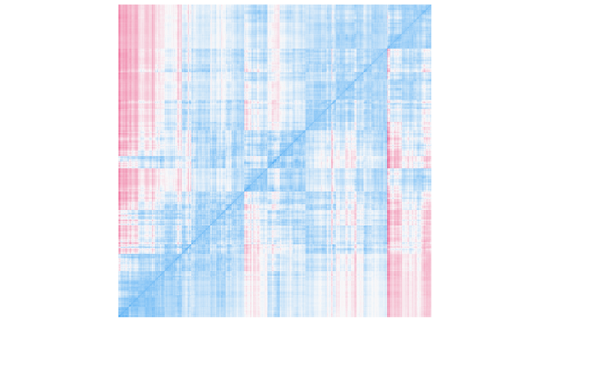

### How many clusters


```r
parameters::n_clusters(lie, standardize = FALSE) %T>%
  print() %>% 
  plot() +
  theme_modern()
```

```
> # Method Agreement Procedure:
> 
> The choice of 2 clusters is supported by 8 (28.57%) methods out of 28 (CH, DB, Silhouette, Beale, Ratkowsky, PtBiserial, McClain, SDindex).
```


The agreement procedure, combining 28 different methods for determining the optimal number of clusters, supported the existence of 2 (8/28) or 3 (11/28)
clusters. 

### Clustering

#### K-means

```r
set.seed(333)

k2 <- kmeans(lie, centers=2, iter.max = 10000, nstart = 1000)
k3 <- kmeans(lie, centers=3, iter.max = 10000, nstart = 1000)

model_parameters(k2) 
```

<div class="kable-table">

Cluster    n_Obs   Sum_Squares   LIE_Frequency   LIE_Ability   LIE_Negativity   LIE_Contextuality
--------  ------  ------------  --------------  ------------  ---------------  ------------------
1            445          3125             1.6           1.1             -0.9                0.61
2            350          2802            -2.0          -1.4              1.1               -0.78

</div>

```r
model_parameters(k3) 
```

<div class="kable-table">

Cluster    n_Obs   Sum_Squares   LIE_Frequency   LIE_Ability   LIE_Negativity   LIE_Contextuality
--------  ------  ------------  --------------  ------------  ---------------  ------------------
1            243          1423            2.14          1.99            -1.42                0.89
2            354          1913            0.28         -0.37             0.07                0.08
3            198          1264           -3.12         -1.78             1.62               -1.23

</div>

```r
paste0("We applied k-means clustering, which revealed that grouping the participants in 2 and 3 clusters would account for ",
       insight::format_value(attributes(model_parameters(k2))$variance*100),
       "% and ",
       insight::format_value(attributes(model_parameters(k3))$variance*100),
       "% of the total variance of the four dimensions of the questionnaire, respectively.",
       " Thus, we decided to go ahead with the latter solution.")
```

```
> [1] "We applied k-means clustering, which revealed that grouping the participants in 2 and 3 clusters would account for 45.24% and 57.51% of the total variance of the four dimensions of the questionnaire, respectively. Thus, we decided to go ahead with the latter solution."
```


<!-- #### H-clust -->
<!-- ```{r warning=FALSE, message=FALSE} -->
<!-- hc <- hclust(dist(lie, method = 'euclidean'), method = 'ward.D2') -->

<!-- ggdendro::ggdendrogram(hc, labels=FALSE, leaf_labels=FALSE) + -->
<!--   theme_void() -->

<!-- lie %>%  -->
<!--   mutate(cluster = cutree(hc, k = 3)) %>% -->
<!--   group_by(cluster) %>%  -->
<!--   summarise_all(mean) -->
<!-- ``` -->

<!-- #### Mixture -->
<!-- ```{r warning=FALSE, message=FALSE} -->
<!-- library(mclust) -->

<!-- model <- mclust::Mclust(lie, verbose = FALSE) -->
<!-- model_parameters(model) -->
<!-- ``` -->

<!-- #### Spectral -->
<!-- ```{r warning=FALSE, message=FALSE} -->
<!-- spectral <- kernlab::specc(as.data.frame(t(lie)), centers=3) -->

<!-- lie %>%  -->
<!--   mutate(cluster = as.numeric(spectral)) %>% -->
<!--   group_by(cluster) %>%  -->
<!--   summarise_all(mean) -->
<!-- ``` -->


### Compute Profiles

```r
lie$LIE_Profile <- model_parameters(k3) %>% 
  predict(names = c("Average", "Trickster", "Virtuous")) 

paste0('We then assigned each participant to its nearest cluster, labelling them as Average (',
       insight::format_value(sum(lie$LIE_Profile=="Average")/nrow(lie)*100),
       "% of the sample; people that report an average lying ability, slightly lower than average frequency, average negativity and contextuality), Trickster (",
       insight::format_value(sum(lie$LIE_Profile=="Trickster")/nrow(lie)*100),
       "%; people with high reported lying ability, frequency, low negative experience associated with deception and above-average flexibility in its implementation), and Virtuous (",
       insight::format_value(sum(lie$LIE_Profile=="Virtuous")/nrow(lie)*100),
       "%; people with very low reported lying ability and frequency, strong negative emotions and moral attitude associated with lying and high rigidity in their (non-)usage of deception).")
```

```
> [1] "We then assigned each participant to its nearest cluster, labelling them as Average (30.57% of the sample; people that report an average lying ability, slightly lower than average frequency, average negativity and contextuality), Trickster (44.53%; people with high reported lying ability, frequency, low negative experience associated with deception and above-average flexibility in its implementation), and Virtuous (24.91%; people with very low reported lying ability and frequency, strong negative emotions and moral attitude associated with lying and high rigidity in their (non-)usage of deception)."
```


### Visualisation

<!-- #### Parallel Coordinate Plot -->

<!-- ```{r warning=FALSE, message=FALSE} -->
<!-- colors_cluster <- c("Normal" = "#4CAF50", "Deceiver" = "#f44336", "Truthful" = "#2196F3") -->

<!-- df %>%  -->
<!--   select(Participant, starts_with("LIE_")) %>%  -->
<!--   pivot_longer(-c(LIE_Profile, Participant), names_to = "Dimension", values_to = "Score") %>% -->
<!--   mutate(LIE_Profile = fct_relevel(LIE_Profile, "Deceiver", "Normal", "Truthful"), -->
<!--          Dimension = str_remove(Dimension, "LIE_"), -->
<!--          Dimension = fct_relevel(Dimension, "Ability", "Frequency", "Willingness", "Morality")) %>% -->
<!--   rename(Profile = LIE_Profile) %>%  -->
<!--   ggplot(aes(x = Dimension, y = Score)) + -->
<!--   # geom_line(aes(color = LIE_Profile, group = Participant), alpha = 0.1, position = ggplot2::position_dodge(0.7)) + -->
<!--   geom_violinhalf(aes(fill = Profile, color = Profile), position = ggplot2::position_dodge(0.7)) + -->
<!--   geom_dotplot(aes(group = interaction(Dimension, Profile)), binaxis = "y", stackdir = "down", position = ggplot2::position_dodge(0.7), binwidth = 0.2, dotsize = 0.8, fill = "black") + -->
<!--   scale_fill_manual(values = colors_cluster) + -->
<!--   scale_color_manual(values = colors_cluster) + -->
<!--   theme_modern() -->
<!-- ``` -->

<!-- #### Radar Plot -->


```r
colors_cluster <- c("Average" = "#D500F9", "Trickster" = "#F50057", "Virtuous" = "#3D5AFE")

p_profiles <- lie %>% 
  select(starts_with("LIE_")) %>% 
  pivot_longer(-LIE_Profile, names_to = "Dimension", values_to = "Score") %>%
  mutate(LIE_Profile = fct_relevel(LIE_Profile, "Trickster", "Average", "Virtuous"),
         Dimension = str_remove(Dimension, "LIE_"),
         Dimension = fct_relevel(Dimension, "Frequency", "Ability", "Negativity", "Contextuality")) %>% 
  group_by(LIE_Profile, Dimension) %>% 
  summarise_all(mean) %>%
  rename(Profile = LIE_Profile) %>% 
  ggplot(aes(x = Dimension, y = Score, color = Profile, group = Profile)) +
  geom_line(key_glyph = "label") +
  geom_polygon(fill = NA, size = 2.5, show.legend = FALSE) +
  scale_color_manual(values = colors_cluster) +
  theme_minimal() +
  xlab("") + ylab("") +
  scale_y_continuous(breaks = c(-2, 0, 2), expand = expansion(c(.10, 0))) +
  # scale_y_continuous(limits = c(-5, 5)) +
  theme(axis.ticks.y = element_blank(),
        axis.text.y = element_blank(),
        legend.title = element_text(face="bold", size=15),
        panel.grid.major.y = element_line(color="#E0E0E0", linetype="longdash"),
        panel.grid.major.x = element_blank(),
        legend.text = element_text(size=13),
        axis.text.x = element_text(
          vjust = -0.5,
          size = 13,
          # face="bold",
          color="black")) +
  coord_radar(start = -pi/4, clip="off")
```


```r
# Combine plots
cowplot::plot_grid(p_distrib, p_profiles, nrow=2, labels = c('A', 'B'), label_size = 14)
```


## Convergent Validity


```r
df <- cbind(df, lie) %>%
  select(-matches("LIE_\\d"))
```


### Demographics

#### Sex


```r
library(rstanarm)

model_dimensional <- stan_glm(Sex ~ LIE_Ability + LIE_Frequency + LIE_Contextuality + LIE_Negativity, data=df, family = "binomial", refresh = 0, seed=333)
model_profile <- stan_glm(Sex ~ LIE_Profile, data = df, family = "binomial", refresh = 0, seed=333)

performance::compare_performance(model_dimensional, model_profile, metrics = c("LOOIC", "R2"))
```

<div class="kable-table">

Model               Type       ELPD   ELPD_SE   LOOIC   LOOIC_SE     R2
------------------  --------  -----  --------  ------  ---------  -----
model_dimensional   stanreg    -536       6.3    1072         13   0.04
model_profile       stanreg    -539       5.5    1077         11   0.02

</div>

```r
parameters::parameters_table(model_parameters(model_profile))
```

<div class="kable-table">

Parameter                 Median   89% CI           pd       % in ROPE   Rhat    ESS    Prior               
------------------------  -------  ---------------  -------  ----------  ------  -----  --------------------
(Intercept)               0.09     [-0.11,  0.28]   76.98%   75.70%      1.000   2775   Normal (0 +- 10.00) 
LIE_Profile [Trickster]   -0.33    [-0.59, -0.07]   97.72%   17.72%      1.000   2701   Normal (0 +- 2.50)  
LIE_Profile [Virtuous]    -0.83    [-1.12, -0.50]   100%     0.05%       1.001   2736   Normal (0 +- 2.50)  

</div>

```r
parameters::parameters_table(model_parameters(model_dimensional))
```

<div class="kable-table">

     Parameter           Median   89% CI           pd       % in ROPE   Rhat    ESS    Prior               
---  ------------------  -------  ---------------  -------  ----------  ------  -----  --------------------
1    (Intercept)         -0.27    [-0.39, -0.15]   100%     13.03%      1.001   3293   Normal (0 +- 10.00) 
2    LIE_Ability         0.03     [-0.05,  0.11]   73.35%   99.75%      1.000   3293   Normal (0 +- 1.30)  
4    LIE_Frequency       0.06     [-0.01,  0.14]   91.27%   99.65%      1.002   3073   Normal (0 +- 1.07)  
3    LIE_Contextuality   -0.03    [-0.13,  0.07]   68.83%   98.72%      1.000   3135   Normal (0 +- 1.75)  
5    LIE_Negativity      -0.17    [-0.29, -0.05]   98.52%   58.33%      1.000   3152   Normal (0 +- 1.63)  

</div>


```r
model_profile %>%
  estimate_means() %>%
  mutate(LIE_Profile = fct_relevel(LIE_Profile, "Trickster", "Average", "Virtuous")) %>%
  ggplot(aes(x = LIE_Profile, y = Probability, color = LIE_Profile)) +
  geom_line(aes(group = 1), size = 1) +
  geom_pointrange(aes(ymin = CI_low, ymax = CI_high), size = 1) +
  theme_modern() +
  scale_color_manual(values = colors_cluster, guide = FALSE) +
  ylab("Probability of being a Male") +
  xlab("Deception Profile")
```


```r
df %>%
  select(Participant, Sex, starts_with("LIE_"), -LIE_Profile) %>%
  pivot_longer(-c(Sex, Participant), names_to = "Dimension", values_to = "Score") %>%
  mutate(Dimension = str_remove(Dimension, "LIE_"),
         Dimension = fct_relevel(Dimension, "Frequency", "Ability", "Negativity", "Contextuality")) %>%
  ggplot(aes(x = Dimension, y = Score)) +
  geom_boxplot(aes(fill = Sex, color = Sex)) +
  scale_fill_manual(values = c("Male" = "#2196F3", "Female" = "#F06292")) +
  scale_color_manual(values = c("Male" = "#2196F3", "Female" = "#F06292")) +
  theme_modern() +
  coord_flip()
```

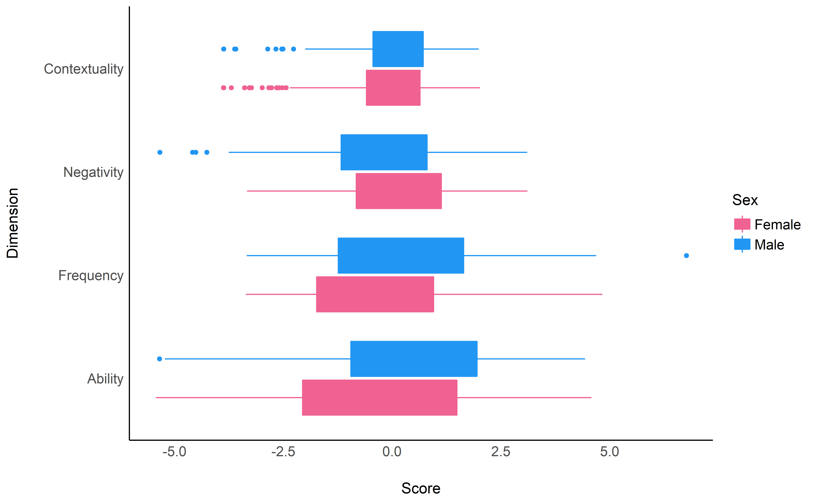


```r
sig <- model_parameters(model_dimensional)[-1,] %>%
  select(Parameter, pd) %>%
  mutate(Dimension = stringr::str_remove(Parameter, "LIE_"),
         Text = insight::format_pd(pd, stars_only=TRUE),
         Predicted = 0.6,
         Score = df %>%
           select(one_of(Parameter)) %>%
           summarise_all(function(x) {mean(range(x))}) %>%
           t()) %>%
  mutate(Dimension = fct_relevel(Dimension, "Frequency", "Ability", "Negativity", "Contextuality"))

p_sex <- rbind(estimate_link(model_dimensional, target="LIE_Ability") %>%
        mutate(LIE_Frequency = NA, LIE_Contextuality=NA, LIE_Negativity=NA),
      estimate_link(model_dimensional, target="LIE_Frequency") %>%
        mutate(LIE_Ability = NA, LIE_Contextuality=NA, LIE_Negativity=NA),
      estimate_link(model_dimensional, target="LIE_Contextuality") %>%
        mutate(LIE_Frequency = NA, LIE_Ability=NA, LIE_Negativity=NA),
      estimate_link(model_dimensional, target="LIE_Negativity") %>%
        mutate(LIE_Frequency = NA, LIE_Contextuality=NA, LIE_Ability=NA)) %>%
  pivot_longer(cols=starts_with("LIE_"), names_to="Dimension", values_to = "Score") %>%
  mutate(Dimension = str_remove(Dimension, "LIE_"),
         Dimension = fct_relevel(Dimension, "Frequency", "Ability", "Negativity", "Contextuality")) %>%
  ggplot(aes(x = Score, y = Predicted)) +
  geom_ribbon(aes(ymin=CI_low, ymax=CI_high, fill=Dimension), alpha=0.1) +
  geom_line(aes(color=Dimension), size = 1) +
  geom_text(data = sig, aes(label = Text)) +
  theme_modern() +
  theme(strip.placement = "outside",
        strip.text = element_text(size=13, face="plain"),
        axis.title = element_text(size=13),
        axis.text = element_text(size=9),
        plot.title = element_text(face="bold", hjust = 0.5)) +
  ggtitle("Sex") +
  ylab("Probability of being a Male") +
  xlab("") +
  scale_color_manual(values=c("Ability"= "#2196F3", "Frequency"="#4CAF50", "Negativity"="#E91E63", "Contextuality"="#FF9800"), name = "Dimensions", guide=FALSE) +
   scale_fill_manual(values=c("Ability"= "#2196F3", "Frequency"="#4CAF50", "Negativity"="#E91E63", "Contextuality"="#FF9800"), name = "Dimensions", guide=FALSE) +
  facet_wrap(~Dimension, scales="free_x", strip.position = "bottom")
```

#### Age


```r
model_dimensional <- stan_lmer(Age ~ LIE_Ability + LIE_Frequency + LIE_Contextuality + LIE_Negativity + Income + Education + (1|Sex), data = df, refresh = 0, seed=333)
model_profile <- stan_lmer(Age ~ LIE_Profile + Income + Education + (1|Sex), data = df, refresh = 0, seed=333)

performance::compare_performance(model_dimensional, model_profile)
```

<div class="kable-table">

Model               Type        ELPD   ELPD_SE   LOOIC   LOOIC_SE   WAIC     R2   R2_marginal   R2_adjusted   RMSE
------------------  --------  ------  --------  ------  ---------  -----  -----  ------------  ------------  -----
model_dimensional   stanreg    -2282        38    4564         76   4564   0.26          0.26          0.23    6.6
model_profile       stanreg    -2279        38    4558         75   4558   0.26          0.26          0.23    6.6

</div>

```r
parameters::parameters_table(model_parameters(model_profile))
```

<div class="kable-table">

     Parameter                 Median     89% CI           pd       % in ROPE   Rhat    ESS    Prior               
---  ------------------------  ---------  ---------------  -------  ----------  ------  -----  --------------------
1    (Intercept)               30.78      [28.40, 32.75]   100%     0%          1.003   880    Normal (0 +- 76.59) 
4    LIE_Profile [Trickster]   0.31       [-0.65,  1.22]   69.92%   75.15%      1.001   2842   Normal (0 +- 19.15) 
5    LIE_Profile [Virtuous]    3.10       [ 2.05,  4.18]   100%     0.02%       1.000   2643   Normal (0 +- 19.15) 
3    Income                    1.76e-04   [ 0.00,  0.00]   99.92%   100%        1.000   3327   Normal (0 +- 0.00)  
2    Education                 -1.90      [-2.11, -1.68]   100%     0%          1.000   3051   Normal (0 +- 9.61)  

</div>

```r
parameters::parameters_table(model_parameters(model_dimensional))
```

<div class="kable-table">

     Parameter           Median     89% CI           pd       % in ROPE   Rhat    ESS    Prior               
---  ------------------  ---------  ---------------  -------  ----------  ------  -----  --------------------
1    (Intercept)         31.60      [29.62, 33.21]   100%     0%          1.008   678    Normal (0 +- 76.59) 
4    LIE_Ability         -0.12      [-0.41,  0.19]   72.55%   100%        1.000   3271   Normal (0 +- 9.83)  
6    LIE_Frequency       -0.37      [-0.61, -0.12]   98.83%   99.52%      1.000   3209   Normal (0 +- 8.25)  
5    LIE_Contextuality   -0.17      [-0.51,  0.17]   78.38%   99.60%      1.000   3042   Normal (0 +- 13.41) 
7    LIE_Negativity      0.07       [-0.35,  0.52]   59.35%   99.10%      1.000   2508   Normal (0 +- 12.30) 
3    Income              1.76e-04   [ 0.00,  0.00]   99.70%   100%        1.000   4242   Normal (0 +- 0.00)  
2    Education           -1.87      [-2.07, -1.66]   100%     0%          1.000   3851   Normal (0 +- 9.61)  

</div>


```r
model_profile %>%
  estimate_means() %>%
  mutate(LIE_Profile = fct_relevel(LIE_Profile, "Trickster", "Average", "Virtuous")) %>%
  ggplot(aes(x = LIE_Profile, y = Mean, color = LIE_Profile)) +
  geom_line(aes(group = 1), size = 1) +
  geom_pointrange(aes(ymin = CI_low, ymax = CI_high), size = 1) +
  theme_modern() +
  scale_color_manual(values = colors_cluster, guide = FALSE) +
  ylab("Age") +
  xlab("Deception Profile")
```

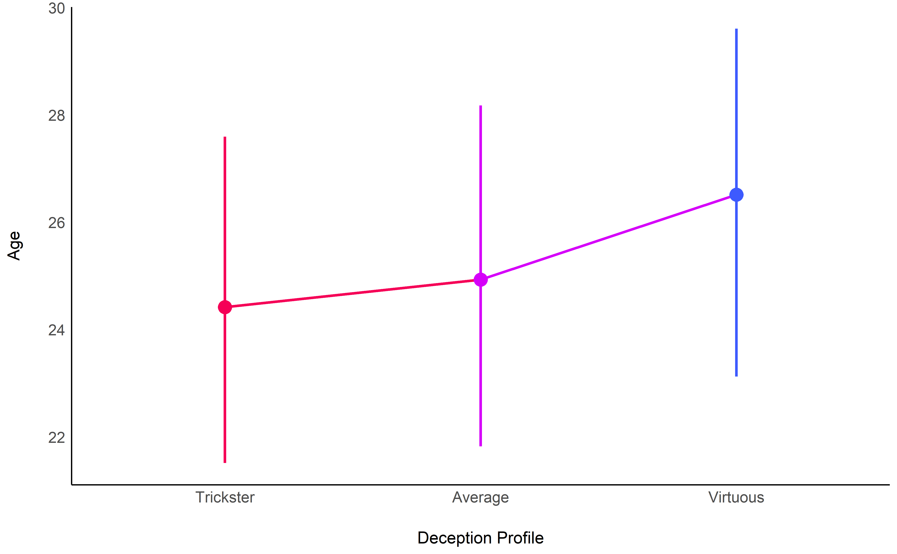


```r
sig <- model_parameters(model_dimensional)[2:5,] %>%
  select(Parameter, pd) %>%
  mutate(Dimension = stringr::str_remove(Parameter, "LIE_"),
         Text = format_pd(pd, stars_only=TRUE),
         Predicted = 29,
         Score = df %>%
           select(one_of(Parameter)) %>%
           summarise_all(function(x) {mean(range(x))}) %>%
           t()) %>%
  mutate(Dimension = fct_relevel(Dimension, "Frequency", "Ability", "Negativity", "Contextuality"))

p_age <- rbind(estimate_link(model_dimensional, target="LIE_Frequency") %>%
        mutate(LIE_Ability = NA, LIE_Contextuality=NA, LIE_Negativity=NA),
      estimate_link(model_dimensional, target="LIE_Ability") %>%
        mutate(LIE_Frequency = NA, LIE_Contextuality=NA, LIE_Negativity=NA),
      estimate_link(model_dimensional, target="LIE_Contextuality") %>%
        mutate(LIE_Frequency = NA, LIE_Ability=NA, LIE_Negativity=NA),
      estimate_link(model_dimensional, target="LIE_Negativity") %>%
        mutate(LIE_Frequency = NA, LIE_Contextuality=NA, LIE_Ability=NA)) %>%
  pivot_longer(cols=starts_with("LIE_"), names_to="Dimension", values_to = "Score") %>%
  mutate(Dimension = str_remove(Dimension, "LIE_"),
         Dimension = fct_relevel(Dimension, "Frequency", "Ability", "Negativity", "Contextuality")) %>%
  ggplot(aes(x = Score, y = Predicted)) +
  geom_ribbon(aes(ymin=CI_low, ymax=CI_high, fill=Dimension), alpha=0.1) +
  geom_line(aes(color=Dimension), size = 1) +
  geom_text(data = sig, aes(label = Text)) +
  theme_modern() +
  theme(strip.placement = "outside",
        strip.text = element_text(size=13, face="plain"),
        axis.title = element_text(size=13),
        axis.text = element_text(size=9),
        plot.title = element_text(face="bold", hjust = 0.5)) +
  ggtitle("Age") +
  ylab("\nAge") +
  xlab("") +
  scale_color_manual(values=c("Frequency"="#4CAF50", "Ability"= "#2196F3", "Negativity"="#E91E63", "Contextuality"="#FF9800"), name = "Dimensions", guide=FALSE) +
   scale_fill_manual(values=c("Frequency"="#4CAF50", "Ability"= "#2196F3", "Negativity"="#E91E63", "Contextuality"="#FF9800"), name = "Dimensions", guide=FALSE) +
  facet_wrap(~Dimension, scales="free_x", strip.position = "bottom")
```


#### Education


```r
model_profile <- stan_lmer(Education ~ LIE_Profile + Age + (1|Sex), data = df, refresh = 0, seed=333)
model_dimensional <- stan_lmer(Education ~ LIE_Ability + LIE_Frequency + LIE_Contextuality + LIE_Negativity + Age + (1|Sex), data = df, refresh = 0, seed=333)

performance::compare_performance(model_dimensional, model_profile)
```

<div class="kable-table">

Model               Type        ELPD   ELPD_SE   LOOIC   LOOIC_SE   WAIC     R2   R2_marginal   R2_adjusted   RMSE
------------------  --------  ------  --------  ------  ---------  -----  -----  ------------  ------------  -----
model_dimensional   stanreg    -1564        33    3128         66   3128   0.24          0.24          0.22    1.7
model_profile       stanreg    -1562        33    3124         65   3124   0.22          0.22          0.23    1.8

</div>

```r
parameters::parameters_table(model_parameters(model_profile))
```

<div class="kable-table">

     Parameter                 Median   89% CI           pd       % in ROPE   Rhat    ESS   Prior               
---  ------------------------  -------  ---------------  -------  ----------  ------  ----  --------------------
1    (Intercept)               7.00     [ 6.14, 10.68]   100%     0%          4.344   2     Normal (0 +- 19.95) 
3    LIE_Profile [Trickster]   0.27     [ 0.06,  0.44]   97.12%   30.35%      1.079   21    Normal (0 +- 4.99)  
4    LIE_Profile [Virtuous]    0.63     [ 0.44,  0.89]   100%     0.27%       1.023   297   Normal (0 +- 4.99)  
2    Age                       -0.12    [-0.14, -0.11]   100%     100%        1.096   15    Normal (0 +- 0.65)  

</div>

```r
parameters::parameters_table(model_parameters(model_dimensional))
```

<div class="kable-table">

     Parameter           Median   89% CI           pd       % in ROPE   Rhat    ESS    Prior               
---  ------------------  -------  ---------------  -------  ----------  ------  -----  --------------------
1    (Intercept)         6.66     [ 5.99,  7.30]   100%     0%          1.003   1034   Normal (0 +- 19.95) 
3    LIE_Ability         -0.10    [-0.17, -0.03]   98.62%   98.42%      1.000   2808   Normal (0 +- 2.58)  
5    LIE_Frequency       -0.08    [-0.14, -0.02]   98.02%   99.75%      1.000   3050   Normal (0 +- 2.13)  
4    LIE_Contextuality   0.09     [ 0.00,  0.17]   96.67%   97.50%      1.002   2998   Normal (0 +- 3.49)  
6    LIE_Negativity      -0.02    [-0.12,  0.08]   59.40%   99.70%      1.000   2729   Normal (0 +- 3.26)  
2    Age                 -0.12    [-0.14, -0.11]   100%     100%        1.000   3825   Normal (0 +- 0.65)  

</div>

```r
model_profile %>%
  estimate_means() %>%
  mutate(LIE_Profile = fct_relevel(LIE_Profile, "Trickster", "Average", "Virtuous")) %>%
  ggplot(aes(x = LIE_Profile, y = Mean, color = LIE_Profile)) +
  geom_line(aes(group = 1), size = 1) +
  geom_pointrange(aes(ymin = CI_low, ymax = CI_high), size = 1) +
  theme_modern() +
  scale_color_manual(values = colors_cluster, guide = FALSE) +
  ylab("Education (in years)") +
  xlab("Deception Profile")
```


#### Income


```r
model_dimensional <- stan_lmer(Income ~ LIE_Ability + LIE_Frequency + LIE_Contextuality + LIE_Negativity + Age + Education + (1|Sex), data = df, refresh = 0, seed=333)
model_profile <- stan_lmer(Income ~ LIE_Profile + Age + Education + (1|Sex), data = df, refresh = 0, seed=333)

performance::compare_performance(model_dimensional, model_profile)
```

<div class="kable-table">

Model               Type        ELPD   ELPD_SE   LOOIC   LOOIC_SE    WAIC     R2   R2_marginal   R2_adjusted   RMSE
------------------  --------  ------  --------  ------  ---------  ------  -----  ------------  ------------  -----
model_dimensional   stanreg    -6733       143   13466        286   13476   0.04          0.04          0.02   4239
model_profile       stanreg    -6732       143   13464        286   13479   0.04          0.04          0.02   4238

</div>

```r
parameters::parameters_table(model_parameters(model_profile))
```

<div class="kable-table">

     Parameter                 Median    89% CI                pd       % in ROPE   Rhat    ESS    Prior                  
---  ------------------------  --------  --------------------  -------  ----------  ------  -----  -----------------------
1    (Intercept)               -134.04   [-1914.68, 1565.71]   55.40%   32.40%      1.001   884    Normal (0 +- 43107.16) 
4    LIE_Profile [Trickster]   -349.50   [ -969.57,  228.00]   82.40%   56.73%      1.003   2276   Normal (0 +- 10776.79) 
5    LIE_Profile [Virtuous]    -822.22   [-1540.40, -128.53]   96.88%   19.53%      1.003   1967   Normal (0 +- 10776.79) 
2    Age                       71.97     [   34.30,  111.47]   99.90%   100%        1.000   2673   Normal (0 +- 1407.05)  
3    Education                 420.20    [  267.51,  568.71]   100%     55.20%      1.000   2194   Normal (0 +- 5411.03)  

</div>

```r
parameters::parameters_table(model_parameters(model_dimensional))
```

<div class="kable-table">

     Parameter           Median    89% CI               pd       % in ROPE   Rhat    ESS    Prior                  
---  ------------------  --------  -------------------  -------  ----------  ------  -----  -----------------------
1    (Intercept)         -733.23   [-4837.80, 928.90]   73.90%   24.93%      1.498   12     Normal (0 +- 43107.16) 
4    LIE_Ability         53.89     [ -134.89, 234.82]   66.62%   99.92%      1.088   55     Normal (0 +- 5535.29)  
6    LIE_Frequency       171.63    [   11.85, 322.64]   97.25%   99.33%      1.109   35     Normal (0 +- 4645.68)  
5    LIE_Contextuality   -160.55   [ -367.78,  60.56]   89.22%   97.62%      1.001   2028   Normal (0 +- 7547.41)  
7    LIE_Negativity      38.94     [ -232.19, 291.87]   61.05%   98.90%      1.004   3006   Normal (0 +- 6922.59)  
2    Age                 68.29     [   35.96, 109.18]   99.90%   100%        1.043   153    Normal (0 +- 1407.05)  
3    Education           438.29    [  287.69, 567.29]   100%     47.12%      1.029   251    Normal (0 +- 5411.03)  

</div>

```r
model_profile %>%
  estimate_means() %>%
  mutate(LIE_Profile = fct_relevel(LIE_Profile, "Trickster", "Average", "Virtuous")) %>%
  ggplot(aes(x = LIE_Profile, y = Mean, color = LIE_Profile)) +
  geom_line(aes(group = 1), size = 1) +
  geom_pointrange(aes(ymin = CI_low, ymax = CI_high), size = 1) +
  theme_modern() +
  scale_color_manual(values = colors_cluster, guide = FALSE) +
  ylab("Income") +
  xlab("Deception Profile")
```

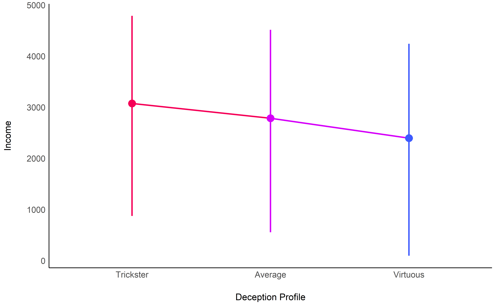


```r
sig <- model_parameters(model_dimensional)[2:5,] %>%
  select(Parameter, pd) %>%
  mutate(Dimension = stringr::str_remove(Parameter, "LIE_"),
         Text = format_pd(pd, stars_only=TRUE),
         Predicted = 4500,
         Score = df %>%
           select(one_of(Parameter)) %>%
           summarise_all(function(x) {mean(range(x))}) %>%
           t()) %>%
  mutate(Dimension = fct_relevel(Dimension, "Frequency", "Ability", "Negativity", "Contextuality"))

p_income <- rbind(estimate_link(model_dimensional, target="LIE_Ability") %>%
        mutate(LIE_Frequency = NA, LIE_Contextuality=NA, LIE_Negativity=NA),
      estimate_link(model_dimensional, target="LIE_Frequency") %>%
        mutate(LIE_Ability = NA, LIE_Contextuality=NA, LIE_Negativity=NA),
      estimate_link(model_dimensional, target="LIE_Contextuality") %>%
        mutate(LIE_Frequency = NA, LIE_Ability=NA, LIE_Negativity=NA),
      estimate_link(model_dimensional, target="LIE_Negativity") %>%
        mutate(LIE_Frequency = NA, LIE_Contextuality=NA, LIE_Ability=NA)) %>%
  pivot_longer(cols=starts_with("LIE_"), names_to="Dimension", values_to = "Score") %>%
  mutate(Dimension = str_remove(Dimension, "LIE_"),
         Dimension = fct_relevel(Dimension, "Frequency", "Ability", "Negativity", "Contextuality")) %>%
  ggplot(aes(x = Score, y = Predicted)) +
  geom_ribbon(aes(ymin=CI_low, ymax=CI_high, fill=Dimension), alpha=0.1) +
  geom_line(aes(color=Dimension), size = 1) +
  geom_text(data = sig, aes(label = Text)) +
  theme_modern() +
  theme(strip.placement = "outside",
        strip.text = element_text(size=13, face="plain"),
        axis.title = element_text(size=13),
        axis.text = element_text(size=9),
        plot.title = element_text(face="bold", hjust = 0.5)) +
  ggtitle("Income") +
  ylab("Income (in SGD per capita)") +
  xlab("") +
  scale_color_manual(values=c("Ability"= "#2196F3", "Frequency"="#4CAF50", "Negativity"="#E91E63", "Contextuality"="#FF9800"), name = "Dimensions", guide=FALSE) +
   scale_fill_manual(values=c("Ability"= "#2196F3", "Frequency"="#4CAF50", "Negativity"="#E91E63", "Contextuality"="#FF9800"), name = "Dimensions", guide=FALSE) +
  facet_wrap(~Dimension, scales="free_x", strip.position = "bottom")
```


#### Religion


```r
model_dimensional <- stan_lmer(Religion_Faith ~ LIE_Ability + LIE_Frequency + LIE_Contextuality + LIE_Negativity + (1|Religion_Type), data = dplyr::filter(df, !is.na(Religion_Faith)), refresh = 0, seed=333)
model_profile <- stan_lmer(Religion_Faith ~ LIE_Profile + (1|Religion_Type), data = dplyr::filter(df, !is.na(Religion_Faith)), refresh = 0, seed=333)

performance::compare_performance(model_dimensional, model_profile)
```

<div class="kable-table">

Model               Type        ELPD   ELPD_SE   LOOIC   LOOIC_SE   WAIC     R2   R2_marginal   R2_adjusted   RMSE
------------------  --------  ------  --------  ------  ---------  -----  -----  ------------  ------------  -----
model_dimensional   stanreg    -1713        18    3426         35   3426   0.40          0.07          0.38    2.3
model_profile       stanreg    -1727        17    3455         35   3455   0.37          0.02          0.36    2.4

</div>

```r
parameters::parameters_table(model_parameters(model_profile))
```

<div class="kable-table">

Parameter                 Median   89% CI         pd       % in ROPE   Rhat    ESS    Prior               
------------------------  -------  -------------  -------  ----------  ------  -----  --------------------
(Intercept)               3.96     [2.63, 5.19]   100%     0.02%       1.002   1024   Normal (0 +- 29.74) 
LIE_Profile [Trickster]   0.37     [0.05, 0.69]   96.43%   35.93%      0.999   3273   Normal (0 +- 7.44)  
LIE_Profile [Virtuous]    0.89     [0.50, 1.23]   99.98%   0.73%       1.000   2777   Normal (0 +- 7.44)  

</div>

```r
parameters::parameters_table(model_parameters(model_dimensional))
```

<div class="kable-table">

     Parameter           Median   89% CI           pd       % in ROPE   Rhat    ESS    Prior               
---  ------------------  -------  ---------------  -------  ----------  ------  -----  --------------------
1    (Intercept)         4.32     [ 3.11,  5.56]   99.90%   0.05%       1.004   848    Normal (0 +- 29.74) 
2    LIE_Ability         0.17     [ 0.07,  0.26]   99.42%   98.55%      1.001   3274   Normal (0 +- 3.85)  
4    LIE_Frequency       0.07     [-0.02,  0.15]   90.85%   100%        1.002   3397   Normal (0 +- 3.20)  
3    LIE_Contextuality   -0.28    [-0.40, -0.16]   100%     60.22%      1.000   3897   Normal (0 +- 5.16)  
5    LIE_Negativity      0.38     [ 0.25,  0.53]   100%     16.02%      1.000   3051   Normal (0 +- 4.83)  

</div>

```r
model_profile %>%
  estimate_means() %>%
  mutate(LIE_Profile = fct_relevel(LIE_Profile, "Trickster", "Average", "Virtuous")) %>%
  ggplot(aes(x = LIE_Profile, y = Mean, color = LIE_Profile)) +
  geom_line(aes(group = 1), size = 1) +
  geom_pointrange(aes(ymin = CI_low, ymax = CI_high), size = 1) +
  theme_modern() +
  scale_color_manual(values = colors_cluster, guide = FALSE) +
  ylab("Faith") +
  xlab("Deception Profile")
```

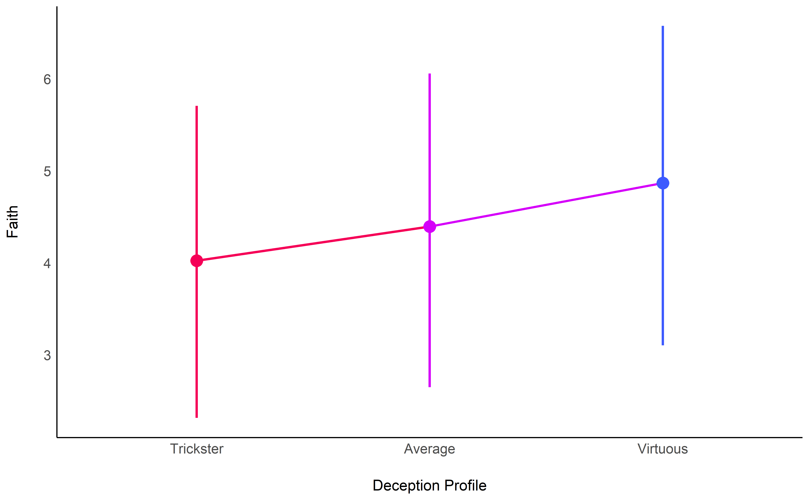


```r
sig <- model_parameters(model_dimensional)[-1,] %>%
  select(Parameter, pd) %>%
  mutate(Dimension = stringr::str_remove(Parameter, "LIE_"),
         Text = format_pd(pd, stars_only=TRUE),
         Predicted = 6.5,
         Score = dplyr::filter(df, !is.na(Religion_Faith)) %>%
           select(one_of(Parameter)) %>%
           summarise_all(function(x) {mean(range(x))}) %>%
           t()) %>%
  mutate(Dimension = fct_relevel(Dimension, "Frequency", "Ability", "Negativity", "Contextuality"))


p_religion <- rbind(estimate_link(model_dimensional, target="LIE_Ability") %>%
        mutate(LIE_Frequency = NA, LIE_Contextuality=NA, LIE_Negativity=NA),
      estimate_link(model_dimensional, target="LIE_Frequency") %>%
        mutate(LIE_Ability = NA, LIE_Contextuality=NA, LIE_Negativity=NA),
      estimate_link(model_dimensional, target="LIE_Contextuality") %>%
        mutate(LIE_Frequency = NA, LIE_Ability=NA, LIE_Negativity=NA),
      estimate_link(model_dimensional, target="LIE_Negativity") %>%
        mutate(LIE_Frequency = NA, LIE_Contextuality=NA, LIE_Ability=NA)) %>%
  pivot_longer(cols=starts_with("LIE_"), names_to="Dimension", values_to = "Score") %>%
  mutate(Dimension = str_remove(Dimension, "LIE_"),
         Dimension = fct_relevel(Dimension, "Frequency", "Ability", "Negativity", "Contextuality")) %>%
  ggplot(aes(x = Score, y = Predicted)) +
  geom_ribbon(aes(ymin=CI_low, ymax=CI_high, fill=Dimension), alpha=0.1) +
  geom_line(aes(color=Dimension), size = 1) +
  theme_modern() +
  theme(strip.placement = "outside",
        strip.text = element_text(size=13, face="plain"),
        axis.title = element_text(size=13),
        axis.text = element_text(size=9),
        plot.title = element_text(face="bold", hjust = 0.5)) +
  geom_text(data = sig, aes(label = Text)) +
  ggtitle("Religion") +
  ylab("\nFaith") +
  xlab("") +
  scale_color_manual(values=c("Ability"= "#2196F3", "Frequency"="#4CAF50", "Negativity"="#E91E63", "Contextuality"="#FF9800"), name = "Dimensions", guide=FALSE) +
   scale_fill_manual(values=c("Ability"= "#2196F3", "Frequency"="#4CAF50", "Negativity"="#E91E63", "Contextuality"="#FF9800"), name = "Dimensions", guide=FALSE) +
  facet_wrap(~Dimension, scales="free_x", strip.position = "bottom")
```


```r
# Combine plots
cowplot::plot_grid(p_sex, p_age, p_income, p_religion, nrow=2)
```

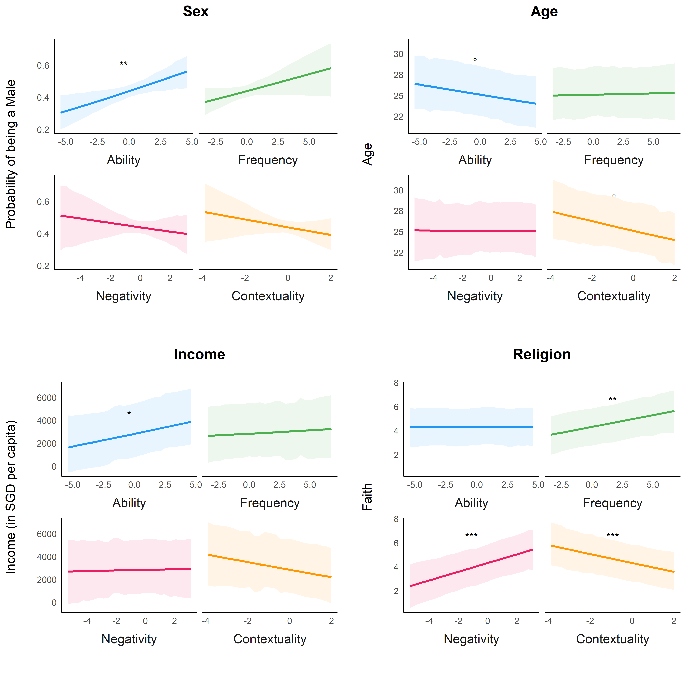

```r
# ggsave("60-40-datasplit/demographics.png", combine_plots, height=figwidth, width=figwidth)
```


### Number of Lies

#### Raw


```r
df$Lying_Frequency <- (df$Lying_Frequency_Day + df$Lying_Frequency_Week / 7) / 2
outliers <- check_outliers(df$Lying_Frequency, method = "zscore", threshold = list("zscore" = stats::qnorm(p = 0.999)))
df$Lying_Frequency[outliers == 1] <- NA


p_freq1 <- df %>%
  filter(!is.na(Lying_Frequency)) %>%
  ggplot(aes(x = Lying_Frequency)) +
  geom_histogram(aes(y=..density.., fill = ..x..), binwidth = 1/7) +
  geom_line(data=estimate_density(df$Lying_Frequency, method = "kernSmooth"),
            aes(x = x, y = y), color = "#2196F3", size = 1.5) +
  scale_fill_gradient(low='#AD1457', high='#F48FB1', guide = FALSE) +
  ylab("Distribution of Participants") +
  xlab(expression(paste('Lying Frequency ', italic("(lies / day)"))))  +
  theme_modern() +
  theme(axis.text.y = element_blank())
```


```r
library(ggforce)

df %>%
  filter(!is.na(Lying_Frequency)) %>%
  dplyr::select(starts_with("LIE"), Lying_Frequency) %>%
  ggplot(aes(x = .panel_x, y = .panel_y, fill = LIE_Profile, colour = LIE_Profile)) +
  geom_point(alpha = 1, shape = 16, size = 0.5) +
  geom_smooth(method = 'lm', formula = y ~ poly(x, 1), alpha = 0.1) +
  scale_color_manual(values = colors_cluster) +
  scale_fill_manual(values = colors_cluster) +
  ggforce::facet_matrix(cols = vars(LIE_Ability , LIE_Frequency, LIE_Negativity, LIE_Contextuality), rows = vars(Lying_Frequency)) +
  coord_cartesian(ylim = c(0, 5)) +
  theme_modern()
```


```r
model_profile <- stan_glm(Lying_Frequency ~ LIE_Profile, data = df, refresh = 0, seed=333)
model_dimensional <- stan_glm(Lying_Frequency ~ LIE_Ability + LIE_Frequency + LIE_Contextuality + LIE_Negativity, data = df, refresh = 0, seed=333)

performance::compare_performance(model_dimensional, model_profile)
```

<div class="kable-table">

Model               Type       ELPD   ELPD_SE   LOOIC   LOOIC_SE   WAIC     R2   R2_adjusted   RMSE
------------------  --------  -----  --------  ------  ---------  -----  -----  ------------  -----
model_dimensional   stanreg    -944        22    1887         45   1887   0.17          0.16   0.87
model_profile       stanreg    -966        22    1933         44   1933   0.11          0.10   0.90

</div>

```r
parameters::parameters_table(model_parameters(model_profile))
```

<div class="kable-table">

Parameter                 Median   89% CI           pd     % in ROPE   Rhat    ESS    Prior              
------------------------  -------  ---------------  -----  ----------  ------  -----  -------------------
(Intercept)               1.63     [ 1.53,  1.74]   100%   0%          1.000   3576   Normal (0 +- 9.58) 
LIE_Profile [Trickster]   -0.51    [-0.64, -0.38]   100%   0%          1.000   3568   Normal (0 +- 2.39) 
LIE_Profile [Virtuous]    -0.86    [-1.01, -0.72]   100%   0%          1.000   3564   Normal (0 +- 2.39) 

</div>

```r
parameters::parameters_table(model_parameters(model_dimensional))
```

<div class="kable-table">

     Parameter           Median   89% CI          pd       % in ROPE   Rhat    ESS    Prior              
---  ------------------  -------  --------------  -------  ----------  ------  -----  -------------------
1    (Intercept)         1.20     [ 1.16, 1.26]   100%     0%          1.001   4269   Normal (0 +- 9.58) 
2    LIE_Ability         0.17     [ 0.14, 0.22]   100%     0.02%       1.000   3568   Normal (0 +- 1.30) 
4    LIE_Frequency       0.00     [-0.03, 0.03]   55.12%   100%        1.000   3992   Normal (0 +- 1.03) 
3    LIE_Contextuality   0.05     [ 0.01, 0.09]   96.45%   95.88%      1.001   3511   Normal (0 +- 1.67) 
5    LIE_Negativity      -0.03    [-0.08, 0.02]   83.45%   97.32%      1.000   3316   Normal (0 +- 1.62) 

</div>


```r
p_freq2 <- model_dimensional %>%
  estimate_link(target = "LIE_Frequency", length = 10, smooth_strength = 0) %>%
  ggplot(aes(x = LIE_Frequency, y = Predicted)) +
  geom_point2(data = df, aes(y = Lying_Frequency, color = Lying_Frequency), size = 4, alpha=0.7) +
  geom_ribbon(aes(ymin = CI_low, ymax = CI_high), alpha = 0.2) +
  geom_line(size = 1.5) +
  scale_color_gradient(low='#AD1457', high='#F48FB1', guide = FALSE) +
  theme_modern() +
  ylab("Absolute Lying Frequency (lies / day)") +
  xlab("LIE - Frequency") +
  theme(plot.margin = unit(c(5.5, 0, 5.5, 5.5), "pt"))
```


```r
# Combine plots
cowplot::plot_grid(p_freq2,
                   p_freq1 +
                     coord_flip() +
                     xlab("") +
                     ylab("") +
                     theme(axis.line = element_blank(),
                           axis.text.x = element_blank(),
                           axis.title.y = element_blank(),
                           axis.line.y = element_blank(),
                           axis.ticks.y=element_blank(),
                           plot.margin = unit(c(0, 0, 10, -20), "pt")),
                   nrow=1, rel_widths = c(0.75, 0.25))
```


#### Adjusted


```r
df$Lying_Frequency_Adjusted <- effectsize::adjust(df, select = "Lying_Frequency", effect = c("BIDR_ImpressionManagement", "BIDR_SelfDeceptiveEnhancement"))$Lying_Frequency
df$Lying_Frequency_Adjusted <- df$Lying_Frequency_Adjusted + abs(min(df$Lying_Frequency_Adjusted, na.rm=TRUE))


p_freq1adj <- df %>%
  filter(!is.na(Lying_Frequency_Adjusted)) %>%
  ggplot(aes(x = Lying_Frequency_Adjusted)) +
  geom_histogram(aes(y=..density.., fill = ..x..), binwidth = 1/7) +
  geom_line(data=estimate_density(df$Lying_Frequency_Adjusted, method = "kernSmooth"),
            aes(x = x, y = y), color = "red", size = 1.5) +
  scale_fill_gradient(low='#1A237E', high='#2196F3', guide = FALSE) +
  ylab("Distribution of Participants") +
  xlab(expression(paste('Lying Frequency ', italic("(lies / day)"))))  +
  theme_modern() +
  theme(axis.text.y = element_blank())
```


```r
library(ggforce)

df %>%
  filter(!is.na(Lying_Frequency_Adjusted)) %>%
  dplyr::select(starts_with("LIE"), Lying_Frequency_Adjusted) %>%
  ggplot(aes(x = .panel_x, y = .panel_y, fill = LIE_Profile, colour = LIE_Profile)) +
  geom_point(alpha = 1, shape = 16, size = 0.5) +
  geom_smooth(method = 'lm', formula = y ~ poly(x, 1), alpha = 0.1) +
  scale_color_manual(values = colors_cluster) +
  scale_fill_manual(values = colors_cluster) +
  ggforce::facet_matrix(cols = vars(LIE_Ability , LIE_Frequency, LIE_Negativity, LIE_Contextuality), rows = vars(Lying_Frequency_Adjusted)) +
  coord_cartesian(ylim = c(0, 5)) +
  theme_modern()
```


```r
model_profile <- stan_glm(Lying_Frequency_Adjusted ~ LIE_Profile, data = df, refresh = 0, seed=333)
model_dimensional <- stan_glm(Lying_Frequency_Adjusted ~ LIE_Ability + LIE_Frequency + LIE_Contextuality + LIE_Negativity, data = df, refresh = 0, seed=333)

performance::compare_performance(model_dimensional, model_profile)
```

<div class="kable-table">

Model               Type       ELPD   ELPD_SE   LOOIC   LOOIC_SE   WAIC     R2   R2_adjusted   RMSE
------------------  --------  -----  --------  ------  ---------  -----  -----  ------------  -----
model_dimensional   stanreg    -954        22    1909         44   1909   0.10          0.09   0.89
model_profile       stanreg    -965        22    1930         44   1930   0.07          0.06   0.90

</div>

```r
parameters::parameters_table(model_parameters(model_profile))
```

<div class="kable-table">

Parameter                 Median   89% CI           pd     % in ROPE   Rhat    ESS    Prior              
------------------------  -------  ---------------  -----  ----------  ------  -----  -------------------
(Intercept)               1.93     [ 1.83,  2.03]   100%   0%          0.999   2713   Normal (0 +- 9.34) 
LIE_Profile [Trickster]   -0.39    [-0.52, -0.27]   100%   0%          1.000   2844   Normal (0 +- 2.33) 
LIE_Profile [Virtuous]    -0.65    [-0.81, -0.52]   100%   0%          1.000   2890   Normal (0 +- 2.33) 

</div>

```r
parameters::parameters_table(model_parameters(model_dimensional))
```

<div class="kable-table">

     Parameter           Median   89% CI          pd       % in ROPE   Rhat    ESS    Prior              
---  ------------------  -------  --------------  -------  ----------  ------  -----  -------------------
1    (Intercept)         1.60     [ 1.55, 1.66]   100%     0%          1.000   4267   Normal (0 +- 9.34) 
2    LIE_Ability         0.14     [ 0.10, 0.18]   100%     3.55%       1.000   3489   Normal (0 +- 1.26) 
4    LIE_Frequency       0.01     [-0.02, 0.04]   71.15%   100%        1.000   3652   Normal (0 +- 1.01) 
3    LIE_Contextuality   0.01     [-0.03, 0.05]   64.40%   99.75%      1.000   3917   Normal (0 +- 1.63) 
5    LIE_Negativity      -0.02    [-0.07, 0.04]   68.58%   98.75%      1.000   3452   Normal (0 +- 1.58) 

</div>


```r
p_freq2adj <- model_dimensional %>%
  estimate_link(target = "LIE_Frequency", length = 10, smooth_strength = 0) %>%
  ggplot(aes(x = LIE_Frequency, y = Predicted)) +
  geom_point2(data = df, aes(y = Lying_Frequency_Adjusted, color = Lying_Frequency_Adjusted), size = 4, alpha=0.7) +
  geom_ribbon(aes(ymin = CI_low, ymax = CI_high), alpha = 0.2) +
  geom_line(size = 1.5) +
  scale_color_gradient(low='#1A237E', high='#2196F3', guide = FALSE) +
  theme_modern() +
  ylab("Absolute Lying Frequency (lies / day)") +
  xlab("LIE - Frequency") +
  theme(plot.margin = unit(c(5.5, 0, 5.5, 5.5), "pt"))
```


```r
# Combine plots
cowplot::plot_grid(p_freq2adj,
                   p_freq1adj +
                     coord_flip() +
                     xlab("") +
                     ylab("") +
                     theme(axis.line = element_blank(),
                           axis.text.x = element_blank(),
                           axis.title.y = element_blank(),
                           axis.line.y = element_blank(),
                           axis.ticks.y=element_blank(),
                           plot.margin = unit(c(0, 0, 10, -20), "pt")),
                   nrow=1, rel_widths = c(0.75, 0.25))
```

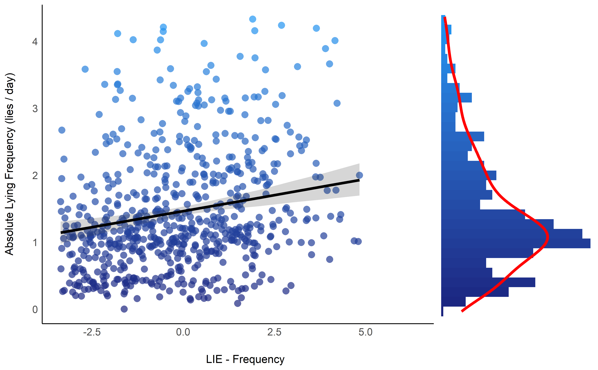


### Social Desirability (BIDR)

#### Utility Functions


```r
library(ggraph)
library(tidygraph)

colors_nodes <- c("LIE"= "#9C27B0",
                  "Psychopathy" = "#f44336",
                  "Narcissism" = "#FF9800",
                  "Pathological Personality" = "#FFC107",
                  "Normal Personality" = "#4CAF50",
                  "Social Desirability" = "#795548",
                  "Light Triad" = "#2196F3",
                  "Impulsivity" = "#673AB7",
                  "Emotion Regulation" = "#E91E63",
                  "Interoception" = "#b71c1c")

# convenience function
create_ggm <- function(data, title = "Pychopathy (TRIMP)", title_size=22, label_edges = TRUE, node_size=32, text_size=5.5, layout="kk", seed=333, bend=0.2){
  set.seed(seed)

  label_edges <- ifelse(rep_len(label_edges, length.out=nrow(data$edges)), insight::format_value(data$edges$r), "")

  data %>%
    ggraph(layout = layout) +
    geom_edge_arc(aes(colour=r, edge_width = abs(r), label = label_edges),
                  strength=bend,
                  angle_calc = 'along',
                  label_dodge = unit(3.5, 'mm'),
                  check_overlap = FALSE) +
    geom_node_point(aes(colour = Questionnaire), size=node_size) +
    geom_node_text(aes(label = name), colour="white", check_overlap = FALSE, repel = FALSE, size=text_size, fontface="bold") +
    scale_edge_color_gradient2(low = "#d50000", high = "#00C853") +
    scale_color_manual(values = colors_nodes) +
    theme_graph() +
    guides(edge_width = FALSE,
           edge_color = FALSE,
           colour = FALSE) +
    scale_x_continuous(expand = expansion(c(.15, .15))) +
    scale_y_continuous(expand = expansion(c(.15, .15))) +
    theme(plot.title = element_text(hjust = 0.5, face="bold", size = title_size),
          plot.margin = unit(c(0, 0, 0, 0), "cm")) +
    ggtitle(title)
}
```


#### Gaussian Graphical Model


```r
cor_bidr <- correlation::correlation(
  dplyr::select(df, dplyr::starts_with("LIE"), dplyr::starts_with("BIDR"), -BIDR_General),
  partial = TRUE, p_adjust = "none")

parameters::parameters_table(cor_bidr)
```

<div class="kable-table">

Parameter1                      Parameter2                      r       95% CI           t        df    p        Method    n_Obs 
------------------------------  ------------------------------  ------  ---------------  -------  ----  -------  --------  ------
LIE_Frequency                   LIE_Ability                     0.19    [ 0.12,  0.26]   5.50     793   < .001   Pearson   795   
LIE_Frequency                   LIE_Negativity                  -0.33   [-0.39, -0.27]   -9.85    793   < .001   Pearson   795   
LIE_Frequency                   LIE_Contextuality               0.33    [ 0.27,  0.39]   9.85     793   < .001   Pearson   795   
LIE_Frequency                   BIDR_SelfDeceptiveEnhancement   0.19    [ 0.13,  0.26]   5.59     793   < .001   Pearson   795   
LIE_Frequency                   BIDR_ImpressionManagement       -0.06   [-0.13,  0.01]   -1.75    793   0.081    Pearson   795   
LIE_Ability                     LIE_Negativity                  -0.49   [-0.54, -0.43]   -15.81   793   < .001   Pearson   795   
LIE_Ability                     LIE_Contextuality               -0.07   [-0.14,  0.00]   -2.08    793   0.038    Pearson   795   
LIE_Ability                     BIDR_SelfDeceptiveEnhancement   -0.23   [-0.30, -0.16]   -6.67    793   < .001   Pearson   795   
LIE_Ability                     BIDR_ImpressionManagement       -0.14   [-0.21, -0.08]   -4.13    793   < .001   Pearson   795   
LIE_Negativity                  LIE_Contextuality               -0.18   [-0.25, -0.12]   -5.28    793   < .001   Pearson   795   
LIE_Negativity                  BIDR_SelfDeceptiveEnhancement   -0.12   [-0.19, -0.05]   -3.39    793   < .001   Pearson   795   
LIE_Negativity                  BIDR_ImpressionManagement       0.12    [ 0.05,  0.19]   3.51     793   < .001   Pearson   795   
LIE_Contextuality               BIDR_SelfDeceptiveEnhancement   -0.12   [-0.19, -0.05]   -3.46    793   < .001   Pearson   795   
LIE_Contextuality               BIDR_ImpressionManagement       -0.16   [-0.23, -0.10]   -4.67    793   < .001   Pearson   795   
BIDR_SelfDeceptiveEnhancement   BIDR_ImpressionManagement       0.25    [ 0.18,  0.31]   7.15     793   < .001   Pearson   795   

</div>


```r
graphdata_bidr <- cor_bidr %>%
  filter(p < .001) %>%
  tidygraph::as_tbl_graph() %>%
  as.list()

graphdata_bidr$nodes$Questionnaire <- ifelse(stringr::str_detect(graphdata_bidr$nodes$name, "LIE_"),
                               "LIE", "Social Desirability")
graphdata_bidr$nodes$name <- stringr::str_remove(graphdata_bidr$nodes$name, "LIE_|BIDR_")
graphdata_bidr$nodes$name <- stringr::str_replace(graphdata_bidr$nodes$name, "fD", "f-D")
graphdata_bidr$nodes$name <- stringr::str_replace(graphdata_bidr$nodes$name, "nM", "n\nM")
graphdata_bidr$nodes$name <- stringr::str_replace(graphdata_bidr$nodes$name, "eE", "e\nE")

ggm_bidr <- create_ggm(graphdata_bidr, title = "Social Desirability", layout="sugiyama")
ggm_bidr
```

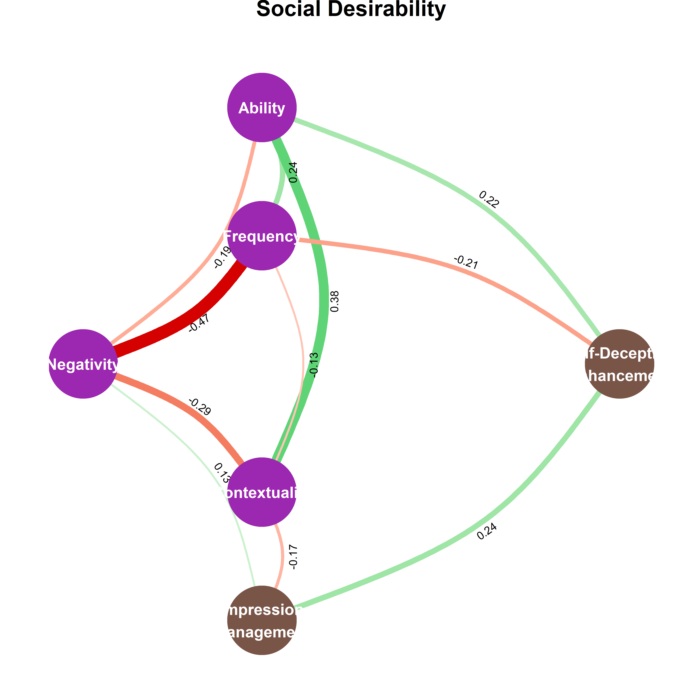

After controlling for social desirability, it seems that the relationship between frequency and contextuality changed from being positive to negative. The more people lie (likely representing a lack of control), and the less flexible and insensitive to the context they are.

#### Adjust for Social Desirability


```r
lie <- df[names(dplyr::select(df, dplyr::starts_with("LIE"), -LIE_Profile))]
df[names(lie)] <- effectsize::adjust(data = cbind(lie, df[c("BIDR_ImpressionManagement", "BIDR_SelfDeceptiveEnhancement", "Age", "Sex")]),
                                     effect = c("BIDR_ImpressionManagement", "BIDR_SelfDeceptiveEnhancement", "Age", "Sex"),
                                     multilevel = TRUE)[names(lie)]
```


### Psychopathy (TRIMP)


```r
cor_trimp <- correlation::correlation(
  dplyr::select(df, dplyr::starts_with("LIE"), -LIE_Profile, TRIMP_Boldness, TRIMP_Meanness, TRIMP_Disinhibition),
  partial = TRUE, p_adjust = "none")

parameters::parameters_table(cor_trimp)
```

<div class="kable-table">

Parameter1          Parameter2            r           95% CI           t        df    p        Method    n_Obs 
------------------  --------------------  ----------  ---------------  -------  ----  -------  --------  ------
LIE_Frequency       LIE_Ability           0.19        [ 0.12,  0.25]   5.39     787   < .001   Pearson   789   
LIE_Frequency       LIE_Negativity        -0.30       [-0.37, -0.24]   -8.93    787   < .001   Pearson   789   
LIE_Frequency       LIE_Contextuality     0.34        [ 0.27,  0.40]   10.01    787   < .001   Pearson   789   
LIE_Frequency       TRIMP_Boldness        0.23        [ 0.16,  0.30]   6.66     787   < .001   Pearson   789   
LIE_Frequency       TRIMP_Meanness        -0.05       [-0.12,  0.02]   -1.37    787   0.170    Pearson   789   
LIE_Frequency       TRIMP_Disinhibition   0.06        [-0.01,  0.13]   1.58     787   0.116    Pearson   789   
LIE_Ability         LIE_Negativity        -0.47       [-0.52, -0.41]   -14.87   787   < .001   Pearson   789   
LIE_Ability         LIE_Contextuality     -0.06       [-0.13,  0.01]   -1.82    787   0.070    Pearson   789   
LIE_Ability         TRIMP_Boldness        -0.01       [-0.08,  0.06]   -0.15    787   0.880    Pearson   789   
LIE_Ability         TRIMP_Meanness        -5.13e-04   [-0.07,  0.07]   -0.01    787   0.989    Pearson   789   
LIE_Ability         TRIMP_Disinhibition   0.20        [ 0.14,  0.27]   5.85     787   < .001   Pearson   789   
LIE_Negativity      LIE_Contextuality     -0.18       [-0.25, -0.12]   -5.27    787   < .001   Pearson   789   
LIE_Negativity      TRIMP_Boldness        0.01        [-0.06,  0.08]   0.18     787   0.854    Pearson   789   
LIE_Negativity      TRIMP_Meanness        -0.19       [-0.26, -0.12]   -5.45    787   < .001   Pearson   789   
LIE_Negativity      TRIMP_Disinhibition   0.13        [ 0.06,  0.20]   3.73     787   < .001   Pearson   789   
LIE_Contextuality   TRIMP_Boldness        -0.08       [-0.15, -0.01]   -2.20    787   0.028    Pearson   789   
LIE_Contextuality   TRIMP_Meanness        -0.03       [-0.10,  0.04]   -0.85    787   0.396    Pearson   789   
LIE_Contextuality   TRIMP_Disinhibition   0.00        [-0.07,  0.07]   -0.05    787   0.959    Pearson   789   
TRIMP_Boldness      TRIMP_Meanness        0.27        [ 0.20,  0.33]   7.84     787   < .001   Pearson   789   
TRIMP_Boldness      TRIMP_Disinhibition   -0.30       [-0.36, -0.23]   -8.77    787   < .001   Pearson   789   
TRIMP_Meanness      TRIMP_Disinhibition   0.62        [ 0.57,  0.66]   22.11    787   < .001   Pearson   789   

</div>


```r
graphdata_trimp <- cor_trimp %>%
  filter(p < .001) %>%
  tidygraph::as_tbl_graph() %>%
  as.list()

graphdata_trimp$nodes$Questionnaire <- ifelse(stringr::str_detect(graphdata_trimp$nodes$name, "LIE_"),
                               "LIE", "Psychopathy")
graphdata_trimp$nodes$name <- stringr::str_remove(graphdata_trimp$nodes$name, "LIE_|TRIMP_")


create_ggm(graphdata_trimp, title = "Pychopathy")
```


### Narcissism (FFNI)


```r
cor_ffni <- correlation::correlation(
  dplyr::select(df, dplyr::starts_with("LIE"), dplyr::starts_with("FFNI"), -FFNI_General),
  partial = TRUE, p_adjust = "none")

parameters::parameters_table(cor_ffni)
```

<div class="kable-table">

Parameter1               Parameter2               r       95% CI           t        df    p        Method    n_Obs 
-----------------------  -----------------------  ------  ---------------  -------  ----  -------  --------  ------
LIE_Frequency            LIE_Ability              0.17    [ 0.10,  0.24]   4.84     787   < .001   Pearson   789   
LIE_Frequency            LIE_Negativity           -0.33   [-0.39, -0.26]   -9.71    787   < .001   Pearson   789   
LIE_Frequency            LIE_Contextuality        0.32    [ 0.25,  0.38]   9.33     787   < .001   Pearson   789   
LIE_Frequency            FFNI_AcclaimSeeking      0.00    [-0.07,  0.07]   0.09     787   0.925    Pearson   789   
LIE_Frequency            FFNI_Distrust            0.04    [-0.03,  0.11]   1.13     787   0.257    Pearson   789   
LIE_Frequency            FFNI_Entitlement         0.00    [-0.07,  0.07]   -0.07    787   0.940    Pearson   789   
LIE_Frequency            FFNI_Exploitativeness    -0.15   [-0.22, -0.08]   -4.21    787   < .001   Pearson   789   
LIE_Frequency            FFNI_Indifference        0.03    [-0.04,  0.10]   0.75     787   0.452    Pearson   789   
LIE_Frequency            FFNI_LackOfEmpathy       -0.05   [-0.12,  0.02]   -1.30    787   0.193    Pearson   789   
LIE_Frequency            FFNI_Manipulativeness    0.36    [ 0.30,  0.42]   10.79    787   < .001   Pearson   789   
LIE_Frequency            FFNI_NeedForAdmiration   0.06    [-0.01,  0.13]   1.59     787   0.113    Pearson   789   
LIE_Frequency            FFNI_ThrillSeeking       0.00    [-0.07,  0.07]   -0.09    787   0.927    Pearson   789   
LIE_Ability              LIE_Negativity           -0.47   [-0.53, -0.42]   -15.14   787   < .001   Pearson   789   
LIE_Ability              LIE_Contextuality        -0.08   [-0.15, -0.01]   -2.23    787   0.026    Pearson   789   
LIE_Ability              FFNI_AcclaimSeeking      0.02    [-0.05,  0.09]   0.47     787   0.640    Pearson   789   
LIE_Ability              FFNI_Distrust            -0.02   [-0.09,  0.05]   -0.52    787   0.600    Pearson   789   
LIE_Ability              FFNI_Entitlement         0.08    [ 0.01,  0.15]   2.15     787   0.032    Pearson   789   
LIE_Ability              FFNI_Exploitativeness    0.00    [-0.07,  0.07]   0.12     787   0.901    Pearson   789   
LIE_Ability              FFNI_Indifference        0.06    [-0.01,  0.13]   1.78     787   0.076    Pearson   789   
LIE_Ability              FFNI_LackOfEmpathy       0.07    [ 0.00,  0.14]   2.08     787   0.038    Pearson   789   
LIE_Ability              FFNI_Manipulativeness    -0.02   [-0.09,  0.05]   -0.61    787   0.543    Pearson   789   
LIE_Ability              FFNI_NeedForAdmiration   0.09    [ 0.02,  0.15]   2.39     787   0.017    Pearson   789   
LIE_Ability              FFNI_ThrillSeeking       0.05    [-0.02,  0.12]   1.32     787   0.189    Pearson   789   
LIE_Negativity           LIE_Contextuality        -0.19   [-0.25, -0.12]   -5.30    787   < .001   Pearson   789   
LIE_Negativity           FFNI_AcclaimSeeking      0.14    [ 0.07,  0.20]   3.87     787   < .001   Pearson   789   
LIE_Negativity           FFNI_Distrust            -0.02   [-0.09,  0.05]   -0.50    787   0.615    Pearson   789   
LIE_Negativity           FFNI_Entitlement         0.07    [ 0.00,  0.14]   2.00     787   0.046    Pearson   789   
LIE_Negativity           FFNI_Exploitativeness    -0.10   [-0.17, -0.03]   -2.93    787   0.003    Pearson   789   
LIE_Negativity           FFNI_Indifference        0.08    [ 0.01,  0.15]   2.38     787   0.018    Pearson   789   
LIE_Negativity           FFNI_LackOfEmpathy       -0.04   [-0.11,  0.03]   -1.22    787   0.224    Pearson   789   
LIE_Negativity           FFNI_Manipulativeness    0.05    [-0.02,  0.12]   1.31     787   0.190    Pearson   789   
LIE_Negativity           FFNI_NeedForAdmiration   0.14    [ 0.07,  0.21]   4.07     787   < .001   Pearson   789   
LIE_Negativity           FFNI_ThrillSeeking       -0.06   [-0.13,  0.01]   -1.64    787   0.102    Pearson   789   
LIE_Contextuality        FFNI_AcclaimSeeking      0.09    [ 0.02,  0.16]   2.45     787   0.015    Pearson   789   
LIE_Contextuality        FFNI_Distrust            0.01    [-0.06,  0.08]   0.25     787   0.804    Pearson   789   
LIE_Contextuality        FFNI_Entitlement         -0.05   [-0.12,  0.02]   -1.48    787   0.140    Pearson   789   
LIE_Contextuality        FFNI_Exploitativeness    0.05    [-0.02,  0.12]   1.36     787   0.174    Pearson   789   
LIE_Contextuality        FFNI_Indifference        0.06    [-0.01,  0.13]   1.66     787   0.098    Pearson   789   
LIE_Contextuality        FFNI_LackOfEmpathy       -0.01   [-0.08,  0.06]   -0.33    787   0.740    Pearson   789   
LIE_Contextuality        FFNI_Manipulativeness    -0.09   [-0.16, -0.02]   -2.52    787   0.012    Pearson   789   
LIE_Contextuality        FFNI_NeedForAdmiration   0.10    [ 0.03,  0.17]   2.75     787   0.006    Pearson   789   
LIE_Contextuality        FFNI_ThrillSeeking       0.03    [-0.04,  0.10]   0.84     787   0.401    Pearson   789   
FFNI_AcclaimSeeking      FFNI_Distrust            0.05    [-0.02,  0.12]   1.37     787   0.173    Pearson   789   
FFNI_AcclaimSeeking      FFNI_Entitlement         0.16    [ 0.09,  0.23]   4.59     787   < .001   Pearson   789   
FFNI_AcclaimSeeking      FFNI_Exploitativeness    -0.02   [-0.09,  0.05]   -0.44    787   0.663    Pearson   789   
FFNI_AcclaimSeeking      FFNI_Indifference        0.02    [-0.05,  0.09]   0.66     787   0.513    Pearson   789   
FFNI_AcclaimSeeking      FFNI_LackOfEmpathy       -0.14   [-0.21, -0.08]   -4.09    787   < .001   Pearson   789   
FFNI_AcclaimSeeking      FFNI_Manipulativeness    0.23    [ 0.16,  0.29]   6.53     787   < .001   Pearson   789   
FFNI_AcclaimSeeking      FFNI_NeedForAdmiration   -0.12   [-0.19, -0.05]   -3.33    787   < .001   Pearson   789   
FFNI_AcclaimSeeking      FFNI_ThrillSeeking       0.18    [ 0.11,  0.25]   5.10     787   < .001   Pearson   789   
FFNI_Distrust            FFNI_Entitlement         0.06    [-0.01,  0.13]   1.61     787   0.108    Pearson   789   
FFNI_Distrust            FFNI_Exploitativeness    0.15    [ 0.08,  0.21]   4.13     787   < .001   Pearson   789   
FFNI_Distrust            FFNI_Indifference        0.10    [ 0.03,  0.17]   2.79     787   0.005    Pearson   789   
FFNI_Distrust            FFNI_LackOfEmpathy       0.08    [ 0.01,  0.15]   2.31     787   0.021    Pearson   789   
FFNI_Distrust            FFNI_Manipulativeness    -0.03   [-0.09,  0.04]   -0.71    787   0.478    Pearson   789   
FFNI_Distrust            FFNI_NeedForAdmiration   0.15    [ 0.08,  0.22]   4.25     787   < .001   Pearson   789   
FFNI_Distrust            FFNI_ThrillSeeking       -0.04   [-0.11,  0.03]   -1.13    787   0.258    Pearson   789   
FFNI_Entitlement         FFNI_Exploitativeness    0.31    [ 0.24,  0.37]   9.06     787   < .001   Pearson   789   
FFNI_Entitlement         FFNI_Indifference        -0.03   [-0.10,  0.04]   -0.85    787   0.398    Pearson   789   
FFNI_Entitlement         FFNI_LackOfEmpathy       0.22    [ 0.15,  0.29]   6.39     787   < .001   Pearson   789   
FFNI_Entitlement         FFNI_Manipulativeness    0.05    [-0.02,  0.12]   1.47     787   0.143    Pearson   789   
FFNI_Entitlement         FFNI_NeedForAdmiration   0.14    [ 0.07,  0.21]   4.02     787   < .001   Pearson   789   
FFNI_Entitlement         FFNI_ThrillSeeking       0.07    [ 0.00,  0.14]   2.06     787   0.040    Pearson   789   
FFNI_Exploitativeness    FFNI_Indifference        -0.02   [-0.09,  0.05]   -0.66    787   0.510    Pearson   789   
FFNI_Exploitativeness    FFNI_LackOfEmpathy       0.25    [ 0.18,  0.31]   7.17     787   < .001   Pearson   789   
FFNI_Exploitativeness    FFNI_Manipulativeness    0.40    [ 0.34,  0.46]   12.19    787   < .001   Pearson   789   
FFNI_Exploitativeness    FFNI_NeedForAdmiration   0.11    [ 0.04,  0.18]   3.14     787   0.002    Pearson   789   
FFNI_Exploitativeness    FFNI_ThrillSeeking       0.05    [-0.02,  0.12]   1.49     787   0.137    Pearson   789   
FFNI_Indifference        FFNI_LackOfEmpathy       0.33    [ 0.27,  0.39]   9.84     787   < .001   Pearson   789   
FFNI_Indifference        FFNI_Manipulativeness    0.13    [ 0.06,  0.20]   3.75     787   < .001   Pearson   789   
FFNI_Indifference        FFNI_NeedForAdmiration   -0.48   [-0.53, -0.42]   -15.17   787   < .001   Pearson   789   
FFNI_Indifference        FFNI_ThrillSeeking       0.18    [ 0.12,  0.25]   5.24     787   < .001   Pearson   789   
FFNI_LackOfEmpathy       FFNI_Manipulativeness    -0.03   [-0.10,  0.04]   -0.83    787   0.405    Pearson   789   
FFNI_LackOfEmpathy       FFNI_NeedForAdmiration   0.01    [-0.06,  0.08]   0.15     787   0.879    Pearson   789   
FFNI_LackOfEmpathy       FFNI_ThrillSeeking       0.06    [ 0.00,  0.13]   1.82     787   0.069    Pearson   789   
FFNI_Manipulativeness    FFNI_NeedForAdmiration   -0.03   [-0.10,  0.04]   -0.78    787   0.434    Pearson   789   
FFNI_Manipulativeness    FFNI_ThrillSeeking       0.10    [ 0.03,  0.16]   2.70     787   0.007    Pearson   789   
FFNI_NeedForAdmiration   FFNI_ThrillSeeking       0.10    [ 0.03,  0.17]   2.74     787   0.006    Pearson   789   

</div>


```r
graphdata_ffni <- cor_ffni %>%
  filter(p < .001) %>%
  tidygraph::as_tbl_graph() %>%
  as.list()

graphdata_ffni$nodes$Questionnaire <- ifelse(stringr::str_detect(graphdata_ffni$nodes$name, "LIE_"),
                               "LIE", "Narcissism")
graphdata_ffni$nodes$name <- stringr::str_remove(graphdata_ffni$nodes$name, "LIE_|FFNI_")
graphdata_ffni$nodes$name <- stringr::str_replace(graphdata_ffni$nodes$name, "dForA", "d for\nA")
graphdata_ffni$nodes$name <- stringr::str_replace(graphdata_ffni$nodes$name, "mS", "m\nS")
graphdata_ffni$nodes$name <- stringr::str_replace(graphdata_ffni$nodes$name, "lS", "l\nS")
graphdata_ffni$nodes$name <- stringr::str_replace(graphdata_ffni$nodes$name, "kOfE", "k of\nE")


ggm_ffni <- create_ggm(graphdata_ffni, title = "Narcissism", node_size=38)
ggm_ffni
```

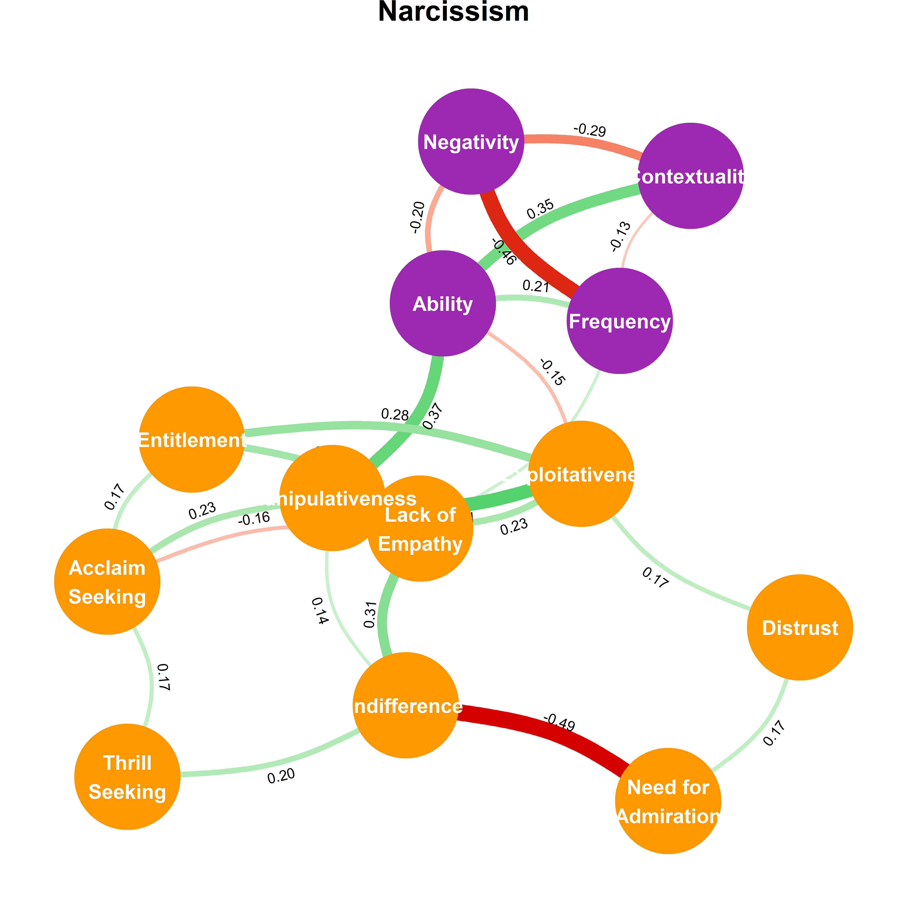


### Normal Personality (IPIP6)


```r
cor_ipip <- correlation::correlation(
  dplyr::select(df, dplyr::starts_with("LIE"), dplyr::starts_with("IPIP6")),
  partial = TRUE, p_adjust = "none")

parameters::parameters_table(cor_ipip)
```

<div class="kable-table">

Parameter1                Parameter2                r       95% CI           t        df    p        Method    n_Obs 
------------------------  ------------------------  ------  ---------------  -------  ----  -------  --------  ------
LIE_Frequency             LIE_Ability               0.20    [ 0.14,  0.27]   5.85     787   < .001   Pearson   789   
LIE_Frequency             LIE_Negativity            -0.31   [-0.37, -0.25]   -9.20    787   < .001   Pearson   789   
LIE_Frequency             LIE_Contextuality         0.32    [ 0.26,  0.38]   9.59     787   < .001   Pearson   789   
LIE_Frequency             IPIP6_Extraversion        0.09    [ 0.02,  0.16]   2.54     787   0.011    Pearson   789   
LIE_Frequency             IPIP6_Agreableness        0.05    [-0.02,  0.12]   1.37     787   0.171    Pearson   789   
LIE_Frequency             IPIP6_Conscientiousness   0.04    [-0.03,  0.11]   1.18     787   0.239    Pearson   789   
LIE_Frequency             IPIP6_Neuroticism         -0.04   [-0.11,  0.03]   -1.20    787   0.229    Pearson   789   
LIE_Frequency             IPIP6_Openeness           0.13    [ 0.06,  0.20]   3.77     787   < .001   Pearson   789   
LIE_Frequency             IPIP6_HonestyHumility     -0.10   [-0.17, -0.03]   -2.90    787   0.004    Pearson   789   
LIE_Ability               LIE_Negativity            -0.46   [-0.52, -0.41]   -14.71   787   < .001   Pearson   789   
LIE_Ability               LIE_Contextuality         -0.07   [-0.14,  0.00]   -1.86    787   0.064    Pearson   789   
LIE_Ability               IPIP6_Extraversion        0.00    [-0.07,  0.07]   0.08     787   0.940    Pearson   789   
LIE_Ability               IPIP6_Agreableness        -0.08   [-0.15, -0.01]   -2.26    787   0.024    Pearson   789   
LIE_Ability               IPIP6_Conscientiousness   -0.08   [-0.15, -0.01]   -2.29    787   0.022    Pearson   789   
LIE_Ability               IPIP6_Neuroticism         0.07    [ 0.00,  0.14]   2.01     787   0.045    Pearson   789   
LIE_Ability               IPIP6_Openeness           -0.09   [-0.16, -0.02]   -2.45    787   0.015    Pearson   789   
LIE_Ability               IPIP6_HonestyHumility     -0.09   [-0.16, -0.02]   -2.58    787   0.010    Pearson   789   
LIE_Negativity            LIE_Contextuality         -0.19   [-0.26, -0.12]   -5.44    787   < .001   Pearson   789   
LIE_Negativity            IPIP6_Extraversion        -0.11   [-0.17, -0.04]   -2.97    787   0.003    Pearson   789   
LIE_Negativity            IPIP6_Agreableness        0.15    [ 0.08,  0.21]   4.17     787   < .001   Pearson   789   
LIE_Negativity            IPIP6_Conscientiousness   0.09    [ 0.02,  0.15]   2.40     787   0.016    Pearson   789   
LIE_Negativity            IPIP6_Neuroticism         0.02    [-0.04,  0.09]   0.70     787   0.483    Pearson   789   
LIE_Negativity            IPIP6_Openeness           -0.03   [-0.10,  0.04]   -0.88    787   0.377    Pearson   789   
LIE_Negativity            IPIP6_HonestyHumility     -0.15   [-0.22, -0.08]   -4.30    787   < .001   Pearson   789   
LIE_Contextuality         IPIP6_Extraversion        -0.11   [-0.17, -0.04]   -2.98    787   0.003    Pearson   789   
LIE_Contextuality         IPIP6_Agreableness        0.02    [-0.05,  0.09]   0.51     787   0.609    Pearson   789   
LIE_Contextuality         IPIP6_Conscientiousness   0.05    [-0.02,  0.12]   1.29     787   0.199    Pearson   789   
LIE_Contextuality         IPIP6_Neuroticism         0.00    [-0.07,  0.07]   -0.06    787   0.953    Pearson   789   
LIE_Contextuality         IPIP6_Openeness           0.02    [-0.05,  0.09]   0.51     787   0.607    Pearson   789   
LIE_Contextuality         IPIP6_HonestyHumility     -0.04   [-0.11,  0.03]   -1.25    787   0.211    Pearson   789   
IPIP6_Extraversion        IPIP6_Agreableness        0.29    [ 0.23,  0.36]   8.66     787   < .001   Pearson   789   
IPIP6_Extraversion        IPIP6_Conscientiousness   -0.09   [-0.16, -0.02]   -2.55    787   0.011    Pearson   789   
IPIP6_Extraversion        IPIP6_Neuroticism         -0.14   [-0.21, -0.07]   -4.00    787   < .001   Pearson   789   
IPIP6_Extraversion        IPIP6_Openeness           0.11    [ 0.04,  0.18]   3.18     787   0.002    Pearson   789   
IPIP6_Extraversion        IPIP6_HonestyHumility     -0.28   [-0.35, -0.22]   -8.30    787   < .001   Pearson   789   
IPIP6_Agreableness        IPIP6_Conscientiousness   0.10    [ 0.03,  0.17]   2.76     787   0.006    Pearson   789   
IPIP6_Agreableness        IPIP6_Neuroticism         0.11    [ 0.04,  0.18]   3.03     787   0.003    Pearson   789   
IPIP6_Agreableness        IPIP6_Openeness           0.18    [ 0.11,  0.25]   5.12     787   < .001   Pearson   789   
IPIP6_Agreableness        IPIP6_HonestyHumility     0.22    [ 0.15,  0.28]   6.25     787   < .001   Pearson   789   
IPIP6_Conscientiousness   IPIP6_Neuroticism         -0.16   [-0.22, -0.09]   -4.43    787   < .001   Pearson   789   
IPIP6_Conscientiousness   IPIP6_Openeness           -0.10   [-0.17, -0.03]   -2.85    787   0.005    Pearson   789   
IPIP6_Conscientiousness   IPIP6_HonestyHumility     0.01    [-0.06,  0.08]   0.36     787   0.722    Pearson   789   
IPIP6_Neuroticism         IPIP6_Openeness           -0.01   [-0.08,  0.06]   -0.17    787   0.869    Pearson   789   
IPIP6_Neuroticism         IPIP6_HonestyHumility     -0.18   [-0.24, -0.11]   -5.03    787   < .001   Pearson   789   
IPIP6_Openeness           IPIP6_HonestyHumility     0.09    [ 0.02,  0.16]   2.43     787   0.015    Pearson   789   

</div>


```r
graphdata_ipip <- cor_ipip %>%
  filter(p < .001) %>%
  tidygraph::as_tbl_graph() %>%
  as.list()

graphdata_ipip$nodes$Questionnaire <- ifelse(stringr::str_detect(graphdata_ipip$nodes$name, "LIE_"),
                               "LIE", "Normal Personality")
graphdata_ipip$nodes$name <- stringr::str_remove(graphdata_ipip$nodes$name, "LIE_|IPIP6_")
graphdata_ipip$nodes$name <- stringr::str_replace(graphdata_ipip$nodes$name, "yH", "y /\nH")

ggm_ipip <- create_ggm(graphdata_ipip, title = "Normal Personality", layout="graphopt", node_size=40)
ggm_ipip
```

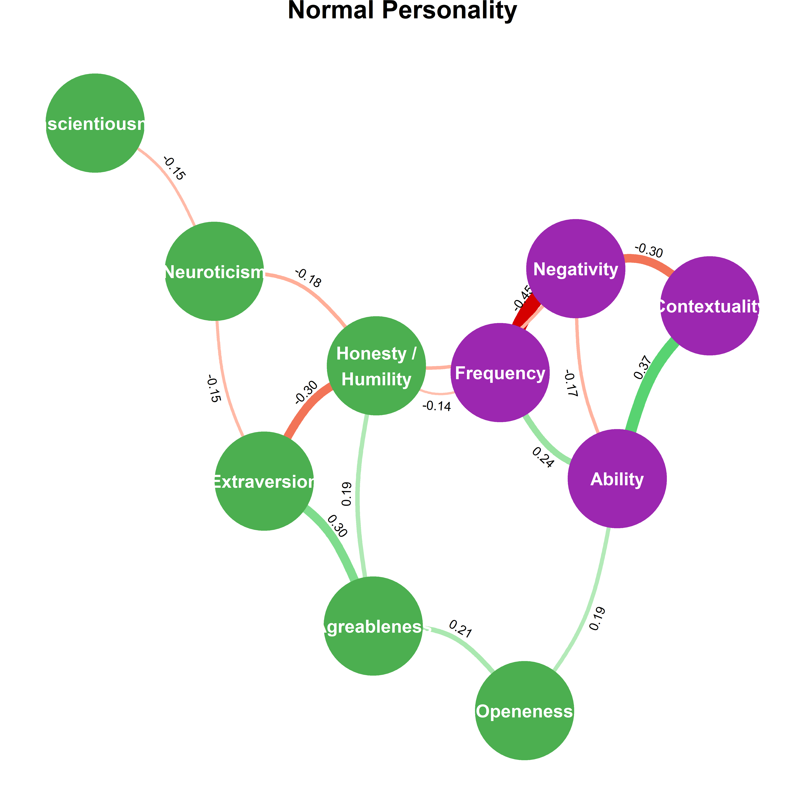

### Pathological Personality (PID5)


```r
cor_pid <- correlation::correlation(
  dplyr::select(df, dplyr::starts_with("LIE"), dplyr::starts_with("PID5"), -PID5_Pathology),
  partial = TRUE, p_adjust = "none")

parameters::parameters_table(cor_pid)
```

<div class="kable-table">

Parameter1            Parameter2            r       95% CI           t        df    p        Method    n_Obs 
--------------------  --------------------  ------  ---------------  -------  ----  -------  --------  ------
LIE_Frequency         LIE_Ability           0.19    [ 0.12,  0.25]   5.30     787   < .001   Pearson   789   
LIE_Frequency         LIE_Negativity        -0.31   [-0.37, -0.24]   -9.11    787   < .001   Pearson   789   
LIE_Frequency         LIE_Contextuality     0.33    [ 0.27,  0.39]   9.88     787   < .001   Pearson   789   
LIE_Frequency         PID5_NegativeAffect   -0.01   [-0.08,  0.06]   -0.29    787   0.773    Pearson   789   
LIE_Frequency         PID5_Detachment       -0.06   [-0.13,  0.01]   -1.71    787   0.089    Pearson   789   
LIE_Frequency         PID5_Antagonism       0.19    [ 0.13,  0.26]   5.53     787   < .001   Pearson   789   
LIE_Frequency         PID5_Disinhibition    -0.07   [-0.14,  0.00]   -1.91    787   0.057    Pearson   789   
LIE_Frequency         PID5_Psychoticism     -0.02   [-0.09,  0.05]   -0.51    787   0.607    Pearson   789   
LIE_Ability           LIE_Negativity        -0.47   [-0.53, -0.42]   -15.10   787   < .001   Pearson   789   
LIE_Ability           LIE_Contextuality     -0.07   [-0.14,  0.00]   -2.00    787   0.046    Pearson   789   
LIE_Ability           PID5_NegativeAffect   0.02    [-0.05,  0.09]   0.65     787   0.514    Pearson   789   
LIE_Ability           PID5_Detachment       0.06    [-0.01,  0.13]   1.73     787   0.085    Pearson   789   
LIE_Ability           PID5_Antagonism       0.05    [-0.02,  0.12]   1.54     787   0.124    Pearson   789   
LIE_Ability           PID5_Disinhibition    0.09    [ 0.02,  0.16]   2.43     787   0.015    Pearson   789   
LIE_Ability           PID5_Psychoticism     0.05    [-0.02,  0.12]   1.31     787   0.190    Pearson   789   
LIE_Negativity        LIE_Contextuality     -0.19   [-0.25, -0.12]   -5.39    787   < .001   Pearson   789   
LIE_Negativity        PID5_NegativeAffect   0.13    [ 0.06,  0.20]   3.60     787   < .001   Pearson   789   
LIE_Negativity        PID5_Detachment       -0.02   [-0.09,  0.05]   -0.56    787   0.574    Pearson   789   
LIE_Negativity        PID5_Antagonism       -0.02   [-0.09,  0.05]   -0.52    787   0.601    Pearson   789   
LIE_Negativity        PID5_Disinhibition    -0.07   [-0.14,  0.00]   -1.91    787   0.057    Pearson   789   
LIE_Negativity        PID5_Psychoticism     0.04    [-0.03,  0.11]   1.00     787   0.318    Pearson   789   
LIE_Contextuality     PID5_NegativeAffect   0.05    [-0.02,  0.12]   1.35     787   0.178    Pearson   789   
LIE_Contextuality     PID5_Detachment       0.02    [-0.05,  0.09]   0.69     787   0.492    Pearson   789   
LIE_Contextuality     PID5_Antagonism       -0.07   [-0.14,  0.00]   -2.00    787   0.046    Pearson   789   
LIE_Contextuality     PID5_Disinhibition    -0.05   [-0.12,  0.02]   -1.41    787   0.160    Pearson   789   
LIE_Contextuality     PID5_Psychoticism     0.06    [-0.01,  0.13]   1.82     787   0.070    Pearson   789   
PID5_NegativeAffect   PID5_Detachment       0.18    [ 0.12,  0.25]   5.23     787   < .001   Pearson   789   
PID5_NegativeAffect   PID5_Antagonism       0.16    [ 0.09,  0.23]   4.50     787   < .001   Pearson   789   
PID5_NegativeAffect   PID5_Disinhibition    0.13    [ 0.07,  0.20]   3.80     787   < .001   Pearson   789   
PID5_NegativeAffect   PID5_Psychoticism     0.23    [ 0.17,  0.30]   6.70     787   < .001   Pearson   789   
PID5_Detachment       PID5_Antagonism       0.13    [ 0.06,  0.19]   3.57     787   < .001   Pearson   789   
PID5_Detachment       PID5_Disinhibition    0.07    [ 0.00,  0.14]   1.98     787   0.048    Pearson   789   
PID5_Detachment       PID5_Psychoticism     0.27    [ 0.20,  0.33]   7.89     787   < .001   Pearson   789   
PID5_Antagonism       PID5_Disinhibition    0.22    [ 0.16,  0.29]   6.47     787   < .001   Pearson   789   
PID5_Antagonism       PID5_Psychoticism     0.12    [ 0.05,  0.19]   3.46     787   < .001   Pearson   789   
PID5_Disinhibition    PID5_Psychoticism     0.37    [ 0.31,  0.43]   11.10    787   < .001   Pearson   789   

</div>


```r
graphdata_pid <- cor_pid %>%
  filter(p < .001) %>%
  tidygraph::as_tbl_graph() %>%
  as.list()

graphdata_pid$nodes$Questionnaire <- ifelse(stringr::str_detect(graphdata_pid$nodes$name, "LIE_"),
                               "LIE", "Pathological Personality")
graphdata_pid$nodes$name <- stringr::str_remove(graphdata_pid$nodes$name, "LIE_|PID5_")
graphdata_pid$nodes$name <- stringr::str_replace(graphdata_pid$nodes$name, "eA", "e\nA")

ggm_pid <- create_ggm(graphdata_pid, title = "Pathological Personality", layout="graphopt", node_size=40)
ggm_pid
```


### Light Triad (LTS)


```r
cor_lts <- correlation::correlation(
  dplyr::select(df, dplyr::starts_with("LIE"), dplyr::starts_with("LTS"), -LTS_General),
  partial = TRUE, p_adjust = "none")

parameters::parameters_table(cor_lts)
```

<div class="kable-table">

Parameter1            Parameter2            r       95% CI           t        df    p        Method    n_Obs 
--------------------  --------------------  ------  ---------------  -------  ----  -------  --------  ------
LIE_Frequency         LIE_Ability           0.20    [ 0.13,  0.27]   5.76     787   < .001   Pearson   789   
LIE_Frequency         LIE_Negativity        -0.33   [-0.39, -0.26]   -9.68    787   < .001   Pearson   789   
LIE_Frequency         LIE_Contextuality     0.31    [ 0.25,  0.38]   9.27     787   < .001   Pearson   789   
LIE_Frequency         LTS_FaithInHumanity   0.04    [-0.03,  0.11]   1.02     787   0.307    Pearson   789   
LIE_Frequency         LTS_Humanism          -0.07   [-0.14,  0.00]   -2.05    787   0.041    Pearson   789   
LIE_Frequency         LTS_Kantianism        -0.03   [-0.10,  0.04]   -0.82    787   0.415    Pearson   789   
LIE_Ability           LIE_Negativity        -0.46   [-0.52, -0.41]   -14.72   787   < .001   Pearson   789   
LIE_Ability           LIE_Contextuality     -0.07   [-0.13,  0.00]   -1.83    787   0.067    Pearson   789   
LIE_Ability           LTS_FaithInHumanity   -0.11   [-0.18, -0.04]   -3.04    787   0.002    Pearson   789   
LIE_Ability           LTS_Humanism          0.03    [-0.04,  0.10]   0.79     787   0.427    Pearson   789   
LIE_Ability           LTS_Kantianism        0.09    [ 0.02,  0.16]   2.49     787   0.013    Pearson   789   
LIE_Negativity        LIE_Contextuality     -0.20   [-0.26, -0.13]   -5.61    787   < .001   Pearson   789   
LIE_Negativity        LTS_FaithInHumanity   -0.03   [-0.10,  0.04]   -0.84    787   0.400    Pearson   789   
LIE_Negativity        LTS_Humanism          -0.06   [-0.13,  0.01]   -1.74    787   0.083    Pearson   789   
LIE_Negativity        LTS_Kantianism        -0.13   [-0.20, -0.06]   -3.69    787   < .001   Pearson   789   
LIE_Contextuality     LTS_FaithInHumanity   0.01    [-0.06,  0.08]   0.21     787   0.835    Pearson   789   
LIE_Contextuality     LTS_Humanism          -0.08   [-0.15, -0.01]   -2.32    787   0.021    Pearson   789   
LIE_Contextuality     LTS_Kantianism        -0.03   [-0.10,  0.04]   -0.82    787   0.415    Pearson   789   
LTS_FaithInHumanity   LTS_Humanism          0.49    [ 0.43,  0.54]   15.65    787   < .001   Pearson   789   
LTS_FaithInHumanity   LTS_Kantianism        0.15    [ 0.08,  0.22]   4.24     787   < .001   Pearson   789   
LTS_Humanism          LTS_Kantianism        0.31    [ 0.24,  0.37]   8.99     787   < .001   Pearson   789   

</div>


```r
graphdata_lts <- cor_lts %>%
  filter(p < .001) %>%
  tidygraph::as_tbl_graph() %>%
  as.list()

graphdata_lts$nodes$Questionnaire <- ifelse(stringr::str_detect(graphdata_lts$nodes$name, "LIE_"),
                               "LIE", "Light Triad")
graphdata_lts$nodes$name <- stringr::str_remove(graphdata_lts$nodes$name, "LIE_|LTS_")
graphdata_lts$nodes$name <- stringr::str_replace(graphdata_lts$nodes$name, "InH", " in\nH")

ggm_lts <- create_ggm(graphdata_lts, title = "Light Triad", layout="fr", bend=0.15)
ggm_lts
```

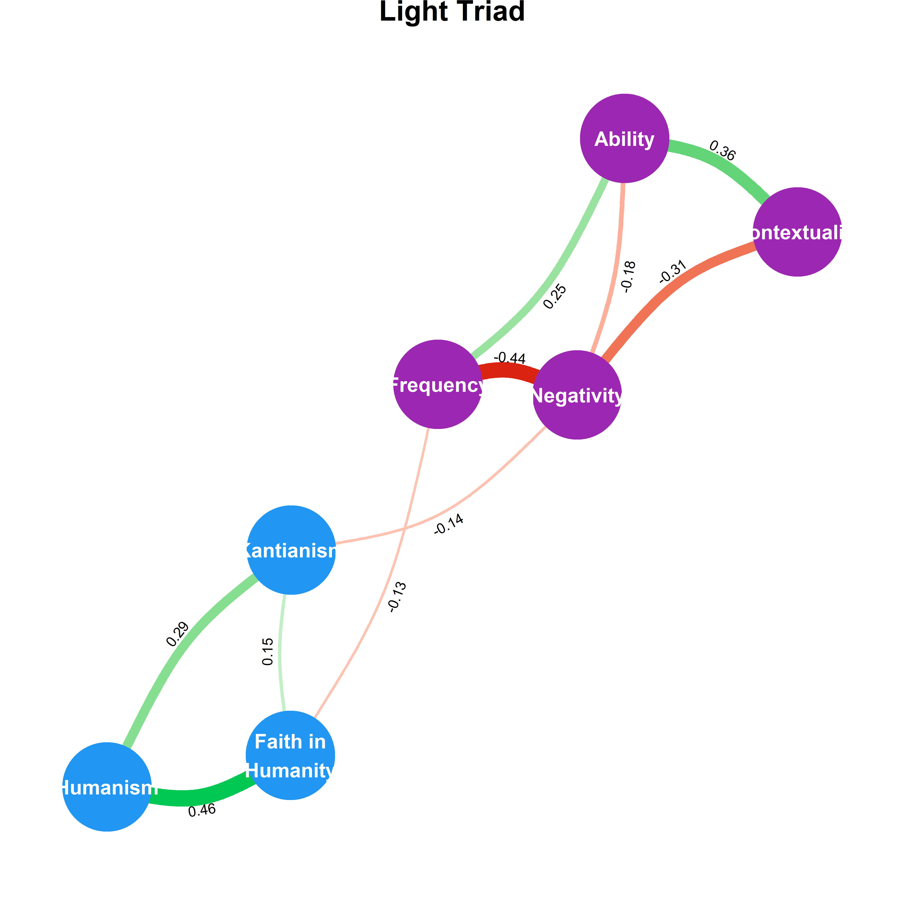


### Impulsivity (UPPS)


```r
cor_upps <- correlation::correlation(
  dplyr::select(df, dplyr::starts_with("LIE"), dplyr::starts_with("UPPS"), -UPPS_General),
  partial = TRUE, p_adjust = "none")

parameters::parameters_table(cor_upps)
```

<div class="kable-table">

Parameter1                 Parameter2                 r       95% CI           t        df    p        Method    n_Obs 
-------------------------  -------------------------  ------  ---------------  -------  ----  -------  --------  ------
LIE_Frequency              LIE_Ability                0.20    [ 0.13,  0.26]   5.66     787   < .001   Pearson   789   
LIE_Frequency              LIE_Negativity             -0.34   [-0.40, -0.27]   -10.00   787   < .001   Pearson   789   
LIE_Frequency              LIE_Contextuality          0.30    [ 0.24,  0.36]   8.85     787   < .001   Pearson   789   
LIE_Frequency              UPPS_NegativeUrgency       0.02    [-0.05,  0.09]   0.66     787   0.509    Pearson   789   
LIE_Frequency              UPPS_PositiveUrgency       -0.01   [-0.08,  0.06]   -0.28    787   0.783    Pearson   789   
LIE_Frequency              UPPS_LackOfPerseverance    -0.07   [-0.14,  0.00]   -1.87    787   0.062    Pearson   789   
LIE_Frequency              UPPS_LackOfPremeditation   -0.07   [-0.14,  0.00]   -1.91    787   0.057    Pearson   789   
LIE_Frequency              UPPS_SensationSeeking      0.05    [-0.02,  0.12]   1.42     787   0.155    Pearson   789   
LIE_Ability                LIE_Negativity             -0.46   [-0.51, -0.40]   -14.57   787   < .001   Pearson   789   
LIE_Ability                LIE_Contextuality          -0.05   [-0.12,  0.02]   -1.42    787   0.157    Pearson   789   
LIE_Ability                UPPS_NegativeUrgency       0.03    [-0.04,  0.10]   0.84     787   0.401    Pearson   789   
LIE_Ability                UPPS_PositiveUrgency       0.17    [ 0.11,  0.24]   4.98     787   < .001   Pearson   789   
LIE_Ability                UPPS_LackOfPerseverance    0.04    [-0.03,  0.11]   1.25     787   0.212    Pearson   789   
LIE_Ability                UPPS_LackOfPremeditation   -0.01   [-0.08,  0.06]   -0.16    787   0.874    Pearson   789   
LIE_Ability                UPPS_SensationSeeking      -0.01   [-0.08,  0.06]   -0.28    787   0.777    Pearson   789   
LIE_Negativity             LIE_Contextuality          -0.20   [-0.26, -0.13]   -5.63    787   < .001   Pearson   789   
LIE_Negativity             UPPS_NegativeUrgency       0.08    [ 0.01,  0.15]   2.16     787   0.031    Pearson   789   
LIE_Negativity             UPPS_PositiveUrgency       0.05    [-0.02,  0.12]   1.28     787   0.199    Pearson   789   
LIE_Negativity             UPPS_LackOfPerseverance    -0.08   [-0.15, -0.01]   -2.20    787   0.028    Pearson   789   
LIE_Negativity             UPPS_LackOfPremeditation   -0.18   [-0.24, -0.11]   -5.03    787   < .001   Pearson   789   
LIE_Negativity             UPPS_SensationSeeking      -0.02   [-0.09,  0.05]   -0.65    787   0.513    Pearson   789   
LIE_Contextuality          UPPS_NegativeUrgency       0.03    [-0.04,  0.10]   0.80     787   0.423    Pearson   789   
LIE_Contextuality          UPPS_PositiveUrgency       -0.04   [-0.11,  0.03]   -1.17    787   0.244    Pearson   789   
LIE_Contextuality          UPPS_LackOfPerseverance    -0.05   [-0.12,  0.02]   -1.46    787   0.146    Pearson   789   
LIE_Contextuality          UPPS_LackOfPremeditation   -0.06   [-0.13,  0.01]   -1.81    787   0.071    Pearson   789   
LIE_Contextuality          UPPS_SensationSeeking      0.07    [ 0.00,  0.14]   1.93     787   0.054    Pearson   789   
UPPS_NegativeUrgency       UPPS_PositiveUrgency       0.58    [ 0.53,  0.62]   19.80    787   < .001   Pearson   789   
UPPS_NegativeUrgency       UPPS_LackOfPerseverance    -0.03   [-0.10,  0.04]   -0.76    787   0.446    Pearson   789   
UPPS_NegativeUrgency       UPPS_LackOfPremeditation   0.04    [-0.03,  0.11]   1.21     787   0.225    Pearson   789   
UPPS_NegativeUrgency       UPPS_SensationSeeking      -0.10   [-0.17, -0.03]   -2.90    787   0.004    Pearson   789   
UPPS_PositiveUrgency       UPPS_LackOfPerseverance    0.02    [-0.05,  0.09]   0.58     787   0.564    Pearson   789   
UPPS_PositiveUrgency       UPPS_LackOfPremeditation   0.21    [ 0.14,  0.27]   5.96     787   < .001   Pearson   789   
UPPS_PositiveUrgency       UPPS_SensationSeeking      0.26    [ 0.20,  0.33]   7.69     787   < .001   Pearson   789   
UPPS_LackOfPerseverance    UPPS_LackOfPremeditation   0.41    [ 0.35,  0.47]   12.67    787   < .001   Pearson   789   
UPPS_LackOfPerseverance    UPPS_SensationSeeking      -0.14   [-0.21, -0.07]   -4.06    787   < .001   Pearson   789   
UPPS_LackOfPremeditation   UPPS_SensationSeeking      -0.01   [-0.08,  0.06]   -0.16    787   0.873    Pearson   789   

</div>


```r
graphdata_upps <- cor_upps %>%
  filter(p < .001) %>%
  tidygraph::as_tbl_graph() %>%
  as.list()

graphdata_upps$nodes$Questionnaire <- ifelse(stringr::str_detect(graphdata_upps$nodes$name, "LIE_"),
                               "LIE", "Impulsivity")
graphdata_upps$nodes$name <- stringr::str_remove(graphdata_upps$nodes$name, "LIE_|UPPS_")
graphdata_upps$nodes$name <- stringr::str_replace(graphdata_upps$nodes$name, "U", "\nU")
graphdata_upps$nodes$name <- stringr::str_replace(graphdata_upps$nodes$name, "OfP", " of\nP")
graphdata_upps$nodes$name <- stringr::str_replace(graphdata_upps$nodes$name, "nS", "n\nS")

ggm_upps <- create_ggm(graphdata_upps, title = "Impulsivity")
ggm_upps
```


### Emotion Regulation (DERS)


```r
cor_ders <- correlation::correlation(
  dplyr::select(df, dplyr::starts_with("LIE"), dplyr::starts_with("DERS"), -DERS_General),
  partial = TRUE, p_adjust = "none")

parameters::parameters_table(cor_ders)
```

<div class="kable-table">

Parameter1           Parameter2           r       95% CI           t        df    p        Method    n_Obs 
-------------------  -------------------  ------  ---------------  -------  ----  -------  --------  ------
LIE_Frequency        LIE_Ability          0.19    [ 0.12,  0.26]   5.46     787   < .001   Pearson   789   
LIE_Frequency        LIE_Negativity       -0.32   [-0.38, -0.26]   -9.46    787   < .001   Pearson   789   
LIE_Frequency        LIE_Contextuality    0.32    [ 0.26,  0.38]   9.49     787   < .001   Pearson   789   
LIE_Frequency        DERS_Awareness       -0.10   [-0.17, -0.03]   -2.84    787   0.005    Pearson   789   
LIE_Frequency        DERS_Clarity         -0.02   [-0.09,  0.05]   -0.50    787   0.619    Pearson   789   
LIE_Frequency        DERS_Goals           -0.05   [-0.12,  0.02]   -1.40    787   0.161    Pearson   789   
LIE_Frequency        DERS_Impulse         0.01    [-0.06,  0.08]   0.29     787   0.773    Pearson   789   
LIE_Frequency        DERS_NonAcceptance   0.04    [-0.03,  0.11]   1.16     787   0.248    Pearson   789   
LIE_Frequency        DERS_Strategies      0.02    [-0.05,  0.09]   0.64     787   0.521    Pearson   789   
LIE_Ability          LIE_Negativity       -0.50   [-0.55, -0.45]   -16.33   787   < .001   Pearson   789   
LIE_Ability          LIE_Contextuality    -0.06   [-0.12,  0.01]   -1.55    787   0.121    Pearson   789   
LIE_Ability          DERS_Awareness       0.06    [-0.01,  0.13]   1.72     787   0.085    Pearson   789   
LIE_Ability          DERS_Clarity         0.10    [ 0.03,  0.17]   2.74     787   0.006    Pearson   789   
LIE_Ability          DERS_Goals           -0.02   [-0.09,  0.05]   -0.43    787   0.665    Pearson   789   
LIE_Ability          DERS_Impulse         0.10    [ 0.03,  0.17]   2.91     787   0.004    Pearson   789   
LIE_Ability          DERS_NonAcceptance   0.11    [ 0.04,  0.18]   3.11     787   0.002    Pearson   789   
LIE_Ability          DERS_Strategies      -0.02   [-0.09,  0.05]   -0.54    787   0.589    Pearson   789   
LIE_Negativity       LIE_Contextuality    -0.18   [-0.24, -0.11]   -5.01    787   < .001   Pearson   789   
LIE_Negativity       DERS_Awareness       -0.04   [-0.11,  0.03]   -1.00    787   0.317    Pearson   789   
LIE_Negativity       DERS_Clarity         0.03    [-0.04,  0.10]   0.79     787   0.430    Pearson   789   
LIE_Negativity       DERS_Goals           0.02    [-0.05,  0.09]   0.51     787   0.612    Pearson   789   
LIE_Negativity       DERS_Impulse         0.01    [-0.06,  0.08]   0.39     787   0.699    Pearson   789   
LIE_Negativity       DERS_NonAcceptance   0.15    [ 0.08,  0.22]   4.27     787   < .001   Pearson   789   
LIE_Negativity       DERS_Strategies      -0.01   [-0.08,  0.06]   -0.21    787   0.834    Pearson   789   
LIE_Contextuality    DERS_Awareness       -0.04   [-0.11,  0.03]   -1.04    787   0.298    Pearson   789   
LIE_Contextuality    DERS_Clarity         -0.03   [-0.10,  0.04]   -0.81    787   0.419    Pearson   789   
LIE_Contextuality    DERS_Goals           0.05    [-0.02,  0.12]   1.49     787   0.137    Pearson   789   
LIE_Contextuality    DERS_Impulse         -0.03   [-0.10,  0.03]   -0.98    787   0.327    Pearson   789   
LIE_Contextuality    DERS_NonAcceptance   -0.01   [-0.08,  0.06]   -0.23    787   0.820    Pearson   789   
LIE_Contextuality    DERS_Strategies      0.01    [-0.06,  0.08]   0.37     787   0.714    Pearson   789   
DERS_Awareness       DERS_Clarity         0.25    [ 0.18,  0.31]   7.25     787   < .001   Pearson   789   
DERS_Awareness       DERS_Goals           -0.16   [-0.23, -0.09]   -4.48    787   < .001   Pearson   789   
DERS_Awareness       DERS_Impulse         0.06    [-0.01,  0.13]   1.68     787   0.094    Pearson   789   
DERS_Awareness       DERS_NonAcceptance   -0.03   [-0.10,  0.04]   -0.97    787   0.330    Pearson   789   
DERS_Awareness       DERS_Strategies      -0.01   [-0.08,  0.06]   -0.30    787   0.766    Pearson   789   
DERS_Clarity         DERS_Goals           0.01    [-0.06,  0.08]   0.30     787   0.765    Pearson   789   
DERS_Clarity         DERS_Impulse         0.07    [ 0.00,  0.13]   1.85     787   0.065    Pearson   789   
DERS_Clarity         DERS_NonAcceptance   0.16    [ 0.10,  0.23]   4.66     787   < .001   Pearson   789   
DERS_Clarity         DERS_Strategies      0.21    [ 0.14,  0.27]   5.91     787   < .001   Pearson   789   
DERS_Goals           DERS_Impulse         0.28    [ 0.22,  0.35]   8.30     787   < .001   Pearson   789   
DERS_Goals           DERS_NonAcceptance   0.17    [ 0.10,  0.24]   4.87     787   < .001   Pearson   789   
DERS_Goals           DERS_Strategies      0.24    [ 0.17,  0.30]   6.94     787   < .001   Pearson   789   
DERS_Impulse         DERS_NonAcceptance   0.03    [-0.04,  0.10]   0.82     787   0.415    Pearson   789   
DERS_Impulse         DERS_Strategies      0.48    [ 0.42,  0.53]   15.30    787   < .001   Pearson   789   
DERS_NonAcceptance   DERS_Strategies      0.24    [ 0.17,  0.30]   6.91     787   < .001   Pearson   789   

</div>


```r
graphdata_ders <- cor_ders %>%
  filter(p < .001) %>%
  tidygraph::as_tbl_graph() %>%
  as.list()

graphdata_ders$nodes$Questionnaire <- ifelse(stringr::str_detect(graphdata_ders$nodes$name, "LIE_"),
                               "LIE", "Emotion Regulation")
graphdata_ders$nodes$name <- stringr::str_remove(graphdata_ders$nodes$name, "LIE_|DERS_")
graphdata_ders$nodes$name <- stringr::str_replace(graphdata_ders$nodes$name, "nA", "n-\nA")

ggm_ders <- create_ggm(graphdata_ders, title = "Difficulties in Emotion Regulation")
ggm_ders
```


### Interoception (MAIA2)


```r
cor_maia <- correlation::correlation(
  dplyr::select(df, dplyr::starts_with("LIE"), dplyr::starts_with("MAIA2")),
  partial = TRUE, p_adjust = "none")

parameters::parameters_table(cor_maia)
```

<div class="kable-table">

Parameter1          Parameter2            r       95% CI           t        df    p        Method    n_Obs 
------------------  --------------------  ------  ---------------  -------  ----  -------  --------  ------
LIE_Frequency       LIE_Ability           0.20    [ 0.13,  0.26]   5.58     787   < .001   Pearson   789   
LIE_Frequency       LIE_Negativity        -0.33   [-0.39, -0.26]   -9.75    787   < .001   Pearson   789   
LIE_Frequency       LIE_Contextuality     0.33    [ 0.26,  0.39]   9.66     787   < .001   Pearson   789   
LIE_Frequency       MAIA2_Noticing        0.08    [ 0.01,  0.15]   2.28     787   0.023    Pearson   789   
LIE_Frequency       MAIA2_BodyListening   0.03    [-0.04,  0.10]   0.74     787   0.459    Pearson   789   
LIE_Ability         LIE_Negativity        -0.49   [-0.54, -0.43]   -15.57   787   < .001   Pearson   789   
LIE_Ability         LIE_Contextuality     -0.07   [-0.14,  0.00]   -1.95    787   0.052    Pearson   789   
LIE_Ability         MAIA2_Noticing        -0.03   [-0.10,  0.04]   -0.81    787   0.419    Pearson   789   
LIE_Ability         MAIA2_BodyListening   0.05    [-0.02,  0.12]   1.32     787   0.188    Pearson   789   
LIE_Negativity      LIE_Contextuality     -0.18   [-0.24, -0.11]   -5.07    787   < .001   Pearson   789   
LIE_Negativity      MAIA2_Noticing        0.07    [ 0.00,  0.14]   2.00     787   0.045    Pearson   789   
LIE_Negativity      MAIA2_BodyListening   0.03    [-0.04,  0.10]   0.72     787   0.472    Pearson   789   
LIE_Contextuality   MAIA2_Noticing        0.00    [-0.07,  0.07]   0.05     787   0.964    Pearson   789   
LIE_Contextuality   MAIA2_BodyListening   -0.01   [-0.08,  0.06]   -0.17    787   0.866    Pearson   789   
MAIA2_Noticing      MAIA2_BodyListening   0.56    [ 0.52,  0.61]   19.20    787   < .001   Pearson   789   

</div>


```r
graphdata_maia <- cor_maia %>%
  filter(p < .001) %>%
  tidygraph::as_tbl_graph() %>%
  as.list()

graphdata_maia$nodes$Questionnaire <- ifelse(stringr::str_detect(graphdata_maia$nodes$name, "LIE_"),
                               "LIE", "Interoception")
graphdata_maia$nodes$name <- stringr::str_remove(graphdata_maia$nodes$name, "LIE_|MAIA2_")
graphdata_maia$nodes$name <- stringr::str_replace(graphdata_maia$nodes$name, "yL", "y\nL")

ggm_maia <- create_ggm(graphdata_maia, title = "Interoception")
ggm_maia
```


<!-- ```{r figure_ggm, fig.height=figwidth*3, fig.width=figwidth*3, message=FALSE, warning=FALSE, include=FALSE, eval=FALSE} -->
<!-- # This has to be run manually -->

<!-- scale <- 1.2 -->
<!-- # Combine plots -->
<!-- p <- cowplot::plot_grid(create_ggm(graphdata_bidr, title = "Social Desirability", layout="sugiyama", label_edges = FALSE, title_size = 35, text_size=5.5*scale, node_size=48*scale), -->
<!--                         create_ggm(graphdata_trimp, title = "Pychopathy", label_edges = FALSE, title_size = 35, text_size=5.5*scale, node_size=40*scale), -->
<!--                         create_ggm(graphdata_ffni, title = "Narcissism", label_edges = FALSE, title_size = 35, text_size=5.5*scale, node_size=52*scale), -->
<!--                         create_ggm(graphdata_ipip, title = "Normal Personality", layout="graphopt", label_edges = FALSE, title_size = 33, text_size=5.5*scale, node_size=52*scale), -->
<!--                         create_ggm(graphdata_pid, title = "Pathological Personality", layout="graphopt", label_edges = FALSE, title_size = 35, text_size=5.5*scale, node_size=40*scale), -->
<!--                         create_ggm(graphdata_lts, title = "Light Triad", layout="fr", bend=0.15, label_edges = FALSE, title_size = 35, text_size=5.5*scale, node_size=40*scale), -->
<!--                         create_ggm(graphdata_upps, title = "Impulsivity", label_edges = FALSE, title_size = 35, text_size=5.5*scale, node_size=44*scale), -->
<!--                         create_ggm(graphdata_ders, title = "Difficulties in Emotion Regulation", label_edges = FALSE, title_size = 35, text_size=5.5*scale, node_size=40*scale), -->
<!--                         create_ggm(graphdata_maia, title = "Interoception", label_edges = FALSE, title_size = 35, text_size=5.5*scale, node_size=40*scale)) + -->
<!--     theme(plot.margin = unit(c(0,0,0,0), "cm")) -->
<!-- ggsave("figures/figure_ggm.png", p, height=figwidth*3, width=figwidth*3, dpi=600) -->
<!-- ``` -->


# References


```r
report::cite_packages(sessionInfo())
```

<div class="kable-table">

|References                                                                                                                                                                                                                                                 |
|:----------------------------------------------------------------------------------------------------------------------------------------------------------------------------------------------------------------------------------------------------------|
|Ben-Shachar, Makowski & Lüdecke (2020). Compute and interpret indices of effect size. CRAN. Available from https://github.com/easystats/effectsize.                                                                                                        |
|Daniel Lüdecke and Dominique Makowski (2020). easystats: Jump in the easyverse. R package version 0.2.0. https://github.com/easystats/easystats                                                                                                            |
|Daniel Lüdecke, Dominique Makowski, Philip Waggoner and Mattan S. Ben-Shachar (2020). see: Visualisation Toolbox for 'easystats' and Extra Geoms, Themes and Color Palettes for 'ggplot2'. R package version 0.5.1. https://CRAN.R-project.org/package=see |
|Dirk Eddelbuettel and Romain Francois (2011). Rcpp: Seamless R and C++ Integration. Journal of Statistical Software, 40(8), 1-18. URL http://www.jstatsoft.org/v40/i08/.                                                                                   |
|Goodrich B, Gabry J, Ali I & Brilleman S. (2018). rstanarm: Bayesian applied regression modeling via Stan. R package version 2.17.4. http://mc-stan.org/.                                                                                                  |
|H. Wickham. ggplot2: Elegant Graphics for Data Analysis. Springer-Verlag New York, 2016.                                                                                                                                                                   |
|Hadley Wickham (2019). forcats: Tools for Working with Categorical Variables (Factors). R package version 0.4.0. https://CRAN.R-project.org/package=forcats                                                                                                |
|Hadley Wickham (2019). stringr: Simple, Consistent Wrappers for Common String Operations. R package version 1.4.0. https://CRAN.R-project.org/package=stringr                                                                                              |
|Hadley Wickham and Lionel Henry (2019). tidyr: Tidy Messy Data. R package version 1.0.0. https://CRAN.R-project.org/package=tidyr                                                                                                                          |
|Hadley Wickham, Jim Hester and Romain Francois (2018). readr: Read Rectangular Text Data. R package version 1.3.1. https://CRAN.R-project.org/package=readr                                                                                                |
|Hadley Wickham, Romain François, Lionel Henry and Kirill Müller (2020). dplyr: A Grammar of Data Manipulation. R package version 0.8.5. https://CRAN.R-project.org/package=dplyr                                                                           |
|Kirill Müller and Hadley Wickham (2019). tibble: Simple Data Frames. R package version 2.1.3. https://CRAN.R-project.org/package=tibble                                                                                                                    |
|Lionel Henry and Hadley Wickham (2019). purrr: Functional Programming Tools. R package version 0.3.3. https://CRAN.R-project.org/package=purrr                                                                                                             |
|Lüdecke D, Waggoner P, Makowski D (2019). "insight: A Unified Interfaceto Access Information from Model Objects in R." _Journal of Open SourceSoftware_, *4*(38), 1412. doi: 10.21105/joss.01412 (URL:https://doi.org/10.21105/joss.01412).                |
|Lüdecke, Ben-Shachar & Makowski (2020). Describe and understand your model’s parameters. CRAN. Available from https://easystats.github.io/parameters.                                                                                                      |
|Lüdecke, Makowski, Waggoner & Patil (2020). Assessment of Regression Models Performance. CRAN. Available from https://easystats.github.io/performance                                                                                                      |
|Makowski, D. & Lüdecke, D. (2019). The report package for R: Ensuring the use of best practices for results reporting. CRAN. Available from https://github.com/easystats/report. doi: .                                                                    |
|Makowski, D., Ben-Shachar, M. S. & Lüdecke, D. (2020). *Estimation of Model-Based Predictions, Contrasts and Means*. CRAN.                                                                                                                                 |
|Makowski, D., Ben-Shachar, M. S., Patil, I. & Lüdecke, D. (2020). *Methods for Correlation Analysis*. CRAN.                                                                                                                                                |
|Makowski, D., Ben-Shachar, M., & Lüdecke, D. (2019). bayestestR: Describing Effects and their Uncertainty, Existence and Significance within the Bayesian Framework. Journal of Open Source Software, 4(40), 1541. doi:10.21105/joss.01541                 |
|Thomas Lin Pedersen (2019). ggforce: Accelerating 'ggplot2'. R package version 0.3.1. https://CRAN.R-project.org/package=ggforce                                                                                                                           |
|Thomas Lin Pedersen (2020). ggraph: An Implementation of Grammar of Graphics for Graphs and Networks. R package version 2.0.3. https://CRAN.R-project.org/package=ggraph                                                                                   |
|Thomas Lin Pedersen (2020). tidygraph: A Tidy API for Graph Manipulation. R package version 1.2.0. https://CRAN.R-project.org/package=tidygraph                                                                                                            |
|Wickham et al., (2019). Welcome to the tidyverse. Journal of Open Source Software, 4(43), 1686, https://doi.org/10.21105/joss.01686                                                                                                                        |
|Yihui Xie (2020). knitr: A General-Purpose Package for Dynamic Report Generation in R. R package version 1.28.                                                                                                                                             |

</div>


